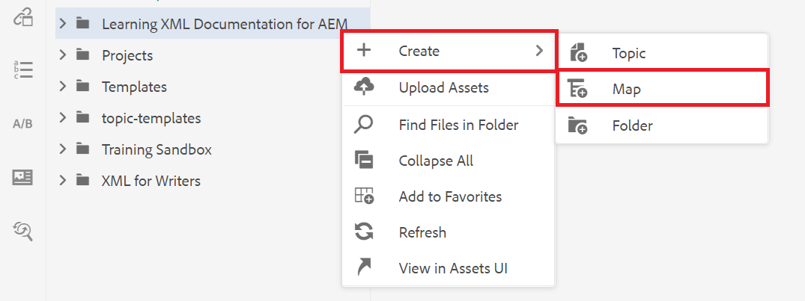

# 맵 만들기

맵은 계층 구조에 정보를 추가하고 구성할 수 있도록 해주는 조직 도구입니다. 이 작업은 맵에서 맵을 만들고 컨텐츠를 구성하는 방법을 보여 줍니다.

여기에서 DITA 파일 예를 다운로드할 수 있습니다.

* [Documents-with-Visual-Content.dita](assets/working-with-maps/Documents-with-Visual-Content.dita)
* [Working-with-Tables.dita](assets/working-with-maps/Working-with-Tables.dita)

>[!VIDEO](https://video.tv.adobe.com/v/336725?quality=12&learn=on)

## 맵 구성 요소 업로드

원하는 경우 로컬 샘플 파일을 AEM에 업로드하여 보다 완벽한 자료 세트를 만들 수 있습니다.

1. 로컬 파일을 AEM에 끌어다 놓아 업로드합니다.
1. 이미지 및 주제를 포함한 모든 파일에 대해 필요에 따라 반복합니다.

## 맵 만들기

1. 를 열려면 [!UICONTROL 옵션] 메뉴에서 기본 폴더에서 줄임표 아이콘을 선택합니다.

   

1. 선택 **[!UICONTROL 만들기]** > **[!UICONTROL 맵]**.

   

   다음 [!UICONTROL 새 맵 만들기] 대화 상자가 표시됩니다.

1. 에서 [!UICONTROL 템플릿] 필드, 선택 **[!UICONTROL 북맵]** 드롭다운 메뉴에서 맵에 제목을 지정합니다.
1. **[!UICONTROL 만들기]**&#x200B;를 선택합니다.

   맵이 만들어지면 왼쪽 레일이 자동으로 저장소 보기에서 맵 보기로 변경됩니다.

## 맵 구성 요소 삽입

1. 왼쪽 레일에서 연필 아이콘을 선택합니다.

   

   편집 아이콘으로서, 편집기에서 맵을 열 수 있습니다.

1. 저장소 아이콘을 선택하여 다시 저장소 보기로 전환합니다.

   

1. 리포지토리의 항목을 드래그하여 편집기의 맵에 놓아 맵에 항목을 추가합니다.

   선 표시기에는 주제가 배치된 위치가 표시됩니다.

1. 필요에 따라 주제를 계속 추가합니다.

## 맵 미리 보기 보기

미리 보기에서는 기본 형식을 사용하여 컨텐츠를 빠르게 볼 수 있습니다. 제목, 단락, 목록 및 주제에 있는 기타 모든 컨텐츠가 표시됩니다.

1. 선택 **[!UICONTROL 미리 보기]** 맨 위 검은색 메뉴 막대에서

   

컨텐츠가 다음에 열립니다 [!UICONTROL 미리 보기].

1. 작성자 보기로 돌아가서 맵 편집을 다시 시작하려면 다음을 선택합니다 **작성자.**

   

## 맵 구조 구성

맵 내에서 주제 계층 구조를 편집할 수 있습니다.

1. 주제 아이콘을 클릭하여 선택합니다.
2. 화살표를 사용하여 요소의 수준을 내리고 승격합니다.

   

## 맵을 새 버전으로 저장

맵이 완료되었으므로 작업을 새 버전으로 저장하고 변경 내용을 기록할 수 있습니다.

1. 을(를) 선택합니다 **[!UICONTROL 새 버전으로 저장]** 아이콘.

   

1. 새 버전에 대한 설명 필드에 변경 사항에 대한 간단한 요약을 입력합니다.

1. 버전 레이블 필드에 관련 레이블을 입력합니다.

   레이블을 사용하면 게시할 때 포함할 버전을 지정할 수 있습니다.

   >[!NOTE]
   > 
   > 프로그램이 사전 정의된 레이블로 구성된 경우 이 중에서 선택하여 일관된 레이블 지정을 보장할 수 있습니다.

1. **저장**&#x200B;을 선택합니다.

   맵의 새 버전을 만들고 버전 번호를 업데이트했습니다.
