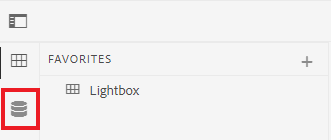

# 맵 만들기

{{test}}

맵은 정보를 계층 구조로 추가하고 구성할 수 있는 조직 도구입니다. 이 작업에서는 맵을 만들고 맵에서 콘텐츠를 구성하는 방법을 보여 줍니다.

다음 위치에서 예제 DITA 파일을 다운로드할 수 있습니다.

* [Documents-with-Visual-Content.dita](assets/working-with-maps/Documents-with-Visual-Content.dita)
* [테이블 작업](assets/working-with-maps/Working-with-Tables.dita)

>[!VIDEO](https://video.tv.adobe.com/v/336725?quality=12&learn=on)

## 맵 구성 요소 업로드

원하는 경우 로컬 샘플 파일을 AEM에 업로드하여 보다 완벽한 자료 세트를 얻을 수 있습니다.

1. 로컬 파일을 AEM으로 드래그 앤 드롭하여 업로드하십시오.
1. 이미지 및 주제를 포함하여 모든 파일에 대해 필요에 따라 반복합니다.

## 맵 만들기

1. [!UICONTROL 옵션] 메뉴를 열려면 주 폴더에서 줄임표 아이콘을 선택합니다.

   

1. **[!UICONTROL 만들기]** > **[!UICONTROL 맵]**&#x200B;을 선택합니다.

   

   [!UICONTROL 새 맵 만들기] 대화 상자가 표시됩니다.

1. [!UICONTROL 템플릿] 필드의 드롭다운 메뉴에서 **[!UICONTROL 북맵]**&#x200B;을(를) 선택하고 맵에 제목을 지정합니다.
1. **[!UICONTROL 만들기]**&#x200B;를 선택합니다.

   맵이 만들어지고 왼쪽 레일이 자동으로 저장소 보기에서 맵 보기로 변경됩니다.

## 맵 구성 요소 삽입

1. 왼쪽 레일에서 연필 아이콘을 선택합니다.

   

   편집 아이콘이며, 이를 통해 편집기에서 맵을 열 수 있습니다.

1. 저장소 아이콘을 선택하여 저장소 보기로 다시 전환합니다.

   

1. 저장소에서 편집기의 맵으로 주제를 끌어다 놓아 맵에 주제를 추가합니다.

   선 표시기는 주제가 배치되는 위치를 보여 줍니다.

1. 필요에 따라 주제를 계속 추가합니다.

## 맵 미리보기 보기 보기

미리보기에서는 기본 형식을 사용하여 콘텐츠를 빠르게 볼 수 있습니다. 제목, 단락, 목록 및 항목의 기타 모든 내용이 표시됩니다.

1. 검정색 상단 메뉴 모음에서 **[!UICONTROL 미리 보기]**&#x200B;를 선택합니다.

   

콘텐트가 [!UICONTROL 미리 보기]에서 열립니다.

1. 작성자 보기로 돌아가서 맵 편집을 다시 시작하려면 **작성자**&#x200B;를 선택하십시오.

   

## 맵 구조 구성

맵 내에서 주제 계층을 편집할 수 있습니다.

1. 주제 아이콘을 클릭하여 선택합니다.
1. 화살표를 사용하여 요소를 각각 내림차순 및 프로모션합니다.

   

## 맵을 새 버전으로 저장

맵이 완성되었으므로 이제 작업을 새 버전으로 저장하고 변경 사항을 기록할 수 있습니다.

1. **[!UICONTROL 새 버전으로 저장]** 아이콘을 선택합니다.

   

1. 새 버전에 대한 설명 필드에 변경 사항에 대한 간략하지만 명확한 요약을 입력합니다.

1. 버전 레이블 필드에 관련 레이블을 입력합니다.

   레이블을 사용하면 게시할 때 포함할 버전을 지정할 수 있습니다.

   >[!NOTE]
   > 
   > 프로그램이 사전 정의된 레이블로 구성된 경우 레이블 지정을 일관되게 유지하기 위해 다음 중에서 선택할 수 있습니다.

1. **저장**&#x200B;을 선택합니다.

   맵의 새 버전을 만들고 버전 번호가 업데이트됩니다.
