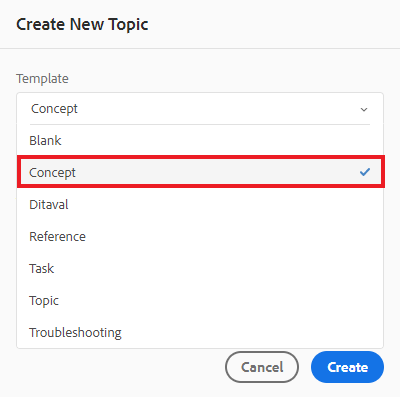

# 컨텐츠 만들기 및 구조

사용자 인터페이스를 숙지하면 자체 콘텐츠를 만들고 구조화할 수 있습니다.

>[!VIDEO](https://video.tv.adobe.com/v/336657?quality=12&learn=on)

## 폴더 만들기

1. 다음 항목 선택 **저장소** 아이콘 을 클릭하여 폴더 및 파일을 봅니다.

   

1. 다음 항목 선택 **+** 아이콘 및 **폴더**.

   

1. 폴더에 제목을 지정합니다.
1. **만들기**를 선택합니다.
이제 저장소에 표시되는 새 폴더를 만들었습니다. 이 폴더는 모든 과정 콘텐츠의 홈입니다.

## 하위 폴더 만들기

이제 새 폴더 내에 이미지 또는 기타 콘텐츠를 포함하는 폴더를 만들 수 있습니다.

1. 저장소의 새 폴더 위로 마우스를 가져간 후 표시되는 줄임표 아이콘을 선택합니다.

   

   옵션(Options) 메뉴가 표시됩니다.

1. 선택 **\> 폴더 만들기**.
   

1. 하위 폴더에 제목(예: &quot;이미지&quot;)을 지정하고 **만들기**.

## 새 개념 만들기 및 채우기

1. 저장소의 상위 폴더 위로 마우스를 가져간 후 줄임표 아이콘을 선택합니다.

   

   옵션 메뉴 가 표시됩니다.

1. 선택 **\> 항목 만들기**.

   

   새 주제 만들기 대화 상자가 표시됩니다.

1. 대화 상자의 템플릿 드롭다운 메뉴에서 을(를) 선택합니다 **개념**.

   

1. 개념에 제목을 지정하고 다음을 선택합니다. **만들기**.

   새 개념이 해당 제목으로 채워져 편집기에 표시됩니다.

   

1. 짧은 설명 또는 단락을 클릭하고 콘텐츠를 입력하여 개념을 채웁니다.

## 저장 후 새 버전으로 저장

언제든지 저장 또는 새 버전으로 저장을 사용하여 작업을 저장할 수 있습니다. 변경 사항을 유지하려면 저장 을 사용하고, 현재 변경 사항으로 주제의 새 버전을 작성하려면 새 버전으로 저장 을 사용합니다.

### 버전 관리 없이 작업 저장

1. 다음 항목 선택 **저장** 아이콘.

   

### 새 버전으로 저장

1. 다음 항목 선택 **새 버전으로 저장** 아이콘 을 클릭하여 액세스합니다.

   

   새 버전으로 저장 대화 상자가 표시됩니다.

1. 새 버전에 대한 설명 필드에 변경 사항에 대한 간략하지만 명확한 요약을 입력합니다.
1. 버전 레이블 필드에 관련 레이블을 입력합니다.

   레이블을 사용하면 게시할 때 포함할 버전을 지정할 수 있습니다.

   >[!NOTE]
   > 
   > 프로그램이 사전 정의된 레이블로 구성된 경우 레이블 지정을 일관되게 유지하기 위해 다음 중에서 선택할 수 있습니다.

1. **저장**&#x200B;을 선택합니다.

   주제의 새 버전을 만들고 버전 번호가 업데이트됩니다.
