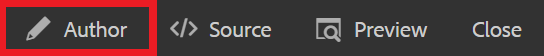

# 웹 사이트에 연결

웹 링크는 자세한 정보를 보려면 웹 사이트로 안내하고, 외부 콘텐츠와 상호 작용하거나 다운로드 가능한 파일에 대한 액세스 권한을 제공합니다. 다음 단계에서는 기존 개념에 웹 링크를 추가하는 방법을 안내합니다.

>[!VIDEO](https://video.tv.adobe.com/v/336656?quality=12&learn=on)

## 링크 삽입

1. 저장소에서 개념을 선택하고 편집기에서 엽니다.
1. 개념에 텍스트 문자열을 추가하고 강조 표시하거나 선택한 기존 텍스트를 강조 표시합니다.

   이 강조 표시된 텍스트는 링크가 삽입될 위치입니다.
1. 다음 항목 선택 **상호 참조 삽입** 단추를 클릭합니다.

   

   참조 대화 상자가 표시됩니다.

1. 선택 **웹 링크** 왼쪽 메뉴에서
1. 원하는 URL을 붙여넣은 다음 **선택**.

   링크는 정상적으로 작동하며 클릭하면 새 브라우저 탭에서 웹 페이지가 열립니다.

## 미리 보기를 사용하여 링크 테스트

미리보기 버튼을 사용하면 주제의 미리보기를 볼 수 있습니다. 여기에서 링크를 테스트하고 대상자처럼 볼 수 있습니다.

1. 선택 **미리 보기** 을 클릭합니다.

   

   개념이 미리보기에서 열립니다.

1. 링크를 선택합니다.
링크 대상이 다른 탭에서 열립니다.
1. 을 선택하여 작성자 보기로 돌아가기 **작성자** 을 클릭합니다.

   

## 새 버전으로 저장

이제 개념에 더 많은 콘텐츠를 추가했으므로 작업을 새 버전으로 저장하고 변경 사항을 기록할 수 있습니다.

1. 다음 항목 선택 **새 버전으로 저장** 아이콘.

   

1. 새 버전에 대한 설명 필드에 변경 사항에 대한 간략하지만 명확한 요약을 입력합니다.
1. 버전 레이블 필드에 관련 레이블을 입력합니다.

   레이블을 사용하면 게시할 때 포함할 버전을 지정할 수 있습니다.

   >[!NOTE]
   > 
   > 프로그램이 사전 정의된 레이블로 구성된 경우 레이블 지정을 일관되게 유지하기 위해 다음 중에서 선택할 수 있습니다.

1. **저장**&#x200B;을 선택합니다.

   주제의 새 버전을 만들고 버전 번호가 업데이트됩니다.
