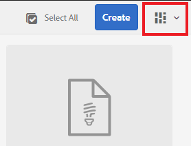
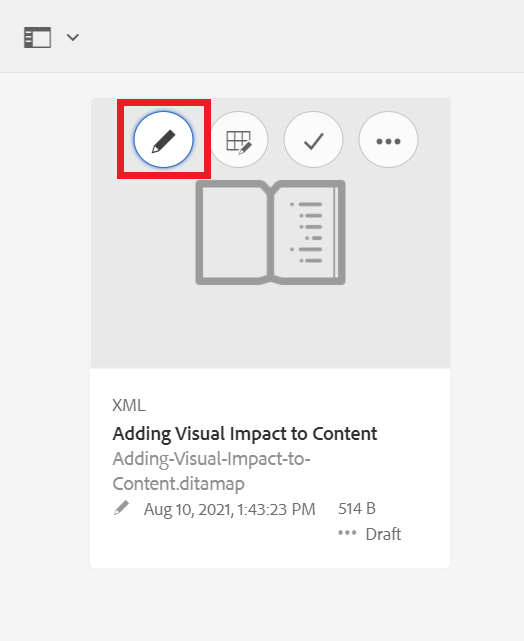

# AEM 사용자 인터페이스 이해

Experience Manager을 위해 XML 편집기에서 에셋, 파일 및 폴더를 관리하는 방법에 대해 알아봅니다.

>[!VIDEO](https://video.tv.adobe.com/v/336659?quality=12&learn=on)

## XML 편집기 액세스

1. 로그인 화면에서 사용자 이름과 암호를 입력하고 **[!UICONTROL 로그인]**&#x200B;을 선택합니다.
1. AEM 탐색 페이지에서 **[!UICONTROL XML 편집기]**&#x200B;를 선택하십시오.

## XML 편집기 뷰

사이드바에서 조직의 요구 사항에 가장 적합한 XML 편집기의 여러 보기 중에서 선택할 수 있습니다. 여기에는 기본 보기와 [!UICONTROL 저장소 보기]가 포함됩니다.

기본 보기에는 [!UICONTROL 즐겨찾기]가 표시됩니다. 필요에 따라 바로 가기를 사용하여 추가로 사용자 정의할 수 있습니다. 반대로 [!UICONTROL 저장소 보기]에는 더 일반적인 폴더 구조가 표시됩니다.

### 기본 보기에서 [!UICONTROL 저장소 보기] (으)로 전환

1. 왼쪽 레일에서 **[!UICONTROL 저장소 보기]**&#x200B;를 선택합니다.

   

   [!UICONTROL 저장소 보기]가 표시됩니다.

## ASSETS UI

[!UICONTROL Assets] 인터페이스에서 다음을 볼 수 있습니다.

### Assets UI에서 컨텐츠 보기

콘텐츠로 추가 작업을 수행할 수 있습니다. 이러한 옵션 중 하나는 Assets UI에서 파일을 보는 것입니다.

1. 저장소의 폴더 또는 주제 위로 마우스를 가져간 후 표시되는 줄임표 아이콘을 선택합니다.

   

   옵션(Options) 메뉴가 표시됩니다.

1. 메뉴에서 **Assets UI에서 보기**&#x200B;를 선택합니다.

   

### 보기 선택

조직의 요구 사항에 가장 적합하게 Assets UI에 대한 여러 보기 중에서 선택할 수 있습니다.

1. 오른쪽 상단의 **전환기 보기** 아이콘을 선택합니다.

   

   드롭다운 메뉴가 표시됩니다.

1. 작업할 보기를 선택합니다.

### Assets UI 보기

| 이름 | 설명 |
| --- | --- |
| 카드 보기 | 각 에셋을 아이콘으로 표시 |
| 열 보기 | 압축되고 확장 가능한 폴더 구조로 자산 표시 |
| 목록 보기 | 세부 정보와 함께 에셋을 목록에 표시합니다. |

## XML 편집기로 돌아가기

Assets UI의 모든 보기에서 XML 편집기로 돌아갈 수 있습니다.

### 목록 및 열 보기에서 반환

1. 목록에서 편집할 항목을 선택합니다.
Assets UI에 주제가 표시됩니다.
1. 상단 도구 모음에서 **편집**&#x200B;을 선택합니다.
XML 편집기로 돌아갑니다.

### 카드 보기에서 반환

1. [!UICONTROL Assets] UI의 항목에서 연필 아이콘을 선택합니다.

   

   XML 편집기로 돌아갑니다.
