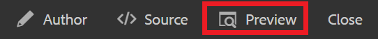

# 버전 관리 콘텐츠

문서의 버전 지정을 통해 현재 상태의 스냅샷을 만들 수 있습니다. 주제 또는 맵의 여러 버전을 만들면 변경 사항을 추적하고 이전 작업을 복구할 수 있습니다.

>[!VIDEO](https://video.tv.adobe.com/v/336724?quality=12&learn=on)

## 새 버전 만들기

1. 새 버전으로 저장 아이콘을 선택합니다.

   

   새 버전으로 저장 대화 상자가 표시됩니다.

1. 새 버전에 대한 설명 필드에 변경 사항에 대한 간단한 요약을 입력합니다.
1. 버전 레이블 필드에 관련 레이블을 입력합니다.

   레이블을 사용하면 게시할 때 포함할 버전을 지정할 수 있습니다.

   >[!NOTE]
   >
   >프로그램이 사전 정의된 레이블로 구성된 경우 이 중에서 선택하여 일관된 레이블 지정을 보장할 수 있습니다.

1. **저장**&#x200B;을 선택합니다.

   항목의 새 버전을 만들면 버전 번호가 업데이트됩니다. 문서의 첫 번째 버전은 버전 1.0입니다.

## 버전 기록 보기

여러 버전의 컨텐츠가 있으면 해당 컨텐츠의 차이점을 탐색할 수 있습니다.

1. 도구 모음에서 버전 기록 아이콘을 선택합니다.

   

   버전 기록 대화 상자가 표시됩니다.

1. 드롭다운에서 버전을 선택하여 현재 버전과 비교합니다.

   버전 간 변경 사항이 표시됩니다.

## 선택한 버전으로 되돌리기

필요한 경우 버전을 선택하고 다시 해당 버전으로 되돌릴 수 있습니다. 이렇게 하면 현재 버전을 취소하고 이전 버전으로 돌아갈 수 있습니다.

1. 버전 기록 대화 상자에서 드롭다운에서 되돌릴 버전을 선택합니다.
1. 선택 **선택한 버전으로 되돌리기**.

버전 되돌리기 대화 상자가 표시됩니다.

1. 이전 버전으로 되돌릴 이유에 대해 설명 설명을 추가합니다.
1. 선택 **확인**.

   주제가 다시 특정 버전으로 되돌렸습니다.

## 필터를 사용하여 버전 비교

오른쪽 레일에서 추적 및 비교 표시 필터를 사용하여 미리 보기에서 버전 차이점을 볼 수도 있습니다.

1. 선택 **미리 보기** 상단 메뉴 모음에서 를 클릭합니다.

   

   주제가 미리 보기에서 열립니다.

1. 오른쪽 레일의 추적 드롭다운에서 을 선택합니다 **마크업 표시**.
1. 차이 표시 드롭다운에서 비교할 버전을 선택합니다.

   변경 사항이 형식이 지정된 콘텐츠로 표시됩니다.
