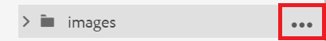
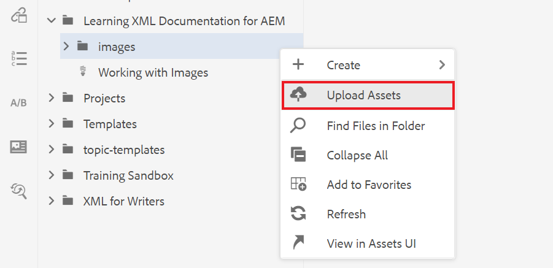

# 이미지를 사용한 작업

다음은 이미지 업로드 및 삽입과 새로운 버전의 주제를 저장하는 방법에 대한 안내입니다.

예제 이미지 파일은 [여기](assets/working-with-images/SignInScreen.png)에서 다운로드할 수 있습니다.

>[!VIDEO](https://video.tv.adobe.com/v/336661?quality=12&learn=on)

## 이미지 업로드

1. 하위 폴더 위로 마우스를 가져간 후 줄임표 아이콘을 선택하여 옵션 메뉴를 엽니다.

   

1. **[!UICONTROL Assets 업로드]**&#x200B;를 선택합니다.

   

1. 로컬 시스템에서 업로드할 이미지를 선택하고 **열기**&#x200B;를 선택합니다.

   [!UICONTROL Assets 업로드] 대화 상자가 표시됩니다.

1. **업로드**&#x200B;를 선택합니다.

## 주제에 이미지 삽입

여러 가지 방법으로 주제에 이미지를 삽입할 수 있습니다.

로컬 시스템의 이미지를 주제로 끌어서 놓을 수 있습니다. 이미지가 이미 업로드되어 있는 경우 왼쪽 레일에서 직접 주제로 드래그하여 놓을 수도 있습니다. 또는 이미지 삽입 버튼을 사용하여 현재 왼쪽 레일에 표시되지 않는 이미지를 삽입하고 삽입하기 전에 이미지를 추가로 구성할 수 있습니다.

다음에 대해서는 문서 편집기에서 주제가 열려 있는지 확인합니다.

### 드래그 앤 드롭으로 이미지 삽입

1. 로컬 시스템이나 왼쪽 레일에서 이미지 파일을 선택하고 주제에 끌어다 놓습니다.

   이미지가 편집기에 표시됩니다.

### 이미지 삽입 버튼을 사용하여 이미지 삽입

1. **이미지 삽입** 아이콘을 선택합니다.

   

   이미지 삽입 대화 상자가 나타납니다.

1. 파일 선택 필드 옆의 폴더 아이콘을 선택하여 이미지를 검색하거나 저장소 내의 해당 위치로 이동합니다.
1. 이미지의 아이콘을 선택한 다음 **선택**&#x200B;합니다.

   

   선택한 이미지에 대한 정보가 포함된 이미지 삽입 대화 상자가 나타납니다.

1. 필요에 따라 그림 제목 및 대체 텍스트 필드에 텍스트를 입력합니다.
1. **삽입**&#x200B;을 선택합니다.

   이미지가 해당 그림 제목과 함께 편집기에 표시됩니다.

## 주제에서 이미지 제거

1. 문서 편집기에서 이미지를 선택하고 **Delete** 키를 누릅니다.

## 주제의 새 버전 저장

버전 관리를 통해 다양한 버전을 검토하고 비교할 수 있습니다. 이전 버전으로 롤백할 수도 있습니다.

주제를 크게 변경했으므로 이제 현재 작업을 새 버전으로 저장하는 것이 유용할 수 있습니다.

1. **새 버전으로 저장** 아이콘을 선택합니다.

   

   **새 버전으로 저장** 대화 상자가 표시됩니다.

1. 새 버전에 대한 설명 필드에 변경 사항에 대한 간략하지만 명확한 요약을 입력합니다.
1. 버전 레이블 필드에 관련 레이블을 입력합니다.

   레이블을 사용하면 게시할 때 포함할 버전을 지정할 수 있습니다.

   >[!NOTE]
   > 
   > 프로그램이 사전 정의된 레이블로 구성된 경우 레이블 지정을 일관되게 유지하기 위해 다음 중에서 선택할 수 있습니다.

1. **저장**&#x200B;을 선택합니다.

   주제의 새 버전을 만들고 버전 번호가 업데이트됩니다.
