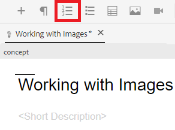

# 목록 작업

정보를 구성하려면 글머리 기호 및 번호 매기기 목록이 필요할 수 있습니다. 다음은 기존 개념 내에 목록을 삽입하고 작업하는 방법을 설명합니다.

>[!VIDEO](https://video.tv.adobe.com/v/336658?quality=12&learn=on)

## 글머리 기호 목록

목록 구성 요소를 특정 순서로 정렬할 필요가 없는 경우 글머리 기호 또는 무순서 목록을 사용해야 합니다.

### 글머리 기호 목록 삽입

1. 도구 모음에서 **글머리 기호 목록 삽입** 아이콘을 선택합니다.

   

   글머리 기호가 표시됩니다. 이것이 목록의 시작입니다.

1. 첫 번째 목록 항목을 입력합니다.
1. Enter 키를 눌러 두 번째 항목을 만들고 컨텐츠를 입력합니다.
1. 필요에 따라 목록 항목을 계속 추가합니다.

## 번호 매기기 목록

목록 구성 요소를 특정 방식으로 정렬하거나 구조화해야 할 때 번호 매기기 목록을 사용해야 합니다.

### 순서가 지정된 목록 삽입

1. 도구 모음에서 **번호 매기기 목록 삽입** 아이콘을 선택합니다.

   

   숫자가 표시됩니다. 이것이 목록의 시작입니다.

1. 첫 번째 목록 항목을 입력합니다.
1. Enter 키를 눌러 두 번째 항목을 만들고 컨텐츠를 입력합니다.
1. 필요에 따라 목록 항목을 계속 추가합니다.

## 새 버전으로 저장

이제 개념에 더 많은 콘텐츠를 추가했으므로 작업을 새 버전으로 저장하고 변경 사항을 기록할 수 있습니다.

1. **새 버전으로 저장** 아이콘을 선택합니다.

   

1. 새 버전에 대한 설명 필드에 변경 사항에 대한 간략하지만 명확한 요약을 입력합니다.
1. 버전 레이블 필드에 관련 레이블을 입력합니다.

   레이블을 사용하면 게시할 때 포함할 버전을 지정할 수 있습니다.

   >[!NOTE]
   > 
   > 프로그램이 사전 정의된 레이블로 구성된 경우 레이블 지정을 일관되게 유지하기 위해 다음 중에서 선택할 수 있습니다.

1. **저장**&#x200B;을 선택합니다.

   주제의 새 버전을 만들고 버전 번호가 업데이트됩니다.
