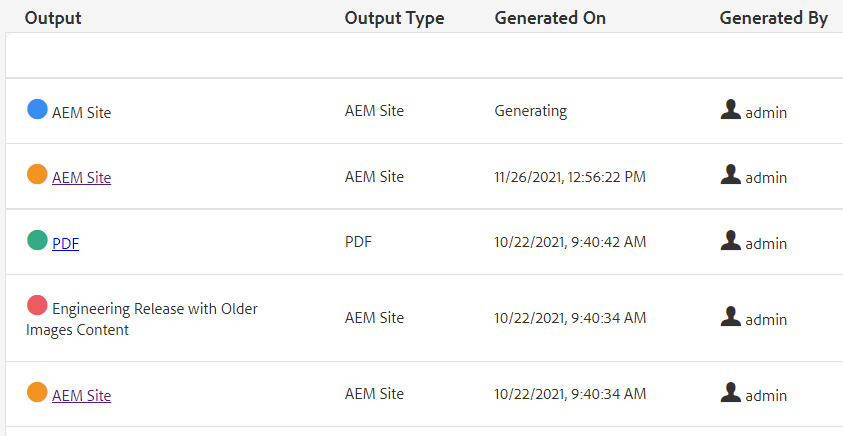

# 벌크 게시

게시할 때 두 개 이상의 문서 유형이 필요한 경우가 많습니다. 맵 컬렉션을 사용하여 조립 및 생성될 출력의 수와 유형을 제어하고 벌크 게시를 시작할 수 있습니다. 게시 대시보드를 사용하면 활성 게시 작업을 볼 수 있습니다. 벌크 게시 대시보드 는 컬렉션을 대량으로 활성화하는 방법을 제공합니다.

>[!VIDEO](https://video.tv.adobe.com/v/338985?quality=12&learn=on)

## 맵 컬렉션 작업

맵 컬렉션을 사용하여 하나 이상의 맵에 대해 생성될 출력 유형을 제어할 수 있습니다.

### 맵 컬렉션 만들기

1. 탐색 메뉴에서 **에셋**.

1. 컬렉션 매핑을 선택합니다.

1. **만들기**&#x200B;를 클릭합니다.

1. 컬렉션 제목을 입력합니다.

   

1. **만들기**&#x200B;를 클릭합니다.
1. 성공 메시지를 닫습니다.

1. 맵 컬렉션을 엽니다(타일 아래의 회색 섹션 클릭)

1. 클릭 **편집**.

1. 필요에 따라 맵을 추가합니다.

1. 선택 또는 선택 해제 **출력 사전 설정** 각 맵에 대해
1. 클릭 **완료**.

### 맵 사전 설정 필터링

1. 맵 사전 설정을 엽니다.

1. 아래 **필터** 필요에 따라 옵션을 확장하고 선택합니다.

### 맵 컬렉션에서 컨텐츠 생성

1. 맵 사전 설정을 엽니다.

1. 원하는 경우 **모두 생성**.

1. 또는 생성할 맵과 출력 유형을 선택하고 **선택 항목 생성**.

1. 필요한 경우 출력 탭으로 전환합니다.

1. 출력을 검토합니다.

## 게시 대시보드에서 활성 게시 작업 보기

게시 대시보드를 사용하면 활성 게시 작업을 볼 수 있습니다. 여기에는 맵과 현재 상태의 동적 목록이 표시됩니다. 게시 워크플로우를 추적, 관리 또는 취소할 수 있습니다.

1. 탐색 보기에서 **도구** 아이콘.

1. 클릭 **[!DNL Guides]**.

1. 다음 항목 선택 **대시보드 게시** 타일.

       대시보드가 비어 있으면 실행 중인 게시 작업이 없습니다.
       
   
1. 모든 게시 작업을 보려면 필요에 따라 대시보드를 필터링하십시오.

### 벌크 게시 대시보드 작업

벌크 게시 대시보드를 사용하면 벌크 활성화 컬렉션으로 작업하고 여러 유형의 출력을 제어할 수 있습니다.

### 벌크 활성화 컬렉션 만들기

1. 탐색 보기에서 **도구** 아이콘.

1. 클릭 **[!DNL Guides]**.

1. 다음 항목 선택 **벌크 게시 대시보드** 타일.

1. 컬렉션 제목을 입력합니다.

1. **만들기**&#x200B;를 클릭합니다.

1. 클릭 **열기**.

1. 맵 컬렉션을 엽니다(타일 아래의 회색 섹션 클릭)

1. 클릭 **편집**.

1. 필요에 따라 맵을 추가합니다.

1. 선택 또는 선택 해제 **출력 사전 설정** 각 맵에 대해
1. 클릭 **완료**.
1. 완료되면 맵 컬렉션을 닫습니다.

### 벌크 활성화 컬렉션 빠른 게시

1. 일괄 활성화 컬렉션 타일을 선택합니다.
1. 클릭 **열기**.
1. 맵을 하나 이상 선택합니다.
1. 클릭 **빠른 게시**.
