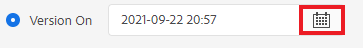
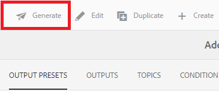
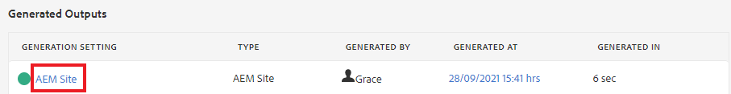
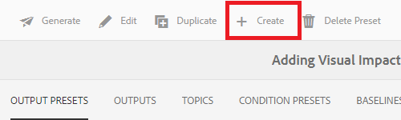

# 기준선을 사용하여 만들기 및 게시

기준선을 사용하면 맵 주제 및 관련 참조 콘텐츠의 버전을 만들 수 있습니다. 특정 날짜 또는 시간 또는 레이블을 기반으로 할 수 있습니다.

>[!VIDEO](https://video.tv.adobe.com/v/338993?quality=12&learn=on)

## 맵 대시보드의 기준선 탭 액세스

맵 대시보드에서 기준선에 액세스할 수 있습니다.

1. 저장소 보기에서 맵의 줄임표 아이콘을 선택하여 옵션 메뉴를 연 다음 **맵 대시보드를 엽니다.**

   
맵 대시보드가 다른 탭에서 열립니다.

1. **기준선**&#x200B;을(를) 선택하십시오.

   

기준선 탭이 표시됩니다.

## 레이블을 기반으로 기준선 만들기

1. [기준선] 탭에서 **만들기**&#x200B;를 선택합니다.

   

   새 베이스라인의 정보가 표시됩니다. 기본 이름은 만든 날짜를 기준으로 합니다.

1. 필요한 경우 베이스라인에 새 이름을 지정합니다.

1. &quot;다음을 기준으로 버전 설정&quot; 제목에서 레이블에 사용할 원을 선택합니다.
   

   >[!NOTE]
   >
   >참고: *레이블이 없는 경우 최신 버전 사용* 확인란이 기본적으로 선택됩니다. 이 항목을 선택하지 않고 선택한 레이블이 없는 주제 또는 미디어 파일이 맵에 있는 경우 기준선 만들기 프로세스가 실패합니다.

1. 사용할 레이블을 입력합니다.

1. **저장**&#x200B;을 선택합니다.

베이스라인이 생성됩니다. 모든 주제 및 관련 정보의 테이블이 표시됩니다.

### 모든 항목 찾아보기 기능 사용

모든 항목 찾아보기 기능을 사용하면 버전 및 레이블을 포함한 항목 정보를 볼 수 있을 뿐만 아니라 사용되는 버전을 지정할 수 있습니다. 기준선을 만들거나 편집할 때 **모든 항목 찾아보기**&#x200B;를 선택하여 액세스할 수 있습니다.

## 날짜 및 시간을 기반으로 기준선 만들기

시간에 따른 스냅샷인 기준선을 생성할 수도 있습니다.

1. [기준선] 탭이 열려 있는지 확인하고 [만들기]를 선택합니다.

   

1. &quot;버전 설정 기준&quot; 제목 아래에서 &quot;버전 설정&quot;에 대한 원을 선택합니다.

   

1. 달력 아이콘을 선택하고 원하는 날짜와 시간을 지정합니다.

   

1. 필요한 경우 베이스라인에 새 이름을 지정합니다.

1. **저장**&#x200B;을 선택합니다.

베이스라인이 생성됩니다. 모든 주제 및 관련 정보의 테이블이 표시됩니다.

### 베이스라인에 레이블 추가

모든 맵 콘텐츠에 새 레이블을 일괄적으로 지정할 수 있습니다.

1. 레이블을 추가할 기준선을 선택합니다.

1. **레이블 추가**&#x200B;를 선택합니다.

   

   레이블 추가 대화 상자가 표시됩니다.

1. 할당할 레이블을 입력하고 **추가**&#x200B;를 선택합니다.

레이블이 모든 주제에 추가되었습니다.

## 기준선을 사용하여 AEM Site 출력 생성

1. 맵 대시보드의 출력 사전 설정 탭으로 이동합니다.

1. AEM 사이트 확인란을 선택합니다.

   

1. **편집**&#x200B;을 선택합니다.

   

   새 페이지가 표시됩니다.

1. 기준 요소 사용 확인란을 선택하고 드롭다운에서 사용할 기준 요소를 선택합니다.

   

1. **완료**&#x200B;를 선택합니다.

   

1. **생성**&#x200B;을 선택하십시오.

   

   베이스라인으로 출력이 생성되었습니다.

## 생성된 출력 보기

1. 맵 대시보드의 출력 탭으로 이동합니다.

1. [생성 설정] 열에서 텍스트를 선택하여 출력을 엽니다.
   

## 기준선 제거

1. 기준선 탭에서 제거할 기준선을 선택합니다.

1. **제거**&#x200B;를 선택합니다.

   

   베이스라인 제거 대화 상자가 표시됩니다.

1. **제거**&#x200B;를 선택합니다.

기준선이 제거됩니다.

## 기준선 복제

1. [기준선] 탭에서 복제할 기준선을 선택합니다.

1. **복제**&#x200B;를 선택합니다.

   

1. **저장**&#x200B;을 선택합니다.

   

중복 베이스라인이 생성됩니다.

## 기준선 수정

베이스라인에 사용되는 항목의 버전을 직접 지정할 수 있습니다.

1. [기준선] 탭에서 수정할 기준선을 선택합니다.
1. **편집**&#x200B;을 선택합니다.

   

1. **모든 항목 찾아보기**&#x200B;를 선택합니다.

   

   주제 및 관련 정보 테이블이 표시됩니다.

1. 수정하려는 주제에 대해 버전 열 아래의 드롭다운에서 원하는 버전을 선택합니다.

   

1. **저장**&#x200B;을 선택합니다.

변경 사항이 저장되었습니다. 이제 기준선에서 지정한 항목 버전을 사용합니다.

## 사용자 지정된 AEM Site 출력 사전 설정 만들기

출력 탭에서 동일한 유형의 기본 출력을 구별하는 것은 어렵습니다. 고유하고 사용자에게 친숙한 이름으로 사용자 지정된 출력 사전 설정을 사용하면 이 문제를 해결할 수 있습니다.

이 경우 기준선을 기반으로 출력 사전 설정을 만드는 것입니다.

1. 맵 대시보드의 출력 사전 설정 탭으로 이동합니다.

1. **만들기**&#x200B;를 선택합니다.

   

   새 출력 사전 설정 페이지(새 출력)가 표시됩니다.
1. 설정 이름 필드에 사용자에게 친숙한 이름을 입력합니다.

1. 기준선 사용 확인란을 선택하고 드롭다운 메뉴에서 원하는 기준선을 선택합니다.

   

1. **완료**&#x200B;를 선택합니다.

새 출력 사전 설정이 생성되어 [출력 사전 설정] 페이지에 표시됩니다.
