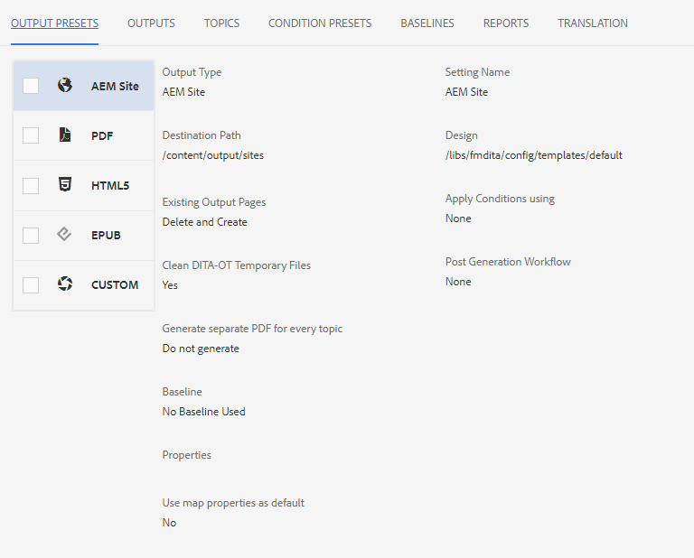

# 맵 대시보드 소개

다음은 맵 대시보드의 주요 기능에 대한 개요를 제공합니다.

>[!VIDEO](https://video.tv.adobe.com/v/339040)

## 맵 대시보드에서 맵 열기

1. 저장소 보기에서 맵의 줄임표 아이콘을 선택하여 옵션 메뉴를 열고 맵 대시보드 열기를 선택합니다.
   

   맵 대시보드가 다른 탭에 열립니다.

## 맵 대시보드의 구성 요소

맵 대시보드에는 출력 사전 설정, 출력 결과, 사용된 항목, 기준선 등을 포함한 많은 탭이 있습니다.

### 출력 사전 설정

출력 사전 설정 탭에는 다음과 같은 다양한 유형의 출력에 대한 기본 사전 설정이 표시됩니다. AEM 사이트, PDF, HTML5, ePub 및 사용자 지정.

출력 사전 설정을 선택하여 변환 이름, 대상 경로, 기준선 및 적용된 조건을 포함하여 해당 설정의 세부 정보를 볼 수 있습니다.

### 출력

출력(Outputs) 탭에는 이전에 생성한 모든 출력 및 현재 생성 출력이 표시됩니다.

생성 설정 열 아래의 녹색 원은 출력이 성공적으로 생성되었음을 나타냅니다. 이 열의 텍스트는 활성 하이퍼링크 역할을 하며 생성된 출력을 열 수 있습니다. 유형 열 아래의 항목은 출력 유형을 나타냅니다.
출력을 생성한 사용자의 이름, 생성 날짜 및 시간, 생성 시간이 포함된 기타 출력 생성 정보도 여기에 표시됩니다. 생성 중에 오류가 있는 경우 생성 위치 열 아래에서 생성 날짜 및 시간을 선택하여 오류 로그를 열고 검토할 수 있습니다.

### 주제

주제 탭에는 맵 내의 모든 주제 목록이 표시됩니다.

항목의 확인란을 선택하면 추가 작업을 수행할 수 있습니다. 태그를 편집하고 재생성하고 태그를 표시, 적용 또는 숨길 수 있습니다.

### 조건 사전 설정

조건 사전 설정 탭에는 포함하거나 제외할 특정 조건부 컨텐츠에 대한 설정이 표시됩니다.

여기에서 작성기 전용 에디션에 대한 확인란을 선택하면 &quot;디자이너&quot; 레이블이 있는 &quot;대상&quot; 속성이 있는 모든 콘텐츠를 제외하고 &quot;작성기&quot; 레이블이 있는 모든 콘텐츠를 포함하는 출력이 표시됩니다.

### 기준선

베이스라인 탭을 사용하여 베이스라인을 볼 수 있습니다.

기준선은 시간에 따라 스냅샷으로 작동하며 게시할 주제 및 자산의 버전을 만들 수 있도록 해줍니다. 예를 들어 특정 날짜 및 시간에 컨텐츠를 캡처하는 기준선은 한 항목의 버전 1.3과 해당 시간의 각 버전을 기준으로 다른 항목의 1.0을 사용할 수 있습니다.
지정된 베이스라인이 없으면 모든 컨텐츠의 최신 버전과 함께 출력이 생성됩니다.

### 보고서

보고서 탭에는 사용 중인 총 주제 수, 이 항목 내에 누락된 요소 및 문서 상태를 포함하여 주제 정보의 요약이 표시됩니다.

항목에 요소가 없으면 행에서 맨 오른쪽 화살표를 선택하여 항목을 확장하고 오류에 대한 세부 정보를 볼 수 있습니다.
