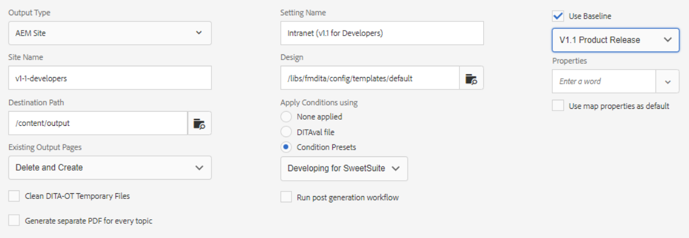

# 출력 사전 설정

[출력 사전 설정]은 맵에 할당된 게시 속성의 컬렉션입니다. 필요한 경우 이러한 매개 변수를 만들거나 수정할 수 있습니다.

>[!VIDEO](https://video.tv.adobe.com/v/338989?quality=12&learn=on)

## 출력 사전 설정 액세스

XML 편집기의 맵이 맵 대시보드에서 열리면 출력 사전 설정이 표시됩니다. 사전 설정에는 특정 출력 유형, 대상 경로, 기존 출력 페이지를 관리하는 방법에 대한 지침 및 맵 출력을 생성하기 위해 맵에 적용할 수 있는 기타 설정에 대한 정보가 포함될 수 있습니다.

## 출력 사전 설정 만들기

>[!NOTE]
>
참고: 출력 사전 설정에서 사용되는 기능 중 일부는 기준선 또는 조건 사전 설정을 먼저 개발하는 것에 따라 달라질 수 있습니다. 이러한 항목이 필요한 경우 적절한 탭을 사용하여 구성해야 합니다.

1. 기준선 출력 사전 설정을 선택합니다. 예를 들어 새로 만들 사전 설정이 사이트용이거나 Adobe PDF 컨텐츠를 제공하는 경우 AEM 또는 PDF을 선택할 수 있습니다.

1. **만들기**&#x200B;를 클릭합니다.

1. 필요한 경우 출력 유형을 선택합니다.

1. 출력 유형에 따라 옵션을 추가로 구성합니다.

1. **완료**&#x200B;를 클릭합니다.

## 출력 사전 설정 편집

출력 사전 설정은 사전 정의되어 있지만 필요에 따라 사용자 정의할 수 있습니다.

1. 맵 대시보드를 엽니다.

1. **출력 사전 설정** 탭을 선택합니다.

1. 출력 사전 설정을 선택합니다.

1. **편집**&#x200B;을 클릭합니다.

1. 필요에 따라 설정을 수정합니다.

   

1. **완료**&#x200B;를 클릭합니다.
