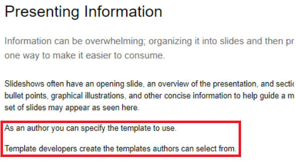
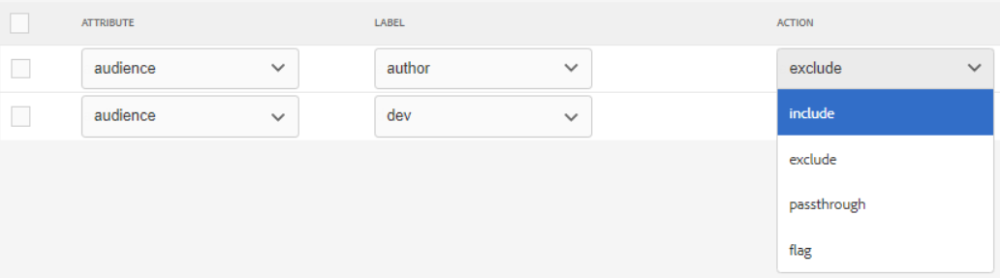

# 조건을 사용하여 게시

조건부 게시를 사용하면 하나 이상의 대상, 제품 또는 플랫폼에 대해 한 개의 콘텐츠 소스를 작성할 수 있습니다. 그런 다음 이 정보를 동적으로 게시할 수 있으며 출력에 포함된 특별히 필요한 컨텐츠만 게시할 수 있습니다.

>[!VIDEO](https://video.tv.adobe.com/v/339041?quality=12&learn=on)

## 운동 준비

여기서는 운동을 위한 샘플 파일을 다운로드할 수 있습니다.

[연습-다운로드](assets/exercises/publishing-with-conditions.zip)

## 조건부 속성을 사용하여 콘텐츠 표시

1. 수정할 항목을 엽니다.

1. 조건부 서식을 지정할 텍스트를 입력합니다. 예를 들어 하나 이상의 단락, 전체 테이블, 그림 또는 기타 컨텐츠가 있습니다.

   

1. 조건부 속성을 지정할 특정 콘텐츠를 선택합니다. 예를 들어 소스 내의 단일 단락입니다.

   

1. 오른쪽 레일에서 속성 이 표시되는지 확인합니다.

1. 대상, 제품 또는 플랫폼에 대한 속성을 추가합니다.

1. 속성에 값을 지정합니다. 조건부 마크업을 표시하는 콘텐츠 표시 업데이트가 적용되었습니다.

   

## 조건부 콘텐츠 미리 보기

1. 클릭 **미리 보기**.

1. 아래 **필터**&#x200B;를 선택하거나 조건을 선택 취소하여 표시하거나 숨깁니다.

1. 선택 또는 선택 취소 **조건 텍스트 강조 표시**.

   

## 조건 사전 설정 만들기

조건 사전 설정은 출력을 생성하는 동안 포함 또는 제외하거나 표시할 항목을 정의하는 속성 모음입니다.

1. 맵 대시보드에서 **조건 사전 설정** 탭.

1. **만들기**&#x200B;를 클릭합니다.

1. 선택 **추가** 또는 **모두 추가**).

1. 조건 이름을 지정합니다.

1. 속성, 레이블 및 작업 조합을 선택합니다.

   

1. 필요에 따라 반복하십시오.

1. **저장**&#x200B;을 클릭합니다.

## 조건부 출력 생성

콘텐츠에 조건이 적용되면 출력으로 생성할 수 있습니다. 조건 사전 설정 또는 DITAval 파일을 사용할 수 있습니다.

## 조건 사전 설정을 사용하여 조건부 출력 생성

1. 을(를) 선택합니다 **출력 사전 설정** 탭.

1. 출력 사전 설정을 선택합니다.

1. 클릭 **편집**.

1. 아래 **다음을 사용하여 조건 적용** 조건 사전 설정을 선택합니다.

   

1. 클릭 **완료**.

1. 출력 사전 설정을 생성하고 컨텐츠를 검토합니다.

## DITAval 파일을 사용하여 조건부 출력 생성

DITAval 파일을 사용하여 조건부 콘텐츠를 게시할 수 있습니다. 게시 시 참조되는 파일을 만들거나 업로드해야 합니다.

1. 을(를) 선택합니다 **출력 사전 설정** 탭.

1. 출력 사전 설정을 선택합니다.

1. 클릭 **편집**.

1. 조건 적용에서 DITAval 파일을 선택합니다.

   

1. 클릭 **완료**.

1. 출력 사전 설정을 생성하고 컨텐츠를 검토합니다.
