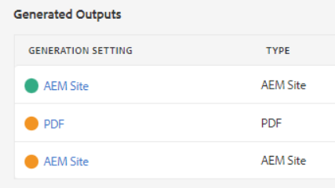
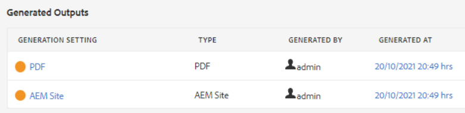

# 게시 오류 문제 해결

일반적으로 맵 게시는 간단합니다. 맵을 열고 출력 사전 설정을 선택한 다음 출력을 생성합니다. 그러나 맵 또는 해당 주제에 오류가 있으면 출력 생성에 실패할 수 있습니다. 이 경우 문제를 해결하는 방법을 아는 것이 중요합니다.

>[!VIDEO](https://video.tv.adobe.com/v/338990?quality=12&learn=on)

## 연습 준비

여기에서 연습에 사용할 샘플 파일을 다운로드할 수 있습니다.

[연습 다운로드](assets/exercises/publishing-basic-to-advanced.zip)

## 게시 오류의 일반적인 원인

소스 콘텐츠에 오류가 발생할 수 있습니다. 예:

* 이름이 잘못된 파일 경로 참조

* 잘못된 이름의 폴더

* 그래픽 또는 파일 누락

* 잘못 구성된 콘텐츠 참조

* 끊어진 상호 참조

* 속성 값(예: 숫자 대신 문자열) 오류

* [!DNL AEM Guides]에서 사용하는 구성 요소의 설정이 잘못되었습니다.

## 오류의 영향

오류가 경미하거나 파일이 성공적으로 패키지되지 않았음을 알리는 간단한 메모를 초래할 수 있거나, 출력을 생성하지 못할 정도로 심각한 오류일 수 있습니다. 출력 탭에는 출력 생성과 관련된 성공, 오류 또는 실패를 표시하는 색상으로 구분된 아이콘이 표시됩니다.

## 오류 로그 열기 및 검토

생성된 로그 파일을 열어 검토할 수 있습니다.

1. **출력** 탭에서 **생성된 날짜/시간을 클릭합니다.**

   

1. 오류 로그를 스크롤합니다.

## 오류 유형 표시 및 숨기기

오류 로그에는 각 오류 유형이 고유한 색상으로 표시됩니다.

1. 강조 표시를 표시하거나 숨기려면 오류 유형을 **선택**&#x200B;하거나 **선택 해제**&#x200B;하십시오.

1. **다음** 또는 **이전** 단추(화살표)를 사용하여 오류를 탐색합니다.

## 오류 해결

오류 유형에 따라 해결이 간단하거나 복잡할 수 있습니다. 작성자가 XML 편집기에서 작성하거나 관리자가 [!DNL AEM Guides](으)로 작업해야 할 수 있습니다. 구체적인 수정 사항은 오류, 영향 및 조직 워크플로에 따라 다릅니다.

* 이름이 잘못된 파일 경로 참조

      작성자가 원본 문서의 경로 참조를 업데이트할 수 있습니다.
     
  
* 잘못된 이름의 폴더

      작성자는 필요에 따라 폴더 이름을 업데이트하거나 파일을 이동할 수 있습니다.
     
  
* 그래픽 또는 파일 누락

      작성자가 누락된 그래픽/파일을 업로드하거나, 그래픽/파일의 이름을 바꾸거나, 그래픽/파일을 이동할 수 있습니다.
     
  
* 잘못 구성된 콘텐츠 참조

      작성자가 참조된 콘텐츠의 위치를 수정하거나 콘텐츠 참조에 대한 경로를 변경할 수 있습니다.
     
  
* 끊어진 상호 참조

      작성자가 상호 참조가 가리키는 위치를 수정하거나 대상 파일 이름 또는 속성을 변경할 수 있습니다.
     
  
* 속성 값(예: 숫자 대신 문자열) 오류

      작성자가 특성을 올바른 값으로 업데이트하거나 관리자가 시스템을 업데이트하여 새 값을 지원할 수 있습니다.
     
  
* [!DNL AEM Guides]에서 사용하는 구성 요소의 설정이 잘못되었습니다.

      관리자는 시스템, 해당 구성 요소 또는 사용 권한의 설치를 업데이트할 수 있습니다.
     
  