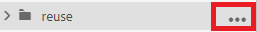

# 보고서 작업

맵 대시보드의 보고서 탭에서는 끊어진 링크, 참조되고 재사용되는 콘텐츠(conrefs), 상호 참조 또는 기타 누락된 정보를 식별하고 해결할 수 있습니다.

>[!VIDEO](https://video.tv.adobe.com/v/339039?quality=12&learn=on)

## 연습 준비

여기에서 연습에 사용할 샘플 파일을 다운로드할 수 있습니다.

[운동-다운로드](assets/exercises/working-with-reports.zip)

## Assets 업로드

1. 저장소 보기에서 주 폴더의 줄임표 아이콘을 선택하여 옵션 메뉴를 엽니다.

   

1. **[!UICONTROL Assets 업로드]**&#x200B;를 선택합니다.

   

1. 폴더에 업로드할 파일을 선택하고 **업로드**&#x200B;를 선택합니다.

DITA 파일이 열려 있으므로 내용 누락, 원추 또는 상호 참조에 대한 문제를 검토해야 합니다.

## 맵 만들기

1. 기본 폴더에서 줄임표 아이콘을 선택하여 옵션 메뉴를 엽니다.

   

1. **만들기 > 맵**&#x200B;을 선택합니다.

   

   새 맵 만들기 대화 상자가 표시됩니다.

1. 템플릿 필드의 드롭다운 메뉴에서 **북맵**(또는 만들고 있는 콘텐츠 유형에 따라 **맵**)을 선택하고 맵에 제목을 지정합니다.

1. **만들기**&#x200B;를 선택합니다.

맵이 만들어지고 왼쪽 레일이 자동으로 저장소 보기에서 맵 보기로 변경됩니다.

## 맵 구성 요소 삽입

1. 왼쪽 레일에서 연필 아이콘을 선택합니다.
편집 아이콘이며, 이를 통해 편집기에서 맵을 열 수 있습니다.

   

1. 저장소 아이콘을 선택하여 저장소 보기로 다시 전환합니다.

   

1. 저장소에서 편집기의 맵으로 주제를 끌어다 놓아 맵에 주제를 추가합니다.
선 표시기는 주제가 배치될 위치를 보여 줍니다.

1. 필요에 따라 주제를 계속 추가합니다.

1. 완료되면 **새 버전으로 저장**&#x200B;을 선택합니다.

   

1. *새 버전에 대한 설명* 필드에 설명 설명을 입력합니다.

1. **저장**&#x200B;을 선택합니다.

## AEM 사이트 출력 생성

1. 저장소에서 맵의 줄임표 아이콘을 선택하여 옵션 메뉴를 연 다음 **맵 대시보드를 엽니다.**

   

   맵 대시보드가 다른 탭에서 열립니다.
1. [출력 사전 설정] 탭에서 **AEM 사이트**&#x200B;를 선택합니다.

   

1. **생성**&#x200B;을 선택하십시오.

1. 생성된 출력의 상태를 보려면 출력 페이지로 이동합니다.
오류가 있는 경우 출력 탭에 생성이 완료되었음을 나타내는 녹색 대신 생성 설정 열 아래에 주황색 원이 표시될 수 있습니다.

1. 생성 설정 열 아래의 링크를 선택하여 생성된 출력을 엽니다.
누락된 콘텐츠에 대한 출력을 검토합니다.

## 보고서 탭

보고서 탭에는 주제 요약과 맵 내의 주제 정보 및 문제가 포함된 테이블이 표시됩니다.

컨텐츠를 가져온 후에는 항상 보고서에 맵이 있는지 확인하는 것이 좋습니다.

Missing Elements 열은 누락된 이미지와 끊어진 원추의 수를 나타냅니다. **연필** 아이콘을 선택하여 편집기에서 항목을 열 수 있습니다.

## 누락된 이미지 해결 중

파일에서 이미지가 누락된 경우 콘텐츠가 업로드되었지만 이미지가 업로드되지 않은 것이 일반적인 원인일 수 있습니다. 이 경우 파일에서 예상하는 경로 및 파일 이름과 일치하는 특정 폴더에 이미지를 업로드하여 이미지 누락 문제를 해결합니다.

1. *저장소 보기*&#x200B;에서 이미지 폴더의 줄임표 아이콘을 선택하여 옵션 메뉴를 엽니다.

   

1. **[!UICONTROL Assets 업로드]**&#x200B;를 선택하고 누락된 이미지를 선택합니다.

1. **업로드**&#x200B;를 선택합니다.

누락된 이미지가 업로드되었습니다. 이제 새로 생성된 AEM Site 출력에 이러한 이미지가 표시되고 보고서 탭에 더 이상 누락된 이미지 오류가 표시되지 않습니다.

## 끊어진 원추형 해결

다른 곳에서 참조되는 콘텐츠(conref)가 다른 폴더(예: &quot;reuse&quot;라는 파일)에 대해 로 연결되는 경우 컨텐츠가 업로드되지 않으면 오류를 해결해야 합니다. 예를 들어 &quot;reuse&quot;라는 하위 폴더를 만들고 누락된 파일을 &quot;reuse&quot;에 업로드해야 합니다.

### [!UICONTROL Assets] UI로 에셋 업로드 중

[!UICONTROL Assets 업로드] 옵션 외에 Assets UI로 드래그 앤 드롭하여 에셋을 업로드할 수 있습니다.

1. 저장소 보기에서 재사용 폴더의 줄임표 아이콘을 선택하여 옵션 메뉴를 엽니다.

   

1. **Assets UI에서 보기**&#x200B;를 선택합니다.

   

1. 파일을 폴더로 끌어다 놓습니다.
파일이 업로드되고 conref 오류가 해결됩니다.

이제 모든 오류가 해결되었습니다. 보고서 페이지에 더 이상 오류가 없음을 나타내며 AEM 사이트를 생성하면 누락된 구성 요소가 없는 전체 출력이 됩니다.
