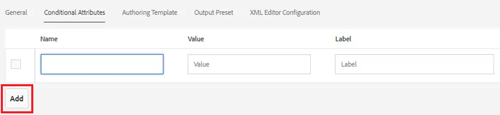

# 조건

DITA에서는 종종 제품, 플랫폼 및 대상과 같은 속성을 통해 조건이 결정됩니다. 여기에는 특정 값이 할당될 수도 있습니다. 사용자는 폴더 프로필을 통해 이 모든 사항을 제어할 수 있습니다.

이 단원에서 사용할 수 있는 샘플 파일은 파일에 제공됩니다 [conditions.zip](assets/conditions.zip).

>[!VIDEO](https://video.tv.adobe.com/v/342755)

## 폴더 프로필에 조건 할당

1. 을(를) 선택합니다 **폴더 프로필** 타일.

2. 클릭 [!UICONTROL **조건부 속성**].

3. 클릭 [!UICONTROL **편집**] 프로필의 왼쪽 상단 모서리에서 을(를) 클릭합니다.

4. [!UICONTROL **추가**]&#x200B;를 클릭합니다.

   

5. 필수 필드를 작성합니다.

   ・ Name 은 프로파일링에 사용되는 속성과 일치해야 합니다.

   ・ 값은 DITA 코드 소스에서 사용할 정확한 항목입니다.

   ・ 레이블은 속성을 입력하는 사용자가 볼 수 있는 단어입니다.

6. [!UICONTROL **저장**]&#x200B;을 클릭합니다.

>[!NOTE]
>
>참고: 글로벌 프로필 구성은 일관된 스타일 안내서를 따르는 속성 및 값의 사용을 제어하는 빠르고 효율적인 방법이 될 수 있습니다.

## 요소에 속성 할당

개념에 사용자 지정 폴더 프로필이 할당되지 않은 경우 단락과 같은 특정 요소에 속성을 할당할 수 있습니다.

1. 에서 **저장소 보기**&#x200B;를 클릭하여 작업할 요소를 선택합니다.

2. 에서 **컨텐츠 속성** 패널에서 [!UICONTROL **속성**] 드롭다운.

3. 지정할 속성을 선택합니다.

4. 추가 **값**.

이제 속성 및 값 쌍이 선택한 요소에 할당됩니다.

## 조건을 사용하여 속성 및 값 쌍 할당

[조건] 패널에서는 속성 및 값 쌍에 대한 제어된 지정을 사용할 수 있습니다.

1. 수정 **사용자 환경 설정**.

   a. 사용자 환경 설정 아이콘을 클릭합니다.

   

   나. 에서 필수 필드를 작성합니다 **사용자 환경 설정** 대화 상자. 예:

   

   c. [!UICONTROL **저장**].

2. 조건 패널에서 대상 및 플랫폼의 드롭다운을 확장합니다. 사용 가능한 조건은 폴더 프로필에 따라 다릅니다.

3. 조건을 원하는 요소에 끌어다 놓아 할당합니다.

## 제목 체계 할당

제목 체계 맵은 Ditamap의 전문 형식이며 맵에서 참조합니다. 주제 구성표는 분류 체계를 정의하는 데 사용됩니다. 사용 가능한 값을 제어할 수 있습니다.

1. 로 이동합니다 **저장소 보기**.

2. 제목 체계 차원을 참조하는 맵을 선택합니다. 이 예제에서는 _디자인 및 레이아웃_.

   

3. 사용자 환경 설정을 구성합니다.

   a. 을(를) 클릭합니다. [!UICONTROL **사용자 환경 설정**] 아이콘.

   

   나. 의 필드를 채웁니다 **사용자 환경 설정** 대화 상자.

   c. 기본 경로 필드 옆에 있는 폴더 기호를 클릭하여 원하는 파일의 경로를 선택합니다.

   d. 클릭 [!UICONTROL **선택**].

   e. 옆에 있는 키 기호를 클릭합니다. **루트 맵** 경로를 입력할 필드입니다.

   >[!IMPORTANT]
   >
   >중요 사항: 선택한 루트 맵은 제목 체계를 포함하는 맵이어야 합니다.

   

   f. 사용할 폴더를 선택하여 표시된 자산을 제한합니다.

   g. 클릭 [!UICONTROL **선택**].

   h. 클릭 [!UICONTROL **저장**].

이제 제목 체계가 할당되었습니다.

## 조건 패널에서 제목 체계 보기

1. 다음으로 이동 **편집기 설정**.

2. 을(를) 선택합니다 **조건** 탭.

3. 상자를 선택합니다. **조건 패널에서 제목 체계 표시**
