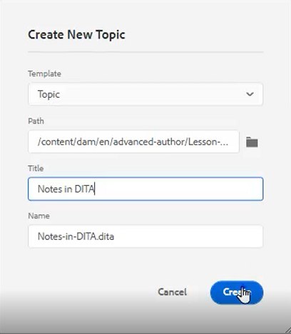
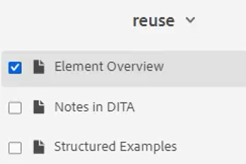

# 컨텐츠 재사용

DITA의 주요 기능 중 하나는 컨텐츠를 재사용하는 기능입니다. 이렇게 하면 작은 구부터 전체 주제 또는 맵까지 컨텐츠를 재사용할 수 있습니다.  그러나 컨텐츠를 효과적으로 재사용하기 위해서는 잘 관리해야 합니다. 재사용 가능한 정보로 작업할 때 효과적인 컨텐츠 전략을 사용할 수 있는지 확인하십시오.

>[!VIDEO](https://video.tv.adobe.com/v/342757?quality=12&learn=on)

## 재사용 가능한 항목 만들기

재사용 가능한 소스 주제가 변경되면 컨텐츠가 사용되는 모든 곳에서 정보가 업데이트됩니다.

1. 로 이동합니다 **저장소**.

1. 을(를) 클릭합니다. **상황별 메뉴** 재사용 폴더 옆에 표시됩니다.

1. 선택 **만들기 > Dita 주제**.

1. 새 주제 만들기 대화 상자에서 필드를 채웁니다. 예:

   

1. [!UICONTROL **만들기**]&#x200B;를 클릭합니다.

1. 필요에 따라 주제에 컨텐츠를 추가합니다.

## 주제에 재사용 가능한 요소 추가

재사용 가능한 요소를 추가하는 방법에는 몇 가지가 있습니다. 여기서는 구성 요소를 하나만 추가할 때 첫 번째 워크플로우가 가장 좋습니다. 두 번째 워크플로우는 여러 재사용 가능한 구성 요소를 추가하는 것이 더 좋습니다.

### 워크플로우 1

1. 올바른 위치에서 항목을 클릭합니다.

1. 을(를) 선택합니다 **재사용 가능한 콘텐츠 삽입** 아이콘 사용 안 함

   

1. 컨텐츠 재사용 대화 상자에서 [!UICONTROL **폴더**] 아이콘.

1. 필요한 폴더로 이동합니다.

1. 재사용 가능한 구성 요소가 있는 항목을 선택합니다.
예:

   

1. 클릭 [!UICONTROL **선택**].

1. 재사용할 특정 구성 요소를 선택합니다.

1. 클릭 [!UICONTROL **선택**].

이제 재사용 가능한 요소가 주제에 삽입되었습니다.

### 워크플로우 2

1. 다음으로 이동 **재사용 가능한 콘텐츠** 왼쪽 패널에 표시됩니다.

1. 을(를) 클릭합니다. [!UICONTROL **추가**] 아이콘을 클릭합니다.

   

1. 폴더로 이동합니다.

1. 특정 주제나 주제를 선택합니다.

1. 클릭 [!UICONTROL **추가**].

1. 재사용 가능한 콘텐츠 패널에서 **요소 개요**.

1. 요소를 올바른 위치에 있는 주제에 끌어다 놓습니다.

이제 재사용 가능한 요소가 주제에 삽입되었습니다.

## 요소에 ID 및 값 할당

방금 만든 dlentry는 재사용 가능한 요소입니다. 따라서 ID와 값이 필요합니다.

1. dlentry 내부를 클릭합니다.

1. 컨텐츠 속성 패널에서 속성 아래의 드롭다운을 클릭합니다.

1. 선택 **ID**.

1. 값에 대한 논리 이름을 입력합니다.

1. 변경 사항이 저장소에 반영되도록 항목을 저장하거나 버전 지정합니다.

ID 및 값이 요소에 할당되었습니다.
