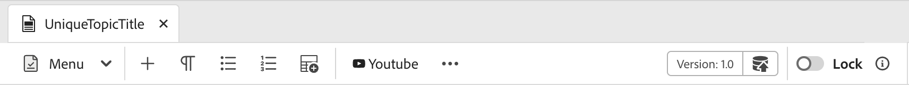

# 개요

이전 UI에서 새 AEM Guides UI로 마이그레이션할 때 **ui_config** 업데이트는 보다 유연하고 모듈식 UI 구성으로 변환되어야 합니다. 이 프레임워크를 사용하면 **editor_toolbar** 및 [기타 도구 모음](/help/courses/course-3/conver-ui-config.md#editing-json-for-different-screens)에 변경 내용을 원활하게 적용할 수 있습니다. 이 프로세스는 애플리케이션에서 다른 보기 및 위젯을 수정하는 것을 지원합니다.

>[!NOTE]
>
>확장 프레임워크로 전환하는 동안 특정 버튼에 적용된 사용자 지정에 문제가 발생할 수 있습니다. 이 경우 신속한 지원 및 해결을 위해 이 페이지를 참조하여 지원 티켓을 제출할 수 있습니다.

## 다른 화면에 대한 JSON 편집

다양한 화면 및 위젯에 대한 XML 편집기 UI 구성 섹션에 JSON 파일을 추가할 수 있습니다. 다음은 널리 사용되는 위젯과 해당 ID의 목록입니다.

1. [editor_toolbar](assets/toolbars/editor_toolbar.json): 파일 및 콘텐츠 작업으로 구성된 Webeditor 도구 모음
1. [editor_tab_bar](assets/toolbars/editor_tab_bar.json): 웹 편집기 내에서 열린 파일의 탭 보기이며, 열린 파일에 대해 수행할 수 있는 작업이 있습니다.
1. [file_mode_switcher](assets/toolbars/file_mode_switcher.json): 웨비터 내에서 열린 파일에 대해 사용 가능한 다양한 모드(작성자, 소스, 미리보기) 간을 전환하는 데 도움이 됩니다.

   

1. [map_console_navigation_bar](assets/toolbars/map_console_navigation_bar.json): 맵 콘솔에 열려 있는 맵의 정보 표시줄입니다. 맵을 변경할 수 있고 설정에 액세스할 수 있습니다.
1. [map_console_action_bar](assets/toolbars/map_console_action_bar.json): [출력 사전 설정], [기준 요소], [변환] 및 [보고서]와 같은 맵 콘솔 항목의 작업 표시줄이며 각 작업 단추와 함께 관련 정보를 제공합니다.

   

1. [home_navigation_bar](assets/toolbars/home_navigation_bar.json): 선택한 폴더 프로필과 함께 시작 메시지가 표시되는 안내 홈 페이지의 헤더 막대

   

<br>

## 각 JSON의 일반 구조

각 JSON은 일관된 구조를 따릅니다.

1. `id`: 구성 요소를 사용자 지정하는 위젯을 지정합니다.
1. `targetEditor`: 편집기 및 모드 속성을 사용하여 단추를 표시하거나 숨길 시기를 정의합니다.

   `targetEditor`에서는 다음 옵션이 지원됩니다.

   - `mode`
   - `displayMode`
   - `editor`
   - `documentType`
   - `documentSubType`
   - `flag`

   자세한 내용은 [targetEditor 속성 이해](#understanding-targeteditor-properties)를 참조하십시오.

   >[!NOTE]
   >
   > Experience Manager Guides의 2506 릴리스에서는 새 속성 `displayMode`, `documentType`, `documentSubType` 및 `flag`이(가) 도입되었습니다. 이러한 속성은 버전 2506 이상에서만 지원됩니다. 마찬가지로 모드 속성에서 `toc`에서 `layout`(으)로의 변경도 이 릴리스부터 적용됩니다.
   >
   > 새 필드 `documentType`을(를) 이제 기존 `editor` 필드와 함께 사용할 수 있습니다.  두 필드는 모두 지원되며 필요에 따라 사용할 수 있습니다. 그러나 구현 간에 일관성을 유지하기 위해, 특히 `documentType` 속성으로 작업할 때는 `documentSubType`을(를) 사용하는 것이 좋습니다. `editor` 필드는 이전 버전과의 호환성 및 기존 통합을 지원하는 데 사용할 수 있습니다.


1. `target`: 새 구성 요소를 추가할 위치를 지정합니다. 고유한 식별을 위해 키-값 쌍 또는 인덱스를 사용합니다. 보기 상태는 다음과 같습니다.

   - **추가**: 끝에 를 추가합니다.

   - **prepend**: 시작 부분에 추가하십시오.

   - **바꾸기**: 기존 구성 요소를 바꿉니다.

예제 JSON 구조:

```json
{
  "id" : "editor_toolbar",
  "view": {
    "items": [
      {
        ...,
        "targetEditor": {
          "mode": [
            "preview"
          ],
          "editor": [
            "xml"
          ]
        },
        "target": {
          "key": "label",
          "value": "Table",
          "viewState": "prepend"
        },
        ...
      },
    ]
  }
}
```

<br>

## `targetEditor` 속성 이해

다음은 각 속성, 해당 용도 및 지원되는 값에 대한 분류입니다.

### `mode`

편집기의 작동 모드를 정의합니다.

**지원되는 값**: `author`, `source`, `preview`, `layout`(이전 `toc`), `split`

### `displayMode` *(선택 사항)*

UI 구성 요소의 가시성 또는 상호 작용을 제어합니다. 지정하지 않으면 기본값이 `show`(으)로 설정됩니다.

**지원되는 값**: `show`, `hide`, `enabled`, `disabled`

예:

```
 {
        "icon": "textBulleted",
        "title": "Custom Insert Bulleted",
        "on-click": "$$AUTHOR_INSERT_REMOVE_BULLETED_LIST",
        "key": "$$AUTHOR_INSERT_REMOVE_BULLETED_LIST",
        "targetEditor": {
          "documentType": [
            "ditamap"
          ],
          "mode": [
            "author"
          ],
          "displayMode": "hide"
        }
      },
```

### `editor`

편집기의 기본 문서 유형을 지정합니다.

**지원되는 값**: `ditamap`, `bookmap`, `subjectScheme`, `xml`, `css`, `translation`, `preset`, `pdf_preset`

### `documentType`

기본 문서 유형을 나타냅니다.

**지원되는 값**: `dita`, `ditamap`, `bookmap`, `subjectScheme`, `css`, `preset`, `ditaval`, `reports`, `baseline`, `translation`, `html`, `markdown`, `conditionPresets`

> 특정 사용 사례에 대해 추가 값이 지원될 수 있습니다.

예:

```
 {
        "icon": "textNumbered",
        "title": "Custom Numbered List",
        "on-click": "$$AUTHOR_INSERT_REMOVE_NUMBERED_LIST",
        "key": "$$AUTHOR_INSERT_REMOVE_NUMBERED_LIST",
        "targetEditor": {
          "documentType": [
            "dita",
            "ditamap"
          ],
          "mode": [
            "author",
            "source"
          ]

        }
      },
```

### `documentSubType`

`documentType`을(를) 기반으로 문서를 추가로 분류합니다.

- **의`preset`**: `pdf`, `html5`, `aemsite`, `nativePDF`, `json`, `custom`, `kb`
- **의`dita`**: `topic`, `reference`, `concept`, `glossary`, `task`, `troubleshooting`

> 특정 사용 사례에 대해 추가 값이 지원될 수 있습니다.

예:

```
 {
        "icon": "rename",
        "title": "Custom Rename",
        "on-click": "$$PUBLISH_PRESETS_RENAME",
        "label": "Custom Rename",
        "key": "$$PUBLISH_PRESETS_RENAME",
        "targetEditor": {
          "documentType": [
            "preset"
          ],
          "documentSubType": [
            "nativePDF",
            "aemsite",
            "json"
          ]

        }
      },
```

### `flag`

문서 상태 또는 기능에 대한 부울 표시기.

**지원되는 값**: `isOutputGenerated`, `isTemporaryFileDownloadable`, `isPDFDownloadable`, `isLocked`, `isUnlocked`, `isDocumentOpen`

또한 `extensionMap`에서 플래그로 사용되는 `targetEditor` 내에 사용자 지정 플래그를 만들 수도 있습니다. 여기서 `extensionMap`은(는) 사용자 지정 키 또는 관찰할 수 있는 값을 추가하는 데 사용되는 전역 변수입니다.

예:

```
 {
        "icon": "filePDF",
        "title": "Custom Export pdf",
        "on-click": "$$DOWNLOAD_TOPIC_PDF",
        "key": "$$DOWNLOAD_TOPIC_PDF",
        "targetEditor": {
          "documentType": [
            "markdown"
          ],
          "mode": [
            "preview"
          ],
          "flag": ["isPDFDownloadable"]

        }
      },
```


## 예

다음은 편집기 도구 모음에서 단추를 추가, 삭제 또는 바꾸는 방법에 대한 예입니다.

### 단추 추가

미리 보기 모드에서만 볼 수 있는 간단한 테이블을 추가하려면 **editor_toolbar**&#x200B;에 새 단추 **사용자 지정 테이블 삽입**&#x200B;을(를) 추가합니다.

```json
{
  "id": "editor_toolbar",
  "view": {
    "items": [
      {
        "icon": "table",
        "title": "Insert Custom Table",
        "on-click": {
          "name": "$$AUTHOR_INSERT_ELEMENT",
          "args": [
            "simpletable",
            "table",
            "choicetable"
          ]
        },
        "key": "$$AUTHOR_INSERT_ELEMENT",
        "targetEditor": {
          "mode": [
            "preview"
          ],
        },
        "target": {
          "key": "label",
          "value": "Table",
          "viewState": "prepend"
        }
      }
    ]
  }
}
```


### 단추 삭제

도구 모음에서 단추 삭제 여기에서는 편집기 도구 모음에서 이미지 추가 단추를 제거하겠습니다.

```json
{
  "id": "editor_toolbar",
  "view": {
    "items": [
      {
        "hide": true,
        "target": {
          "key": "label",
          "value": "Image",
          "viewState": "replace"
        }
      }
    ]
  }
}
```

### 단추 바꾸기

도구 모음의 **멀티미디어** 단추를 작성자 모드에서만 볼 수 있는 **Youtube** 링크 삽입 단추로 바꿉니다.

```json
{
  "id": "editor_toolbar",
  "view": {
    "items": [
      {
        "icon": "s2youtube",
        "title": "Youtube",
        "on-click": {
          "name": "$$AUTHOR_INSERT_ELEMENT",
          "args": "<object data='http://youtube.com'></object>"
        },
        "targetEditor": {
          "mode": [
            "author"
          ]
        },
        "target": {
          "key": "elementId",
          "value": "toolbar-multimedia",
          "viewState": "replace"
        }
      }
    ]
  }
}
```



<br>

### 미리보기 모드에서 버튼 추가

설계에 따라 잠금 및 잠금 해제(읽기 전용) 모드에 대해 버튼 가시성을 별도로 관리하여 명확하고 통제된 사용자 경험을 유지합니다. 기본적으로 인터페이스가 읽기 전용 모드일 때는 새로 추가된 모든 단추가 표시되지 않습니다.
**읽기 전용** 모드에서 단추를 표시하려면 인터페이스가 잠겨 있어도 액세스할 수 있는 도구 모음 하위 섹션 내에 단추를 배치하는 대상을 지정해야 합니다.
예를 들어 대상을 **PDF으로 다운로드**(으)로 지정하면 단추가 기존 표시 단추와 동일한 섹션에 표시되어 잠금 해제 모드에서 액세스할 수 있습니다.

```json
"target": {
  "key": "label",
  "value": "Download as PDF",
  "viewState": "prepend"
}
```

잠금 모드와 잠금 해제 모드 모두에 표시되는 **미리 보기** 모드에서 **PDF으로 내보내기** 단추를 추가하는 중입니다.

```json
{
  "id": "editor_toolbar",
  "view": {
    "items": [
      {
        "icon": "filePDF",
        "title": "Export as PDF",
        "on-click": "$$DOWNLOAD_TOPIC_PDF",
        "key": "$$DOWNLOAD_TOPIC_PDF",
        "targetEditor": {
          "editor": [
            "ditamap",
            "xml"
          ],
          "mode": [
            "preview"
          ]
        },
        "target": {
          "key": "label",
          "value": "Download as PDF",
          "viewState": "prepend"
        }
      },
      {
        "icon": "filePDF",
        "title": "Export as PDF",
        "on-click": "$$DOWNLOAD_TOPIC_PDF",
        "key": "$$DOWNLOAD_TOPIC_PDF",
        "targetEditor": {
          "editor": [
            "ditamap",
            "xml"
          ],
          "mode": [
            "preview"
          ]
        }
      }
    ]
  }
}
```

다음 코드 조각은 잠금 시나리오와 함께 **PDF으로 내보내기** 단추를 보여줍니다.


또한 잠금 해제 시나리오가 있는 **PDF으로 내보내기** 단추는 아래 코드 조각에 있습니다.


### 편집기 도구 모음의 메뉴 드롭다운에 나타나는 옵션 사용자 지정

다음 예를 사용하여 메뉴 드롭다운에서 사용자 지정 옵션을 추가, 숨기기, 바꾸기 및 추가할 수 있습니다.

#### 추가 중

메뉴 드롭다운에 옵션 추가. 메뉴 옵션에서 **사용자 지정 메뉴 단추**&#x200B;를 추가합니다.

```json
{
        "icon": "specialCharacter",
        "title": "Custom menu button",
        "on-click": "$$AUTHOR_INSERT_SYMBOL",
        "targetEditor": {
          "editor": [
            "ditamap"
          ],
          "mode": [
            "author"
          ]
        },
        "target": {
          "key": "label",
          "value": "Version label",
          "viewState": "append"
        }
      }
```

#### 바꾸기

메뉴 드롭다운에 나타나는 옵션 바꾸기 **검토 작업 만들기**&#x200B;를 **사용자 지정 메뉴 단추 3**(으)로 바꾸는 중입니다.

```json
{
        "icon": "specialCharacter",
        "title": "Custom menu button 3",
        "on-click": "$$AUTHOR_INSERT_SYMBOL",
        "target": {
          "key": "label",
          "value": "Create review task",
          "viewState": "replace"
        }

      }
```

#### 숨기기

메뉴 드롭다운에 나타나는 옵션을 숨깁니다. 메뉴에서 **찾기 및 바꾸기** 옵션을 숨깁니다.

```json
{
        "hide": true,
        "target": {
          "key": "label",
          "value": "Find and replace",
          "viewState": "replace"
        }
      }
```

#### 하위 메뉴에서 사용자 지정 옵션 추가

메뉴 드롭다운 내의 하위 메뉴에 옵션 추가.

```json
{
        "icon": "viewAllTags",
        "title": "Toggle Tags View Goziamasu",
        "key": "AUTHOR_TOGGLE_TAG_VIEW",
        "target": {
          "key": "label",
          "value": "Track changes",
          "viewState": "replace"
        },
        "targetEditor": {
          "documentType": [
            "dita"
          ],
          "mode": [
            "author"
          ]
        }

      }
```

## 사용자 지정된 JSON을 업로드하는 방법

1. **XML 편집기 구성** 탭의 상단 표시줄에서 **편집**&#x200B;을 클릭합니다.
1. 이제 **XML 편집기 UI 구성** 하위 섹션에서 **업로드** 단추를 볼 수 있습니다.

   {width="400" height="150"}

1. 을 클릭하고 수정된 JSON을 업로드할 수 있습니다. (업로드할 JSON의 이름은 사용자 지정 중인 위젯 ID와 동일해야 함)
1. 업로드한 후에는 상단 표시줄의 **저장**&#x200B;을 누르십시오.

   업로드된 각 파일에 대해 UI에서 JSON을 **삭제**&#x200B;하여 해당 사용자 지정 항목을 제거하거나 **다운로드**&#x200B;하여 다시 보거나 수정할 수도 있습니다.

   {width="400" height="150"}

<br>


## 사용자 지정된 CSS를 업로드하는 방법

UI에서 사용자 정의 추가 단추 또는 이미 존재하는 위젯 또는 단추의 모양과 느낌을 사용자 정의하기 위해 css를 추가할 수도 있습니다.

새로 추가된 사용자 지정 단추의 경우 JSON 내의 사용자 지정 단추 또는 구성 요소에 **extraclass**&#x200B;를 추가합니다.
이전 클래스의 경우 요소를 검사하고 기존 클래스를 수정할 수도 있습니다.

```json
{
  "icon": "table",
  "title": "Insert Custom Table",
  "extraclass": "custom-css",
  "key": "$$AUTHOR_INSERT_ELEMENT",
  "targetEditor": {
    "mode": [
      "preview"
    ],
  },
  "target": {
    "key": "label",
    "value": "Table",
    "viewState": "prepend"
  }
}
```

1. **XML 편집기 구성** 탭의 상단 표시줄에서 **편집**&#x200B;을 클릭합니다.
1. 이제 **XML 편집기 페이지 레이아웃** 하위 섹션에서 **업로드** 단추를 볼 수 있습니다.

   {width="400" height="150"}

1. 을(를) 클릭하고 수정된 css를 업로드할 수 있습니다. (css 파일만 지원됨)
1. 업로드한 후에는 상단 표시줄의 **저장**&#x200B;을 누르십시오.

   업로드된 각 파일에 대해 css를 **삭제**&#x200B;하여 UI에서 해당 사용자 지정 항목을 제거하거나 **다운로드**&#x200B;하여 다시 보거나 수정할 수도 있습니다.

   {width="400" height="150"}


<br>

### 단추 css 맞춤화 예제

여기서는 **editor_toolbar**&#x200B;에 새 단추 **사용자 지정 테이블 삽입**&#x200B;을 추가하여 미리 보기 모드에서만 볼 수 있는 간단한 테이블을 추가하고 사용자 지정 css를 적용합니다.
이 css는 버튼의 배경과 제목의 글꼴 크기를 수정합니다.


```css
#editor_toolbar {
  .custom-css {
    background-color: burlywood;
    font-size: 2rem;  
  }
}
```

```json
{
  "id": "editor_toolbar",
  "view": {
    "items": [
      {
        "icon": "table",
        "title": "Insert Custom Table",
        "extraclass": "custom-css",
        ...
      }
    ]
  }
}
```

<br>

## ui 구성을 모듈식 Json으로 변환하는 단계

1. 탐색 화면에서 [!UICONTROL **도구**] 아이콘을 클릭합니다.

   

1. 왼쪽 패널에서 **안내서**&#x200B;를 선택합니다.

1. [!UICONTROL **폴더 프로필**] 타일을 클릭합니다.

   

1. 폴더 프로필을 선택합니다.

1. [!UICONTROL **XML 편집기 구성**] 탭을 클릭합니다.

1. **UI 구성을 JSON으로 변환** 단추를 클릭할 수 있습니다. **ui_config**&#x200B;에서 수행된 변경 내용이 포함된 **editor_toolbar** 및 **map_console_action_bar** json이 생성됩니다.

   

1. [편집기 도구 모음](assets/editor_toolbar.json) 및 [맵 콘솔 작업 모음](assets/map_console_action_bar.json)에 대해 샘플 생성 작업을 확인할 수 있습니다.


>[!NOTE]
>
>**도구 모음** 및 **topbar** 섹션에 대한 변경 사항이 편집기 페이지에서 볼 수 있는 **editor_toolbar** json에 추가됩니다. **ui_config**&#x200B;의 사전 설정 또는 번역 관련 단추에 대한 변경 사항이 맵 콘솔 페이지에서 볼 수 있는 **map_console_action_bar** json에 추가됩니다.
