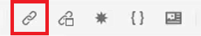

# 상호 참조 및 링크

XML 편집기와 DITA는 주제 간에 연결하는 강력한 방법을 제공합니다. 고유 ID 값을 사용한 작업이 포함된 콘텐츠 참조를 효과적으로 관리하는 것이 중요합니다.

이 단원에서 사용할 수 있는 샘플 파일은 파일에 제공됩니다
[crossreferencesandlinks.zip](assets/crossreferencesandlinks.zip)

>[!VIDEO](https://video.tv.adobe.com/v/342764?quality=12&learn=on)

## 외부 주제에 대한 상호 참조 만들기

저장소에서 열린 파일로 주제를 끌어다 놓아 외부 상호 참조를 생성할 수 있습니다. 그러나 상호 참조가 끊어지는 것을 방지하려면 먼저 ID를 상위 요소와 관련된 값으로 정의해야 합니다. 이는 ID가 올바르게 지정되었는지 확인하면서 상호 참조를 만드는 한 가지 쉬운 방법입니다.

1. 외부 상호 참조를 삽입할 파일을 엽니다.

1. 참조할 요소에 ID를 지정합니다.

   a. 요소 내부를 클릭합니다.

   b. [콘텐츠 속성] 패널의 [특성] 드롭다운에서 **ID**&#x200B;을(를) 선택합니다.

   c. 값 필드에 논리 이름을 입력합니다.

   d. 원하는 경우 **개요 보기**&#x200B;에서 요소 및 해당 값을 봅니다.

1. 저장소에 업데이트된 ID가 있는지 확인하려면 항목을 **저장**&#x200B;하십시오.

1. 상단 도구 모음에서 [!UICONTROL **참조**] 아이콘을 클릭합니다.

   

1. **콘텐츠 참조** 탭에서 상호 참조로 삽입할 ID 및 요소 쌍을 선택합니다.

1. [!UICONTROL **선택**]&#x200B;을 클릭합니다.

상호 참조가 주제에 추가되었습니다.

## 웹 사이트에 대한 링크

모든 항목 내에 웹 사이트에 대한 링크를 삽입할 수 있습니다. 자세한 내용은 웹 사이트 연결에 대한 AEM Guides 교육 과정 1 비디오를 참조하십시오.

## 끊어진 링크 보기

일부 수정 사항으로 인해 상호 참조가 손상될 수 있습니다. 여기에는 항목 삭제, 상호 참조가 포함된 섹션 재구성 또는 상호 참조가 삽입된 후 ID 변경 등이 포함됩니다. 샘플 항목 _crossreferencesandlinks.zip_&#x200B;에는 내부 콘텐츠에 대한 글머리 기호 상호 참조의 일부가 중단되는 이 단원이 포함되어 있습니다.

1. 왼쪽 패널의 **개요 보기**(으)로 이동합니다.

1. [!UICONTROL **필터**] 아이콘을 클릭합니다.

1. **끊어진 링크**&#x200B;를 선택하십시오.

   

끊어진 링크는 클릭 가능한 개체로 표시됩니다. 항목의 빨간색 텍스트로 식별할 수 있습니다.
