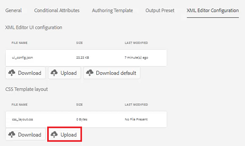

# XML 편집기 구성

제한 환경에서 작업하는 경우, 특정 폴더 프로필 내에서 편집기 구성을 사용자 지정하여 작성자가 볼 수 있는 기능을 선택할 수 있습니다. 이 폴더 프로필을 적용하면 편집기 자체, CSS 템플릿, 사용 가능한 코드 조각 및 컨텐츠 버전 레이블의 모양과 느낌을 변경할 수 있습니다.

이 단원에서 사용할 수 있는 샘플 파일은 파일에 제공됩니다 [xmlditorconfiguration.zip](assets/xmleditorconfiguration.zip).

>[!VIDEO](https://video.tv.adobe.com/v/342762?quality=12&learn=on)

## 기본 편집기 UI 구성 사용자 지정

항상 기본 UI 구성을 로컬 시스템에 다운로드하고 선택한 텍스트 편집기에서 변경한 다음 다시 업로드할 수 있습니다.

1. 탐색 화면에서 [!UICONTROL **도구**] 아이콘.

   

1. 선택 **안내서** 왼쪽 패널에 표시됩니다.

1. 을(를) 클릭합니다. [!UICONTROL **폴더 프로필**] 타일.

   

1. 폴더 프로필을 선택합니다.

1. 을(를) 클릭합니다. [!UICONTROL **XML 편집기 구성**] 탭.

1. 클릭 [!UICONTROL **다운로드**] 기본값.

   

이제 텍스트 편집기에서 컨텐츠를 열고 수정할 수 있습니다. 다음 _AEM 안내서 설치 및 구성_ 안내서에는 UI 구성에 함수를 제거, 사용자 지정 또는 추가하는 방법에 대한 샘플이 포함되어 있습니다.

## 수정된 XML 편집기 UI 구성 업로드

UI 구성을 사용자 지정한 후 업로드할 수 있습니다. 샘플 구성 파일은 _ui-config-restricted-editor.json_ 은 이 단원에 대한 지원 주제 집합을 제공합니다.

1. 폴더 프로필 내에서 [!UICONTROL **XML 편집기 구성**] 탭.

1. XML 편집기 UI 구성에서 [!UICONTROL **업로드**].

   

1. 수정된 UI 구성에 대한 파일 또는 제공된 샘플 파일을 두 번 클릭합니다.

   

1. 클릭 [!UICONTROL **저장**] 화면 왼쪽 상단 모서리에서 을(를) 클릭합니다.

수정된 UI 구성을 성공적으로 업로드했습니다.

## CSS 템플릿 레이아웃 사용자 지정

UI 구성과 마찬가지로 CSS 템플릿 레이아웃을 다운로드할 수 있습니다. 텍스트 편집기에서 열어서 업로드하기 전에 주제의 모양과 느낌을 사용자 지정하기 위해 수정할 수 있습니다.

1. 탐색 화면에서 [!UICONTROL **도구**] 아이콘.

   

1. 선택 **안내서** 왼쪽 패널에 표시됩니다.

1. 을(를) 클릭합니다. [!UICONTROL **폴더 프로필**] 타일.

   

1. 폴더 프로필을 선택합니다.

1. 을(를) 클릭합니다. [!UICONTROL **XML 편집기 구성**] 탭.

1. CSS 템플릿 레이아웃 아래에서 를 클릭합니다 [!UICONTROL **다운로드**].

   

이제 텍스트 편집기에서 CSS 콘텐츠를 수정하고 저장할 수 있습니다.

## 수정된 CSS 템플릿 레이아웃 업로드

CSS 템플릿 레이아웃을 사용자 지정한 후 업로드할 수 있습니다. 샘플 파일은 _css-layout-only-draft-comment-change.css_ 은 이 단원에 대한 지원 주제 집합을 제공합니다. 이 파일에는 초안 주석 변경 사항만 포함되어 있지만 _css-layout-draft-comment-change.css_ 는 테스트 또는 검토 용으로만 사용할 수 있는 전체 파일입니다.

1. 폴더 프로필 내에서 [!UICONTROL **XML 편집기 구성**] 탭.

1. CSS 템플릿 레이아웃 아래에서 를 클릭합니다 [!UICONTROL **업로드**].

   

1. 여기에 표시된 사용자 지정 CSS 레이아웃 또는 제공된 샘플 파일에 대한 파일을 두 번 클릭합니다.

   

1. 클릭 [!UICONTROL **저장**] 화면 왼쪽 상단 모서리에서 을(를) 클릭합니다.
사용자 지정된 CSS 템플릿 레이아웃을 성공적으로 업로드했습니다.

## XML 편집기 코드 조각 편집

코드 조각은 제품 또는 그룹별로 지정할 수 있는 재사용 가능한 컨텐츠 조각입니다. 샘플 코드 조각은 이 단원에 대한 지원 파일과 함께 제공됩니다.

1. 탐색 화면에서 [!UICONTROL **도구**] 아이콘.

   

1. 선택 **안내서** 왼쪽 패널에 표시됩니다.

1. 을(를) 클릭합니다. [!UICONTROL **폴더 프로필**] 타일.

   

1. 폴더 프로필을 선택합니다.

1. 을(를) 클릭합니다. [!UICONTROL **XML 편집기 구성**] 탭.

1. XML 편집기 코드 조각에서 **업로드**.

   

1. 자신의 코드 조각을 선택하거나 제공된 샘플을 사용하십시오.

   

1. 클릭 [!UICONTROL **저장**] 화면 왼쪽 상단 모서리에서 을(를) 클릭합니다.

편집기에 새 코드 조각을 추가했습니다.

## XML 내용 버전 레이블 사용자 지정

기본적으로 작성자는 원하는 레이블을 만들고 주제 파일과 연결할 수 있습니다. 이로 인해 동일한 레이블에 다른 변형이 나타날 수 있습니다. 일관되지 않은 레이블 지정을 방지하기 위해 사전 정의된 레이블 목록에서 선택할 수도 있습니다.

1. 탐색 화면에서 [!UICONTROL **도구**] 아이콘.

   

1. 선택 **안내서** 왼쪽 패널에 표시됩니다.

1. 을(를) 클릭합니다. [!UICONTROL **폴더 프로필**] 타일.

   

1. 폴더 프로필을 선택합니다.

1. 을(를) 클릭합니다. [!UICONTROL **XML 편집기 구성**] 탭.

1. XML 컨텐트 버전 레이블에서 [!UICONTROL **다운로드**].

   

이제 필요에 따라 레이블을 사용자 지정할 수 있습니다.

## XML 컨텐츠 버전 레이블 업로드

레이블을 다운로드하여 수정한 후에는 XML 컨텐트 버전 레이블 항목을 업로드할 수 있습니다. 샘플 파일을 사용하도록 선택할 수 있습니다 _labels.json_&#x200B;은 이 단원에 대한 지원 주제 집합을 제공합니다.

1. 폴더 프로필 내에서 [!UICONTROL **XML 편집기 구성**] 탭.

1. XML 컨텐트 버전 레이블에서 [!UICONTROL **업로드**].

   

1. 사용자 지정 레이블이나 여기에 표시된 제공된 샘플 파일에 대해 파일을 두 번 클릭합니다.

   

1. 클릭 [!UICONTROL **저장**] 화면 왼쪽 상단 모서리에서 을(를) 클릭합니다.

사용자 정의 XML 콘텐츠 버전 레이블을 업로드했습니다.
