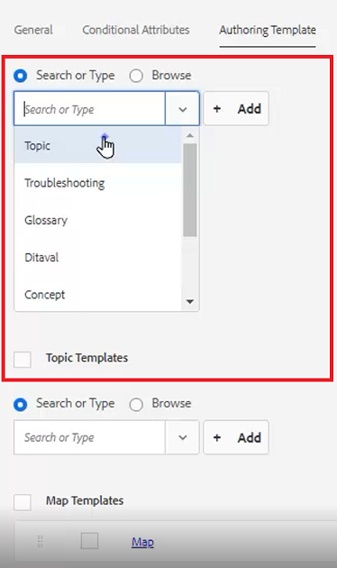

# 폴더 프로필

AEM에서는 구성 도구에 빠르게 액세스할 수 있습니다. 폴더 프로필을 사용자 지정하면 다른 부서나 제품에 고유한 템플릿, 작성 환경, 조건부 속성 프로필, 코드 조각 또는 웹 편집기 구성이 있을 수 있습니다.

이 단원에서 사용할 수 있는 샘플 파일은 [folderprofiles.zip](assets/folderprofiles.zip) 파일에 제공됩니다.

>[!VIDEO](https://video.tv.adobe.com/v/342758?quality=12&learn=on)

## 폴더 프로필 액세스

구성은 폴더 프로필 아이콘을 통해 관리됩니다.

1. 탐색 화면에서 [!UICONTROL **도구**] 아이콘을 클릭합니다.

   

1. 왼쪽 패널에서 **안내서**&#x200B;를 선택합니다.

1. [!UICONTROL **폴더 프로필**] 타일을 클릭합니다.

   

1. 원하는 프로필을 선택합니다. 예를 들어 기본 프로필인 **전역 프로필**&#x200B;을(를) 선택합니다.

   

## 전역 프로필에서 조건부 속성 편집

전역 프로필에 액세스하면 해당 구성을 편집할 수 있습니다. 글로벌 프로필 설정은 달리 지정하지 않는 한 모든 사용자에게 적용됩니다.

1. 전역 프로필에서 **조건부 특성** 탭을 선택합니다.

1. 화면 왼쪽 상단 모서리에서 [!UICONTROL **편집**]&#x200B;을 클릭합니다.

   

1. [!UICONTROL **추가**]&#x200B;를 클릭합니다.

1. 새 조건에 대해 **이름**, **값** 및 **레이블** 필드를 채웁니다.

   

1. 화면 왼쪽 상단 모서리에서 [!UICONTROL **저장**]을 클릭합니다.
이제 모든 사용자가 새 조건을 사용할 수 있습니다. [컨텐츠 속성] 패널에서 이 옵션을 선택하고 필요에 따라 컨텐츠에 적용할 수 있습니다.

## 새 폴더 프로필 작성

기본 전역 프로필 외에도 사용자 지정 프로필을 만들 수 있습니다.

1. 탐색 화면에서 [!UICONTROL **도구**] 아이콘을 클릭합니다.

   

1. 왼쪽 패널에서 **안내서**&#x200B;를 선택합니다.

1. [!UICONTROL **폴더 프로필**] 타일을 클릭합니다.

   

1. [!UICONTROL **만들기**]&#x200B;를 클릭합니다.

1. 폴더 프로필 만들기 대화 상자에서 다음을 수행합니다.

   a. 프로필 이름을 지정합니다.

   b. 경로를 지정합니다.

   c. [!UICONTROL **만들기**]&#x200B;를 클릭합니다.

   

새 프로필 이름의 타일이 폴더 프로필 페이지에 나타납니다.

## 일반 탭에서 관리자 추가

관리자는 폴더 프로필에 대한 조건부 속성, 작성 템플릿 및 출력 사전 설정을 업데이트할 수 있는 권한이 있습니다.

1. 타일을 클릭하여 원하는 폴더 프로필을 엽니다.

   

1. **일반** 탭을 선택합니다.

1. 화면 왼쪽 상단의 [!UICONTROL **편집**]&#x200B;을 클릭합니다.

1. 관리자 사용자 아래의 드롭다운에서 사용자를 선택하거나 사용자 이름을 입력합니다.

1. [!UICONTROL **추가**]&#x200B;를 클릭합니다.

   필요한 경우 여러 명의 관리 사용자를 추가할 수 있습니다.

   

1. 모든 사용자가 추가되면 화면 오른쪽 상단의 [!UICONTROL **저장**]&#x200B;을 클릭합니다.

이제 관리 사용자가 이 프로필에 할당되었습니다.

## 조건부 속성 탭에서 새 대상 추가

전역 프로필에 액세스하면 해당 구성을 편집할 수 있습니다. 글로벌 프로필 설정은 달리 지정하지 않는 한 모든 사용자에게 적용됩니다.

1. 원하는 폴더 프로필 내에서 **조건부 특성** 탭을 선택합니다.

1. 화면 왼쪽 상단 모서리에서 [!UICONTROL **편집**]&#x200B;을 클릭합니다.

   

1. [!UICONTROL **추가**]&#x200B;를 클릭합니다.

1. 새 조건에 대해 **이름**, **값** 및 **레이블** 필드를 채웁니다.

   [!UICONTROL **더하기**] 기호를 클릭하면 명명된 특성에 대한 값 및 레이블 쌍을 추가할 수 있습니다.

   

1. 화면 왼쪽 상단 모서리에서 [!UICONTROL **저장**]&#x200B;을 클릭합니다.

새 조건부 속성이 이 프로필에 추가되었습니다.

## 템플릿 작성 탭에서 템플릿 선택 및 매핑

AEM Guides에는 작성 템플릿과 맵이 기본 제공됩니다. 특정 작성자로 제한할 수 있습니다. 기본적으로 템플릿은 DITA 템플릿 폴더 내의 Assets 위치에 저장됩니다.

1. 원하는 폴더 프로필 내에서 템플릿 작성 탭을 선택합니다.

1. 화면 왼쪽 상단 모서리에서 편집 을 클릭합니다.

1. 맵 템플릿을 추가합니다.

   a. **맵 템플릿** 드롭다운에서 사용 가능한 맵에서 옵션을 선택합니다.

   b. [!UICONTROL **추가**]&#x200B;를 클릭합니다.

   

1. 주제 템플릿을 추가합니다.

   a. **주제 템플릿** 드롭다운에서 사용 가능한 템플릿에서 옵션을 선택합니다.

   

1. [!UICONTROL **추가**]&#x200B;를 클릭합니다.

1. 필요에 따라 추가 주제 템플릿을 추가합니다.

1. 완료되면 화면 왼쪽 상단의 [!UICONTROL **저장**]&#x200B;을 클릭합니다.

새 작성 템플릿이 이 프로필에 추가되었습니다.

## [출력 사전 설정] 탭에서 필요하지 않은 사전 설정 삭제

폴더 프로필을 기반으로 각 출력 사전 설정을 구성할 수 있습니다. 필요하지 않은 출력 사전 설정은 제거해야 합니다.

1. 원하는 폴더 프로필에서 **출력 사전 설정** 탭을 선택합니다.

1. 왼쪽 패널에서 필요하지 않은 사전 설정의 확인란을 선택합니다.

   

1. 화면 왼쪽 상단 모서리에서 [!UICONTROL **사전 설정 삭제**]&#x200B;를 클릭합니다.

1. 사전 설정 삭제 대화 상자에서 [!UICONTROL **삭제**]&#x200B;를 클릭합니다.

   

이제 사용할 출력 사전 설정만 표시됩니다.

## XML 편집기 구성 탭에서 코드 조각 업로드

1. 원하는 폴더 프로필에서 **XML 편집기 구성** 탭을 선택합니다.

1. XML 편집기 코드 조각에서 [!UICONTROL **업로드**]&#x200B;를 클릭합니다.

   

1. 이전에 만든 코드 조각으로 이동합니다.

1. [!UICONTROL **열기**]&#x200B;를 클릭합니다.

1. 화면 왼쪽 상단의 [!UICONTROL **저장**]&#x200B;을 클릭합니다.

코드 조각을 포함하도록 편집기 구성을 수정했습니다.

## 저장소에서 폴더 프로필 지정

편집기에서 폴더 프로필에 대해 수정한 결과를 볼 수 있습니다.

1. **저장소 보기**(으)로 이동합니다.

1. 작업할 콘텐츠의 폴더를 클릭합니다.

1. 상단 도구 모음에서 [!UICONTROL **사용자 환경 설정**] 아이콘을 클릭합니다.

   

1. 사용자 환경 설정 대화 상자의 드롭다운에서 원하는 폴더 프로필을 선택합니다.

   

1. [!UICONTROL **저장**]&#x200B;을 클릭합니다.

폴더 프로필을 콘텐츠에 적용했습니다. 이제 새 DITA 주제를 만들면 폴더 프로필을 기반으로 제한된 주제 유형 목록이 표시됩니다. 대상 조건에는 전역 설정과 폴더 프로필에 관련된 설정이 포함됩니다. 업로드한 코드 조각 파일에서 선택할 기본 코드 조각 집합을 만들었습니다. 맵 대시보드에는 제한된 출력 사전 설정이 표시됩니다.
