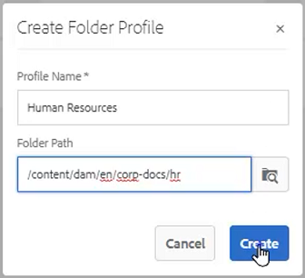
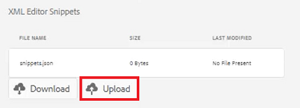
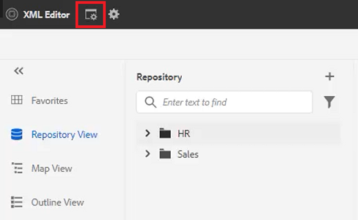

# 폴더 프로필

AEM에서는 구성 도구에 빠르게 액세스할 수 있습니다. 폴더 프로필을 사용자 지정함으로써, 서로 다른 부서 또는 제품에는 고유한 템플릿, 작성 환경, 조건부 속성 프로필, 코드 조각 또는 심지어 웹 편집기 구성이 있을 수 있습니다.

이 단원에서 사용할 수 있는 샘플 파일은 파일에 제공됩니다 [folderprofiles.zip](assets/folderprofiles.zip).

>[!VIDEO](https://video.tv.adobe.com/v/342758)

## 폴더 프로필 액세스

구성은 폴더 프로필 아이콘을 통해 관리됩니다.

1. 탐색 화면에서 [!UICONTROL **도구**] 아이콘.

   

2. 선택 **안내서** 왼쪽 패널에 표시됩니다.

3. 을(를) 클릭합니다. [!UICONTROL **폴더 프로필**] 타일.

   

4. 원하는 프로필을 선택합니다. 예를 들어, **글로벌 프로필**: 기본 프로필입니다.

   

## 전역 프로필에서 조건부 속성 편집

글로벌 프로필에 액세스하면 해당 구성을 편집할 수 있습니다. 글로벌 프로필 설정은 별도로 지정하지 않는 한 모든 사용자에게 적용됩니다.

1. 글로벌 프로필에서 **조건부 속성** 탭.

2. 클릭 [!UICONTROL **편집**] 화면 왼쪽 상단 모서리에서 을(를) 클릭합니다.

   

3. [!UICONTROL **추가**]&#x200B;를 클릭합니다.

4. 을(를) 채우기 **이름**, **값**, 및 **레이블** 새 조건에 대한 필드입니다.

   

5. 클릭 [!UICONTROL **저장**] 화면 왼쪽 상단 모서리에서 을(를) 클릭합니다.
이제 모든 사용자가 새 조건을 사용할 수 있습니다. 컨텐츠 속성 패널에서 이 필드를 선택하여 필요에 따라 컨텐츠에 적용할 수 있습니다.

## 새 폴더 프로필 작성

기본 글로벌 프로필 외에도 고유한 사용자 지정 프로필을 만들 수 있습니다.

1. 탐색 화면에서 [!UICONTROL **도구**] 아이콘.

   

2. 선택 **안내서** 왼쪽 패널에 표시됩니다.

3. 을(를) 클릭합니다. [!UICONTROL **폴더 프로필**] 타일.

   

4. [!UICONTROL **만들기**]&#x200B;를 클릭합니다.

5. 폴더 프로필 만들기 대화 상자에서 다음을 수행합니다.

   a. 프로필 이름을 지정합니다.

   나. 경로를 지정합니다.

   c. [!UICONTROL **만들기**].

   

폴더 프로필 페이지에 새 프로필 이름이 있는 타일이 나타납니다.

## 일반 탭에서 관리 사용자 추가

관리 사용자는 폴더 프로필에 대한 조건부 속성, 작성 템플릿 및 출력 사전 설정을 업데이트할 수 있는 권한이 있습니다.

1. 타일을 클릭하여 원하는 폴더 프로필을 엽니다.

   

2. 을(를) 선택합니다 **일반** 탭.

3. 클릭 [!UICONTROL **편집**] 화면 왼쪽 상단에 있습니다.

4. 관리자 사용자의 드롭다운에서 사용자를 선택하거나 사용자 이름을 입력합니다.

5. [!UICONTROL **추가**]&#x200B;를 클릭합니다.

   필요한 경우 여러 관리 사용자를 추가할 수 있습니다.

   

6. 클릭 [!UICONTROL **저장**] 모든 사용자가 추가되면 화면의 오른쪽 상단 모서리에서 을(를) 클릭합니다.

이제 관리 사용자가 이 프로필에 할당됩니다.

## 조건부 속성 탭에서 새 대상 추가

글로벌 프로필에 액세스하면 해당 구성을 편집할 수 있습니다. 글로벌 프로필 설정은 별도로 지정하지 않는 한 모든 사용자에게 적용됩니다.

1. 원하는 폴더 프로필 내에서 를 선택합니다 **조건부 속성** 탭.

2. 클릭 [!UICONTROL **편집**] 화면 왼쪽 상단 모서리에서 을(를) 클릭합니다.

   

3. [!UICONTROL **추가**]&#x200B;를 클릭합니다.

4. 을(를) 채우기 **이름**, **값**, 및 **레이블** 새 조건에 대한 필드입니다.

   클릭 [!UICONTROL **플러스**] sign을 사용하면 명명된 속성에 대해 값 및 레이블 쌍을 추가할 수 있습니다.

   

5. 클릭 [!UICONTROL **저장**] 화면 왼쪽 상단 모서리에서 을(를) 클릭합니다.

새 조건부 속성이 이 프로필에 추가되었습니다.

## 템플릿 작성 탭에서 템플릿 및 맵을 선택합니다

AEM 안내서에는 기본 제작 템플릿 및 맵이 포함되어 있습니다. 특정 작성자에게 제한할 수 있습니다. 기본적으로 템플릿은 DITA 템플릿 폴더 내의 자산 위치에 저장됩니다.

1. 원하는 폴더 프로필 내에서 템플릿 작성 탭을 선택합니다.

2. 화면의 왼쪽 상단 모서리에서 편집 을 클릭합니다.

3. 맵 템플릿을 추가합니다.

   a. 에서 **맵 템플릿** 드롭다운에서 사용 가능한 맵에서 옵션을 선택합니다.

   나. 클릭 [!UICONTROL **추가**].

   

4. 주제 템플릿을 추가합니다.

   a. 에서 **항목 템플릿** 드롭다운에서 사용 가능한 템플릿에서 옵션을 선택합니다.

   

5. [!UICONTROL **추가**]&#x200B;를 클릭합니다.

6. 필요에 따라 주제 템플릿을 추가합니다.

7. 완료되면 를 클릭합니다 [!UICONTROL **저장**] 화면 왼쪽 상단에 있습니다.

이 프로필에 새 작성 템플릿이 추가되었습니다.

## [출력 사전 설정] 탭에서 불필요한 사전 설정을 삭제합니다

폴더 프로필에 따라 각 출력 사전 설정을 구성할 수 있습니다. 필요하지 않은 출력 사전 설정은 제거해야 합니다.

1. 원하는 폴더 프로필 내에서 를 선택합니다 **출력 사전 설정** 탭.

2. 왼쪽 패널에서 필요하지 않은 사전 설정의 확인란을 선택합니다.

   

3. 클릭 [!UICONTROL **사전 설정 삭제**] 화면 왼쪽 상단 모서리에서 을(를) 클릭합니다.

4. 사전 설정 삭제 대화 상자에서 [!UICONTROL **삭제**].

   

이제 사용할 출력 사전 설정이 표시됩니다.

## XML 편집기 구성 탭에서 코드 조각 업로드

1. 원하는 폴더 프로필 내에서 를 선택합니다 **XML 편집기 구성** 탭.

2. XML 편집기 코드 조각에서 [!UICONTROL **업로드**].

   

3. 이전에 만든 코드 조각으로 이동합니다.

4. 클릭 [!UICONTROL **열기**].

5. 클릭 [!UICONTROL **저장**] 화면 왼쪽 상단에 있습니다.

코드 조각을 포함하도록 편집기 구성을 수정했습니다.

## 보관소의 폴더 프로파일 지정

편집기에서는 폴더 프로필에 대해 수정한 결과를 볼 수 있습니다.

1. 다음으로 이동 **저장소 보기**.

2. 작업할 컨텐츠의 폴더를 클릭합니다.

3. 을(를) 클릭합니다. [!UICONTROL **사용자 환경 설정**] 아이콘 사용 안 함

   

4. 사용자 환경 설정 대화 상자의 드롭다운에서 원하는 폴더 프로필을 선택합니다.

   

5. [!UICONTROL **저장**]&#x200B;을 클릭합니다.

폴더 프로필을 컨텐츠에 적용했습니다. 이제 새 DITA 주제를 만들면 폴더 프로필에 따라 제한된 항목 유형 목록이 표시됩니다. 대상 조건에는 전역 설정뿐만 아니라 폴더 프로필에 따른 설정도 포함되어 있습니다. 업로드한 코드 조각 파일에서 선택할 기본 코드 조각 집합을 만들었습니다. 맵 대시보드에 제한된 출력 사전 설정이 표시됩니다.
