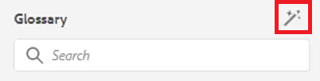

# 용어 설명

용어집 패널을 사용하면 맵을 구문 분석할 수 있습니다. 용어집 주제 파일을 만들어 공통 용어집 맵에 포함할 수 있습니다. 그런 다음 이 맵을 다른 맵에 추가할 수 있습니다. 용어집을 사용하면 정보를 일관되게 표현하기가 쉬워지고 독자에게 보다 명확해집니다.

이 단원에서 사용할 수 있는 샘플 파일은 [glossary.zip](assets/glossary.zip) 파일에 제공됩니다.

>[!VIDEO](https://video.tv.adobe.com/v/342765?quality=12&learn=on)

## 항목에 용어집 항목 추가

1. **용어집** 패널로 이동합니다.

1. **용어집** 패널의 항목을 주제에서 원하는 위치로 끌어서 놓습니다.

맵에 용어집 항목이 포함되어 있고 올바르게 구성된 경우 주제를 자동으로 업데이트하여 약식 양식을 포함할 수 있습니다.

## 루트 맵 지정

용어집을 사용하여 제대로 작동하려면 올바른 루트 맵을 선택해야 합니다. 루트 맵이 용어집 항목을 찾으면 용어집 패널에 표시됩니다.

1. 주제를 연 상태에서 왼쪽 패널에서 **용어집**&#x200B;을 선택합니다.

1. 상단 도구 모음에서 [!UICONTROL **사용자 환경 설정**] 아이콘을 클릭합니다.

   

1. 용어집 작업에 적합한 루트 맵을 지정하려면 키 아이콘을 클릭합니다.

1. [!UICONTROL **선택**]&#x200B;을 클릭합니다.

1. [!UICONTROL **저장**]&#x200B;을 클릭합니다.

용어집 패널이 자동으로 업데이트됩니다.

## 용어집 작업

1. **저장소 보기**&#x200B;로 이동합니다.

1. 용어집을 사용하도록 사전 구성된 맵을 선택합니다.

   

1. [!UICONTROL **맵 보기**]&#x200B;를 선택합니다.

1. 맵 보기에 필요한 항목이 표시되는지 확인합니다.

## 용어집 미리 보기

벌크 변경을 수행할 수 있으므로 글로센트리를 미리 보는 것이 중요할 수 있습니다.

1. 왼쪽 패널에서 **용어집**&#x200B;을(를) 선택합니다.

1. 용어집 옆에 있는 상황별 메뉴를 클릭하고 [!UICONTROL **미리 보기**]&#x200B;를 선택합니다.

약식 양식과 용어집 정의가 모두 표시됩니다.

## 핫스팟 도구 설정 검토

핫스팟 도구를 사용하여 단일 맵에서 용어집 항목의 전체 컬렉션을 만듭니다. 특정 텍스트 용어를 검색하여 연결된 용어집 약어로 변환할 수도 있습니다.

1. 용어집 패널에서 [!UICONTROL **핫스팟 아이콘**]&#x200B;을 선택합니다.

   

1. [!UICONTROL **용어집 키**] 드롭다운을 클릭하고 적용할 키만 선택합니다.

1. [!UICONTROL **주제**] 드롭다운을 클릭하여 영향을 받아야 하는 콘텐츠를 선택합니다.

1. 구성된 옵션을 검토하려면 [!UICONTROL **상태별로 항목 필터링**] 드롭다운을 클릭하십시오.

1. 나머지 설정은 필요에 따라 구성합니다.

1. 완료되면 [!UICONTROL **변환**]&#x200B;을 클릭합니다.

이제 용어집 패널에 업데이트된 모든 주제와 오류가 있는 주제가 표시됩니다.
