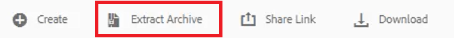
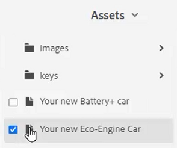

# 키

다양한 자료 세트는 선택 위치에서 사용자 지정해야 하는 유사한 정보를 포함할 수 있습니다. 키를 사용하면 DITA를 사용할 때 변수 정보를에 포함할 수 있습니다.

이 단원에서 사용할 수 있는 샘플 파일은 파일에 제공됩니다 [keys.zip](assets/keys.zip).

>[!VIDEO](https://video.tv.adobe.com/v/342756?quality=12&learn=on)

## 키 사용

1. 제공된 샘플 파일 세트를 업로드합니다.

   a. zip 파일을 로드합니다.

   나. AEM 환경을 새로 고칩니다.

   c. 추출할 파일을 선택합니다.

   

   d. 클릭 [!UICONTROL **아카이브 추출**] 상단 도구 모음에서 를 클릭합니다.

   

   e. 대화 상자에서 Keys라는 폴더와 같이 파일의 압축을 해제할 특정 위치를 선택합니다.

   f. 클릭 [!UICONTROL **다음**].

   g. 이전에 업로드한 적이 없는 콘텐츠에 대해서는 존재하지 않으므로 충돌을 건너뜁니다.

   h. 선택 [!UICONTROL **Extract**] 화면 오른쪽 상단에 있습니다.

1. 추출이 완료되면 을 클릭합니다 [!UICONTROL **대상 폴더로 이동합니다**].

   

## 참조된 값으로 키 해결

키를 올바르게 사용하려면 사용자 환경 설정이 특정 맵을 루트 맵으로 참조해야 합니다. 이 맵 내부에는 상위 그룹 내에 함께 그룹화된 키 컬렉션이 있습니다. 맵을 열고 이 맵이 참조하는 값에 대한 키 를 확인합니다.

1. 루트 맵을 지정합니다.

   a. 키 화면에서 맵을 엽니다.

   나. 사용자 환경 설정을 구성합니다.

   c. [!UICONTROL **사용자 환경 설정**] 아이콘 사용 안 함

   

   d. 키 아이콘을 클릭하여 **루트 맵** 키 확인에 사용됩니다.

   e. 원하는 자산에 대한 확인란을 선택합니다.

   

   f. 클릭 [!UICONTROL **선택**].

   g. **저장** 사용자 환경 설정.

1. 로 이동합니다 **맵 보기**.

1. 지정된 맵을 엽니다.

키가 해결되었습니다.

## 새 KEYDEF를 수동으로 추가

1. 지정된 루트 맵으로 맵을 엽니다.

1. 키를 선택합니다.

   

1. 새 DEF를 삽입합니다.

   a. 맵에서 유효한 위치를 클릭합니다.

   나. 을(를) 선택합니다 **Keydef** 아이콘 사용 안 함

   

   c. [EDEF 삽입] 대화 상자에서 생성 중인 정의에 적합한 키의 고유 값을 입력합니다.

   d. 클릭 [!UICONTROL **삽입**].

1. keydef 내에 topicmeta를 추가합니다.

   a. 을(를) 클릭합니다. [!UICONTROL **요소 삽입**] 아이콘 사용 안 함

   

   나. 요소 삽입 대화 상자에서 &quot;topicmeta&quot;를 검색하고 선택합니다.

1. topicmeta 내에 키워드를 추가합니다.

   a. 을(를) 클릭합니다. [!UICONTROL **요소 삽입**] 아이콘 사용 안 함

   

   나. 요소 삽입 대화 상자에서 &quot;키워드&quot;를 검색하고 선택합니다.

1. topicmeta 내에 키워드를 추가합니다.

   a. 을(를) 클릭합니다. [!UICONTROL **요소 삽입**] 아이콘 사용 안 함

   

   나. 에서 **요소 삽입** 대화 상자에서 &quot;키워드&quot;를 검색하고 선택합니다.

1. 키워드에 키 정의 값을 입력합니다.

맵에서 SDK는 다음과 같이 표시되어야 합니다.

## 코드 조각으로 키 정의 구성

코드 조각은 설명서 프로젝트의 다양한 항목에서 다시 사용할 수 있는 작은 컨텐츠 조각입니다. 각 keydef를 수동으로 생성하는 대신 단일 KEYDEF를 코드 조각으로 구성할 수 있습니다.

1. 맵에서 DEF 요소를 선택합니다.

1. 상황별 메뉴에서 [!UICONTROL **코드 조각 만들기**].

1. 새 코드 조각 대화 상자에서 제목 및 설명을 추가합니다.
콘텐츠에서 기존 키 또는 키워드 정의를 제거할 수도 있습니다.

1. [!UICONTROL **만들기**]&#x200B;를 클릭합니다.

1. 왼쪽 패널에서 을 선택합니다 **코드 조각**.

1. 코드 조각 패널에서 방금 만든 코드 조각을 맵으로 끌어다 놓습니다.

1. 콘텐츠 속성을 사용하여 필요에 따라 KEYDEF를 업데이트합니다.
저장 및 새로 고침하면 동일한 루트 맵을 포함하는 맵을 정의한 모든 사용자가 이 키 세트를 사용할 수 있습니다.
