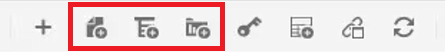

# 지도 및 북맵

Adobe Experience Manager Guides의 맵 편집기를 사용하면 맵 파일을 만들고 편집할 수 있습니다. 맵 편집기를 사용하여 DITA 맵과 북맵이라는 두 가지 유형의 파일을 편집할 수 있습니다. 우리의 목적을 위해, 이것들은 대체로 상호 교환 가능한 개념들이라고 생각하자.
맵 편집기는 기본 맵 편집기와 고급 맵 편집기의 두 가지 모드로 제공됩니다.

>[!VIDEO](https://video.tv.adobe.com/v/342766?quality=12&learn=on)

## 맵 만들기

AEM Guides은 DITA 맵과 북맵이라는 두 가지 기본 맵 템플릿을 제공합니다. 또한 고유한 맵 템플릿을 만들고 이를 작성자와 공유하여 맵 파일을 만들 수도 있습니다.

맵 파일을 만들려면 다음 단계를 수행하십시오.

1. Assets UI에서 맵 파일을 만들 위치로 이동합니다.

1. [!UICONTROL **만들기 > DITA 맵**]&#x200B;을 클릭합니다.

1. 블루프린트 페이지에서 사용할 맵 템플릿의 유형을 선택하고 [!UICONTROL **다음**]&#x200B;을 클릭합니다.

1. 속성 페이지에서 맵의 **제목** 및 **이름**&#x200B;을 입력하십시오.

1. [!UICONTROL **만들기**]&#x200B;를 클릭합니다.

## 고급 맵 편집기로 맵 열기

1. **Assets UI**&#x200B;에서 편집할 맵을 선택합니다.

1. [!UICONTROL **항목 편집**]&#x200B;을 클릭합니다.

   

또는

1. 마우스를 맵 아이콘 위로 가져갑니다.

1. **작업** 메뉴에서 **항목 편집**&#x200B;을 선택합니다.

## 맵 또는 북맵에 콘텐츠 추가

1. **저장소 보기**&#x200B;로 이동합니다.

1. 저장소 보기의 콘텐츠를 맵 또는 북맵의 유효한 위치로 끌어서 놓습니다.

또는

1. 맵이나 북맵 내에서 유효한 위치를 클릭합니다.

1. 해당 [!UICONTROL **도구 모음 아이콘**]&#x200B;을 클릭하여 챕터, 주제 또는 topicrefs를 추가합니다.

   

1. 추가하려는 Assets을 하나 이상 선택합니다.

1. [!UICONTROL **선택**]&#x200B;을 클릭합니다.

### 맵에서 요소 승격 또는 강등

**도구 모음 화살표**&#x200B;를 사용하여 맵이나 북맵에서 챕터 및 topicrefs를 승격 또는 강등합니다.

1. 맵에서 요소를 선택합니다.

1. [!UICONTROL **왼쪽 화살표**]&#x200B;를 클릭하여 topicref를 챕터로 승격하거나 [!UICONTROL **오른쪽 화살표**]&#x200B;를 클릭하여 챕터를 topicref로 강등합니다.

   

1. 필요한 경우 맵을 저장하고 버전을 지정합니다.

또는

1. 요소를 드래그하여 놓아 다시 구성합니다.

## 맵에 메타데이터 추가

1. **맵 도구 모음**&#x200B;에서 topicgroup을 삽입합니다.

   

1. 요소를 삽입하려면 [!UICONTROL **더하기 아이콘**]&#x200B;을 클릭하세요.

1. 삽입할 요소를 선택합니다.

   

1. [!UICONTROL **닫기**]&#x200B;를 클릭합니다.

## 맵에 관련 항목 추가

맵을 구성한 후 신뢰할 수 있는 를 추가할 수 있습니다.

1. 맵을 클릭하여 해당 테이블을 삽입할 위치를 선택합니다.

1. **도구 모음 아이콘**&#x200B;을 사용하여 관련 가능한 항목을 맵에 추가하십시오.

   

1. 대화 상자를 구성합니다.

1. [!UICONTROL **삽입**]&#x200B;을 클릭합니다.

1. **저장소**&#x200B;의 필수 항목을 관련 항목으로 끌어다 놓습니다.

1. 표준 키보드 단축키를 사용하여 맵에서 변경 가능한 요소에 필요한 요소를 복사하여 붙여넣습니다.

## 맵에서 topicrefs에 속성 할당

1. 맵에서 topicref 또는 topicrefs의 중첩된 컬렉션을 강조 표시합니다.

1. [컨텐츠 속성] 패널의 다른 특성에서 **특성** 및 해당 **값을 선택합니다.**

   
