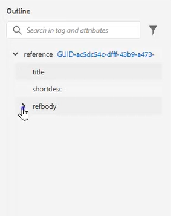

# 개요 보기

개요 보기에서는 구조화된 문서를 사용할 때 광범위한 지원을 제공합니다. 버튼을 클릭할 때 보기 확장 및 축소, 구조 탐색, 속성 작업(예: 새 ID 만들기), 요소 재구성, 배치 해제 및 구조 변경 등의 작업을 수행할 수 있습니다.

>[!VIDEO](https://video.tv.adobe.com/v/342767?quality=12&learn=on)

## 개요 보기 확장 및 축소

요소를 확장하여 하위 요소를 표시하거나 필요에 따라 축소할 수 있습니다.

1. 해당 아이콘을 클릭하여 아웃라인 보기를 확장하거나 축소합니다.

   

   

개요 보기가 확장에서 축소로 전환됩니다.

## 개요 보기를 사용하여 탐색

1. 해당 위치로 이동할 요소를 클릭합니다.

1. 바로 가기 옵션에 액세스하려면 요소 옆에 있는 [!UICONTROL **줄임표**]&#x200B;를 클릭하십시오.

   

## 개요 보기를 사용하여 ID 할당

시스템 구성을 기반으로 새 ID를 자동으로 생성할 수 있습니다. 필요한 경우 콘텐츠 속성을 사용하여 ID 및 해당 값을 업데이트할 수도 있습니다.

1. 요소 옆에 있는 [!UICONTROL **줄임표**]&#x200B;를 클릭합니다.

1. **ID 생성**&#x200B;을 선택하세요.

   

ID가 할당됩니다. 컨텐트 등록 정보가 업데이트되고 요소 및 속성 정보가 표시됩니다.

## 끌어서 놓기를 사용하여 요소 재구성

개요 보기 내에서 요소의 순서를 변경할 수 있습니다.

1. 요소를 클릭하여 개요 뷰의 다른 위치로 드래그합니다.

1. 요소를 다른 요소 위에 놓아 바꿉니다. 이 작업은 대체할 요소 주위에 사각형 상자로 표시됩니다.

   또는

   다른 두 요소 사이에 요소를 놓아 위치를 변경합니다. 이 작업은 새 요소가 삭제될 요소 사이에 줄로 표시됩니다.

## 요소 이름 바꾸기

1. 요소를 선택합니다.

1. [!UICONTROL **줄임표**]&#x200B;를 클릭합니다.

1. **요소 이름 바꾸기**&#x200B;를 선택합니다.

   

1. 새 요소 이름을 두 번 클릭합니다.

이제 요소 이름이 변경되었습니다.

## 요소 래핑 해제

1. 줄 바꿈을 취소할 요소를 선택합니다.

1. [!UICONTROL **줄임표**]&#x200B;를 클릭합니다.

1. [!UICONTROL **요소 줄 바꿈 해제**]&#x200B;를 선택합니다.

콘텐츠는 남아 있지만 구조는 제거되었습니다.

## 개요 보기를 사용하여 콘텐츠 필터링

1. 개요 보기에서 검색 창 옆의 [!UICONTROL **필터**] 아이콘을 클릭합니다.

   

1. **모두**&#x200B;를 선택하여 모든 요소를 표시하거나 **끊어진 링크**&#x200B;를 선택하여 끊어진 참조를 찾아 수정하십시오.

## 개요 보기로 검색

검색을 제한하고 요소, 속성 또는 값을 기반으로 결과를 반환할 수 있습니다.

1. 검색 창에서 찾을 요소의 이름을 입력합니다.

   

1. 요구 사항과 가장 관련이 있는 결과를 선택합니다.
