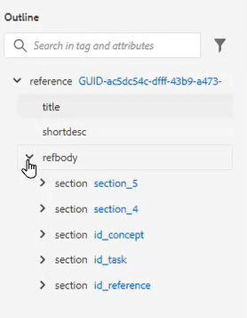

# 개요 보기

구조화된 문서를 사용할 때 아웃라인 뷰는 광범위한 지원을 제공합니다. 보기를 확장 및 축소하고, 구조를 탐색하고, 속성을 사용하여 작업하고(예: 새 ID를 만드는 경우), 단추를 클릭하면 요소를 재구성, 언래핑 및 재구성합니다.

>[!VIDEO](https://video.tv.adobe.com/v/342767?quality=12&learn=on)

## 아웃라인 뷰 확장 및 축소

요소를 확장하여 하위 요소를 표시하거나 필요에 따라 축소할 수 있습니다.

1. 해당 아이콘을 클릭하여 아웃라인 뷰를 확장하거나 축소합니다.

   

   

개요 보기는 확장에서 축소로 전환합니다.

## 개요 보기를 사용하여 탐색

1. 요소를 클릭하여 해당 위치로 이동합니다.

1. 을(를) 클릭합니다. [!UICONTROL **줄임표**] 요소 옆에 바로 가기 옵션에 액세스합니다.

   

## 개요 보기를 사용하여 ID 할당

시스템 구성에 따라 새 ID를 자동으로 생성할 수 있습니다. 컨텐츠 속성을 사용하여 필요한 경우 ID 및 해당 값을 업데이트할 수도 있습니다.

1. 을(를) 클릭합니다. [!UICONTROL **줄임표**] 모든 요소 옆에 표시됩니다.

1. 선택 **ID 생성**.

   

ID가 지정됩니다. 컨텐츠 속성 업데이트 및 요소 및 속성 정보가 표시됩니다.

## 드래그하여 놓기를 사용하여 요소 재구성

아웃라인 뷰 내에서 요소의 순서를 변경할 수 있습니다.

1. 를 클릭하고 요소를 아웃라인 뷰의 다른 위치로 드래그합니다.

1. 요소를 다른 요소의 맨 위에 놓아 바꿉니다. 이 작업은 바꿀 요소 주위에 사각형 상자로 표시됩니다.

   또는

   요소를 다른 두 요소 사이에 놓아 위치를 변경합니다. 이 작업은 새 요소를 삭제할 요소 사이의 행으로 표시됩니다.

## 요소 이름 바꾸기

1. 요소를 선택합니다.

1. 을(를) 클릭합니다. [!UICONTROL **줄임표**].

1. 선택 **요소 이름 바꾸기**.

   

1. 새 요소 이름을 두 번 클릭합니다.

이제 요소의 이름이 변경되었습니다.

## 요소 래핑 취소

1. 래핑을 취소할 요소를 선택합니다.

1. 을(를) 클릭합니다. [!UICONTROL **줄임표**].

1. 선택 [!UICONTROL **요소 래핑 취소**].

컨텐츠는 그대로 유지되지만 구조가 제거되었습니다.

## 개요 보기를 사용하여 컨텐츠 필터링

1. 을(를) 클릭합니다. [!UICONTROL **필터**] 개요 보기에서 검색 막대 옆에 있는 아이콘을 클릭합니다.

   

1. 다음 중 하나를 선택합니다 **모두** 모든 요소를 표시하거나 **끊어진 링크** 손상된 참조를 찾아 수정하기 위해

## 개요 보기로 검색

요소, 속성 또는 값을 기준으로 검색을 제한하고 결과를 반환할 수 있습니다.

1. 검색 막대에서 찾을 요소의 이름을 입력합니다.

   

1. 사용자의 요구 사항에 가장 적합한 결과를 선택합니다.
