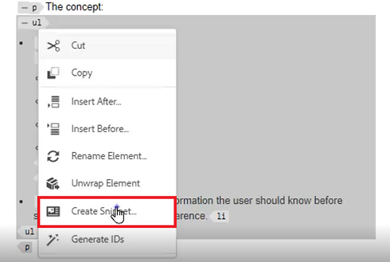
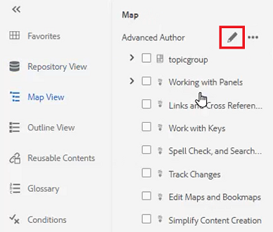
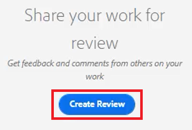

# 패널

AEM Guides 웹 편집기는 기본 도구 모음, 보조 도구 모음, 왼쪽 패널, 컨텐츠 편집 영역 및 오른쪽 패널을 포함하여 여러 섹션으로 나뉘어 있습니다.

>[!VIDEO](https://video.tv.adobe.com/v/342760?quality=12&learn=on)

## 왼쪽 패널 크기 조정

왼쪽 패널과 같은 영구 패널의 크기는 조정할 수 있습니다.

1. 패널 테두리 위에 커서를 놓습니다.

1. 양방향 화살표가 나타나면 필요한 경우 을 클릭하여 안쪽이나 바깥쪽으로 끕니다.

## 왼쪽 패널 사이드바 확장 또는 축소

확장된 뷰에는 축소된 뷰에 도구 설명으로 표시되는 이름과 아이콘이 표시됩니다.

1. [!UICONTROL **사이드바**] 아이콘을 클릭하여 패널을 확장합니다.

   

1. 패널을 축소하려면 [!UICONTROL **사이드바**] 아이콘을 다시 클릭하십시오.

   

## 즐겨찾기 컬렉션 만들기

왼쪽 패널에서 즐겨찾기 를 사용하여 특정 문서 목록을 만들고 시간이 지남에 따라 추가할 수 있습니다. 다양한 즐겨찾기를 만들고 관리할 수 있습니다.

1. 왼쪽 패널에서 **즐겨찾기**&#x200B;를 선택합니다.

1. [!UICONTROL **더하기**] 아이콘을 클릭합니다.

   

1. 새 컬렉션 대화 상자에서 **제목** 및 **설명**&#x200B;을 입력합니다.

   공개 를 선택하면 다른 사용자가 이 즐겨찾기를 볼 수 있습니다.

1. [!UICONTROL **만들기**]&#x200B;를 클릭합니다.

이제 즐겨찾기 컬렉션을 생성했습니다.

## 저장소에서 즐겨찾기 컬렉션에 파일 추가

컬렉션을 만든 후 즐겨찾기를 추가할 수 있습니다.

1. 왼쪽 패널에서 **저장소 보기**&#x200B;를 선택합니다.

1. 컨텍스트 옵션에 액세스하려면 주제 옆에 있는 [!UICONTROL **줄임표**]&#x200B;를 클릭하십시오.

1. **다음에 추가** > **즐겨찾기**&#x200B;를 선택합니다.

1. 즐겨찾기에 추가 대화 상자에서 **새 컬렉션** 또는 **기존 컬렉션**&#x200B;을 선택합니다.

   여기에서는 기존 컬렉션에 추가하도록 선택합니다.

   

1. 필요한 경우 드롭다운에서 컬렉션을 선택합니다.

1. [!UICONTROL **추가**]&#x200B;를 클릭합니다.

선택한 즐겨찾기 컬렉션에 항목이 추가됩니다. 즐겨찾기 메뉴에서 볼 수 있습니다.

## 편집기에서 즐겨찾기 컬렉션에 파일 추가

편집기의 열린 항목에서 즐겨찾기에 항목을 추가하는 다른 방법도 있습니다.

1. **저장소 보기**&#x200B;로 이동합니다.

1. 항목을 두 번 클릭하여 엽니다.

1. 편집기에서 파일의 **제목 탭**&#x200B;을 마우스 오른쪽 단추로 클릭하여 상황별 옵션에 액세스합니다.

1. **다음에 추가** > **즐겨찾기**&#x200B;를 선택하십시오.

   

1. 즐겨찾기에 추가 대화 상자에서 **새 컬렉션** 또는 **기존 컬렉션**&#x200B;을 선택합니다.

   여기에서는 새 컬렉션에 추가하도록 선택합니다.

1. 새 컬렉션 대화 상자에서 **제목** 및 **설명**&#x200B;을 입력합니다.

   **공개**&#x200B;를 선택하면 다른 사용자가 이 즐겨찾기를 볼 수 있습니다.

1. [!UICONTROL **만들기**]&#x200B;를 클릭합니다.

새 즐겨찾기가 만들어지고 그룹화되었습니다. 즐겨찾기 메뉴에서 볼 수 있습니다.

## 즐겨찾기 보기 및 관리

즐겨찾기 컬렉션에 이미 추가한 주제를 쉽게 볼 수 있습니다.

1. 왼쪽 패널에서 [!UICONTROL **즐겨찾기**]&#x200B;를 선택합니다.

1. 즐겨찾기에서 컬렉션 옆에 있는 [!UICONTROL **화살표**] 아이콘을 클릭하여 해당 콘텐츠를 봅니다.

   

1. 즐겨찾기 목록에서 삭제하는 옵션을 포함하여 상황에 맞는 옵션을 표시하려면 항목 옆에 있는 [!UICONTROL **줄임표**]&#x200B;를 클릭하십시오.

## 저장소 보기에서 검색 필터링

저장소의 향상된 필터를 사용하면 다양한 제한 사항이 있는 텍스트를 검색할 수 있습니다.

1. **저장소 보기**(으)로 이동합니다.

1. [!UICONTROL **검색 필터**] 아이콘을 클릭합니다.

   

1. 선택한 패스에 텍스트를 입력하거나 필요한 경우 새 패스를 선택합니다.

   필터에 텍스트를 입력하면 파일 목록이 업데이트됩니다.

1. 필요한 경우 검색 카테고리 옆에 있는 화살표 아이콘을 클릭하여 검색 범위를 더 좁힙니다.

   

검색 범위를 DITA 주제 또는 DITA 맵으로 좁힐 수 있습니다. 선택한 경로에서 비 DITA 이미지 파일, 멀티미디어 또는 기타 문서를 검색할 수 있습니다. 검색을 DITA 요소로 제한하거나 파일 체크 아웃을 통해 필터링할 수도 있습니다.

## 맵 보기 탐색

맵 보기에서는 파일 체크 아웃 및 잠금 기능, 맵 파일 미리 보기 기능, 맵 대시보드 열기 기능 및 Assets UI에서 맵 보기 기능 등 몇 가지 유용한 기능을 사용할 수 있습니다.

맵 보기 및 해당 기능에 대한 자세한 내용은 이 과정의 [맵 및 북맵](./maps-and-bookmaps.md) 단원을 참조하십시오.

## 개요 보기 탐색

개요 보기에서는 현재 문서의 개요를 계층 구조로 볼 수 있습니다. 개요 보기 를 확장하여 여러 요소와 지정된 ID를 표시할 수 있습니다.

개요 보기 및 그 기능에 대한 자세한 내용은 이 과정의 [개요 보기](./outline-view.md) 단원을 참조하십시오.

## 재사용 가능한 콘텐츠 작업

핵심 DITA 기능은 작은 구문에서 전체 주제 또는 맵에 이르기까지 콘텐츠를 재사용하는 기능입니다. 편집기는 콘텐츠 재사용을 위한 드래그 앤 드롭 인터페이스를 제공합니다.

자세한 내용은 이 과정의 [콘텐츠 재사용](./content-reuse.md) 단원을 참조하십시오
재사용 가능한 콘텐츠 및 이를 효과적으로 관리하는 방법에 대한 정보.

## 용어집 작업

용어집을 사용하면 정보를 일관되게 표현하기가 쉬워지고 독자에게 보다 명확해집니다. 편집기는 용어집 용어를 주제에 삽입하기 위한 드래그 앤 드롭 인터페이스를 제공합니다.

용어집 구성 및 사용에 대한 자세한 내용은 이 과정의 [용어집](./glossary.md) 단원을 참조하십시오.

## 조건 사용

DITA에서 조건은 각각 특정 값을 지정할 수 있는 제품, 플랫폼 및 대상과 같은 속성을 사용하여 유도된 경우가 많습니다. 조건은 폴더 프로필을 통해 관리됩니다.

조건부 특성 구성 및 사용에 대한 자세한 내용은 이 과정의 [조건](./conditions.md) 단원을 참조하십시오.

## 코드 조각 만들기

스니펫은 콘텐츠 또는 구조의 시작점으로 다시 사용할 수 있는 작은 콘텐츠 조각입니다. 스니펫을 사용하면 콘텐츠를 만드는 데 필요한 시간이 줄어들고 재료의 구조적 품질과 일관성이 향상됩니다.

1. 편집기에서 주제를 엽니다.

1. 주제 내의 요소를 선택합니다.

1. 요소 내에서 보조 마우스 버튼을 클릭합니다.

1. 결과 메뉴에서 [!UICONTROL **코드 조각 만들기**]&#x200B;를 선택합니다.

   

1. 새 코드 조각 대화 상자에서 **제목** 및 **설명**&#x200B;을 추가합니다.

1. 필요에 따라 코드 조각을 편집합니다.

   콘텐츠에 오류를 도입할 경우 컨텍스트 확인에서 시각적으로 알려줍니다.

1. [!UICONTROL **만들기**]&#x200B;를 클릭합니다.

사용 가능한 코드 조각 목록에 코드 조각이 추가됩니다. 주제의 올바른 위치로 끌어서 놓을 준비가 되었습니다.

## 템플릿 작업

템플릿 패널을 통해 관리자는 작성자가 사용할 템플릿을 쉽게 만들고 관리할 수 있습니다. 기본적으로 템플릿은 맵과 주제 유형으로 분류됩니다.

템플릿 구성 및 적용에 대한 자세한 내용은 이 과정의 [폴더 프로필](./folder-profiles.md) 및 [간단한 콘텐츠 만들기 워크플로](simple-content-creation-workflows.md)라는 단원을 참조하십시오.

## 찾기 및 바꾸기로 파일 검색

편집기에서는 두 가지 찾기 및 바꾸기 옵션을 사용할 수 있습니다. 첫 번째는 특정 열린 주제 내에서 찾기 및 바꾸기 기능을 사용할 수 있습니다. 이는 기존의 워드 프로세서와 매우 유사합니다. 두 번째는 저장소에서 여러 파일의 텍스트를 검색하는 찾기 및 바꾸기 패널입니다.

찾기 및 바꾸기 기능에 대한 자세한 내용은 이 과정의 [맞춤법 검사와 찾기 및 바꾸기](./spell-check.md) 단원을 참조하십시오.

## 콘텐츠 속성 업데이트

오른쪽 패널의 콘텐츠 속성에는 현재 선택한 요소에 대한 특정 정보(예: 속성 ID 및 값)가 포함됩니다.

1. **XML 편집기**&#x200B;에서 주제를 엽니다.

1. **요소**&#x200B;를 선택하십시오.

   컨텐츠 등록 정보는 요소의 현재 유형 및 속성을 표시합니다.

1. 요소에 대해 새 **값**&#x200B;을(를) 입력하십시오.

   

요소를 변경할 때 콘텐츠 속성이 동적으로 업데이트됩니다.

## 파일 속성을 사용하여 맵에 주제 추가

파일 속성은 전체 열린 주제에 대한 추가 정보를 보여 줍니다. 이 정보 중 일부는 주제 속성에 의해 제어됩니다. 문서 상태와 같은 다른 자료에 대한 수정 사항은 권한에 따라 다를 수 있습니다.

1. 편집기에서 주제를 엽니다.

1. 오른쪽 패널의 [!UICONTROL  **파일 속성**] 아이콘을 클릭합니다.

   

1. **문서 상태**&#x200B;를 **편집**(으)로 설정합니다. 참조(References) 목록은 현재 비어 있습니다.

   

1. 주제를 닫습니다.

1. 왼쪽 패널에서 [!UICONTROL **저장소 보기**]&#x200B;를 선택합니다.

1. 맵을 엽니다.

   보기가 맵 보기로 변경됩니다.

1. [!UICONTROL **편집**] 아이콘을 클릭합니다.

   

1. 편집할 맵이 열려 있으면 **저장소 보기**(으)로 다시 전환합니다.

1. 작업 중인 주제를 맵으로 끌어서 놓습니다.

1. 상단 도구 모음에서 [!UICONTROL **저장**] 아이콘을 클릭합니다.

주제가 맵에 추가됩니다. 이제 항목을 열고 파일 속성을 확인하면 해당 항목이 지정된 맵에서 사용되었음을 반영하도록 참조가 업데이트되었음을 볼 수 있습니다.

## 리뷰 작업 만들기

오른쪽 패널에는 검토 워크플로를 시작하는 단축키가 포함되어 있습니다.

1. 오른쪽 패널의 [!UICONTROL **검토**] 아이콘을 클릭합니다.

   

1. [!UICONTROL **검토 만들기**]&#x200B;를 클릭합니다.

   

1. 검토 작업 만들기 대화 상자에서 필요에 따라 필드를 채웁니다.

1. [!UICONTROL **다음**]&#x200B;을 클릭합니다.

리뷰 작업이 생성됩니다.

## 변경 내용 추적

변경 사항을 추적하는 기능을 통해 한 버전의 주제에서 다음 버전까지 유지되는 변경 사항을 상당히 제어할 수 있습니다. 오른쪽 패널을 사용하여 추적된 변경 내용을 관리할 수 있습니다.

변경 내용 추적 기능에 대한 자세한 내용은 이 과정의 [변경 내용 추적](./track-changes.md) 단원을 참조하십시오.
