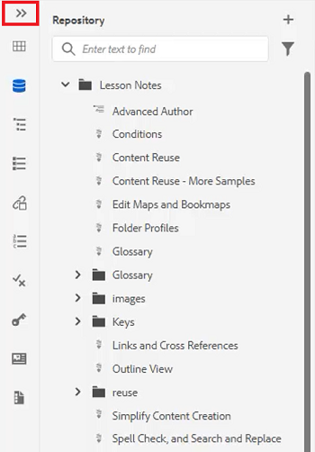
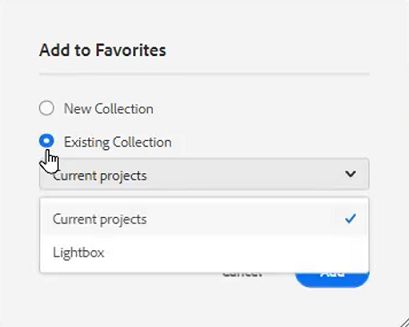
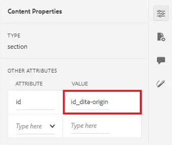

# 패널

AEM 안내서 웹 편집기는 기본 도구 모음, 보조 도구 모음, 왼쪽 패널, 컨텐츠 편집 영역 및 오른쪽 패널을 포함하여 여러 섹션으로 나누어져 있습니다.

>[!VIDEO](https://video.tv.adobe.com/v/342760?quality=12&learn=on)

## 왼쪽 패널 크기 조정

왼쪽 패널과 같은 영구 패널은 크기를 조정할 수 있습니다.

1. 패널 테두리에 커서를 놓습니다.

2. 양방향 화살표가 나타나면 필요에 따라 내측 또는 외측으로 클릭하여 드래그합니다.

## 왼쪽 패널 사이드바를 확장하거나 축소합니다

확장된 보기는 축소된 보기에서 도구 팁으로 표시되는 이름과 아이콘을 표시합니다.

1. 을(를) 클릭합니다. [!UICONTROL **사이드바**] 아이콘을 클릭하여 패널을 확장합니다.

   

2. 을(를) 클릭합니다. [!UICONTROL **사이드바**] 아이콘을 다시 클릭하여 패널을 축소합니다.

   

## 즐겨찾기 컬렉션 만들기

왼쪽 패널에서 즐겨찾기를 사용하여 특정 문서 목록을 만들고 시간이 지남에 따라 추가할 수 있습니다. 광범위한 즐겨찾기 컬렉션을 만들고 관리할 수 있습니다.

1. 선택 **즐겨찾기** 왼쪽 패널에 표시됩니다.

2. 을(를) 클릭합니다. [!UICONTROL **플러스**] 아이콘.

   

3. 새 컬렉션 대화 상자에서 **제목** 그리고 **설명**.

   공개를 선택하면 다른 사용자가 이 즐겨찾기를 볼 수 있습니다.

4. [!UICONTROL **만들기**]&#x200B;를 클릭합니다.

이제 즐겨찾기 컬렉션을 만들었습니다.

## 저장소에서 즐겨찾기 컬렉션에 파일 추가

컬렉션을 만든 후에 즐겨찾기를 추가할 수 있습니다.

1. 선택 **저장소 보기** 왼쪽 패널에 표시됩니다.

2. 을(를) 클릭합니다. [!UICONTROL **줄임표**] 주제 옆에 위치하며 컨텍스트 옵션에 액세스합니다.

3. 선택 **추가 대상** > **즐겨찾기**.

4. 즐겨찾기에 추가 대화 상자에서 **새 컬렉션** 또는 **기존 컬렉션**.

   여기서는 기존 컬렉션에 을(를) 추가하도록 선택합니다.

   

5. 필요한 경우 드롭다운에서 컬렉션을 선택합니다.

6. [!UICONTROL **추가**]&#x200B;를 클릭합니다.

선택한 즐겨찾기 컬렉션에 주제가 추가됩니다. 즐겨찾기 메뉴에서 볼 수 있습니다.

## 편집기에서 즐겨찾기 컬렉션에 파일 추가

즐겨찾기에 항목을 추가하는 또 다른 방법은 편집기에서 열려 있는 주제입니다.

1. 로 이동합니다 **저장소 보기**.

2. 항목을 두 번 클릭하여 엽니다.

3. 파일의 **제목 탭** 편집기에서 상황별 옵션에 액세스합니다.

4. 선택 **추가 대상** > **즐겨찾기**.

   

5. 즐겨찾기에 추가 대화 상자에서 **새 컬렉션** 또는 **기존 컬렉션**.

   여기서는 새 컬렉션에 을(를) 추가하도록 선택합니다.

6. 새 컬렉션 대화 상자에서 **제목** 그리고 **설명**.

   선택 **공용** 은 다른 사용자가 이 즐겨찾기를 볼 수 있음을 의미합니다.

7. [!UICONTROL **만들기**]&#x200B;를 클릭합니다.

새로운 즐겨찾기를 만들고 그룹화했습니다. 즐겨찾기 메뉴에서 볼 수 있습니다.

## 즐겨찾기 보기 및 관리

이미 즐겨찾기 컬렉션에 추가한 항목을 쉽게 볼 수 있습니다.

1. 선택 [!UICONTROL **즐겨찾기**] 왼쪽 패널에 표시됩니다.

2. 즐겨찾기에서 [!UICONTROL **화살표**] 컬렉션 옆에 있는 아이콘을 클릭하여 해당 콘텐츠를 확인합니다.

   

3. 을(를) 클릭합니다. [!UICONTROL **줄임표**] 주제 옆에 있는 즐겨찾기 목록에서 컨텍스트 옵션을 삭제하는 옵션을 포함하여 상황별 옵션을 표시합니다.

## 저장소 보기에서 검색 필터링

리포지토리의 향상된 필터를 사용하면 다양한 제한 사항으로 텍스트를 검색할 수 있습니다.

1. 다음으로 이동 **저장소 보기**.

2. 을(를) 클릭합니다. [!UICONTROL **검색 필터링**] 아이콘.

   

3. 선택한 경로에 텍스트를 입력하거나 필요한 경우 새 경로를 선택합니다.

   필터에 텍스트를 입력할 때 파일 목록이 업데이트됩니다.

4. 필요한 경우 검색 카테고리 옆에 있는 화살표 아이콘을 클릭하여 검색 범위를 더 좁힙니다.

   

검색은 DITA 주제 또는 DITA 맵으로 제한할 수 있습니다. 선택한 경로 내에서 비 DITA 이미지 파일, 멀티미디어 또는 기타 문서를 검색할 수 있습니다. 검색을 DITA 요소로 제한하거나 파일 체크아웃을 통해 필터링할 수도 있습니다.

## 맵 보기 탐색

맵 보기에서 파일 체크 아웃 및 잠금, 맵 파일 미리 보기, 맵 대시보드 열기, 자산 UI에서 맵 보기 등 몇 가지 유용한 기능을 사용할 수 있습니다.

제목이 있는 단원을 참조하십시오. [맵 및 북맵](./maps-and-bookmaps.md) 맵 보기 및 해당 기능에 대한 자세한 내용은 이 교육 과정을 참조하십시오.

## 개요 보기 탐색

아웃라인 뷰는 아웃라인에서 현재 문서의 계층적 뷰를 제공합니다. 개요 보기를 확장하여 할당된 ID와 여러 요소를 표시할 수 있습니다.

제목이 있는 단원을 참조하십시오. [개요 보기](./outline-view.md) 개요 뷰 및 해당 기능에 대한 자세한 내용은 이 교육 과정을 참조하십시오.

## 재사용 가능한 콘텐츠 작업

핵심 DITA 기능은 작은 구문에서 전체 주제 또는 맵에 이르기까지 컨텐츠를 재사용하는 기능입니다. 편집기는 컨텐츠를 재사용할 수 있도록 끌어서 놓기 인터페이스를 제공합니다.

제목이 있는 단원을 참조하십시오. [컨텐츠 재사용](./content-reuse.md) 이 교육 과정에서는 재사용 가능한 콘텐츠 및 효율적으로 관리하는 방법에 대한 자세한 정보를 제공합니다.

## 용어집을 사용한 작업

용어집을 사용하면 일관된 구문 정보를 쉽게 만들고 독자에게 더 나은 명확성을 제공할 수 있습니다. 편집기에서는 용어집 용어를 주제에 삽입하기 위한 끌어서 놓기 인터페이스를 제공합니다.

제목이 있는 단원을 참조하십시오. [용어 설명](./glossary.md) 용어집 구성 및 사용에 대한 자세한 내용은 이 교육 과정을 참조하십시오.

## 조건 사용

DITA에서는 각각 특정 값을 지정할 수 있는 제품, 플랫폼 및 대상과 같은 속성을 사용하여 조건을 실행하는 경우가 많습니다. 조건은 폴더 프로필을 통해 관리됩니다.

제목이 있는 단원을 참조하십시오. [조건](./conditions.md) 이 교육 과정에서는 조건부 특성 구성 및 사용에 대한 자세한 정보를 제공합니다.

## 코드 조각 만들기

코드 조각은 컨텐츠 또는 구조의 시작점으로 재사용할 수 있는 작은 컨텐츠 조각입니다. 코드 조각을 사용하면 컨텐츠를 만드는 데 필요한 시간이 줄어들고 재료의 구조적 품질과 일관성이 향상됩니다.

1. 편집기에서 항목을 엽니다.

2. 주제 내에서 요소를 선택합니다.

3. 요소 내에서 보조 마우스 단추를 클릭합니다.

4. 결과 메뉴에서 만들기를 선택합니다 [!UICONTROL **코드 조각**].

   

5. 새 코드 조각 대화 상자에서 **제목** 그리고 **설명**.

6. 필요에 따라 코드 조각을 편집합니다.

   콘텐츠에 오류가 발생하면 상황별 검사가 시각적으로 알려줍니다.

7. [!UICONTROL **만들기**]&#x200B;를 클릭합니다.

사용 가능한 코드 조각 목록에 코드 조각이 추가됩니다. 항목을 주제의 올바른 위치로 드래그하여 놓을 준비가 되었습니다.

## 템플릿으로 작업

관리자는 템플릿 패널을 사용하여 작성자가 사용할 템플릿을 쉽게 만들고 관리할 수 있습니다. 기본적으로 템플릿은 맵 및 주제 유형으로 분류됩니다.

제목이 있는 단원을 참조하십시오. [폴더 프로필](./folder-profiles.md) 및 [간단한 컨텐츠 작성 워크플로우](simple-content-creation-workflows.md) 템플릿 구성 및 적용에 대한 자세한 내용은 이 교육 과정을 참조하십시오.

## 찾기 및 바꾸기 로 파일 검색

편집기에서 사용할 수 있는 두 가지 찾기 및 바꾸기 옵션이 있습니다. 첫 번째는 기존의 워드 프로세서와 마찬가지로 특정 오픈 주제 내에서 찾기 및 바꾸기 기능을 허용합니다. 두 번째는 리포지토리의 여러 파일에서 텍스트를 검색하는 [찾기 및 바꾸기] 패널입니다.

제목이 있는 단원을 참조하십시오. [맞춤법 검사 및 찾기 및 바꾸기](./spell-check.md)  찾기 및 바꾸기 기능에 대한 자세한 내용은 이 교육 과정을 참조하십시오.

## 콘텐츠 속성 업데이트

오른쪽 패널의 컨텐츠 속성에 현재 선택한 요소에 대한 특정 정보(예: 속성 ID 및 값)가 포함되어 있습니다.

1. 에서 주제 열기 **XML 편집기**.

2. 선택 **요소**.

   컨텐츠 속성은 요소의 현재 유형 및 속성을 표시합니다.

3. 새 입력 **값** 참조하십시오.

   

요소를 변경할 때 컨텐츠 속성이 동적으로 업데이트됩니다.

## 파일 속성을 사용하여 맵에 주제 추가

파일 속성에는 열려 있는 전체 주제에 대한 추가 정보가 표시됩니다. 이 정보 중 일부는 항목 등록 정보에 의해 제어됩니다. 문서 상태 등의 다른 자료의 수정 사항은 권한에 따라 달라질 수 있습니다.

1. 편집기에서 항목을 엽니다.

2. 을(를) 클릭합니다. [!UICONTROL  **파일 속성**] 아이콘을 클릭합니다.

   

3. 설정 **문서 상태** to **편집**. 참조(References) 목록은 현재 비어 있습니다.

   

4. 항목을 닫습니다.

5. 선택 [!UICONTROL **저장소 보기**] 왼쪽 패널에 표시됩니다.

6. 맵을 엽니다.

   보기가 맵 보기에 변경됩니다.

7. 을(를) 클릭합니다. [!UICONTROL **편집**] 아이콘.

   

8. 맵을 열어 편집하고 나면 다시 로 전환합니다. **저장소 보기**.

9. 작업 중인 항목을 드래그하여 맵에 놓습니다.

10. 을(를) 클릭합니다. [!UICONTROL **저장**] 아이콘 사용 안 함

맵에 주제가 추가됩니다. 이제 항목을 열고 파일 등록 정보를 선택하면 지정된 맵에서 해당 항목이 사용되었음을 반영하도록 참조 가 업데이트되는 것을 볼 수 있습니다.

## 검토 작업 만들기

오른쪽 패널에 검토 워크플로우를 시작하는 단축키가 있습니다.

1. 을(를) 클릭합니다. [!UICONTROL **검토**] 아이콘을 클릭합니다.

   

2. 클릭 [!UICONTROL **검토 만들기**].

   

3. 검토 작업 만들기 대화 상자에서 필요에 따라 필드를 채웁니다.

4. [!UICONTROL **다음**]&#x200B;을 클릭합니다.

검토 작업이 만들어집니다.

## 변경 사항 추적

변경 사항을 추적하는 기능을 통해 한 버전의 주제의 변경 사항이 다음 버전으로 유지될 수 있습니다. 오른쪽 패널을 사용하여 추적된 변경 사항을 관리할 수 있습니다.

제목이 있는 단원을 참조하십시오. [변경 사항 추적](./track-changes.md) 변경 내용 추적 기능에 대한 자세한 내용은 이 교육 과정 을 참조하십시오.
