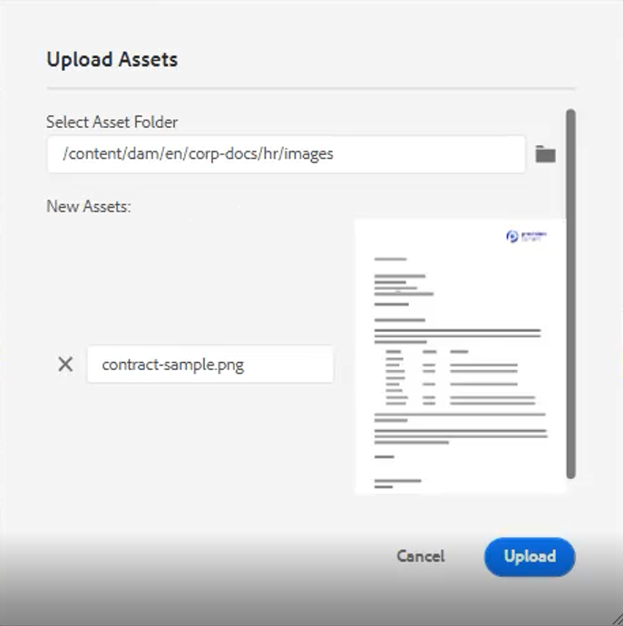
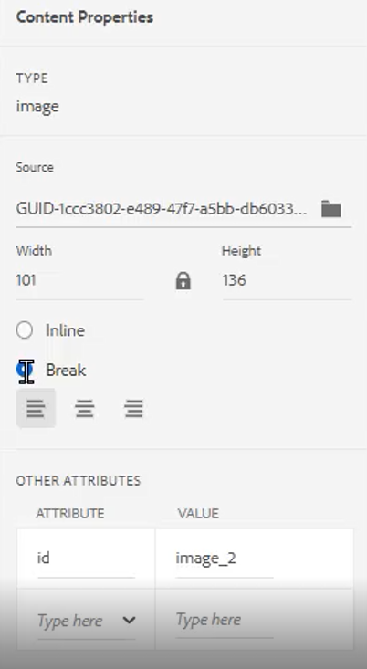

# 간단한 콘텐츠 작성 워크플로

AEM Guides 편집기에는 콘텐츠 작성 워크플로를 간소화하는 여러 단축키가 있습니다. 이러한 단축키를 사용하면 이미지를 빠르게 추가 및 수정하고, 한 번에 여러 주제로 작업하고, 오류를 수정하고, 주제 PDF을 다운로드하고, 버전 및 레이블을 사용할 수 있습니다.

>[!VIDEO](https://video.tv.adobe.com/v/342770?quality=12&learn=on)

## 이미지 추가

로컬 드라이브에서 직접 이미지를 추가할 수 있습니다.

1. 이미지를 토픽에 바로 드래그하여 놓습니다. **Assets 업로드** 대화 상자가 나타납니다.

   

1. 폴더 경로를 원하는 이미지 위치로 수정합니다.

1. 이미지 이름을 용도를 나타내는 이름으로 변경합니다.

1. [!UICONTROL **업로드**]&#x200B;를 클릭합니다.

## 이미지 수정

1. 모퉁이를 끌어서 놓아 이미지 크기를 조정합니다.

1. 이미지를 끌어다 놓아 주제 내의 다른 위치로 이동합니다.

1. 오른쪽 패널의 **콘텐츠 속성**&#x200B;을 사용하여 이미지 수정

   - 크기 조절

   - position

   - 정렬 또는

   - 기타 속성.

   

## 여러 주제를 사용한 작업

분할 보기는 주제를 비교하거나, 주제 간에 복사하여 붙여넣거나, 한 주제에서 다른 주제로 콘텐츠를 드래그 앤 드롭할 때 유용합니다.

1. 두 개 이상의 관련 항목을 엽니다.

1. 한 파일의 제목 탭을 클릭하여 상황별 메뉴를 엽니다.

1. [!UICONTROL **분할**]&#x200B;을 선택합니다.

1. **오른쪽**&#x200B;을 선택하세요.

   

## 오타 수정

1. 오류가 포함된 단어 또는 구를 찾습니다.

1. [!UICONTROL **Ctrl**]&#x200B;을 길게 누릅니다.

1. 오류에서 보조 마우스 단추를 클릭합니다.

1. 올바른 철자를 선택하십시오.

주제 텍스트에서 오류가 수정되었습니다.

## 주제 PDF 다운로드

사용자는 현재 주제의 PDF을 다운로드하여 표시하거나 다른 사용자와 공유하고자 할 수 있습니다.

1. 화면 오른쪽 상단의 [!UICONTROL **미리 보기**]&#x200B;를 클릭합니다.

1. 항목 위의 [!UICONTROL **PDF 아이콘**]&#x200B;을 클릭합니다. 대화 상자가 나타납니다.

   

1. 필요한 경우 **변환 이름** 또는 **DITA-OT 명령줄 인수**&#x200B;에 대한 정보를 입력하십시오. 모든 필드가 비어 있는 경우에도 PDF이 생성됩니다.

1. [!UICONTROL **다운로드**]&#x200B;를 클릭합니다. PDF이 생성됩니다.

1. 사용 가능한 아이콘을 사용하여 PDF 주제를 구성, 다운로드 또는 공유할 수 있습니다.

## 저장소 또는 맵에서 주제 찾기

1. 주제를 엽니다.

1. 제목 탭에서 보조 마우스 버튼을 클릭합니다.

1. **다음 위치에서 찾기**&#x200B;를 선택합니다.

1. 원하는 주제 위치로 이동하려면 **저장소** 또는 **맵**&#x200B;을 선택하십시오.

## 주제 버전 지정

1. 주제를 변경합니다.

1. 항목을 저장합니다.

1. 왼쪽 상단 메뉴에서 **저장소** 아이콘을 클릭합니다.

   

1. 대화 상자에서 **새 버전에 대한 댓글**&#x200B;을 추가합니다.

   

1. [!UICONTROL **저장**]&#x200B;을 클릭합니다.

버전 번호가 업데이트됩니다.

## 버전 레이블 로드

버전 번호만 기반으로 주제의 상태를 추적하기가 어려울 수 있습니다. 레이블을 사용하면 여러 수정 버전이 있는 주제의 정확한 상태를 더 쉽게 식별할 수 있습니다.

1. **폴더 프로필**&#x200B;을 선택하세요.

1. 폴더 프로필 내에서 XML 편집기를 구성합니다.

   a. 화면 왼쪽 상단에서 편집 을 선택합니다.

   b. XML 콘텐츠 버전 레이블에서 새 주제를 추가하거나 기존 주제를 사용합니다.

   

1. [!UICONTROL **업로드**]&#x200B;를 선택합니다.

1. ReviewLabels.json 또는 유사한 파일을 선택합니다. 이러한 파일을 만드는 방법에 대한 자세한 내용은 다른 비디오에서 다룹니다.

1. [!UICONTROL **열기**]&#x200B;를 클릭합니다.

1. 폴더 프로필 화면 왼쪽 상단의 [!UICONTROL **저장**]&#x200B;을 클릭합니다.

1. 오른쪽 상단의 [!UICONTROL **닫기**]&#x200B;를 클릭합니다.

이제 버전 레이블이 로드되었습니다.

## 버전 레이블 할당

1. 버전 레이블 로드.

1. 현재 항목의 왼쪽 상단에 있는 [!UICONTROL **사용자 환경 설정**] 아이콘을 클릭합니다.

   

1. 버전 레이블을 이전에 로드한 것과 동일한 폴더 프로필을 선택합니다.

1. 사용자 환경 설정 대화 상자에서 기본 경로가 폴더 프로필이 적용된 것과 동일한 정보를 참조하는지 확인합니다.

   

1. [!UICONTROL **저장**]&#x200B;을 클릭합니다.

1. 주제의 버전을 지정합니다.

1. 댓글을 추가하고 드롭다운에서 버전 레이블을 선택합니다.

   

1. [!UICONTROL **저장**]&#x200B;을 클릭합니다.

버전 번호가 업데이트됩니다.

## 버전 내역 및 레이블 보기

1. 왼쪽 패널에서 현재 주제 제목을 찾습니다.

1. 제목을 클릭하여 상황별 메뉴를 엽니다.

1. [!UICONTROL **Assets UI에서 보기**]&#x200B;를 선택합니다.

   

   - 레이블이 있는 버전 내역은 왼쪽에 표시됩니다.

   

1. **이 버전으로 되돌리기** 및 **버전 미리 보기**&#x200B;와 같은 옵션에 액세스하려면 버전을 클릭하십시오.

## 새 템플릿 만들기

템플릿은 주제와 맵 모두에 존재합니다. 관리자는 왼쪽 패널에서 템플릿에 액세스할 수 있습니다.

1. 왼쪽 패널에서 [!UICONTROL **템플릿**]&#x200B;을 클릭합니다.

1. 맵 또는 주제 를 선택하여 연관된 상황별 메뉴를 엽니다.

1. 을(를) 클릭하여 새 템플릿을 추가합니다.

   

1. 결과 대화 상자의 필드를 채웁니다.

샘플 콘텐츠와 샘플 구조를 포함하는 셸 템플릿이 나타납니다.
