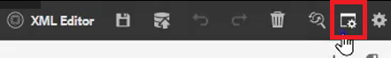

# 간단한 컨텐츠 작성 워크플로우

AEM 안내서 편집기에는 컨텐츠 작성 워크플로우를 간소화하는 여러 단축키가 있습니다. 이러한 단축키를 사용하면 이미지를 빠르게 추가 및 수정하고, 여러 항목을 한 번에 작업하고, 오류를 수정하고, 주제 PDF을 다운로드하고, 버전과 레이블을 사용할 수 있습니다.

>[!VIDEO](https://video.tv.adobe.com/v/342770?quality=12&learn=on)

## 이미지 추가

로컬 드라이브에서 이미지를 직접 추가할 수 있습니다.

1. 이미지를 주제별로 직접 드래그합니다. 다음 **자산 업로드** 대화 상자가 나타납니다.

   

1. 원하는 이미지 위치로 폴더 경로를 수정합니다.

1. 이미지 이름을 용도를 대표하는 것으로 변경합니다.

1. 클릭 [!UICONTROL **업로드**].

## 이미지 수정

1. 모퉁이를 끌어다 놓아 이미지 크기를 조정합니다.

1. 이미지를 끌어다 놓아 주제 내의 다른 위치로 이동합니다.

1. 사용 **컨텐츠 속성** 오른쪽 패널에서 이미지를 수정합니다.

   - 축소

   - position

   - 정렬 또는

   - 기타 속성입니다.

   

## 여러 항목을 사용한 작업

보기 분할은 주제를 비교하거나, 주제 간에 복사 및 붙여넣거나, 한 주제의 컨텐츠를 다른 주제와 드래그 앤 드롭할 때 유용합니다.

1. 관련 항목을 두 개 이상 엽니다.

1. 한 파일의 제목 탭을 클릭하여 상황별 메뉴를 엽니다.

1. 선택 [!UICONTROL **분할**].

1. 선택 **Right**.

   

## 오타 오류 수정

1. 오류가 포함된 단어 또는 구를 찾습니다.

1. 길게 누르기 [!UICONTROL **Ctrl**].

1. 오류 시 보조 마우스 단추를 클릭합니다.

1. 올바른 맞춤법을 선택합니다.

주제 텍스트에서 오류가 수정되었습니다.

## 주제 PDF 다운로드

사용자는 현재 항목의 PDF을 다운로드하여 다른 사용자와 표시하거나 공유할 수 있습니다.

1. 클릭 [!UICONTROL **미리 보기**] 화면 오른쪽 상단에 있습니다.

1. 을(를) 클릭합니다. [!UICONTROL **PDF 아이콘**] 위의 항목을 참조하십시오. 대화 상자가 나타납니다.

   

1. 다음 방법 중 하나를 위해 정보를 입력합니다 **변환 이름** 또는 **DITA-OT 명령줄 인수** 필요한 경우. 모든 필드를 비워 두면 PDF이 여전히 생성됩니다.

1. [!UICONTROL **다운로드**]&#x200B;를 클릭합니다. PDF이 생성됩니다.

1. 사용 가능한 아이콘을 사용하여 PDF 항목을 구성, 다운로드 또는 공유할 수 있습니다.

## 저장소 또는 맵에서 항목을 찾습니다

1. 주제를 엽니다.

1. 제목 탭에서 보조 마우스 단추를 클릭합니다.

1. 선택 **위치**.

1. 다음 중 하나를 선택합니다 **저장소** 또는 **맵** 원하는 주제 위치로 이동합니다.

## 주제 버전 지정

1. 주제를 변경합니다.

1. 항목을 저장합니다.

1. 을(를) 클릭합니다. **저장소** 아이콘을 클릭합니다.

   

1. 대화 상자에서 를 추가합니다. **새 버전에 대한 댓글**.

   

1. [!UICONTROL **저장**]&#x200B;을 클릭합니다.

버전 번호가 업데이트됩니다.

## 버전 레이블 로드

버전 번호만 기반으로 항목의 상태를 추적하려는 것은 어려울 수 있습니다. 레이블을 사용하면 여러 개정을 거친 주제의 정확한 상태를 보다 쉽게 식별할 수 있습니다.

1. 선택 **폴더 프로필**.

1. 폴더 프로파일 내에서 XML 편집기를 구성합니다.

   a. 화면 왼쪽 상단에서 편집 을 선택합니다.

   나. XML 컨텐트 버전 레이블에서 새 항목을 추가하거나 기존 항목을 사용합니다.

   

1. 선택 [!UICONTROL **업로드**].

1. ReviewLabels.json 등의 파일을 선택합니다. 이러한 파일을 만드는 방법에 대한 자세한 내용은 다른 비디오에서 다룹니다.

1. 클릭 [!UICONTROL **열기**].

1. 클릭 [!UICONTROL **저장**] 폴더 프로필 화면의 왼쪽 상단에 있습니다.

1. 클릭 [!UICONTROL **닫기**] 오른쪽 상단에 있습니다.

이제 버전 레이블이 로드됩니다.

## 버전 레이블 지정

1. 버전 레이블을 로드합니다.

1. 을(를) 클릭합니다. [!UICONTROL **사용자 환경 설정**] 아이콘 사용

   

1. 버전 레이블을 이전에 로드한 것과 동일한 폴더 프로필을 선택합니다.

1. 사용자 환경 설정 대화 상자에서 기본 경로가 폴더 프로파일이 적용된 정보와 동일한 정보를 참조하는지 확인합니다.

   

1. [!UICONTROL **저장**]&#x200B;을 클릭합니다.

1. 항목을 버전 지정합니다.

1. 설명을 추가하고 드롭다운에서 버전 레이블을 선택합니다.

   

1. [!UICONTROL **저장**]&#x200B;을 클릭합니다.

버전 번호가 업데이트됩니다.

## 버전 기록 및 레이블 보기

1. 왼쪽 패널에서 현재 주제 제목을 찾습니다.

1. 제목을 클릭하여 상황별 메뉴를 엽니다.

1. 선택 [!UICONTROL **자산 UI에서 보기**].

   

   - 레이블이 있는 버전 기록이 왼쪽에 표시됩니다.

   

1. 버전을 클릭하여 다음과 같은 옵션에 액세스합니다 **이 버전으로 되돌리기** 및 **버전 미리 보기**.

## 새 템플릿 만들기

템플릿에는 주제와 맵이 모두 있습니다. 관리자는 왼쪽 패널에서 템플릿에 액세스할 수 있습니다.

1. 클릭 [!UICONTROL **템플릿**] 왼쪽 패널에 표시됩니다.

1. 맵 또는 주제 를 선택하여 관련 컨텍스트 메뉴를 엽니다.

1. 을(를) 클릭하여 새 템플릿을 추가합니다.

   

1. 결과 대화 상자에서 필드를 채웁니다.

샘플 컨텐츠 및 샘플 구조가 포함된 셸 템플릿이 표시됩니다.
