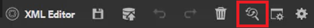

# 맞춤법 검사 및 찾기/바꾸기

AEM 안내서 편집기에는 강력한 맞춤법 검사와 찾기 및 바꾸기 기능이 있습니다.

>[!VIDEO](https://video.tv.adobe.com/v/342768?quality=12&learn=on)

맞춤법 오류 수정

1. 빨간색 밑줄이 표시된 열린 주제의 오류를 찾습니다.

1. Ctrl 키를 누른 채로 단어 내에서 보조 마우스 단추를 클릭합니다.

1. 제안 사항에서 올바른 맞춤법을 선택합니다.

올바른 맞춤법을 제안하지 않으면 항상 수동으로 단어를 편집할 수 있습니다.

## AEM 맞춤법 검사로 전환

브라우저의 기본 사전 이외의 맞춤법 검사 도구를 사용할 수 있습니다.

1. 다음으로 이동 **편집기 설정**.

1. 을(를) 선택합니다 **일반** 설정 탭.

   

1. 다음 두 가지 옵션을 사용할 수 있습니다.

   - **브라우저 맞춤법 검사** — 맞춤법 검사가 브라우저의 기본 사전을 사용하는 기본 설정입니다.

   - **AEM 맞춤법 검사** — AEM 사용자 지정 사전을 사용하여 사용자 지정 단어 목록을 작성하는 데 사용합니다.

1. 선택 **AEM 맞춤법 검사**.

1. [!UICONTROL **저장**]&#x200B;을 클릭합니다.

사용자 지정 사전 구성

관리자는 AEM 사전이 회사 이름과 같은 사용자 지정 단어를 인식하도록 설정을 변경할 수 있습니다.

1. 로 이동합니다 **도구** 창

1. 에 로그인합니다. **CRXDE Lite**.

   

1. 로 이동합니다 **_/apps/fmdita/config 노드_**.

   

1. 새 파일을 만듭니다.

   a. 구성 폴더를 마우스 오른쪽 단추로 클릭합니다.

   나. 선택 **만들기 > 파일 만들기**.

   

   c. 파일 이름을 지정합니다 _**user_dictionary.txt**_.

   

   d. 클릭 [!UICONTROL **확인**].

1. 파일을 엽니다.

1. 사용자 지정 사전에 포함할 단어 목록을 추가합니다.

1. 클릭 [!UICONTROL **모두 저장**].

1. 파일을 닫습니다.

작성자는 AEM Dictionary에서 업데이트된 사용자 지정 단어 목록을 가져오려면 웹 편집기 세션을 다시 시작해야 할 수 있습니다.

## 단일 파일에서 찾기 및 바꾸기

1. 상단 도구 모음에서 찾기 및 바꾸기 아이콘을 클릭합니다.

   

1. 하단 도구 모음에서 단어 또는 구를 입력합니다.

1. 클릭 [!UICONTROL **찾기**].

1. 필요한 경우 찾은 단어를 바꿀 단어를 입력합니다.

1. 클릭 [!UICONTROL **바꾸기**].

## 저장소에서 찾기 및 바꾸기

1. 로 이동합니다 **저장소**.

1. 을(를) 클릭합니다. [!UICONTROL **찾기 및 바꾸기**] 아이콘을 클릭합니다.

1. 을(를) 클릭합니다. [!UICONTROL **설정 표시**] 아이콘.

1. 다음 중 하나를 선택합니다

   - **바꾸기 전 체크 아웃 파일** — 관리자가 활성화한 경우 검색어를 바꾸기 전에 파일이 자동으로 체크 아웃됩니다.

   - **단어 단위로** — 입력한 단어 또는 구문만 반환하도록 검색을 제한합니다.

   

1. 을(를) 클릭합니다. [!UICONTROL **필터 적용**] 아이콘 - 검색을 수행할 리포지토리에서 경로를 선택합니다.

1. 찾기 및 바꾸기에 사용할 조건을 입력합니다.

1. 필요한 경우 을 선택합니다. **바꾸기 후 새 버전 만들기**.

1. 클릭 [!UICONTROL **찾기**].

1. 원하는 파일을 열고 화살표를 사용하여 찾은 결과에서 다음 결과로 이동합니다.

   
