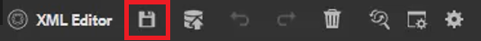

# 변경 내용 추적

변경 내용 추적 모드를 활성화하여 문서에 대해 수행된 모든 업데이트를 추적할 수 있습니다. 이 모드를 사용하면 사용자와 팀이 문서 검토 프로세스 중에 모든 삽입 및 삭제를 캡처할 수 있습니다.

>[!VIDEO](https://video.tv.adobe.com/v/342763?quality=12&learn=on)

## 변경 내용 추적 기능 작업

1. **변경 내용 추적** 도구 모음 아이콘을 전환하여 기능을 활성화(또는 비활성화)합니다.

   

1. 주제를 변경합니다.

   추가된 콘텐츠는 이제 변경 표시줄과 함께 녹색으로 표시됩니다. 삭제된 컨텐츠는 취소선과 함께 빨간색으로 표시됩니다.

1. 오른쪽의 **추적된 변경 내용** 아이콘을 선택하여 [추적된 변경 내용] 패널에 액세스합니다.

   

1. [!UICONTROL **저장**]&#x200B;을 클릭합니다.

   

1. 주제를 닫습니다.

이제 다른 사용자가 주제를 열고 기존의 추적된 변경 내용을 볼 수 있습니다. 사용자는 변경 사항을 수락하거나 거부하고 자신의 변경 사항을 추가할 수 있습니다.

## 추적된 변경 내용 검색

검색 기능은 추적된 변경 내용이 많을 때 유용합니다. 변경 내용을 스크롤하는 데는 시간이 걸릴 수 있기 때문입니다.

1. 오른쪽의 **추적된 변경 내용** 아이콘을 선택하여 [추적된 변경 내용] 패널에 액세스합니다.

1. 검색 필드에 단어 또는 구를 입력합니다.
검색어는 검색어와 일치하는 모든 변경 사항을 반환합니다.

## 추적된 변경 내용 필터링

추적된 여러 변경 내용을 삽입, 삭제 또는 검토자별로 필터링할 수도 있습니다.

1. [추적된 변경 내용] 패널 아래에 있는 [!UICONTROL **필터**] 아이콘을 클릭합니다.

1. 원하는 필터의 확인란을 선택합니다.

   

1. [!UICONTROL **적용**]&#x200B;을 클릭합니다.

## 추적된 변경 내용 적용 또는 거부

검토자와 주제전문가는 다른 사용자의 변경 사항을 개별적으로 또는 한 번에 모두 수락하거나 거부할 수 있습니다.

1. 오른쪽의 [!UICONTROL **추적된 변경 내용**] 아이콘을 클릭하여 [추적된 변경 내용] 패널에 액세스합니다.

1. 특정 변경 사항을 선택합니다.

1. 변경 내용과 관련된 [!UICONTROL **엄지손가락 위로**] 또는 [!UICONTROL **엄지손가락 아래로**] 아이콘을 클릭하여 허용하거나 거부합니다.

   

   또는

   모든 변경 내용을 적용하거나 거부하려면 검색 창 위에 있는 [!UICONTROL **엄지손가락 위로**] 또는 [!UICONTROL **엄지손가락 아래로**] 아이콘을 클릭하십시오.

   

1. 주제를 [!UICONTROL **저장**]&#x200B;합니다.

## 결합 피쳐 작업

다중 작성 환경에서 작업할 때 다른 작성자가 주제나 맵에서 변경한 내용을 추적하기가 어려울 수 있습니다. 병합 기능을 사용하면 변경 내용을 볼 수 있을 뿐만 아니라 문서의 최신 버전에서 유지되는 변경 내용도 보다 세밀하게 제어할 수 있습니다.

1. 웹 편집기에서 주제를 엽니다.

1. 도구 모음에서 [!UICONTROL **병합**] 아이콘을 클릭합니다.

   

1. 병합 대화 상자에서 파일의 현재 버전을 비교할 파일 버전을 선택합니다.

1. 옵션에서 다음을 선택합니다.

   - **선택한 버전에서 변경 내용 추적**: 이 옵션은 추적된 변경 내용의 형태로 모든 콘텐츠 업데이트를 표시합니다. 그런 다음 문서의 변경 내용을 한 번에 하나씩 적용하거나 모두 적용하도록 선택할 수 있습니다.

   - **선택한 버전으로 되돌리기**: 이 옵션은 문서의 현재 버전을 선택한 버전으로 되돌립니다. 허용 또는 거부되는 콘텐츠에 대한 제어 권한은 없습니다.

1. [!UICONTROL **완료**]&#x200B;를 클릭합니다.

**선택한 버전에서 변경 내용 추적 옵션**&#x200B;을 선택한 경우 선택한 버전의 모든 변경 내용이 오른쪽 패널의 [변경 내용] 탭에 나타납니다.
