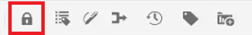

# 사용자 환경 설정, 편집기 설정 및 편집기 도구 모음

편집기에는 구성 가능한 인터페이스가 있습니다. 사용자 환경 설정, 편집기 설정 및 폴더 프로필을 혼합하여 특정 작업 환경에 거의 모든 측면을 사용자 지정할 수 있습니다.

>[!VIDEO](https://video.tv.adobe.com/v/342769?quality=12&learn=on)

## 요소 태그 표시 또는 숨기기

태그는 요소의 경계를 나타내는 시각적 큐입니다. 요소 경계는 요소의 시작과 끝을 표시합니다. 그런 다음 이러한 경계를 시각적 큐로 사용하여 삽입 지점을 배치하거나 경계 내에서 텍스트를 선택할 수 있습니다.

1. 을(를) 클릭합니다. [!UICONTROL **태그 보기 전환**] 아이콘을 클릭합니다.

   

   태그는 주제 내에 나타납니다. 태그 보기에서 다음을 수행할 수 있습니다.

   - 열기 또는 닫기 태그를 클릭하여 요소의 콘텐츠를 선택합니다.

   - + 또는 - 태그를 클릭하여 태그를 확장하거나 축소합니다.

   - 컨텍스트 메뉴를 사용하여 선택한 요소를 잘라내거나 복사하거나 지나칠 수 있습니다.

   - 태그를 선택하고 요소를 유효한 위치에 드래그하여 놓습니다.

1. 을(를) 클릭합니다. [!UICONTROL **태그 보기 전환**] 아이콘을 다시 클릭하여 태그를 숨깁니다.

태그는 사라져서 텍스트에 집중할 수 있습니다.

## 사용 시 자산 잠금

파일을 잠금(또는 체크 아웃)하면 파일에 대한 사용자 전용 쓰기 액세스 권한이 제공됩니다. 파일이 잠금 해제됨(또는 체크 인됨)이면 변경 사항이 파일의 현재 버전에 저장됩니다.

1. 을(를) 클릭합니다. [!UICONTROL **잠금**] 아이콘을 클릭합니다.

   

   파일이 체크 아웃되고 저장소의 파일 이름 옆에 잠금 아이콘이 표시됩니다.

1. 을(를) 클릭합니다. [!UICONTROL **잠금 해제**] 아이콘.

   

저장소가 업데이트되어 파일이 체크 인되었음을 표시합니다.

## 특수 문자 삽입

1. 을(를) 클릭합니다. [!UICONTROL **특수 문자 삽입**] 아이콘을 클릭합니다.

   

1. 특수 문자 삽입 대화 상자에서 검색 창에 문자 이름을 입력합니다.

   또는 카테고리 선택 드롭다운을 사용하여 특정 카테고리의 모든 문자를 표시합니다.

1. 원하는 문자를 선택합니다.

1. 클릭 [!UICONTROL **삽입**].

특수 문자가 텍스트에 삽입됩니다.

## 작성자, 소스 및 미리 보기 모드 간에 전환합니다.

화면 오른쪽 상단의 도구 모음에서 보기 간에 전환할 수 있습니다.

- 선택 **작성자** 주제 작업 시 구조 및 컨텐츠를 볼 수 있습니다.

- 선택 **소스** 항목을 구성하는 기본 XML을 표시합니다.

- 선택 **미리 보기** 브라우저에서 사용자가 볼 때 주제가 표시되는 방식을 표시합니다.

## 사용자 환경 설정을 사용하여 테마 변경

편집기의 밝은 테마 또는 어두운 테마 중에서 선택할 수 있습니다. [밝은 테마]를 사용하면 도구 모음과 패널에서는 밝은 회색 배경을 사용합니다. [어두운 테마]를 사용하면 도구 모음과 패널에서는 검은 배경색을 사용합니다. 두 테마 모두에서 콘텐츠 편집 영역이 흰색 배경으로 나타납니다.

1. 을(를) 클릭합니다. [!UICONTROL **사용자 환경 설정**] 아이콘 사용 안 함

   

1. 사용자 환경 설정 대화 상자에서 [!UICONTROL **테마**] 드롭다운.

1. 사용 가능한 옵션 중에서 선택합니다.

   

1. [!UICONTROL **저장**]&#x200B;을 클릭합니다.

기본 테마를 표시하도록 편집기가 업데이트됩니다.

## 기본 경로를 사용자 기본 설정으로 업데이트

편집기를 실행하는 즉시 저장소 보기에 특정 위치의 컨텐츠가 표시되도록 기본 경로를 업데이트할 수 있습니다. 따라서 작업 파일에 액세스하는 시간이 줄어듭니다.

1. 을(를) 클릭합니다. [!UICONTROL **사용자 환경 설정**] 아이콘 사용 안 함

   

1. 사용자 환경 설정 대화 상자에서 [!UICONTROL **폴더**] 기본 경로 옆에 있는 아이콘을 클릭합니다.

   

1. 경로 선택 대화 상자에서 특정 폴더 옆에 있는 확인란을 클릭합니다.

1. 클릭 [!UICONTROL **선택**].

다음에 편집기를 실행하면 저장소에 기본 경로에 지정된 파일이 표시됩니다.

## 새 폴더 프로필 할당

글로벌 프로필 은 시스템 기본값입니다. 관리자는 선택할 추가 폴더 프로필을 만들 수 있습니다.

1. 을(를) 클릭합니다. [!UICONTROL **사용자 환경 설정**] 아이콘 사용 안 함

   

1. 사용자 환경 설정 대화 상자에서 [!UICONTROL **폴더 프로필**] 드롭다운.

   

1. 사용 가능한 옵션에서 프로필을 선택합니다.

1. [!UICONTROL **저장**]&#x200B;을 클릭합니다.

이제 새 폴더 프로필이 할당됩니다. 왼쪽 패널에서 도구 모음 옵션, 보기 모드, 조건 및 코드 조각이 변경되었습니다. 또한 편집기에서 컨텐츠의 시각적 모양을 변경할 수도 있습니다.

## 편집기 설정으로 사전 변경

편집기 설정은 관리자 사용자가 사용할 수 있습니다. 이러한 환경 설정을 사용하면 다양한 설정을 구성할 수 있습니다. 이 중 하나는 편집기가 맞춤법 검사에 사용하는 사전입니다.

1. 을(를) 클릭합니다. [!UICONTROL **편집기 설정**] 아이콘 사용 안 함

   

1. 편집기 설정 대화 상자에서 [!UICONTROL **일반**] 탭.

1. 작업할 사전을 선택합니다.

1. [!UICONTROL **저장**]&#x200B;을 클릭합니다.

사전이 업데이트됩니다. AEM 맞춤법 검사로 전환하면 사용자 지정 단어 목록을 사용할 수 있습니다.

## 편집기 설정으로 패널 표시 및 숨기기

편집기 설정으로 사용자 지정할 수 있는 기능 중 하나는 패널입니다. 보다 구체적으로, 편집기에서 표시하거나 숨길 패널을 선택할 수 있습니다.

1. 을(를) 클릭합니다. [!UICONTROL **편집기 설정**] 아이콘 사용 안 함

   

1. 편집기 설정 대화 상자에서 [!UICONTROL **패널**] 탭.

1. 사용 가능한 패널을 필요에 따라 표시 또는 숨기기로 전환합니다.

   

1. [!UICONTROL **저장**]&#x200B;을 클릭합니다.

이제 왼쪽 패널은 [표시]로 전환된 패널만 표시하도록 구성되었습니다.

## 편집기 설정의 이름 및 레이블 요소

요소 목록에서는 특정 요소의 이름을 지정하고 좀 더 인간적인 레이블로 지정할 수 있습니다. 요소 이름은 DITA 요소 중 하나여야 합니다. 레이블은 임의의 문자열일 수 있습니다.

1. 을(를) 클릭합니다. [!UICONTROL **편집기 설정**] 아이콘 사용 안 함

   

1. 편집기 설정 대화 상자에서 [!UICONTROL **요소 목록**] 탭.

1. 을(를) 입력합니다 **요소 이름** 그리고 **레이블** 를 입력합니다.

1. 을(를) 클릭합니다. [!UICONTROL **플러스**] 아이콘을 클릭하여 목록에 요소를 더 추가합니다.

   

1. [!UICONTROL **저장**]&#x200B;을 클릭합니다.

편집기에서 기존 태그의 요소 목록에 대한 변경 사항을 즉시 볼 수 있습니다. 새 요소를 추가할 때 제공된 옵션에서 해당 요소를 볼 수도 있습니다.

## 편집기 설정의 이름 및 레이블 속성

속성 목록은 요소 목록과 유사하게 작동합니다. 편집기 설정에서 속성 목록 및 해당 표시 이름을 제어할 수 있습니다.

1. 을(를) 클릭합니다. [!UICONTROL **편집기 설정**] 아이콘 사용 안 함

   

1. 편집기 설정 대화 상자에서 [!UICONTROL **속성 목록**] 탭.

1. 을(를) 입력합니다 **속성 이름** 그리고 **레이블** 를 입력합니다.

1. 을(를) 클릭합니다. [!UICONTROL **플러스**] 아이콘을 클릭하여 목록에 속성을 더 추가합니다.

## 편집기 설정에서 조건 구성

조건 탭에서는 여러 속성을 구성할 수 있습니다.

1. 을(를) 클릭합니다. [!UICONTROL **편집기 설정**] 아이콘 사용 안 함

   

1. 편집기 설정 대화 상자에서 [!UICONTROL **조건**] 탭.

1. 적용할 조건의 확인란을 선택합니다.

   

1. [!UICONTROL **저장**]&#x200B;을 클릭합니다.

## 편집기 설정에서 게시 프로필 만들기

게시 프로필을 사용하여 기술 자료를 게시할 수 있습니다. 예를 들어 Salesforce는 소비자 키와 소비자 암호가 있는 구성된 앱을 사용합니다. 이 정보는 Salesforce 게시 프로필을 만드는 데 사용할 수 있습니다.

1. 을(를) 클릭합니다. [!UICONTROL **편집기 설정**] 아이콘 사용 안 함

   

1. 편집기 설정 대화 상자에서 [!UICONTROL **프로필**] 탭.

1. 을(를) 클릭합니다. [!UICONTROL **플러스**] 프로필 옆에 있는 아이콘을 클릭합니다.

1. 필요에 따라 필드를 채웁니다.

1. [!UICONTROL **저장**]&#x200B;을 클릭합니다.

게시 프로필이 생성되었습니다.
