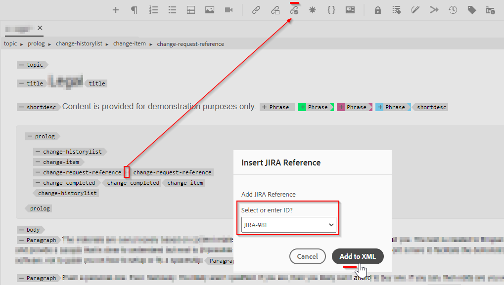

# 웹 편집기 도구 모음에서 새 사용자 지정 작업 가능 단추 추가

이 문서에서는 Webeditor 도구 모음에 새 사용자 지정 단추를 추가하고 javascript를 호출하여 원하는 사용자 지정 작업을 수행하는 방법을 알아봅니다.

웨비더에 실행 가능한 단추를 추가하는 작업은 다음 단계를 수행합니다.
- 에서 버튼 추가 *ui_config.json* 필요한 위치에서
- 사용자가 클릭했을 때 작업을 수행할 수 있도록 웹 편집기에서 단추 클릭 이벤트를 등록합니다


## 예를 들어 구현

작성자가 주제 프로필 섹션에 jira 참조를 추가하려는 예를 사용하여 이를 이해하겠습니다. 포함된 jira 참조-id가 있는 prolog 섹션은 다음과 같을 수 있습니다.


JIRA ID를 포함하는 &quot;change-request-id&quot; 요소는 API에서 검색해야 합니다(예를 들어, 애플리케이션에서 표시하는 특정 JIRA 쿼리를 기반으로 함). 사용자가 prolog 섹션을 작성할 때 다음과 같은 단추를 클릭하고 웹 편집기 도구 모음에서 jira 참조 id를 삽입할 수 있습니다.


사용자가 버튼을 클릭하면 가능한 옵션을 가져오고 사용자가 원하는 JIRA ID를 선택할 수 있도록 하는 대화 상자가 표시됩니다.



그런 다음 &quot;change-request-id&quot;를 prolog에 추가해야 합니다.


## 이 구현


### 브라우저에서 버튼을 구성 *ui_config.json*

폴더 프로필을 사용하여 *ui_config.json* &quot;XML Editor 구성&quot; 탭에서 단추 구성 JSON을 &quot;도구 모음&quot; 그룹의 원하는 섹션에 추가합니다.

```
{
    "on-click":"insertJIRARef",
    "icon":"linkCheck",
    "variant":"quiet",
    "type":"button",
    "title":"Insert JIRA Reference"
}
```

[폴더 프로필 및 ui_config.json 구성에 대한 자세한 내용을 보려면 이 링크를 사용하십시오](https://experienceleague.adobe.com/docs/experience-manager-guides-learn/videos/advanced-user-guide/editor-configuration.html?lang=en)


### 새 단추에 대한 클릭 이벤트를 처리합니다

    참고: 아래 언급된 단계는 이 게시물에 첨부된 패키지로 사용할 수 있습니다


- 폴더 프로필을 저장한 후 프로젝트 디렉터리(아래)에 &quot;cq:ClientLibraryFolder&quot;를 만듭니다 */apps*)을 클릭하고 아래 스크린샷에 표시된 대로 속성을 추가하십시오.
   

```
This example uses "coralui3" library to show a dialog as it is used in the Javascript sample we presented.
You may use different library of your choice.
```

- 이 클라이언트 라이브러리 폴더 아래에 설명된 대로 두 개의 파일을 만듭니다.
   - *overrides.js*: &quot;insertJIRARef&quot;에 대한 클릭 이벤트를 처리할 javascript 코드가 있습니다(이 javascript의 컨텐츠를 가져오려면 첨부된 패키지 사용)
   - *js.txt*: 이 javascript를 활성화하기 위해 &quot;overrides.js&quot;를 포함합니다.

- 변경 사항을 저장하고 테스트할 준비가 되어야 합니다.


### 테스트

- 웹 편집기 열기
- 사용자 환경 설정에서 사용자 지정 항목을 추가한 폴더 프로필을 선택합니다 *ui_config.json*. 글로벌 프로필에 추가했다면 이미 해당 프로필을 사용하고 있을 수 있습니다.
- 항목을 열면 도구 모음에 &quot;Insert Jira Reference&quot; 단추가 새로 생깁니다
- 그런 다음 주제에 지정된 대로 prolog 섹션을 추가하고 prolog 요소 &quot;change-request-reference&quot; 내의 &quot;Insert Jira Reference&quot; 단추를 클릭해 볼 수 있습니다

```
<prolog>
    <change-historylist>
        <change-item>
            <change-request-reference>
            </change-request-reference>
            <change-completed></change-completed>
            <change-summary></change-summary>
        </change-item>
    </change-historylist>
</prolog>
```

어떻게 표시될지 알아보려면 아래 스크린샷을 참조하십시오.


### 첨부 파일

- 도구 모음 단추 작업에 대한 javascript 코드가 있는 Webvisitor 클라이언트 라이브러리를 설치하는 샘플 clientlibs 패키지: [이 링크를 사용하여 다운로드](../../../assets/authoring/webeditor-addbuttonontoolbar-insertjira-clientlib.zip)
- 샘플 *ui_config.json* 폴더 프로필에 업로드할 수 있습니다. [샘플 ui_config.json 다운로드](../../../assets/authoring/sample_ui_config_Guides4.2-InsertJiraReference.json)

```
Please note this is compatible to AEM 6.5 and AEM Guides version 4.2.
If you are using a different version please add the toolbar button to the ui_config.json manually.
```
