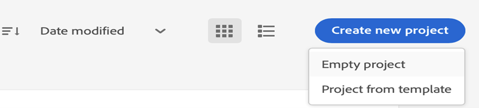
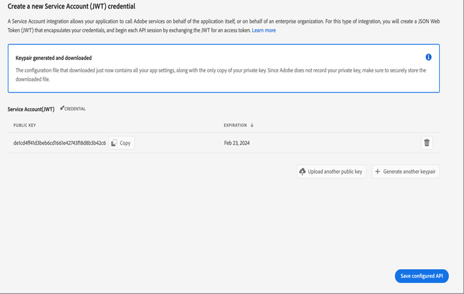

# AEM 안내서 as a Cloud Service에 대한 새로운 마이크로서비스 기반 게시 구성

새로운 게시 마이크로서비스를 사용하면 AEM Guides에서 as a Cloud Service으로 대규모 게시 작업 로드를 동시에 실행하고 업계 선도적인 Adobe I/O Runtime 서버를 사용하지 않는 플랫폼을 활용할 수 있습니다.

각 게시 요청 AEM 안내서는 사용자 요청에 따라 가로 방향으로 크기가 조절되는 별도의 컨테이너를 as a Cloud Service으로 실행합니다. 따라서 사용자는 여러 게시 요청을 실행하고 대규모 on-prem AEM 서버보다 성능을 더 잘 얻을 수 있습니다.

>[!NOTE]
>
> 현재 AEM 가이드의 마이크로서비스 기반 게시는 기본 PDF 게시 또는 DITA-OT를 통한 PDF 출력만 지원합니다. 향후 릴리스에서 더 많은 출력 유형에 대한 마이크로서비스 기반 게시 지원을 추가할 예정입니다.

새 클라우드 게시 서비스는 Adobe IMS JWT 기반 인증으로 보호되므로 고객은 아래 절차에 따라 Adobe의 보안 토큰 기반 인증 워크플로우와 환경을 통합하고 새로운 클라우드 기반 확장 가능한 게시 솔루션을 사용하기 시작해야 합니다.


## Adobe Developer 콘솔에서 IMS 구성 만들기

**구성을 만드는 데 필요한 역할**: 시스템 관리자

Adobe Developer 콘솔에서 IMS 구성을 만들려면 다음 단계를 수행하십시오.

1. Developer Console 열기: `https://developer.adobe.com/console`.

1. 다음으로 전환 **프로젝트** 탭에서 다음을 수행합니다.

   

1. 빈 프로젝트를 새로 만들려면 **빈 프로젝트** 에서 **새 프로젝트 만들기** 드롭다운.

   

1. 선택 **API** 에서 **프로젝트에 추가** 드롭다운을 클릭하여 프로젝트에 IO Management API를 추가합니다.

   

   

1. API를 추가하는 동안 새 개인/공개 키 쌍을 만듭니다. 그러면 시스템에 있는 개인 키가 자동으로 다운로드됩니다.

   

1. 구성된 API를 저장합니다.

   

1. 로 돌아갑니다. **프로젝트** 탭을 클릭하고 **프로젝트 개요** 왼쪽에 있습니다.

   

1. 클릭 **다운로드** 서비스 JSON을 다운로드하려면 맨 위에 있는 버튼을 클릭합니다.

   

이제 JWT 인증 세부 사항을 구성하고 개인 키 및 서비스 세부 사항 JSON도 다운로드했습니다. 다음 섹션에서 이러한 파일이 필요하므로 이 두 파일을 가까이 보관하십시오.

### 환경에 IMS 구성 추가

다음 단계를 수행하여 IMS 구성을 환경에 추가합니다.

1. Experience Manager를 열고 구성할 환경이 포함된 프로그램을 선택합니다.
1. 다음으로 전환 **환경** 탭.
1. 구성할 환경 이름을 클릭합니다. 환경 정보 페이지로 이동해야 합니다.
1. 다음으로 전환 **구성** 탭.
1. 아래 스크린샷에 표시된 대로 개인 키 및 프로젝트 JSON을 업로드합니다. 아래 강조 표시된 이름과 구성을 동일하게 사용하고 있는지 확인하십시오.

   

>[!NOTE]
>
> 위 스크린샷에 표시된 대로 개인 키 및 서비스 세부 사항 JSON 파일의 컨텐츠를 열고 복사 및 붙여넣으십시오.

환경에 IMS 구성을 추가했으면 다음 단계를 수행하여 OSGi를 사용하여 AEM 가이드에 이러한 속성을 연결합니다.

1. cloud manager Git 프로젝트 코드에서 아래에 제공된 두 개의 파일을 추가합니다(파일 내용은 [부록](#appendix)).

   * `com.adobe.aem.guides.eventing.ImsConfiguratorService.cfg.json`
   * `com.adobe.fmdita.publishworkflow.PublishWorkflowConfigurationService.xml`
1. 새로 추가한 파일을 `filter.xml`.
1. Git 변경 사항을 커밋하고 푸시합니다.
1. 파이프라인을 실행하여 환경에 변경 사항을 적용합니다.

이 작업이 완료되면 새로운 마이크로서비스 기반 클라우드 게시를 사용할 수 있습니다.

## 부록 {#appendix}

**파일**:
`com.adobe.aem.guides.eventing.ImsConfiguratorService.cfg.json`

**콘텐츠**:

```
{
  "service.account.details": "$[secret:SERVICE_ACCOUNT_DETAILS]",
  "private.key": "$[secret:PRIVATE_KEY]"
}
```

**파일**: `com.adobe.fmdita.publishworkflow.PublishWorkflowConfigurationService.xml`

**콘텐츠**:
* `dxml.use.publish.microservice`: DITA-OT를 사용하여 마이크로서비스 기반 PDF 게시를 사용하도록 전환
* `dxml.use.publish.microservice.native.pdf`: 마이크로 서비스 기반의 기본 PDF 게시를 사용하도록 전환

```
<?xml version="1.0" encoding="UTF-8"?>
<jcr:root xmlns:jcr="http://www.jcp.org/jcr/1.0" xmlns:sling="http://sling.apache.org/jcr/sling/1.0"
          jcr:primaryType="sling:OsgiConfig"
          dxml.publish.microservice.url="https://adobeioruntime.net/api/v1/web/543112-guidespublisher/default/publishercaller.json"
          dxml.use.publish.microservice="{Boolean}true"
          dxml.use.publish.microservice.native.pdf="{Boolean}true"
/>
```
