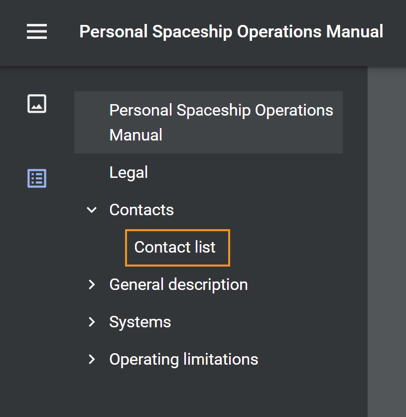

# PDF 출력에 사용자 지정 책갈피 추가

일반적으로 DITA 맵의 TOC는 최종 PDF 출력에서 책갈피로 복제됩니다. 이 목차는 DITA 맵의 주제 또는 섹션 제목에서 만들어집니다. 간편한 탐색을 위해 PDF 출력의 특정 콘텐츠에 사용자 지정 책갈피를 추가할 수 있습니다. 이를 위해서는 `outputclass` 속성에 대한 속성 및 다음 속성을 요소에 적용합니다.

`bookmark-level: 3`

여기, `bookmark-level` 는 속성 및 번호입니다 `3` 책갈피가 추가되는 책갈피 계층의 수준을 나타내는 값입니다. 다음 예제에서는 첫 번째 수준 항목인 &quot;연락처&quot; 에는 &quot;연락처 목록&quot;이라는 테이블이 있습니다. 여기에서 `outputclass` 값이 인 속성 `custom-bookmark`.


다음에 대한 다음 정의 `custom-bookmark` 클래스는 CSS 파일에 추가됩니다.

```css
…
/*Adding a custom bookmark*/
.custom-bookmark{
    bookmark-level: 2
}
…
```

PDF 출력에서 *연락처 목록* 표는 아래와 같이 PDF 책갈피 목록의 두 번째 수준에 추가됩니다.



>[!NOTE]
>
>사용자 지정 책갈피가 추가되는 올바른 수준을 선택해야 합니다. 상위 항목의 책갈피보다 작은 숫자를 지정하는 경우 사용자 지정 책갈피는 상위 책갈피의 위치를 차지하며 다른 모든 책갈피는 하위 책갈피로 표시됩니다. 이로 인해 예기치 않은 책갈피 구조가 발생할 수 있습니다.

