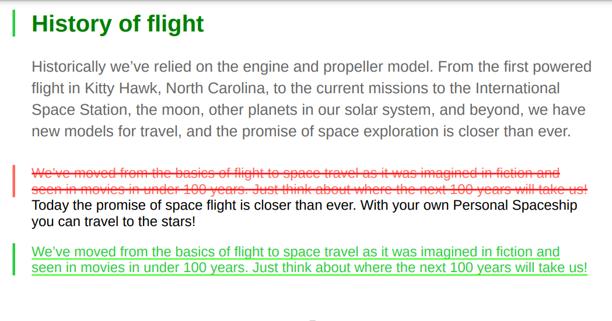

# 사용자 정의 변경 막대 스타일을 사용한 작업

변경 표시줄은 새 컨텐츠나 수정된 컨텐츠를 시각적으로 식별하는 세로 줄입니다. AEM 가이드를 사용하면 주제 내에서 변경된 컨텐츠의 왼쪽에 변경 막대를 표시하고 PDF 출력의 TOC에서 변경된 주제를 표시할 수 있습니다.

변경 내용 표시줄 표시에 대한 자세한 내용은 *게시된 버전 간 변경 막대를 사용하여 PDF 만들기* 설정 [PDF 출력 게시](../web-editor/native-pdf-web-editor.md).

## 항목 내에서 변경된 콘텐츠

변경 표시줄은 삽입, 변경 또는 삭제된 항목의 컨텐츠 왼쪽에 나타납니다.

다음 스타일을 수정하여 변경 내용 및 변경 내용 모음을 표시할 수 있습니다.


>[!NOTE]
>
>이러한 스타일은 `layout.css` 파일을 편집하고 필요에 따라 편집할 수 있습니다.

예를 들어 `.inserted-block` 게시된 PDF 출력에 삽입된 컨텐츠가 표시되는 방식을 정의하는 스타일입니다.


```css
...
.inserted-block { 
  color: #2ECC40; 
  display: inline; 
  -ro-comment-content: " "; 
  -ro-comment-style: underline; 
  -ro-comment-title: "Inserted"; 
  -ro-comment-date: attr(data-time); 
  -ro-comment-dateformat: "yyyy/dd/MM HH:mm:ss"; 
} 
...
```

마찬가지로 `.deleted-block` 게시된 PDF 출력에 삭제된 컨텐츠가 표시되는 방식을 정의하는 스타일입니다.

```css
...
.deleted-block { 
  display: inline; 
  color: #FF6961; 
  text-decoration: line-through; 
  -ro-comment-content: " "; 
  -ro-comment-style: strikeout; 
  -ro-comment-title: "Deleted"; 
  -ro-comment-date: attr(data-time); 
  -ro-comment-dateformat: "yyyy/dd/MM HH:mm:ss"; 
} 
...
```

다음을 사용할 수 있습니다 `.inserted-change-bar` 및 `.deleted-change-bar` 업데이트된 컨텐츠 왼쪽에 표시되는 변경 막대의 모양을 수정하는 스타일입니다.

예를 들어 `-ro-change-bar-color` 특성 `.inserted-change-bar` 삽입된 변경 표시줄을 녹색 색상으로 표시하는 스타일입니다. 를 사용할 수도 있습니다 `-ro-change-bar-color` 특성 `.deleted-change-bar` 삭제된 변경 표시줄을 빨간색으로 표시하는 스타일입니다.

```css
...
.inserted-change-bar { 
  -ro-change-bar-color: #2ECC40; 
} 

.deleted-change-bar { 
  -ro-change-bar-color: #FF6961; 
  } 
...
```



## 목차(TOC)에서 주제가 변경되었습니다.

PDF 출력의 목차에서 변경된 주제 왼쪽에 변경 막대를 추가할 수도 있습니다. 다음을 사용할 수 있습니다 `-ro-change-bar-color` 의 속성 `.changed-topic` 목차 목록에서 업데이트된 주제에 대한 원하는 색상의 변경 막대를 추가하는 스타일.

예를 들어 녹색 색상의 변경 막대를 추가할 수 있습니다.

```css
...
.changed-topic { 
 -ro-change-bar-color: #2ECC40; 
}  
...
```


여기에는 일부 업데이트된 TOC의 모든 주제에 대한 녹색 변경 표시줄이 표시됩니다. 목차에서 변경된 항목을 클릭하고 자세한 변경 사항을 볼 수 있습니다.


