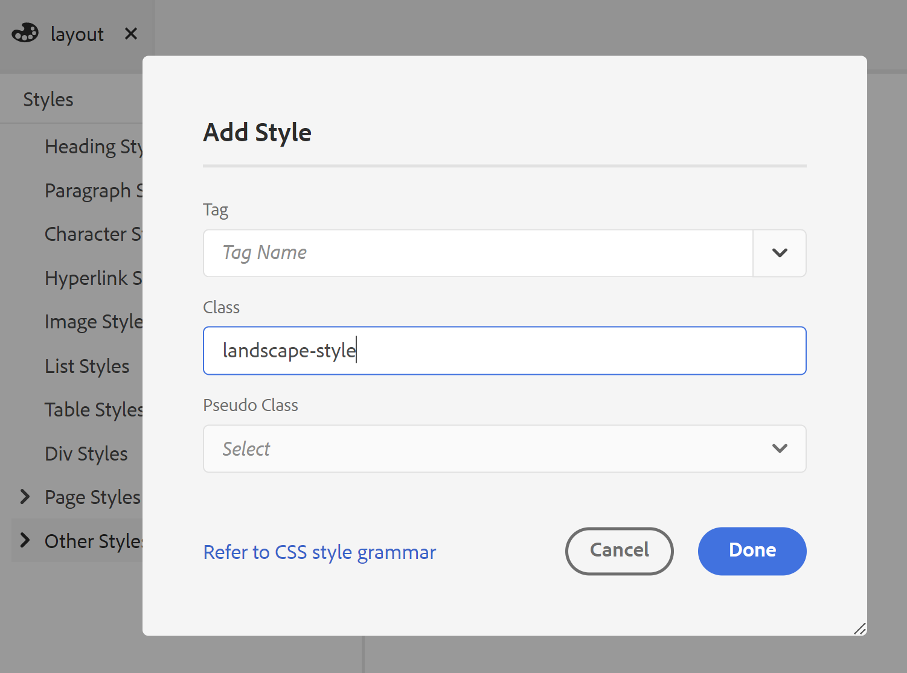
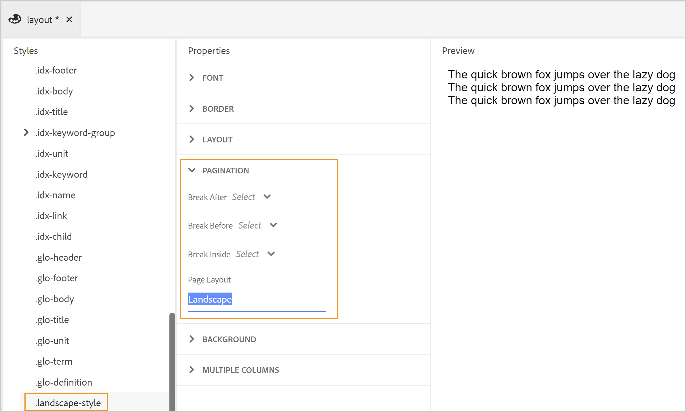
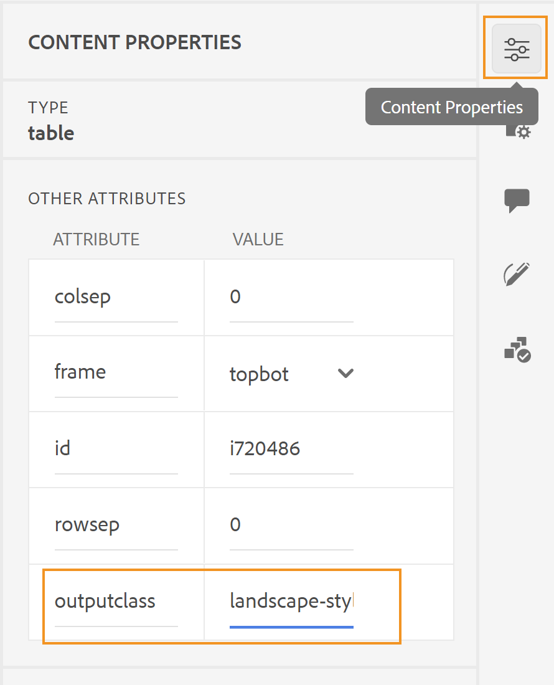

# 페이지 레이아웃 디자인

PDF 문서를 만들 때 다양한 유형의 정보를 제공하기 위한 섹션이 서로 다릅니다. 예를 들어, PDF 문서는 회사의 로고, 책 제목 또는 버전 정보가 있는 앞면 또는 표지 페이지에서 시작됩니다. 그러면 장, 부록, 용어집 페이지가 있습니다. PDF 문서의 각 섹션은 다르게 나타나며, 페이지 레이아웃을 만들고 사용자 지정하여 달성됩니다.

페이지 레이아웃을 디자인할 때 페이지를 구성하는 다양한 요소를 정의할 수 있습니다. 예를 들어 페이지에서 페이지 크기, 여백, 머리글 및 바닥글, 방향 및 기타 페이지 사양을 정의할 수 있습니다. 기본 PDF 게시 기능을 사용하면 CSS 페이징 미디어 표준에 따라 페이지를 디자인할 수 있습니다. CSS 페이징 미디어에서 적용되는 대부분의 설정은 기본 PDF 기능의 사용자 인터페이스를 사용하여 쉽게 사용자 지정할 수 있습니다. 일부 다른 고급 수준의 서식의 경우 소스 보기를 사용하여 고유한 CSS 코드를 작성할 수 있습니다.

페이지 레이아웃을 설계했으면 PDF 페이지 레이아웃 설정에서 이러한 레이아웃을 해당 섹션과 연결해야 합니다. 자세한 내용은 _페이지 레이아웃 만들기 및 사용자 지정_ 섹션을 참조하십시오.

## 페이지 레이아웃 유형 및 해당 변형

PDF 문서에는 일반적으로 다음 섹션이 포함됩니다.

* 표지
* 목차
* 숫자 향상도
* 테이블 리프트
* 장 또는 주제 페이지
* 용어 설명
* 색인
* 뒤로 페이지

이러한 섹션에는 특정 형식으로 정보를 제공하기 위해 해당 페이지 레이아웃이 필요합니다. 또한 홀수 또는 짝수 페이지에서 새 장을 시작하는 데 필러로 사용되는 빈 페이지가 있을 수도 있습니다. 이 경우 빈 페이지 레이아웃이 필요합니다.

페이지의 **템플릿 > 설정** 섹션에서 PDF의 여러 섹션에 사용할 템플릿을 정의할 수 있습니다. 각 페이지 레이아웃은 다른 첫 번째, 오른쪽 또는 왼쪽 페이지 조합을 더 가질 수 있습니다. 이는 *CSS 페이지 미디어* 표준.

## 첫 번째, 오른쪽 또는 왼쪽 페이지 레이아웃을 만듭니다

첫 번째, 오른쪽 또는 왼쪽 페이지 레이아웃이 서로 다르므로 PDF 템플릿의 다양한 페이지 레이아웃을 사용자 지정할 수 있습니다. 페이지 레이아웃 디자이너를 사용하여 이러한 페이지를 다르게 디자인할 수 있습니다.

>[!NOTE]
>
>책의 한 섹션에 대해 단일 페이지 레이아웃을 사용하려는 경우 첫 번째, 오른쪽 또는 왼쪽 페이지 레이아웃을 만들 필요가 없습니다.


페이지 레이아웃을 만들 때 다음 사항을 고려하십시오.

* 한 장 내의 모든 페이지에 대해 단일 페이지 레이아웃을 사용하려면 단일 장 페이지 레이아웃만 만듭니다.
* 책의 첫 번째 페이지에 대해 다른 모양과 느낌을 갖도록 하려면 장에 대해 첫 번째 페이지 레이아웃을 만들어야 합니다.
* 책의 모든 왼쪽 및 오른쪽 측면에 대해 다른 모양과 느낌을 갖도록 하려면 장 페이지 레이아웃에 대해 왼쪽 및 오른쪽 변형을 만들어야 합니다.
* 장에서 홀수 또는 짝수 페이지에서 시작하도록 하려면 빈 페이지 레이아웃을 만들어야 합니다. 이 페이지 레이아웃은 두 장 사이의 간격을 채우는 데 사용됩니다. 장 시작 부분이 원하는 홀수 또는 짝수 페이지에서 시작되도록 합니다.

다음 예는 페이지 레이아웃의 변형을 만드는 프로세스를 안내합니다.

1. 아래 제공된 단계를 사용하여 &quot;장&quot; 페이지 레이아웃을 만듭니다 *새 페이지 레이아웃 만들기* 절차.

   빈 장 페이지 레이아웃이 작성되어 페이지 레이아웃 아래에 추가됩니다.

   기본적으로 페이지 레이아웃을 만들 때 편집을 위해 열립니다. 다음 스크린샷에는 빈(기본) 페이지 레이아웃이 표시됩니다.

   

   템플릿의 머리글, 바닥글 및 콘텐츠 영역은 기본적으로 만들어집니다. 사용자 인터페이스에 지정된 도구, 페이지 속성 및 컨텐츠 속성을 사용하여 이러한 영역을 쉽게 사용자 지정할 수 있습니다. 고급 구성의 경우 소스 보기를 사용하고 사용자 지정 HTML 및 CSS 코드를 추가할 수 있습니다.

1. 장 페이지 레이아웃에 대한 변형을 작성하려면 다음을 수행하십시오.

   1. 마우스를 위로 가져갑니다. **제 장** 레이아웃, **옵션** 을 눌러 컨텍스트 메뉴를 표시합니다.

   1. 클릭 또는 마우스로 가리키기 **레이아웃 변형 추가** 만들 페이지 레이아웃(첫 번째, 왼쪽 또는 오른쪽)을 선택합니다.

   선택한 페이지 레이아웃은 기본 장 레이아웃의 사본을 사용하여 만들어집니다. 즉, 기본 장 페이지 레이아웃을 변경한 경우 동일한 변경 내용이 변형 페이지 레이아웃에 복제됩니다.

## 페이지 레이아웃에서 이미지 작업

필요에 따라 장(PDF) 출력의 모든 첫 페이지에 나타나는 이미지를 추가할 수 있습니다. 다음 <u>**이미지 추가**</u> 페이지 레이아웃 편집기의 도구는 페이지 레이아웃에 이미지를 삽입하는 데 사용됩니다.

예를 들어, 장 출력의 [첫 번째] 페이지의 헤더 영역에 이미지를 삽입하려면 다음 단계를 수행하십시오.

1. 편집에 필요한 페이지 레이아웃을 엽니다.

   >[!NOTE]
   >
   >자세한 내용은 _페이지 레이아웃 사용자 지정_ 사용자 지정 또는 편집을 위해 페이지 레이아웃을 여는 섹션.

1. 헤더 편집 () 아이콘을 클릭하여 헤더 영역에 커서를 놓습니다.

1. 비활성 이미지( ) 아이콘.

   경로 선택 팝업이 나타납니다.

1. 이미지 위치로 이동하여 선택 을 클릭하여 헤더 영역에 삽입합니다.

   다음 스크린샷은 헤더 영역에 추가된 샘플 이미지를 보여줍니다.

   

   이미지가 삽입되면 속성을 수정하여 원하는 모양과 느낌을 제공할 수 있습니다. 페이지 레이아웃의 이미지나 다른 요소의 모양을 변경하는 가장 쉬운 방법은 컨텐츠 속성 패널을 사용하여 변경합니다. 자세한 내용은 _컨텐츠 속성 패널을 사용한 작업_ UI를 통해 사용자 정의할 수 있는 다양한 속성의 경우 를 참조하십시오.

## 필드를 사용한 작업

필드는 사전 정의된 정보를 삽입하려는 경우 매우 유용합니다. 예를 들어 장 머리글 영역에 장 제목 필드를 포함하면 실제 장 제호로 바뀝니다.

페이지 레이아웃에 삽입할 수 있는 필드에는 다음과 같은 범주가 있습니다.

* 날짜
* 시간
* 주제 제목
* 프로젝트 제목
* 페이지 번호
* 총 페이지
* 장 제목
* 장 번호
* 메타데이터

이러한 각 필드 카테고리에는 필드 정보를 삽입할 수 있는 다양한 변형이 있습니다. 예를 들어 날짜 필드에는 다음과 같은 다양한 변형이 있을 수 있습니다. `YYYY-MM-DD`, `MM/DD/YY`, `MM/DD/YYYY` 기타.

다음 예제에서는 페이지 레이아웃의 바닥글 영역에 페이지 번호와 주제 제목을 삽입합니다.

1. 편집에 필요한 페이지 레이아웃을 엽니다.

   >[!NOTE]
   >
   >자세한 내용은 _페이지 레이아웃 사용자 지정_ 사용자 지정 또는 편집을 위해 페이지 레이아웃을 여는 섹션.

1. 바닥글 편집 () 아이콘을 클릭하여 바닥글 영역에 커서를 놓습니다.

1. HTML 요소 삽입 을 클릭하여 단락 요소를 삽입합니다  아이콘을 클릭하고 요소 목록에서 단락을 선택합니다.

1. 필드 삽입( ) 아이콘을 클릭합니다.

   필드 팝업이 나타납니다.

1. 을(를) 선택합니다 **페이지 번호** 카테고리(필드 목록, **default(1)** 서식 목록에서 페이지 번호 형식을 선택하고 **삽입**.

   

   >[!NOTE]
   >
   >기본 형식을 제외하고 모든 필드의 형식을 편집할 수도 있습니다. 편집하려면 편집할 형식 옆에 있는 편집 아이콘을 클릭하고 변경한 다음 확인을 클릭합니다.

   기본 페이지 번호 필드는 페이지 레이아웃의 바닥글 영역에 삽입됩니다.

   

   상단 탐색 표시 에는 정보가 저장되는 요소가 나열됩니다.

1. 페이지 번호 필드 뒤에 빈 공간을 입력하고 **필드 삽입** 아이콘.

1. 을(를) 선택합니다 **주제 제목** 카테고리(필드 목록, **Chapter.ptl** 서식 목록에서 제목 형식을 지정하고 삽입 을 클릭합니다.

   다음 `Chapter.ptl` 게시할 때 항목의 제호로 채워진 필드가 바닥글 영역에 삽입됩니다. 이때 페이지 번호 및 주제 제목 필드는 공백으로 구분됩니다.

   

1. 주제 제목을 마우스 오른쪽 단추로 정렬하려면 다음 단계를 수행하십시오.

   1. 탐색 경로에서 필드 요소를 클릭하여 주제 제목 필드를 선택합니다.

   1. 오른쪽 패널에서 HTML 속성 을 클릭합니다.

      

   1. 를 확장합니다. **레이아웃** 속성 섹션을 설정하고 **부동** 속성 값 **오른쪽**.

      

      항목 제목 필드는 페이지 바닥글의 오른쪽에 정렬됩니다.

      

| 개발자 코너: |  |
|--- |--- |
CSS 및 HTML 코드로 직접 작업하려는 경우 페이지 레이아웃의 소스 보기로 이동하여 코드를 변경하여 이를 수행할 수도 있습니다. 다음 코드 조각은 코드를 통해 수행된 동일한 바닥글 설정을 보여 줍니다.

```md
…
<div data-region="footer">
	<p>
		<span data-field="page-number" data-format="default">1</span>
		<span data-field="title" data-format="default" style="float: right">Chapter.plt</span>
	</p>
</div>
…
```

## 장 목차 추가

장 또는 미니 목차 는 독자가 장의 내용을 빨리 알 수 있도록 하는 참조 역할을 합니다. 일반적으로 장 TOC는 장의 맨 앞에 추가됩니다. 따라서 장 목차를 사용하려는 경우 기본 장 페이지 레이아웃 또는 장의 첫 번째 페이지 레이아웃에 추가할 수 있습니다.

다음 예제에서는 장의 첫 번째 페이지 레이아웃에 장 목차를 삽입합니다.

1. 편집에 필요한 페이지 레이아웃을 엽니다.

   >[!NOTE]
   >
   >자세한 내용은 _페이지 레이아웃 사용자 지정_ 사용자 지정 또는 편집을 위해 페이지 레이아웃을 여는 섹션.

1. 페이지 레이아웃의 콘텐츠 영역에 커서를 놓습니다.
1. 장 목차() 아이콘.

   기본 장 TOC가 콘텐츠 영역에 삽입됩니다.

   

   >[!NOTE]
   >
   >기본 장 TOC에는 머리글 1부터 4까지의 항목이 포함되어 있습니다. 여기서 제목 1은 장 제목 자체입니다. 따라서 목차에 장 제목을 다시 붙이지 않으려는 경우 또는 목차에 원하는 머리글 수준을 높일 수 있습니다. 속성을 변경하여 목차를 사용자 지정할 수 있습니다.

1. HTML 컨텐츠 속성 패널을 열어 TOC 제목 수준을 사용자 지정합니다.

   예를 들어, 머리글 2에서 시작하려면 첫 번째 드롭다운 목록을 2에서 시작으로 변경합니다.

   

   유사하게, 머리글이 레벨 5까지 올리려면 두 번째 드롭다운 목록을 5로 변경하십시오. 업데이트된 TOC는 아래와 같이 표시됩니다.

   

   >[!NOTE]
   >
   >마지막으로 게시된 PDF은 장의 컨텐츠를 기반으로 하는 TOC 항목만 표시됩니다. 장에 수준 5 제목이 없으면 최종 출력에 표시되지 않습니다.

## 다중 열 페이지 레이아웃으로 작업

여러 열 페이지 레이아웃은 책의 잡지 또는 색인에 대해 매우 일반적입니다. 기본 PDF 게시 기능을 사용하면 문서를 여러 열로 쉽게 분할할 수 있습니다. 다른 페이지 레이아웃을 사용하면 다른 섹션을 단일 열(또는 일반) 레이아웃으로 유지하면서 특정 섹션만 여러 열로 유지하도록 선택할 수 있습니다.

여러 열로 페이지 레이아웃을 만들려면 다음 단계를 수행하십시오.

1. 편집에 필요한 페이지 레이아웃을 엽니다.

   >[!NOTE]
   >
   >자세한 내용은 _페이지 레이아웃 사용자 지정_ 사용자 지정 또는 편집을 위해 페이지 레이아웃을 여는 섹션.

1. 머리글 및 바닥글 영역을 제외하고 컨텐츠에 다중 열 레이아웃이 적용되므로 이동 경로에서 컨텐츠 요소를 선택해야 합니다.

   컨텐츠 탐색 표시를 선택하면 HTML 컨텐츠 속성 패널에 여러 열에 대한 속성이 표시됩니다.

   

1. 여러 열 속성을 사용하여 다중 열 페이지 레이아웃을 사용자 지정합니다.

   * **열 수:** 페이지를 나눌 열 수를 지정합니다. 위쪽 및 아래쪽 화살표 아이콘을 사용하거나 숫자를 입력하여 열 수를 설정합니다.

   * **열 너비:** 다중 열 레이아웃에서 열의 너비를 지정합니다. 기본적으로 크기는 픽셀(px)로 설정되며 pt, rem, em, % 또는 단위로 지정할 수도 있습니다.

      >[!NOTE]
      >
      >크기를 지정하지 않으면 열 크기가 지정된 페이지 여백에 맞게 자동으로 조정됩니다.

   * **열 간격** : 개별 열 사이의 공간을 지정합니다.

   * **열 범위** : 페이지 레이아웃의 요소가 열 간에 확장되도록 하려면 이 속성을 사용해야 합니다. 스타일시트를 사용하여 원하는 요소의 스타일을 수정하여 이 작업을 수행할 수 있습니다. 자세한 내용은 _\&lt;section explaining=&quot;&quot; style=&quot;&quot; customization=&quot;&quot;>_.

   페이지 레이아웃에서 모든 장 페이지 레이아웃의 첫 페이지에 특정 텍스트를 표시하려면 장 페이지 레이아웃의 첫 번째 페이지 변형에 추가할 수 있습니다.

   다음 예제와 같이 제목 텍스트의 Span Column 속성이 모두 로 설정됩니다. 이렇게 하면 문서가 여러 열로 구성되어 있어도 제목이 여러 열로 확장됩니다.

   

   >[!IMPORTANT]
   DITA 요소에 Span Column 속성을 적용할 수 있습니다.

   * **열 채우기** : 컨텐츠가 열을 채우는 방법을 지정합니다. 기본적으로 각 열에 동일한 양의 컨텐츠가 채워지는 밸런스로 설정됩니다.

   * **열 규칙** : 열 사이에 줄을 만들려면 이 속성을 사용하여 선 또는 눈금선 스타일을 정의합니다. 열 사이에 선을 추가할 [스타일], [색상] 및 [너비]의 값을 지정합니다.


## 다른 페이지 방향에 페이지 속성 사용

페이지 레이아웃을 디자인하는 동안 다양한 페이지 속성을 제어해야 합니다. 기본 PDF 기능은 페이지 속성 패널 아래에 있는 모든 주요 페이지 속성을 캡슐화합니다. 페이지 속성 패널에서는 다음 섹션 아래의 다양한 속성에 액세스할 수 있습니다.

* **페이지 크기**: 페이지 레이아웃에 사용할 페이지 크기를 지정합니다. 페이지 크기 드롭다운 목록에서 15개 이상의 페이지 크기 중에서 선택할 수 있습니다.

* **방향**: 페이지 레이아웃에 사용할 페이지 방향을 지정합니다. 세로 또는 가로 페이지 방향에서 선택할 수 있습니다. 페이지 레이아웃의 다른 페이지 변형에 서로 다른 방향이 적용되도록 선택할 수 있습니다. 예를 들어 첫 번째 페이지에서 세로 방향을 설정하고 왼쪽 및 오른쪽 페이지 레이아웃에서 가로 방향을 설정할 수 있습니다.

* **회전 보기**: 페이지의 컨텐츠가 배치되는 보기 또는 방향을 지정합니다. 시계 방향 90, 시계 반대 방향 90 또는 시계 반대 방향 180도 중에서 선택할 수 있습니다. 이 기능은 출력에 세로 및 가로 레이아웃의 조합을 사용하려는 경우 매우 유용합니다. 예를 들어 세로 를 일반 페이지 레이아웃으로 사용할 수 있으며 긴 표를 캡처하기 위한 가로 페이지 레이아웃을 설정할 수 있습니다. 이 경우 테이블 컨텐츠를 시계 방향으로 90도 표시하도록 선택할 수 있습니다. 이렇게 하면 페이지가 가로로 정렬되고 컨텐츠가 90도로 회전되어 보기의 연속성이 유지됩니다. 이 섹션의 뒷부분에 나오는 예로서 이 작업이 어떻게 수행되는지 보겠습니다.

* **번호 매기기 다시 시작**: 이 페이지 레이아웃의 번호 매기기를 시작할 페이지 번호를 지정합니다. 예를 들어 책의 부록 섹션에 대한 페이지 레이아웃을 만들고 번호 매기기를 1에서 다시 시작하도록 설정할 수 있습니다.

* **레이아웃**: 위쪽, 아래쪽, 왼쪽 및 오른쪽 측면에 대한 패딩과 함께 페이지 여백을 지정합니다.

* **배경**: 이미지를 페이지 레이아웃에 배경 이미지로 포함합니다. 이미지의 높이와 너비를 반복 및 위치 속성과 함께 지정할 수 있습니다.

* **각주**: 출력에서 각주를 표시할 속성을 지정합니다. 테두리 스타일과 함께 여백 및 패딩 속성을 지정하도록 선택할 수 있습니다.

세로 및 가로 페이지 방향과 보기 회전 속성의 조합이 사용되는 예를 살펴보겠습니다. 이 예제에서는 기본 세로 방향이 있는 PDF을 만들지만, 표가 시계 방향 90도 보기에서 내용이 있는 가로 방향으로 렌더링됩니다. 최종 출력은 다음과 비슷합니다.


위의 출력에서 연락처 목록 정보는 90도 회전된 컨텐츠가 있는 가로 모드로 표시됩니다. 나머지 컨텐츠는 일반 세로 모드로 표시됩니다.

이러한 종류의 출력을 얻으려면 다음과 같은 주요 작업을 수행해야 합니다.

1. 가로 방향으로 페이지 레이아웃을 만듭니다.
1. 컨텐츠를 시계 방향으로 90도 렌더링하도록 [보기 회전] 속성을 변경합니다.
1. 새 페이지 레이아웃을 사용할 사용자 지정 스타일을 만듭니다.
1. 가로 페이지 레이아웃에 렌더링할 테이블의 출력 정의에 스타일을 추가합니다.

위의 작업을 수행하려면 다음 단계를 수행하십시오.

1. 가로 방향으로 페이지 레이아웃을 만듭니다.
   1. 새 페이지 레이아웃 만들기 절차에 제공된 단계를 사용하여 &quot;가로&quot; 페이지 레이아웃을 만듭니다.

   1. 오른쪽 패널에서 **페이지 속성**.

      
   1. 변경 **방향** to **가로**.

1. 컨텐츠를 시계 방향으로 90도 렌더링하도록 [보기 회전] 속성을 변경합니다.

   1. 선택 **시계 방향 90°** 를 클릭합니다.

   1. 클릭 **모두 저장** 를 눌러 업데이트된 페이지 레이아웃 속성을 저장합니다.

1. 새 페이지 레이아웃을 사용할 사용자 지정 스타일을 만듭니다.
   1. 왼쪽 사이드바를 확장하고 스타일을 만들 템플릿을 두 번 클릭합니다.

   1. 스타일시트 섹션을 확장합니다.

   1. 레이아웃 스타일시트를 마우스로 가리킨 다음 (_옵션_ 아이콘) **...** 및 **편집**.

      레이아웃 스타일시트가 열려 편집을 위해 열립니다.

   1. 마우스 오른쪽 단추 클릭 **기타 스타일** 및 **새 스타일**.

      

   1. 에서 **스타일 추가** 팝업, 입력 `landscape-style` 에서 **클래스** 이름 필드.

      

   1. 클릭 **완료**.

      이름이 인 새 스타일 `.landscape-style` 가 만들어지고 의 끝에 추가됩니다 **기타 스타일** 목록.

   1. 을(를) 두 번 클릭합니다. `.landscape-style` 편집할 스타일을 엽니다.

   1. 를 확장합니다. **페이지 매김** 속성을 사용합니다.

   1. Enter 키 `Landscape` 에서 **페이지 레이아웃** 속성을 사용합니다.

      

1. 가로 페이지 레이아웃에 렌더링할 테이블의 출력 정의에 스타일을 추가합니다.

   1. 웹 편집기에서 새 페이지 레이아웃을 적용할 파일을 엽니다.

   1. 를 찾습니다. `<table>` 요소 - 가로 모드에서 렌더링될 요소.

   1. 탐색 경로에서 `table` 요소를 사용하여 테이블을 선택합니다.

      

   1. 오른쪽 패널에서 을(를) 클릭하고 을(를) 엽니다 **컨텐츠 속성** 패널.

   1. 에서 **컨텐츠 속성** 패널, 새 항목 추가 `outputclass` 속성 `landscape-style` 를 입력합니다.

      

   1. 클릭 **모두 저장** 를 눌러 업데이트된 파일을 저장합니다.

   1. PDF 출력을 생성합니다.

최종 PDF에는 예제의 시작 부분에 표시된 대로 가로 모드로 렌더링되는 표 컨텐츠가 있습니다.

## 컨텐츠 속성 패널을 사용한 작업

컨텐츠 속성 패널을 사용하면 페이지 레이아웃에 있는 요소의 모양과 느낌을 쉽게 업데이트할 수 있습니다. [컨텐츠 속성] 패널 아래의 속성은 다음 섹션으로 구분됩니다.

>[!NOTE]
이러한 속성의 사용에 대한 자세한 내용은 W3C CSS 페이지 미디어 표준 설명서를 참조하십시오.

* **속성**: ID, 클래스 및 변환 속성을 포함합니다. Translate 속성을 no로 설정하면 해당 특정 요소의 컨텐츠가 번역되지 않습니다.

* **글꼴**: 글꼴 관련 속성을 포함합니다. 글꼴 패밀리, 가중치, 크기, 텍스트 장식(밑줄, 줄바꿈, 줄 끝), 텍스트 스타일(굵게, 기울임체 등), 텍스트 정렬(왼쪽, 오른쪽, 가운데 또는 균등), 공백 처리(사전 정의된 형식, 줄바꿈 없음, 공백 등), 줄 높이, 문자 간격 및 텍스트 들여쓰기를 설정할 수 있습니다.

* **테두리**: 페이지 레이아웃에서 요소에 테두리를 추가하고 서식을 지정하는 속성을 포함합니다. 테두리 면(모두, 위쪽, 아래쪽, 오른쪽 또는 왼쪽), 테두리 스타일(단색, 파선, 점선 등), 테두리 색상, 폭 및 반경을 곡선 테두리로 설정할 수 있습니다. 다음 예제에서는 페이지의 헤더 영역에 곡면 테두리를 추가했습니다.

   

* **레이아웃**: 페이지 레이아웃에서 요소의 레이아웃을 구성하는 속성을 포함합니다. 높이, 너비, 여백 및 패딩(위쪽, 아래쪽, 왼쪽 또는 오른쪽), 가로 또는 세로 정렬, 부동(왼쪽, 오른쪽 또는 없음), 지우기(왼쪽, 오른쪽, 둘 다 또는 없음), 요소의 위치(절대, 고정, 상대적 또는 없음), 표시(블록, 컨텐츠, 수정 등), Z 인덱스, 투명도, 변형(회전 또는 크기 조절으로) 및 변형 원본(X 및 Y-offset)을 설정할 수 있습니다.

* **배경**: 배경 이미지나 색상 음영을 포함하는 속성을 포함합니다. [이미지 크기](높이 또는 폭 설정), [배경 반복](반복, 반복 없음, 라운드 이상)및 [배경 위치]를 왼쪽 위, 오른쪽 가운데, 가운데 하단 등으로 설정할 수 있습니다.

* **여러 열**: 페이지 또는 특정 요소(예: 장 TOC)에 대한 다중 열 속성을 구성하는 속성을 포함합니다. 속성 및 속성 사용 방법에 대한 자세한 내용은 _다중 열 페이지 레이아웃으로 작업_.

