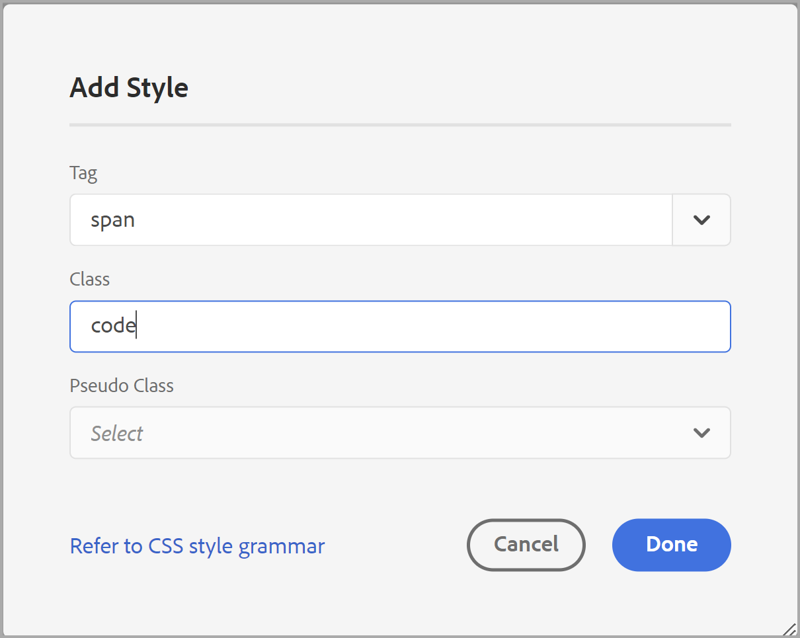

# 일반적인 콘텐츠 스타일 작업 {#work-with-common-styles}

스타일시트에는 PDF 출력에 사용되는 요소의 스타일 정의가 포함되어 있습니다. 샘플 스타일시트로 작업하거나 새 스타일시트를 만들도록 선택할 수 있습니다. 대부분의 경우 OOTB 샘플 스타일시트의 사본을 만들면 빠르게 시작할 수 있습니다.

스타일 편집기는 사용자 인터페이스 뒤에 있는 CSS 코드의 모든 복잡성을 숨기는 WYSIWYG 편집기입니다. 스타일 편집기를 사용하면 원하는 요소의 스타일을 쉽고 빠르게 사용자 지정할 수 있습니다. 스타일은 다음 헤드에 따라 분류됩니다.

* 제목 스타일
* 단락 스타일
* 문자 스타일
* 하이퍼링크 스타일
* 이미지 스타일
* 목록 스타일
* 표 스타일
* Div 스타일
* 페이지 스타일
* 기타 스타일

구조화된 DITA 콘텐츠로 작업할 때 대부분의 DITA 요소에 대한 스타일 매핑이 기본 스타일시트에 적용됩니다. 표준 DITA 요소로 작업하는 경우 스타일 정의를 직접 변경하여 모양과 느낌을 변경할 수 있습니다. 이러한 스타일 정의는 기타 스타일 카테고리에서 사용할 수 있습니다. 자세한 내용은 [다른 스타일을 사용한 작업](#other-styles) 나중에 이 항목을 참조하십시오.

다음 섹션에서는 예제의 양식에서 가장 일반적으로 사용되는 스타일 설정을 다룹니다.

>[!NOTE]
>
>다음 예제에서는 제품과 함께 제공된 샘플 스타일시트를 사용하여 작업한다고 가정합니다.

## 제목 스타일을 사용한 작업 {#heading-styles}

제목 스타일은 컨텐츠에 사용되는 머리글의 모든 기본 스타일을 캡슐화합니다. OOTB는 주제/장 및 부록 제목 머리글에 대한 6개의 기본 제목 스타일과 제목 스타일을 제공합니다. 구조화된 문서에서 H1은 주제 또는 장의 제목을 나타내고 H2에서 H6는 주제/장 내의 하위 주제나 섹션에 사용됩니다. 이 머리글 계층은 해당 제목을 찾을 때마다 컨텐츠에 자동으로 적용됩니다.

>[!NOTE]
>
>자신만의 사용자 지정 제목 스타일을 만들 수 있으며 그러한 스타일을 outputclass를 사용하여 컨텐츠에서 사용할 수 있습니다. 자세한 내용은 [페이지 방향 및 보기 회전 사용](design-page-layout.md#page-orientation-rotation) 예.

### 사용자 정의 장 수준 머리글 만들기 {#create-chapter-level-heading}

책(또는 책 맵)에서는 장 작업을 합니다. 기본 제목 스타일은 사용자 지정 없이 장 수준 제목에 적용할 수 있도록 디자인되었습니다. 그러나 컨텐츠에 특수 제목을 만들려면 반드시 해당 제목을 만들어야 합니다. 예를 들어, 기본값은 `h1.chapter` 제목이 장의 제목에 적용됩니다. 장 제목을 다른 스타일로 표시하려면 `h1.chapter` 스타일. 마찬가지로 장에서 하위 머리글에 대한 사용자 지정 스타일을 만들 수 있습니다. 예를 들어, 두 개 모두에 대해 사용자 지정 스타일을 만들려면nd 및 3rd 장의 머리글 수준 지정을 선택한 다음 새 스타일을 `h2.chatper` 및 `h3.chatper`.

기본 PDF 게시 기능에는 가장 일반적인 스타일에 대한 기본 스타일 정의가 포함되어 있으므로 실수로 스타일을 삭제하더라도 기본 스타일이 콘텐츠에 적용됩니다. 예를 들어, 스타일시트에 h2 스타일에 대한 스타일 정의가 없으면 Native PDF 게시 기능이 h2 컨텐츠에 일부 기본 스타일을 적용합니다.

이 예제에서는 두 번째 수준 장 제목 스타일을 만듭니다.

1. 편집에 필요한 스타일시트를 엽니다.
   >[!NOTE]
   >
   >자세한 내용은 [사전 정의된 스타일이나 새 스타일 사용자 지정](components-pdf-template.md#customize-style) 사용자 지정 또는 편집을 위해 스타일시트를 여는 섹션

1. 에서 **스타일** 목록, 확장 **제목 스타일**.
1. 마우스 오른쪽 단추 클릭 **제목 스타일** 스타일 및 선택 **새 스타일**.
1. 에서 *스타일 추가* 대화 상자, 유지 **태그** 이름 `h2` 을 입력합니다. `chapter` 에서 **클래스** 이름 필드.
1. 클릭 **완료**.

이름이 인 새 제목 스타일 `h2.chapter` 제목 스타일 목록 아래에 만들고 추가됩니다.

스타일을 만들면 스타일 편집기를 사용하여 스타일의 필수 속성을 사용자 지정할 수 있습니다.

### 자동 번호 머리글 만들기 {#auto-number-heading}

가장 일반적으로 사용되는 출력 스타일 중 하나는 자동으로 번호가 매겨지는 제목입니다. 이러한 제목은 장 번호, 주제 및 하위 주제 번호를 나타냅니다. 자동 번호 머리글은 주제 내의 항목 목록에 자동 숫자가 지정되는 목록 스타일과 다릅니다.

이 예제에서는 머리글을 레벨 1에서 레벨 3로 사용자 지정하여 다른 형식의 자동 번호를 사용합니다.

1. 편집에 필요한 스타일시트를 엽니다.

   >[!NOTE]
   >
   >자세한 내용은 [사전 정의된 스타일이나 새 스타일 사용자 지정](components-pdf-template.md#customize-style) 사용자 지정 또는 편집을 위해 스타일시트를 여는 섹션

1. 에서 **스타일** 목록, 확장 **제목 스타일**.

1. 을(를) 선택합니다 **h1** 목록에서 스타일을 지정합니다.
h1 스타일에 대한 속성은 [속성] 패널에 [미리 보기]와 함께 표시됩니다.

   >[!NOTE]
   >
   >[미리 보기] 패널에서는 모든 요소에 적용하는 스타일 업데이트에 대한 실시간 보기를 제공합니다.

1. 을(를) 선택합니다 **자동 번호** 속성을 사용합니다.

   자동 번호 목록에 적용할 수 있는 스타일은 Autonumber 속성 아래에 표시됩니다.

1. 다음 속성을 설정합니다.
   * **스타일**: 다양한 로케일 특정 또는 일반 번호 지정 스타일 중에서 선택합니다. 아랍어, 인도, 데바나가리, 조지아, 십진수, 하부 알파 등의 스타일을 선택할 수 있습니다. 현재 예제에서는 `upper-alpha`.

   * **형식**: 기본 형식은 로 설정되어 있습니다 `<x>`, 여기서 `x` 값은 [스타일] 속성에서 선택한 번호 지정 스타일로 바뀝니다. 예를 들어, `decimal` (1) 스타일, 다음 값 `x` 의 모든 인스턴스에 대해 자동 증분됩니다. `h1` 스타일 및 은 2, 3 등으로 이동합니다. 필드에 사용자 지정 텍스트를 추가하여 제목 스타일 서식을 지정할 수도 있습니다. 예를 들어, 모든 h1 헤딩에 `Chapter`를 입력한 다음 이 필드를 `Chapter <x>`.

   * **문자 삽입**: 형식에 특수 문자를 추가하려면 문자 삽입() 아이콘. 스타일 형식으로 추가할 문자를 선택하고 [삽입]을 클릭합니다. 카테고리 선택 드롭다운 목록에서 선택할 수 있는 다양한 유형의 특수 문자가 있습니다. 예를 들어, 구두점 카테고리에서 오른쪽 포인팅 큰각 큰따옴표(Right-Pointing Double Angle Queta Mark)를 선택합니다.

      

   * **번호 지정 시작 위치**: 번호를 특정 번호부터 시작하려면 해당 값을 제공합니다. 이 예제에서는 기본값 1을(를) 유지합니다.

   * **들여쓰기**: 제목을 들여쓰려면 들여쓰기 값을 설정해야 합니다. 이 예제에서는 0px로 설정합니다.

      >[!NOTE]
      >
      >px(픽셀), pt(포인트), rem, em, %(백분율) 또는 in(인치) 단위로 값을 입력할 수 있습니다.

   * **접두사 너비**: 자동 번호 형식으로 사용 중인 영역입니다. 선택한 스타일 형식을 쉽게 수용할 수 있는 크기로 자동 설정됩니다. 크기를 늘리려면 기본값을 바꿀 수 있습니다.

      이 값을 수동으로 설정할 때는 너비에 영향을 줄 다른 속성을 변경해 보십시오. 예를 들어, 글꼴 크기, 접두사가 있는 형식(장) 또는 접미사(:)를 변경하고 *번호 지정 시작 위치* 속성에 지정할 수 있으며, 최적의 크기를 지정할 다양한 글꼴 속성을 제공합니다.

      이 예제에서는 기본값을 유지합니다.

   * **간격**: 가로 및 세로 간격을 지정합니다. 이 예제에서는 기본값을 유지합니다.

      위의 사용자 지정을 사용하여 스타일은 다음과 같이 사용자 지정됩니다.

      

   * **서식 적용 대상**: [자동 번호] 범주 아래의 속성은 번호 지정 스타일을 정의하는 데 도움이 됩니다. 번호 매기기 스타일 또는 제목 서식 내용에 추가 사용자 지정을 적용하려면 이 필드에서 번호 매기기 또는 단락을 선택할 수 있습니다. [번호 매기기]를 선택하면 [글꼴], [테두리], [레이아웃] 및 [기타 범주]에 대한 변경 내용이 머리글의 번호 매기기 스타일에만 적용됩니다. 그러나 [단락]을 선택하면 제목 컨텐츠에 변경 사항이 적용되고 번호 지정 스타일이 적용되지 않습니다.

   다음 스크린샷에 표시된 출력을 생성하려면 다음 설정을 사용하십시오.

   |**제목 스타일**|**속성**|**값**|**추가 댓글**| | :- | :- | :- | :- | |h1|스타일|십진수|이러한 속성은 자동 번호 범주 아래에 있습니다 | ||형식|`Capter <x>:`|| ||접두사 너비|160px|| ||Font > Text Alignment|Left|Apply Formatting To가 Numbering로 설정되어 있는지 확인합니다.| |h2|스타일|십진수|이러한 속성은 자동 번호 범주 아래에 있습니다 | ||형식|`Section <x>:`|| ||접두사 너비|125px|| ||Font > Text Alignment|Left|Apply Formatting To가 Numbering로 설정되어 있는지 확인합니다.| |h3|스타일|십진수|이러한 속성은 자동 번호 범주 아래에 있습니다 | ||수준 삽입|2|| ||형식|`Section <2>.<x>:`|| ||접두사 너비|125px|| ||Font > Text Alignment|Left|Apply Formatting To가 Numbering로 설정되어 있는지 확인합니다.| ||

   

## 단락 스타일을 사용한 작업 {#paragraph-style}

단락 스타일을 만들어 전체 단락에 특수 서식을 적용할 수 있습니다. 그러나 의사 클래스를 사용하면 텍스트의 특정 부분에만 스타일을 적용할 수 있습니다. 다음 예제에서는 단락 시작표시문자 스타일을 사용하여 단락 스타일을 만듭니다.

### 드롭 단면 스타일을 만듭니다 {#drop-cap-style}

단락의 첫 문자에 단락의 첫 문장이 특별한 스타일을 부여해 주는 단락의 대문자(또는 드롭된 대문자) 스타일이 잡지에 사용됩니다. 기본 PDF 게시 기능을 사용하여 동일한 효과를 얻을 수 있습니다.

다음 예제에서는 드롭 단면 스타일을 만듭니다.

1. 편집에 필요한 스타일시트를 엽니다.

   >[!NOTE]
   자세한 내용은 [사전 정의된 스타일이나 새 스타일 사용자 지정](components-pdf-template.md#customize-style) 사용자 지정 또는 편집을 위해 스타일시트를 여는 섹션

1. 에서 **스타일** 목록, 확장 **단락 스타일**.

1. 을(를) 마우스 오른쪽 단추로 클릭합니다. **단락 스타일** 및 **새 스타일**.

1. 에서 *스타일 추가* 대화 상자, 유지 **태그** 이름을 p로 지정하고 **의사** **클래스** 필드, 선택 `::first-letter`.

1. 클릭 **완료**.

   이름이 인 새 단락 스타일 `::first-letter`  가 생성되어 아래에 추가됩니다. **단락 스타일** 목록.

1. 선택 `::first-letter` p 스타일 아래에서 다음 속성을 설정합니다.

   * **글꼴**: 단락의 첫 번째 편지에 원하는 글꼴을 설정합니다. 예를 들어, 글꼴 패밀리를 500으로 설정하고 글꼴 크기를 30pt로 설정하고 글꼴 색상을 선택합니다.

   * **레이아웃**: 드롭 단면 스타일 주위에 텍스트의 세로 정렬을 설정합니다. 이 예제에서는 세로 정렬을 하단으로 설정합니다.

로서의 `p` 태그가 `
` DITA에서는 outputclass 속성을 사용하여 이 스타일을 명시적으로 추가할 필요가 없습니다. 컨텐츠의 모든 위치 `
` 요소가 사용되면 drop cap 스타일이 자동으로 적용됩니다. 다음 스크린샷에서는 장 제목, 짧은 설명 및 정의 목록 요소의 형식이 드롭 단면 스타일로 지정되지 않았습니다. 단락 스타일만 드롭 단면 스타일로 서식이 지정됩니다.

## 문자 스타일을 사용한 작업 {#char-style}

문자 스타일을 사용하여 콘텐츠 내의 문자 또는 단어 서식을 위한 스타일을 만들 수 있습니다. 예를 들어 인라인 코드나 파일 이름에 사용할 문자 스타일을 만들거나 선택한 컨텐츠에서 여러 스타일 형식을 사용하는 스타일을 만들 수 있습니다.

### 인라인 문자 스타일 만들기 {#inline-char-style}

단락에 인라인 문자 또는 단어의 서식을 지정하는 것은 매우 일반적인 스타일입니다. 인라인 스타일을 만드는 과정에는 두 가지 작업이 포함됩니다. 먼저, 스타일시트에서 새 스타일을 만들고, 두 번째는 을 사용하여 컨텐츠의 스타일을 적용합니다 `outputclass` 속성을 사용합니다.

다음 예제에서는 인라인 문자 스타일을 만듭니다.

1. 편집에 필요한 스타일시트를 엽니다.

   >[!NOTE]
   자세한 내용은 [사전 정의된 스타일이나 새 스타일 사용자 지정](components-pdf-template.md#customize-style) 사용자 지정 또는 편집을 위해 스타일시트를 여는 섹션

1. 에서 **스타일** 목록, 확장 **문자 스타일**.

1. 을(를) 마우스 오른쪽 단추로 클릭합니다. **문자 스타일** 및 **새 스타일**.

1. 스타일 추가 대화 상자에서 **태그** span으로 이름을 지정하고 `BoldItalic` 에서 **클래스** 이름 필드.

   

1. 클릭 **완료**.

   코드라는 새 문자 스타일이 만들어지고 문자 스타일 목록 아래에 추가됩니다.

1. 선택 `span.BoldItalic` 에서 **문자 스타일** 목록을 표시하고 다음 속성을 설정합니다.

   * **글꼴**: 이 섹션에서 모든 글꼴 관련 속성을 사용자 지정할 수 있습니다. 기본적으로 제품에 번들로 제공되는 글꼴이 있습니다. 문자 스타일에 대해 원하는 글꼴을 선택할 수 있습니다. 예제에서는 글꼴 모음을 로 설정합니다. *Serif,* 을(를) 선택합니다. *굵게* 및 *기울임체* Font Style 속성을 클릭합니다. 글꼴 가중치(굵게, 밝은 글꼴), 텍스트 장식(밑줄, 밑줄, 밑줄), 글꼴 크기, 글꼴 색상, 텍스트 정렬 등과 같은 기타 글꼴 속성을 사용자 지정할 수도 있습니다.

      >[!NOTE]
      템플릿의 리소스 섹션에 저장된 템플릿에 글꼴을 추가할 수도 있습니다. 글꼴 추가 및 리소스 작업에 대한 자세한 내용은 [리소스를 사용한 작업](components-pdf-template.md#work-with-resources).

   * **레이아웃**: 높이 및 너비, 여백, 패딩, 정렬 등과 같은 레이아웃 관련 속성을 설정할 수 있습니다.

   * **배경**: 배경 속성을 사용하면 특정 스타일의 배경색 서식을 지정할 수 있습니다. 모든 스타일에 대해 배경색 또는 이미지를 정의할 수 있습니다.

인라인 문자 스타일을 만들면 콘텐츠에 적용해야 합니다. 인라인 코드 스타일을 적용하려면 소스 보기로 이동한 다음 를 추가합니다 `outputclass` 원하는 컨텐츠의 속성:

`outputclass="BoldItalic"`

다음 예제는 실행 중인 텍스트의 다른 위치에 적용되는 굵은 기울임꼴 형식을 보여줍니다.

## 목록 스타일 사용자 지정 {#custom-list-style}

목록 스타일에는 순차 목록과 비순차 목록에 대한 기본 스타일 설정이 포함됩니다. 이러한 목록 스타일을 사용자 지정하여 설명서 요구 사항을 쉽게 충족할 수 있습니다.

다음 예에서는 번호 또는 순서가 지정된 목록 스타일을 사용자 지정합니다.

1. 편집에 필요한 스타일시트를 엽니다.

   >[!NOTE]
   자세한 내용은 [사전 정의된 스타일이나 새 스타일 사용자 지정](components-pdf-template.md#customize-style) 사용자 지정 또는 편집을 위해 스타일시트를 여는 섹션

1. 에서 **스타일** 목록, 확장 **목록 스타일**.

1. 을(를) 선택합니다 **ol** 목록에서 스타일을 지정합니다.

   도구 스타일의 속성은 [속성] 패널에 [미리 보기]와 함께 표시됩니다.

   

1. 을(를) 선택합니다 **고급 서식** 선택 사항입니다.

   확인 메시지가 표시됩니다.

1. 클릭 **예** on *확인* 메시지 열기 **고급 서식** 속성을 사용합니다.

   기본적으로 다음 속성을 사용할 수 있습니다.

   * **수준**: 기본적으로 6가지 수준의 번호 목록이 있습니다. 이 드롭다운에서 선택하는 레벨은 선택한 레벨과 모든 후속 레벨에서 스타일 변경을 제어합니다. 예를 들어 레벨 4를 선택하면 적용하는 모든 스타일 변경 사항이 레벨 4, 5 및 6에 설정됩니다.

   * **목록 스타일 유형**: 선택할 수 있는 목록 번호 지정 스타일이 여러 개 있습니다. 이 목록에는 번호 매기기 목록을 만드는 데 사용되는 로캘별 및 일반 번호 매기기 스타일이 포함되어 있습니다. 일부 목록 스타일 유형은 아랍어, 캄보디아, 데바나가리, 에티오피아, 한글, 히브리어, 일본어, 한국어, 중국어 간체, 우르두 등입니다.

   또한 다음과 같은 고급 서식 속성을 사용하여 작업할 수 있습니다.

   * **숫자 형식**: 기본 형식은 로 설정되어 있습니다 `<x>`, 여기서 `x` 값은 목록 스타일 유형 속성에서 선택한 번호 지정 스타일로 바뀝니다. 예를 들어, `decimal` (1) 스타일, 다음 값 `x` 목록 요소의 모든 인스턴스에 대해 자동 증분이 수행되며, 2, 3 등으로 이동합니다. 필드에 사용자 지정 텍스트를 추가하여 목록 스타일의 서식을 지정할 수도 있습니다. 예를 들어, 모든 첫 번째 수준 목록 스타일에 &quot; 접미사가 붙도록 하려면`)`&quot; &quot; 그런 다음 첫 번째 수준 목록 스타일에 대해 이 필드를 &quot;`<x>)`&quot;.

   * **문자 삽입**: 숫자 형식에 특수 문자를 추가하려면 문자 삽입() 아이콘. 스타일 형식으로 추가할 문자를 선택하고 [삽입]을 클릭합니다. 카테고리 선택 드롭다운 목록에서 선택할 수 있는 다양한 유형의 특수 문자가 있습니다.

   * **수준 삽입**: 숫자 형식에 이전 레벨의 숫자를 포함할 수 있습니다. 예를 들어, 6번째 수준 숫자 포맷의 5번째 레벨의 숫자 포맷을 포함하려면, 삽입 레벨 드롭다운 목록에서 5를 선택합니다. 레벨 삽입 드롭다운에는 이전 레벨의 숫자만 표시되고 다음 레벨은 표시되지 않습니다. 예를 들어 레벨 3에 있는 동안 레벨 삽입 목록에 레벨 1과 2만 표시됩니다.

      

      필요에 따라 번호 형식을 변경하여 목록 값을 표시할 수도 있습니다. 예를 들어 레벨 3에 중첩된 번호 지정 스타일을 사용하는 경우 &quot;`<2>.<x>))`&quot;. 이렇게 하면 목록 번호 2, 마침표 순으로 표시되고 목록 번호 3, 그 다음에 중괄호 두 개가 표시됩니다 `2.3))`.

   * **들여쓰기**: 목록을 들여쓰려면 들여쓰기 값을 설정해야 합니다. 들여쓰기의 모든 변경 사항은 [미리 보기] 패널에서 검토하고 조정할 수 있습니다.

      >[!NOTE]
      px(픽셀), pt(포인트), rem, em, %(백분율) 또는 in(인치) 단위로 값을 입력할 수 있습니다.

   * **접두사 너비**: 숫자 형식으로 사용 중인 영역입니다. 선택한 형식을 쉽게 수용할 수 있는 크기로 자동 설정됩니다. 크기를 늘리려면 기본값을 바꿀 수 있습니다.

      이 값을 수동으로 설정할 때는 너비에 영향을 줄 다른 속성을 변경해 보십시오. 예를 들어, 글꼴 크기, 접두사 또는 접미사가 있는 형식 및 다양한 글꼴 속성을 변경하여 최적의 크기를 지정합니다.

   * **간격**: 목록 번호 형식과 콘텐츠 사이에 가로 간격을 지정합니다. 세로 간격은 두 목록 항목 사이의 간격을 제어합니다.

      다음 스크린샷에서는 각 수준에 대해 사용자 지정된 주문 목록을 보여 줍니다.

      

## 표 스타일을 사용한 작업 {#table-styles}

스타일시트를 사용하여 디자인할 수 있습니다 *n* 표 스타일 수. 표 스타일을 사용하여 전체 표, 특정 행 또는 열을 디자인할 수 있습니다. 셀 수준 스타일링에서 컨트롤을 사용하면 프레젠테이션이 가능한 테이블 스타일을 만들 수 있습니다.

다음 예제에서는 사용자 지정할 수 있는 테이블 스타일 및 다양한 테이블 스타일 옵션을 만드는 방법을 보여 줍니다.

1. 편집에 필요한 스타일시트를 엽니다.

   >[!NOTE]
   자세한 내용은 [사전 정의된 스타일이나 새 스타일 사용자 지정](components-pdf-template.md#customize-style) 사용자 지정 또는 편집을 위해 스타일시트를 여는 섹션

1. 에서 **스타일** 목록에서 마우스 오른쪽 단추를 클릭합니다. **표 스타일** 및 **새 스타일**.

1. 에서 *스타일 추가* 대화 상자, 유지 **태그** 이름 `table` 을 입력합니다. `double-border` 에서 **클래스** 이름 필드.

1. 클릭 **완료**.

   이름이 인 새 테이블 스타일 `table.double-border` 표 스타일 목록 아래에 만들고 추가됩니다.

1. 선택 `table.double-border` 에서 **표 스타일** 목록을 표시하고 다음 속성을 설정합니다.

   * **서식 적용 대상**: 스타일 서식을 전체 테이블, 홀수/짝수 행 또는 열, 첫 번째/마지막 행 또는 열에 적용하도록 선택할 수 있습니다.

      >[!NOTE]
      다음 설정은 **일반** 섹션 **서식 적용 대상** 가 로 설정되어 있습니다. **전체 테이블**.

   * **텍스트 줄바꿈**: 표 주위에 텍스트를 둘러싸는 방법을 선택합니다. 이 기능은 테이블이 다른 블록 수준 요소 내에 있고 표를 블록 요소의 다른 콘텐츠와 함께 렌더링해야 하는 경우에 유용합니다. 포장 옵션은 다음과 같습니다 *왼쪽* 또는 *오른쪽* 정렬 또는 *없음*.

   * **테두리 축소**: 표 테두리의 모양을 선택합니다. [축소]를 선택하면 표 셀 사이에 단일 테두리 선만 그려집니다. 그러나 별도의 스타일의 경우 각 셀 주위에 추가 패딩이 표시됩니다.

      

   * **테두리 간격**: 이 설정은 [테두리 축소]가 [분리]로 설정된 경우에만 사용할 수 있습니다. 이 설정을 사용하여 셀 테두리 사이의 세로 및 가로 간격을 지정할 수 있습니다.

      

      >[!NOTE]
      다음 설정은 **셀** 섹션 **서식 적용 대상** 가 로 설정되어 있습니다. **전체 테이블**.

   * **패딩**: 표 셀 사이에 패딩을 지정합니다. 위쪽, 아래쪽, 왼쪽 및 오른쪽 측면에 대해 다른 패딩 값을 지정할 수 있습니다.

   * **세로 정렬**: 셀 내용에 대해 세로 정렬을 지정합니다. 사용 가능한 옵션은 다음과 같습니다. 위쪽, 중간 및 아래쪽.

   * **테두리 면, 스타일, 색상, 폭, 반경:** 테두리 관련 속성을 지정합니다. 왼쪽 또는 오른쪽과 같은 특정 측면에만 테두리가 있도록 선택할 수 있습니다. 테두리 스타일은 솔리드, 파선, 이중 선 등과 같은 사용 가능한 테두리 스타일을 나열합니다. 색상 팔레트를 사용하여 테두리 색상을 지정합니다. 테두리 너비를 px, pt, rem, em, % 및 단위로 지정할 수 있습니다. 반지름(Radius)은 커브를 정의하여 원형 코너를 만듭니다.

   글꼴, 테두리, 레이아웃, 페이지 매김 및 배경 아래의 다른 속성은 이 항목의 다른 예에서 설명합니다. 에서 선택한 내용에 따라 **서식 적용 대상** 속성을 사용하면 이 값을 전체 테이블이나 선택한 행 또는 열에 적용할 수 있습니다.

   다른 방식으로 형식이 지정된 다른 행이 있는 샘플 테이블의 미리 보기는 다음과 같습니다.

   

## 다른 스타일을 사용한 작업 {#other-styles}

구조화된(DITA) 콘텐츠로 작업하는 경우 거의 모든 DITA 요소에 기본 스타일시트에 스타일 매핑이 있는 것을 볼 수 있습니다. 예: `<shortdesc>` 요소의 스타일은 **기타 스타일** > **.shortdesc** 스타일 정의. 이러한 스타일을 쉽게 사용자 정의할 수 있으며 구조화된 컨텐츠에서 생성된 PDF 출력에 자동으로 적용됩니다. 즉, 다른 사용자 지정 스타일과 달리 `outputclass` 속성에 대한 설명을 포함합니다.

기본적으로 사용할 수 없거나 사용자 지정 요소가 있는 요소에 대해 스타일 정의를 만들려면 스타일시트에서 쉽게 만들 수 있습니다. 구조화된 요소의 이름과 동일한 이름으로 스타일을 만드는 것이 유일한 고려 사항입니다.

다음 예제에서는 새 창의 제목(`wintitle`) 스타일:

1. 편집에 필요한 스타일시트를 엽니다.

   >[!NOTE]
   자세한 내용은 [사전 정의된 스타일이나 새 스타일 사용자 지정](components-pdf-template.md#customize-style) 사용자 지정 또는 편집을 위해 스타일시트를 여는 섹션

1. 에서 **스타일** 목록, 확장 **기타 스타일**.

1. 을(를) 마우스 오른쪽 단추로 클릭합니다. **기타 스타일** 및 **새 스타일**.

1. 에서 *스타일 추가* 대화 상자, 유지 **태그** 이름 *공백* 을 입력합니다. `wintitle` 에서 **클래스** 이름 필드.

   로서의 `wintitle` 은 인식된 DITA 요소 이름이고, 스타일 정의는 자동으로 `<wintitle>` 요소를 소스에 추가합니다.

1. 클릭 **완료**.

   이름이 인 새 스타일 `.wintitle` 가 생성되어 아래에 추가됩니다. **기타 스타일** 목록.

1. 에서 .wintitle 을 선택합니다. **기타 스타일** 목록을 표시하고 필요에 따라 속성을 설정합니다.

다음 스크린샷에는 &quot;기본 컨트롤&quot; 텍스트에 적용되는 wintitle 스타일이 표시됩니다.

