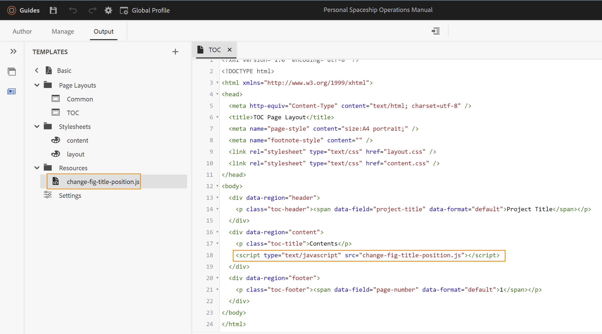

# JavaScript를 사용하여 콘텐츠 또는 스타일 작업

기본 PDF 게시 기능을 사용하면 최종 PDF이 생성되기 전에 JavaScript를 실행하여 콘텐츠에 적용된 콘텐츠 또는 스타일을 조작할 수 있습니다. 이 기능을 사용하면 최종 출력이 생성되는 방식을 완벽하게 제어할 수 있습니다. 예를 들어, 다른 PDF에 있는 PDF 출력에 법적 고지 정보를 추가할 수 있습니다. JavaScript를 사용하면 기본 컨텐츠에 대해 PDF이 생성되면 최종 PDF이 생성되기 전에 법적 고지 정보를 추가할 수 있습니다.\
JavaScript 실행을 지원하기 위해 기본 PDF 게시 기능을 사용하면 다음과 같은 콜백 함수를 사용할 수 있습니다.

* `window.pdfLayout.onBeforeCreateTOC(callback)`: 이 콜백 함수는 TOC가 생성되기 전에 실행됩니다.
* `window.pdfLayout.onBeforePagination(callback)`: 이 콜백 함수는 TOC가 생성된 후에 실행되지만, PDF에 페이지 나누기가 추가되기 전에 실행됩니다.
* `window.pdfLayout.onAfterPagination(callback)`: 이 콜백 함수는 TOC와 페이지 나누기가 PDF에 추가된 후에 실행됩니다.

>[!NOTE]
>
>내부적으로 이러한 콜아웃 기능에 대해 실행 시퀀스가 유지됩니다. 먼저 onBeforeCreateTOC가 실행되고, 그 다음에 onBeforePagination이 실행되며, 마지막으로 onAfterPagination이 실행됩니다.

수행할 컨텐츠 또는 스타일 수정 유형에 따라 사용할 콜백 함수를 선택할 수 있습니다. 예를 들어 컨텐츠를 추가하려면 목차가 생성되기 전에 이 작업을 수행하는 것이 좋습니다. 마찬가지로, 일부 스타일링 업데이트를 만들려면 페이지 매김 전이나 후에 수행할 수 있습니다.

다음 예제에서는 그림 제목의 위치가 이미지 위쪽에서 이미지 아래로 변경됩니다. 이를 위해 사전 설정에서 JavaScript 실행 옵션을 활성화해야 합니다. 이렇게 하려면 다음 단계를 수행합니다.

1. 편집할 사전 설정을 엽니다.
1. 로 이동합니다. **고급** 탭.
1. 을(를) 선택합니다 **JavaScript 활성화** 선택 사항입니다.
1. 사전 설정을 저장하고 닫습니다.

다음으로, 다음 코드를 사용하여 JavaScript 파일을 만들고 템플릿의 Resources 폴더에 저장합니다.

```css
...
/*
* DITA only allows the figure title to be placed above images 
* This JavaScript code is used to move the figure title below the image
* */
window.addEventListener('DOMContentLoaded', function () {
    window.pdfLayout.onBeforeCreateTOC(function() {
        var titleNodes = document.querySelectorAll('.fig > .title')
        for (var i = 0; i < titleNodes.length; i++) {
            var titleNode = titleNodes[i]
            var figNode = titleNode.parentNode
            var imageNode = figNode.querySelector('.image')
            if(imageNode && imageNode.parentNode !== figNode) {
              imageNode = imageNode.parentNode
            }
            if (figNode && imageNode && imageNode.parentNode === figNode) {
                figNode.insertBefore(imageNode, titleNode)
            }
        }
    })
});
...
```

>[!NOTE]
>
>다음 `window.addEventListener('DOMContentLoaded', function ()` 함수는 콜백 함수를 사용하기 전에 호출해야 합니다.

그런 다음 PDF 출력을 생성하는 데 사용되는 템플릿 파일에서 이 스크립트를 호출해야 합니다. 이 예제에서는 TOC 템플릿에 추가합니다. 다음을 확인합니다. `<script>` 태그는 사전 정의된 내에 추가됩니다 `<div>` 태그 내에 있어야 합니다 `<body>` 태그에 가깝게 포함했습니다. 에 추가하면 `<head>` 태그 또는 외부 `<body>` 태그로 묶으면 스크립트가 실행되지 않습니다.



이 코드를 사용하여 생성된 출력과 템플릿은 이미지 아래에 그림 제목을 표시합니다.


