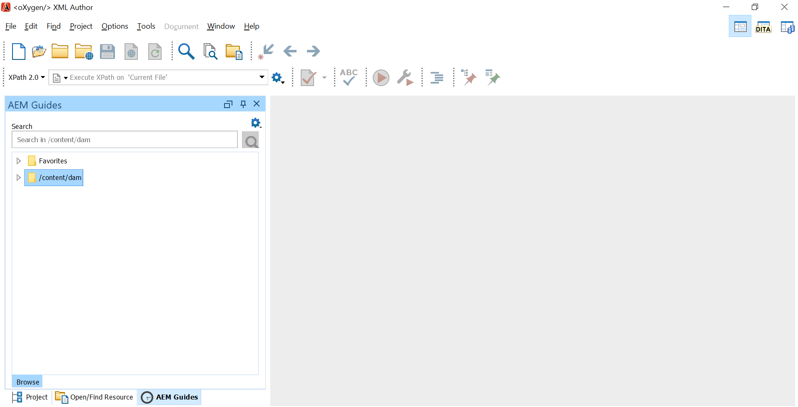
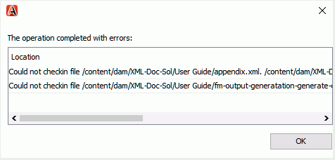
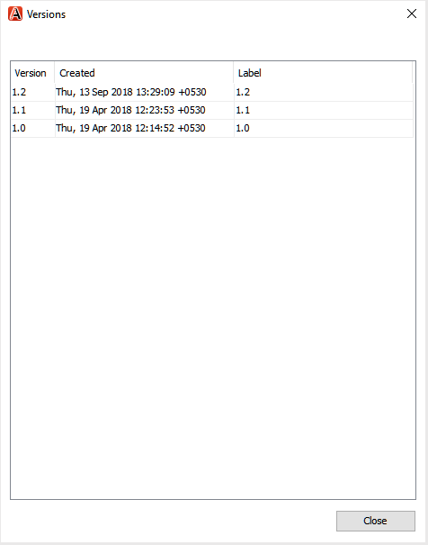
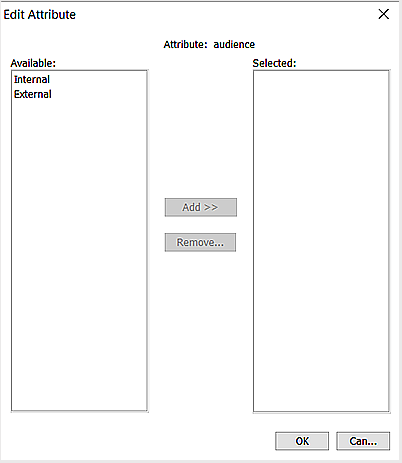

# Adobe Experience Manager 안내서를 위한 Oxygen 플러그인 {#id1645H6010Q5}

Adobe Experience Manager 안내서용 산소 플러그인 \(나중에 안내서에서 AEM 안내서용 산소 플러그인\)을 사용하면 Oxygen XML 작성자를 컨텐츠 작성 및 관리를 위한 Adobe Experience Manager \(AEM\) 리포지토리와 연결할 수 있습니다. 플러그인을 사용하여 파일을 검색, 검색할 수 있습니다. 체크 아웃 및 체크 인 파일 AEM 리포지토리에서 폴더 및 파일을 업로드합니다. 데스크톱 응용 프로그램의 AEM 안내서 패널에서는 원하는 폴더 \(AEM 저장소\)를 즐겨찾기 폴더 목록에 표시하여 빠르게 액세스할 수 있습니다. 또한 AEM 웹 인터페이스에 패키지를 설치하고 AEM 웹 인터페이스에서 직접 Oxygen XML Author에서 DITA 파일을 열 수 있습니다.

## 다운로드 및 설치 {#id1826M0L0PUI}

AEM 안내서용 Oxygen 플러그인은 Adobe 소프트웨어 배포 포털을 통해 사용할 수 있습니다. Experience Manager 탭에서 &quot;oxygen&quot;을 검색한 다음 플러그인 설치 관리자를 [Adobe 소프트웨어 배포 포털](https://experience.adobe.com/#/downloads/content/software-distribution/en/general.html).

>[!NOTE]
>
>특정 Adobe Experience Manager 안내서의 릴리스 노트에서 Oxygen Connector 버전 호환성을 확인하십시오.

설치 프로그램이 설치되면 Oxygen XML 작성자가 설치된 로컬 시스템에 설치합니다. 설치 프로세스를 시작하기 전에 시스템이 AEM Guides용 Oxygen 플러그인을 설치하기 위한 기술 요구 사항을 충족하는지 확인해야 합니다.

### 기술 요구 사항

- Oxygen XML 작성자 버전 24.1

- Adobe Experience Manager 안내서 버전 3.4 이상

- Adobe Experience Manager 버전 6.5 서비스 팩 10, 11, 12 및 13

- Oxygen XML 작성자 버전 24.1에서 지원되는 운영 체제

- Java 개발 키트
   - Oracle SE 8 JRE 1.8

### Windows에 플러그인 설치

>[!IMPORTANT]
>
>시스템에 이전 버전의 플러그인이 설치되어 있는 경우 설치 프로세스를 시작하기 전에 플러그인을 제거해야 합니다. 자세한 내용은 **패키지 제거** 의 섹션 [패키지 작업 방법](https://helpx.adobe.com/kr/experience-manager/6-4/sites/administering/using/package-manager.html) 제거 지침에 대한 문서.

Oxygen XML 작성자가 설치된 시스템에서 다음 단계를 수행합니다.

1. 설치 관리자 시작 `.exe` 파일.

   설치 마법사의 시작 화면이 나타납니다.

1. 클릭 **다음** Oxygen XML Author의 .exe 파일을 사용할 수 있는 위치로 이동합니다.

1. 파일을 선택하고 **열기**.

   선택한 파일의 위치가 설치 마법사에 추가됩니다.

1. **다음**&#x200B;을 클릭합니다.

1. 클릭 **설치**.

1. 클릭 **완료** 설치 마법사를 닫으려면 다음을 수행하십시오.
1. Oxygen XML 작성자를 시작합니다.

   AEM 안내선 패널은 Oxygen XML 작성자에 표시됩니다.

   

   >[!NOTE]
   >
   >AEM 안내서 패널이 표시되지 않으면 문제 해결 섹션의 해결 방법을 참조하십시오.[누락된 AEM 안내선 패널](#id192BH200ZAX).


### Mac에 플러그인 설치

>[!IMPORTANT]
>
>시스템에 이전 버전의 플러그인이 설치되어 있는 경우 설치 프로세스를 시작하기 전에 플러그인을 제거해야 합니다. 자세한 내용은 **패키지 제거** 의 섹션 [패키지 작업 방법](https://helpx.adobe.com/kr/experience-manager/6-4/sites/administering/using/package-manager.html) 문서 제거 지침.

Oxygen XML 작성자가 설치된 시스템에서 다음 단계를 수행합니다.

1. 시스템에서 플러그인의 .dmg 파일을 찾습니다.

1. .dmg 파일을 두 번 클릭하여 파일 내용을 엽니다.

   .dmg 파일에는 aem-connector-x.x 폴더와 aem-connector-x.x-setup 파일이 포함되어 있습니다.

   >[!NOTE]
   >
   >파일 이름에서 x.x는 플러그인의 버전 번호입니다.

1. Oxygen XML Author의 플러그인 폴더에서 aem-connector-x.x 폴더를 복사합니다.
1. aem-connector-x.x-setup 파일을 두 번 클릭하여 설치 프로그램을 시작합니다.

1. Oxygen XML 작성자를 시작합니다.

   AEM 안내선 패널은 Oxygen XML 작성자에 표시됩니다.

   

   >[!NOTE]
   >
   >AEM 안내서 패널이 표시되지 않으면 문제 해결 섹션의 해결 방법을 참조하십시오.[누락된 AEM 안내선 패널](#id192BH200ZAX).


### AEM 웹 인터페이스에서 문서 편집 기능을 사용하도록 설정할 패키지를 설치합니다 {#id182CE0Q0TY4}

작성자는 AEM 웹 인터페이스에서 직접 Oxygen XML Author에서 DITA 맵이나 주제를 열고 편집할 수 있습니다. AEM 웹 인터페이스에서 이 기능을 활성화하려면 AEM 관리자가 AEM 작성 인스턴스에 패키지를 설치해야 합니다.

AEM 관리자는 다음 단계를 수행하여 패키지를 설치합니다.

1. IT 팀에서 패키지의 .zip 파일을 가져옵니다.
1. AEM 인스턴스에 로그인합니다. *\(관리자로\)* CRX 패키지 관리자로 이동합니다. 패키지 관리자에 액세스할 기본 URL은 다음과 같습니다

   `http://<server name>:<port>/crx/packmgr/index.jsp`

   패키지 관리자는 로컬 AEM 설치에서 패키지를 관리합니다. 패키지 관리자 작업에 대한 자세한 내용은 [패키지 작업 방법](https://experienceleague.adobe.com/docs/experience-manager-cloud-service/content/implementing/developer-tools/package-manager.html?lang=en) ( AEM 설명서 참조).

   

1. 산소 패키지를 업로드하려면 **패키지 업로드**.
1. 패키지 업로드 대화 상자에서 1단계에서 다운로드한 Oxygen 패키지 파일로 이동한 후 확인을 클릭합니다.

   패키지가 AEM 인스턴스에 업로드됩니다.

1. 설치 프로세스를 시작하려면 **설치**.

   

1. 패키지 설치 대화 상자에서 **설치**.
1. 설치가 완료되면 CRX 패키지 관리자의 왼쪽 위 모서리에 있는 홈 단추를 클릭합니다.
1. 자산 폴더에서 DITA 파일을 선택합니다.

   **산소에서 편집** 선택 사항은 도구 모음에서 사용할 수 있습니다. 이 옵션 사용에 대한 자세한 내용은 [AEM 웹 인터페이스의 Oxygen XML Author에서 DITA 주제를 엽니다.](#id182CE0I905Z).

   >[!NOTE]
   >
   >다음 **산소에서 편집** 옵션 은 DITA 주제 하나를 선택하면 표시됩니다. 여러 항목을 선택하면 옵션이 표시되지 않습니다.


## AEM 안내서용 산소 플러그인 구성 {#id1826KF00AHS}

플러그인을 다운로드하여 설치한 후에는 플러그인으로 작동하도록 다음 항목을 구성해야 합니다.

- **웹 인증 설정**: AEM Guides 플러그인의 SSO 인증 설정.
- **일반 설정**: 플러그인에 대한 연결 설정(예: AEM 서버 URL, 로그인 세부 정보 등).
- **속성 사용자 지정을 프로파일링하는 기본 설정**: 이 구성은 설명서 세트의 프로파일링 속성 구성표에 필요합니다.

### 웹 인증 설정

JxBrowser는 Oxygen 커넥터 플러그인에 의한 SSO 인증에 사용됩니다. 크롬 기반 브라우저입니다. 비공개 API에 대한 java 9+ 액세스 권한이 필요하며 JxBrowser에 이 액세스 권한을 명시적으로 부여해야 합니다. 자세한 내용은 [JxBrowser 문제 해결](https://jxbrowser-support.teamdev.com/docs/guides/troubleshooting/issues.html).

지정된 파일을 업데이트하여 AEM Guide용 Oxygen Plugin에서 웹 인증 설정을 구성합니다.

>[!NOTE]
>
>파일을 업데이트하기 전에 파일을 백업하십시오.

**Mac 및 Oxygen 24.1용**

env.sh에서 다음 줄을 추가합니다.

```java
--illegal-access=permit\
--add-opens=java.desktop/javax.swing.plaf.basic=ALL-UNNAMED\
--add-exports=javafx.controls/com.sun.javafx.scene.control=ALL-UNNAMED\
--add-exports=javafx.graphics/com.sun.javafx.stage=ALL-UNNAMED\
--add-exports=javafx.graphics/com.sun.javafx.scene=ALL-UNNAMED\
--add-exports=javafx.graphics/com.sun.javafx.scene.traversal=ALL-UNNAMED\
--add-exports=javafx.graphics/com.sun.javafx.tk=ALL-UNNAMED\
--add-exports=javafx.graphics/com.sun.glass.ui=ALL-UNNAMED\
--add-opens=javafx.graphics/com.sun.glass.ui=ALL-UNNAMED\
--add-opens=javafx.graphics/javafx.stage=ALL-UNNAMED\
--add-opens=javafx.graphics/com.sun.javafx.tk.quantum=ALL-UNNAMED\
--add-exports=java.desktop/sun.awt=ALL-UNNAMED\
--add-opens javafx.swing/javafx.embed.swing=ALL-UNNAMED
```

oxygenAuthor.sh에 다음 줄 추가

```java
-Djdk.module.illegalAccess=permit\-Djava.ipc.external=true\
```

**Windows 및 Oxygen 24.1용**

env.bat에서 다음 줄을 추가합니다

```java
--illegal-access=permit --add-opens=java.desktop/javax.swing.plaf.basic=ALL-UNNAMED --add-exports=javafx.controls/com.sun.javafx.scene.control=ALL-UNNAMED --add-exports=javafx.graphics/com.sun.javafx.stage=ALL-UNNAMED --add-exports=javafx.graphics/com.sun.javafx.scene=ALL-UNNAMED --add-exports=javafx.graphics/com.sun.javafx.scene.traversal=ALL-UNNAMED --add-exports=javafx.graphics/com.sun.javafx.tk=ALL-UNNAMED --add-exports=javafx.graphics/com.sun.glass.ui=ALL-UNNAMED --add-opens=javafx.graphics/com.sun.glass.ui=ALL-UNNAMED --add-opens=javafx.graphics/javafx.stage=ALL-UNNAMED --add-opens=javafx.graphics/com.sun.javafx.tk.quantum=ALL-UNNAMED --add-exports=java.desktop/sun.awt=ALL-UNNAMED --add-opens javafx.swing/javafx.embed.swing=ALL-UNNAMED
```

oxygenAuthor.bat에 다음 줄을 추가합니다

```java
-Djdk.module.illegalAccess=permit -Djava.ipc.external=true
```

>[!NOTE]
>
>Mac용 oxyauthor.sh 및 Windows용 oxygenAuthor.bat를 관리자로 실행해야 합니다.

### 일반 설정

다음 단계를 수행하여 Adobe Experience Manager 안내서를 위한 Oxygen Plugin에서 연결 설정을 구성합니다.

1. AEM 안내선 패널에서 설정 아이콘을 클릭한 다음 **설정**.

   

1. 다음 세부 정보를 지정합니다.
   - **서버 URL**: AEM 서버의 URL(예:

      ```http
      http[s]://<host>:<port>
      ```

      위의 URL에서 AEM 서버가 배포되는 서버의 호스트 이름과 포트를 지정합니다.

      >[!IMPORTANT]
      >
      >AEM 서버가 포트 80 또는 443에 배포된 경우 URL에 지정할 필요가 없습니다.

   - **인증:** 선택 **기본 \(사용자 이름/암호\)** 또는 **웹 인증**. 선택할 경우 **기본** 인증을 입력해야 합니다. **사용자 이름** 및 **암호** 기본 설정 대화 상자에서 다음을 수행합니다.

      웹 인증을 선택하면 AEM 로그인 화면이 표시됩니다. 로그인 자격 증명을 입력하고 **로그인** 버튼을 클릭합니다. 성공적으로 로그인하면 AEM 로그인 화면이 닫히고 AEM 안내서 패널에 AEM 서버의 파일 목록이 표시됩니다.

   - **연결 시간 초과**: 클라이언트가 AEM 서버의 응답을 기다리는 시간(초)을 지정합니다. 지정된 시간 내에 서버로부터 응답을 받지 못하면 요청이 종료됩니다. 기본값은 20초입니다.

   - **로컬 폴더**: 체크 아웃 후 AEM 저장소의 파일이 저장되는 로컬 시스템의 위치입니다. 드라이브에 없는 위치를 지정하면 플러그인이 해당 위치를 만듭니다.
   - **체크 아웃할 때 파일 열기**: 선택한 경우 체크 아웃에서 파일을 엽니다.
   - **체크 인할 때 파일 닫기**: 선택한 경우 체크 인 시 파일을 닫습니다. 파일을 닫기 전에 버전 설명을 지정할 수 있는 팝업이 표시됩니다.
   - **파일을 닫을 때 체크 인 대화 상자 표시**: 선택한 경우 파일을 닫을 때 팝업이 표시됩니다. 팝업에서 체크 인하거나 체크 인하지 않고 파일을 닫도록 선택할 수 있습니다.
   - **열 때 자동 체크 아웃 파일**: 선택한 경우 파일을 두 번 클릭하면 자동으로 체크 아웃되어 편집을 위해 열립니다. 파일이 이미 체크 아웃된 경우 간단히 열어 편집할 수 있습니다. 이 옵션을 선택하지 않은 경우 잠금이 없는 파일을 열면 읽기 전용 모드로 열립니다.
1. **확인**&#x200B;을 클릭합니다.

### 속성 사용자 지정을 프로파일링하는 기본 설정 {#id1827K0D0OHT}

AEM 저장소의 DITA 주제와 연관된 프로파일링 속성을 사용하도록 Oxygen XML Author에서 기본 설정을 구성해야 합니다.

프로파일링 속성을 구성하려면 다음 단계를 수행합니다.

1. 산소 XML 작성기에서 **옵션** \> **기본 설정**.
1. 에서 **문서 유형 연결** 탭, 선택 **DITA**&#x200B;를 클릭한 다음 **확장**.

   

1. 에서 **Classpath** 탭에서 com.adobe.o2.connector를 선택합니다. **ID가 있는 플러그인의 부모 클래스 로더 사용** 드롭다운.

   

1. 에서 **확장** 탭에서 다음 사항을 변경합니다.
1. 
   - 클릭 **선택** 다음 **작성자 확장 상태 수신기** 아래에 **개별 확장** 및 에서는 CustomAuthorExtensionStateListener - com.adobe.o2.framework.extn을 선택합니다. **클래스** 목록. **확인**&#x200B;을 클릭합니다.
- 클릭 **선택** 다음 **작성자 사용자 지정 속성 값 편집기** 아래에 **개별 확장** 을 선택하고 의 CustomValueEditor - com.adobe.o2.framework.extn을 선택합니다. **클래스** 목록. **확인**을 클릭합니다.
다음 스크린샷은 구성된 **확장** DITA 주제 탭:

   

1. 클릭 **확인** 모든 대화 상자에서 변경 내용을 저장합니다.

### DITA 맵 확장 구성

AEM 웹 인터페이스에서 직접 Oxygen XML Author에서 맵 파일을 열 수 있도록 하려면 DITA 맵 확장 구성이 필요합니다. 이러한 구성은 이전 절차에서 수행되는 프로파일링 속성 구성과 유사합니다.

다음 단계를 수행하여 DITA 맵 확장을 구성합니다.

1. 산소 XML 작성기에서&#x200B;**옵션** \> **기본 설정**.
1. 에서 **문서 유형 연결** 탭, 선택 **DITA 맵**&#x200B;를 클릭한 다음 **확장**.
1. 에서 **Classpath** 탭에서 com.adobe.o2.connector를 선택합니다. **ID가 있는 플러그인의 부모 클래스 로더 사용** 드롭다운.
1. 에서 **확장** 탭에서 다음 사항을 변경합니다.
1. 
   - 클릭 **선택** 다음 **작성자 확장 상태 수신기** 아래에 **개별 확장** 및 에서는 CustomDITAMapAuthorExtensionStateListener - com.adobe.o2.framework.extn을 선택합니다. **클래스** 목록. **확인**&#x200B;을 클릭합니다.
- 클릭 **선택** 다음 **작성자 사용자 지정 속성 값 편집기** 아래에 **개별 확장** 을 선택하고 의 CustomValueEditor - com.adobe.o2.framework.extn을 선택합니다. **클래스** 목록. **확인**&#x200B;을 클릭합니다.
- *\(선택 사항\)* 맵 파일을 여는 동안 참조를 확인하지 않으려면 다음 추가 구성을 수행해야 합니다.

   클릭 **선택** 다음 **참조 확인자**&#x200B;아래에 **개별 확장** 및 에서 CustomDITAMapReferenceResolver - com.adobe.o2.framework.extn 을 선택합니다. **클래스** 목록. **확인**&#x200B;을 클릭합니다.

   다음 스크린샷은 구성된 **확장** 탭:

   

1. 클릭 **확인** 모든 대화 상자에서 변경 내용을 저장합니다.

## AEM 안내서를 위한 Oxygen 플러그인 작업 {#id1826JG00WY4}

### AEM 안내서 패널

다음 화면에는 AEM 안내서 패널이 표시됩니다.


**A**\) 검색 막대를 표시합니다.

**B**\) 즐겨찾기 폴더를 표시합니다. 기본적으로 비어 있습니다. AEM 리포지토리의 폴더를 즐겨찾기로 추가할 수 있습니다. 즐겨찾는 폴더가 여기에 표시됩니다.

**C**\) DAM 폴더에 AEM 저장소가 표시됩니다. 폴더 보기를 확장하거나 축소할 수 있습니다.

**D**\) 설정 \(톱니바퀴\) 아이콘에 다음 옵션이 있습니다.

- **Connect**: AEM 서버에 연결하려면 이 옵션을 선택합니다. Oxygen XML 작성자가 AEM 서버에 연결되어 있으면 옵션이 비활성화됩니다.
- **새로 고침**: AEM 저장소에서 파일 및 폴더의 최신 상태를 가져오려면 이 옵션을 선택합니다.

   >[!NOTE]
   >
   >파일을 새로 고치기 전에 파일을 저장했는지 확인합니다. 선택 시 **새로 고침** 옵션을 선택하면 파일을 새로 고치기 전에 파일을 저장하라는 경고가 표시됩니다. 파일을 저장하지 않은 경우 **취소** 그리고 그들을 구해요

- **설정**: 이 옵션을 사용하여 플러그인의 일반 환경 설정 대화 상자를 열 수 있습니다.
- **로그아웃**: AEM 서버 연결을 닫으려면 이 옵션을 선택합니다. 이 옵션은 웹 인증 모드를 사용하는 경우에만 사용할 수 있습니다.

### 컨텍스트 메뉴 함수

AEM 안내서용 산소 플러그인 기능은 AEM 저장소의 폴더나 파일을 마우스 오른쪽 단추로 클릭할 때 사용할 수 있습니다. 폴더에 사용할 수 있는 기능은 파일과 다릅니다. 다음은 AEM 안내서 컨텍스트 메뉴에 있는 Oxygen Plugin의 전체 함수 목록입니다.

- **열기**: 선택한 파일을 열거나 선택한 폴더를 확장합니다.
- **여는 위치**: 선택한 파일을 AEM 안내서의 웹 편집기, 맵 대시보드 또는 맵 편집기에서 열 수 있습니다. 이러한 옵션에 대한 자세한 내용은 [AEM 안내서 편집기에서 파일 열기](#id195GH0V30KX).
- **체크아웃**: AEM 저장소에서 파일을 체크 아웃합니다. 자세한 내용은 [체크 아웃 파일](#id195HC020TS4).
- **종속 항목을 통한 체크아웃**: 직접 참조가 있는 파일을 체크 아웃합니다. 자세한 내용은 [체크 아웃 파일](#id195HC020TS4).
- **읽기 전용 종속 항목을 사용한 체크아웃**: 선택한 파일과 종속 파일을 체크 아웃합니다. 종속 파일은 변경할 수 없습니다. 자세한 내용은 [체크 아웃 파일](#id195HC020TS4).
- **체크 아웃 취소**: 체크 아웃된 파일을 취소하고, 편집기에서 파일을 닫고, 변경 사항을 서버에 저장된 파일의 마지막 버전으로 되돌립니다.
- **새로 고침**: 파일의 경우 AEM 저장소에서 파일의 최신 복사본을 가져옵니다. 폴더의 경우 폴더 구조와 파일 상태를 가져옵니다. 즉, 파일이 추가되면 AEM 안내서 보기에 표시됩니다. 또한 AEM 서버에서 파일을 체크 아웃한 경우 Oxygen Author에서 새로 고침을 수행하면 파일이 체크 아웃된 것으로 표시됩니다. 그러나 이 경우 *AEM 안내서에서 체크 아웃된 파일* 보기.
- **체크 아웃된 파일 새로 고침**: 에서 체크 아웃된 파일 목록을 새로 고칩니다. *AEM 안내서에서 체크 아웃된 파일* 보기. AEM 서버에서 파일을 체크 아웃한 경우 새로 고침을 수행하면 체크 아웃된 파일의 목록이 업데이트됩니다 *AEM 안내서에서 체크 아웃된 파일* 보기. 그러나 새 파일이 추가되었거나 파일의 상태가 변경된 경우에는 AEM 안내서 트리 보기에서 업데이트되지 않습니다. AEM에서 파일의 상태를 업데이트하려면 새로 고침을 수행해야 합니다.
- **체크인**: 체크 아웃한 파일을 체크 인합니다. 자세한 내용은 [파일 체크 인](#id182CF0J0FHS).
- **종속 항목을 통한 체크인**: 종속 파일이 있는 파일을 체크 아웃한 경우 이 옵션은 종속 파일과 함께 기본 파일을 체크 인합니다. 자세한 내용은 [파일 체크 인](#id182CF0J0FHS).
- **폴더 만들기**: AEM 저장소에 폴더를 만듭니다. 이 옵션은 폴더 수준에서만 사용할 수 있습니다.
- **파일 업로드\**: 단일 또는 여러 파일을 업로드합니다. 자세한 내용은 [파일 및 폴더 업로드](#id195HC03F03J).
- **종속 항목이 있는 업로드**: DITA 파일 \(XML, DITA, Book map 또는 DITA 맵\)을 해당 종속 파일과 함께 업로드합니다. 자세한 내용은 [파일 및 폴더 업로드](#id195HC03F03J).
- **폴더 업로드**: AEM 리포지토리에서 폴더를 업로드합니다. 자세한 내용은 [파일 및 폴더 업로드](#id195HC03F03J).
- **즐겨찾기에 추가**: 폴더에 폴더 추가 *즐겨찾기* [AEM 안내서] 패널의 폴더. AEM에서 파일 및 파일 상태를 쉽게 동기화할 수 있도록 작업 폴더를 여기에 추가하는 것이 좋습니다.
- **즐겨찾기에서 제거**: 에서 폴더 제거 *즐겨찾기*. 자세한 내용은 [즐겨찾기 추가 또는 제거](#id195HC04405P).
- **메타데이터 보기**: DITA 클래스, 문서의 제목, 유형, UUID 및 파일과 연관된 기타 정보와 같은 메타데이터를 표시합니다. 자세한 내용은 [파일의 메타데이터 보기](#id195GHN0H05C).
- **버전 보기**: 파일의 버전 기록을 표시합니다. 자세한 내용은 [파일의 버전 기록 보기](#id195GI000D5Q).

### Oxygen XML 작성기에서 파일 열기 {#id195GHJ0A0UB}

AEM 저장소에 연결되면 Oxygen XML 작성기에서 편집할 파일을 열 수 있습니다. 다음 단계를 수행하여 Oxygen XML 작성기에서 편집할 파일을 엽니다.

1. [AEM 안내선] 패널에서 편집할 파일을 마우스 오른쪽 단추로 클릭합니다.

1. 선택 **열기** 컨텍스트 메뉴에서 을 클릭합니다.

   Oxygen XML 작성자 편집기에서 파일이 열립니다.

   

   파일의 탭 위에 마우스 포인터를 두면 해당 UUID와 함께 서버 경로가 표시됩니다. 위의 스크린샷에서는 문서의 UUID가 강조 표시됩니다.


을(를) 선택한 경우 **열 때 자동 체크 아웃 파일** 옵션 \(기본 설정 대화 상자\)를 선택한 다음 파일을 열면 파일이 자동으로 체크 아웃되고 편집할 수 있습니다. 파일을 열려면 파일 이름을 두 번 클릭하거나 파일 이름을 마우스 오른쪽 단추로 클릭하고 **열기** 컨텍스트 메뉴에서 을 클릭합니다. 이 옵션을 선택하지 않으면 파일이 읽기 전용 모드로 열립니다.

>[!NOTE]
>
>파일을 두 번 클릭하여 열 수도 있습니다.

### AEM 안내서 편집기에서 파일 열기 {#id195GH0V30KX}

AEM 안내서에서 사용할 수 있는 편집기를 사용하려면 컨텍스트 메뉴에서 필요한 옵션을 선택하여 사용할 수 있습니다. Oxygen XML 작성자 편집기 대신 AEM 안내서 편집기를 사용하려면 다음 단계를 수행하십시오.

1. [AEM 안내선] 패널에서 편집할 파일을 마우스 오른쪽 단추로 클릭합니다.

1. 선택 **여는 위치** 컨텍스트 메뉴에서 다음 옵션 중에서 선택합니다.

   - **웹 항목 편집기**: 여는 파일이 .xml 또는 .dita 파일인 경우 웹 편집기에서 편집할 수 있도록 열 수 있습니다. 을(를) 선택합니다 **웹 항목 편집기** 웹 편집기에서 편집할 선택한 파일을 여는 옵션.

   - **맵 대시보드**: 맵 대시보드에서 .ditamap 파일을 편집하도록 선택할 수 있으며 맵 파일에서 다양한 작업을 수행할 수 있습니다. 이러한 작업은 사용자가 속한 역할/그룹에 따라 다릅니다.

   - **웹 DITA 맵 편집기**: 맵 편집기에서 편집할 .ditamap 파일을 열려면 이 옵션을 선택합니다. DITA 맵 편집기 옵션을 사용하여 주제를 추가하거나 제거하고 관계 테이블을 추가하고 맵에서 다른 작업을 수행할 수 있습니다.


### 체크 아웃 파일 {#id195HC020TS4}

파일을 체크 아웃하면 시스템에 로컬로 저장되고 AEM 리포지토리에서 편집할 수 있도록 잠깁니다. 파일을 체크 아웃하려면 다음 단계를 수행합니다.

1. [AEM 안내서] 패널에서 파일을 마우스 오른쪽 단추로 클릭합니다.
1. 다음 옵션 중 하나를 선택합니다.
   - **체크아웃:** AEM 저장소에서 파일을 체크 아웃하여 편집할 수 있도록 합니다.
   - **종속 항목을 통한 체크아웃**: 직접 참조가 있는 파일을 체크 아웃합니다. 이 옵션을 사용하여 상위 및 하위 페이지를 변경할 수 있습니다. AEM 안내서용 산소 플러그인 은 한 수준의 종속 항목 확인을 지원합니다. 예를 들어, 참조 항목 A와 주제 A는 주제 B를 참조합니다. 맵 A를 체크 아웃하면 TOC 계층의 해당 수준에 관계없이 주제 A가 체크 아웃됩니다. 하지만 주제 B는 맵 A에서 직접 연결되어 있지 않으므로 체크 아웃하지 않습니다.
   - **읽기 전용 종속 항목을 사용한 체크아웃**: 파일을 체크 아웃하고 해당 종속 파일을 로컬 컴퓨터에 읽기 전용 복사본으로 다운로드합니다. 종속 파일은 변경할 수 없습니다.

을(를) 선택한 경우 **체크 아웃에서 파일 열기** 옵션 \(환경 설정 대화 상자\)를 선택한 다음 파일을 체크 아웃하면 파일이 자동으로 열려 편집을 수행합니다.

을(를) 선택한 경우 **열 때 자동 체크 아웃 파일** 옵션 \(환경 설정 대화 상자\)를 선택한 다음 파일을 열면 파일이 자동으로 체크 아웃되고 편집할 수 있습니다. 파일을 열려면 파일 이름을 두 번 클릭하거나 파일 이름을 마우스 오른쪽 단추로 클릭하고 **열기** 컨텍스트 메뉴에서 을 클릭합니다.

파일이 체크 아웃되면 파일의 아이콘이 해당 잠긴 상태를 표시하도록 변경됩니다.


위의 스크린샷에서는 다른 사용자가 체크 아웃한 파일이 검은색 색상 잠금 아이콘 \(A\)으로 표시됩니다. 현재 사용자가 체크 아웃한 파일은 녹색 색상 잠금 \(B\)으로 표시됩니다.

>[!NOTE]
>
>체크 아웃한 파일이 삭제되거나 AEM의 다른 폴더로 이동되면 파일을 체크 인할 때 오류 메시지가 표시됩니다. AEM 웹 인터페이스를 사용하여 체크 아웃된 파일을 이동하거나 삭제하지 않았는지 확인합니다.

### 파일 체크 인 {#id182CF0J0FHS}

파일을 체크 인하면 시스템의 로컬 복사본이 AEM 저장소에 저장되고 파일의 잠금이 제거됩니다. 파일을 체크 인하려면 다음 단계를 수행하십시오.

1. 을 클릭하여 파일을 저장합니다. **파일** \> **저장**.

1. 체크 아웃된 파일을 마우스 오른쪽 단추로 클릭하고 다음 두 옵션 중에서 선택합니다.

   - **체크인**: 로컬 시스템에서 AEM 저장소로 선택한 파일을 체크 인합니다.
   - **종속 항목 체크인:** 종속 파일과 함께 파일을 체크 아웃한 경우 이 옵션을 사용하여 하나의 작업에 있는 모든 종속 파일을 체크 인합니다. 이 옵션을 선택하면 모든 종속 파일이 있는 체크 인 대화 상자가 표시됩니다. 확인 을 클릭하여 모든 파일을 한 번에 체크 인합니다.

   종속 파일을 체크 아웃하지 않은 다음 이 옵션을 선택하면 \(별도\) 체크 아웃한 종속 파일만 체크 인됩니다. 체크 인할 수 없는 파일 목록이 표시됩니다.

   

   체크 아웃된 파일을 이동하지 않는 것이 좋습니다. 그러나 체크 아웃된 파일을 다른 위치로 이동한 경우에는 해당 파일의 체크 아웃을 취소해야 합니다. 해당 파일을 업데이트하려면 파일을 다시 체크 아웃하고 변경한 다음 다시 체크 인합니다. 원래 위치에서 이동된 파일을 체크 인하려고 하면 오류가 발생합니다.

   종속 파일을 AEM에서 체크 아웃한 경우 종속 파일로 체크 인하면 체크 인 대화 상자에 종속 파일이 표시되지 않습니다. AEM에서 체크 아웃된 종속 파일 목록을 가져오려면 폴더 새로 고침을 수행해야 합니다.

   마찬가지로, AEM을 통해 종속 파일을 체크 인한 경우 폴더 새로 고침 및 체크 아웃 파일 새로 고침을 수행할 때까지 Oxygen Author에서 파일 목록을 새로 고치지 않습니다. AEM을 통해 체크 인된 일부 파일이 있는 종속 항목에 체크 인을 수행하면 체크 인할 수 없는 파일을 나열하는 오류가 표시됩니다.

1. \(선택 사항\) 체크인 대화 상자에서 설명을 추가합니다 **버전 설명** 텍스트 상자

   >[!NOTE]
   >
   >이 주석은 파일의 AEM 버전 기록에 표시됩니다.

1. **확인**&#x200B;을 클릭합니다.

>[!NOTE]
>
>체크 아웃한 파일이 삭제되거나 AEM의 다른 폴더로 이동되면 파일을 체크 인할 때 오류 메시지가 표시됩니다. AEM 웹 인터페이스를 사용하여 체크 아웃된 파일을 이동하거나 삭제하지 않았는지 확인합니다.

### AEM 안내서 보기에서 체크 아웃된 파일

여러 폴더가 있는 경우 한 보기에서 체크 아웃되는 파일 수를 찾기가 쉽지 않습니다. AEM 안내서에서는 현재 체크 아웃된 파일의 전체 스냅샷을 제공하는 AEM 안내서 보기에서 체크 아웃된 파일을 제공합니다. 이 보기를 사용하면 AEM Guides를 사용하여 AEM 저장소에서 어떤 파일을 체크 인했는지 쉽게 확인할 수 있습니다. 이 보기에 액세스하여 작업하려면 다음 단계를 수행하십시오.

1. 클릭 **창** \> **보기 표시** \> **AEM 안내서에서 체크 아웃된 파일**.

   AEM 안내서의 체크 아웃된 파일 보기가 표시됩니다.

   

1. 이 보기에서 파일을 마우스 오른쪽 단추로 클릭하여 다음 옵션을 가져옵니다.

   - [열기](#id195GH0V30KX)
   - [여는 위치](#id195GH0V30KX)
   - 체크 아웃 취소
   - [체크인](#id182CF0J0FHS)
   - [종속 항목 체크인](#id182CF0J0FHS)
   - [메타데이터 보기](#id195GHN0H05C)
   - [버전 보기](#id195GI000D5Q)

**AEM 안내서 보기의 체크 아웃된 파일에 대한 참고 사항:**

- 다음 *AEM 안내서에서 체크 아웃된 파일* 보기는 사용자의 세션을 유지합니다. 즉, 현재 사용자가 체크 아웃한 파일은 동일한 사용자의 세션 \(또는 cache\)에 걸쳐 뷰에 저장되고 유지됩니다.

- 사용자가 로그인 자격 증명 또는 AEM 서버를 변경하면 보기에서 체크 아웃된 파일의 데이터 \(또는 cache\)가 재설정됩니다. 사용자는 수동으로 *체크 아웃된 파일 새로 고침* 명령을 사용하여 파일을 이전에 체크 아웃한 각 폴더에 대해 명령을 실행합니다. 이를 간소화하려면 작업 폴더를 *즐겨찾기* 여기에서 폴더 새로 고침을 신속하게 수행할 수 있습니다.

- 파일 이름, 제목 또는 경로를 기준으로 파일 목록을 정렬할 수 있습니다. 새 파일을 체크 아웃하면 해당 파일이 보기에서 정렬된 순서로 나타납니다.


### 파일 및 폴더 업로드 {#id195HC03F03J}

파일 또는 폴더를 업로드하려면 다음 단계를 수행하십시오.

1. AEM 안내선 패널에서 폴더를 마우스 오른쪽 버튼으로 클릭합니다.
1. 다음 옵션 중 하나를 선택합니다.
   - **파일 업로드\**: 하나 또는 여러 파일을 AEM 저장소의 선택한 폴더에 업로드하려면 이 옵션을 선택합니다. 업로드할 파일 선택 대화 상자에서 파일을 선택하고 **열기**.
   - **종속 항목이 있는 업로드**: 종속 항목이 있는 DITA 파일을 업로드하려면 이 옵션을 선택합니다. 업로드할 파일 선택 대화 상자에서 파일을 선택하고 를 클릭합니다 **열기**.
   - **폴더 업로드**: AEM 저장소의 폴더를 업로드하려면 이 옵션을 선택합니다. 선택 대화 상자에서 폴더를 선택하고 을(를) 클릭합니다 **선택**.

**UUID 기반 파일 작업에 대한 추가 참고 사항**:

로컬 시스템에서 AEM 저장소로 컨텐츠를 이동하거나 복사하는 동안 다음 사항을 고려해야 합니다.

- 하나 이상의 파일을 업로드할 때 UUID가 없는 파일에 대해 새 UUID가 생성됩니다. 이 UUID는에 추가됩니다. `topic id` DITA 파일

- 폴더를 복사할 때 해당 폴더의 파일을 참조하는 모든 DITA 맵에서 파일 \(폴더 내\)에 대한 참조가 자동으로 업데이트됩니다.

- DITA 맵 파일을 복사할 때 맵 파일 내의 UUID 참조는 변경되지 않습니다.

- 파일 또는 폴더에 충돌이 있거나 중복이 있는 경우 복사 또는 이동되는 새 파일에 대해 고유한 파일 이름이 생성됩니다.

- 두 파일에 동일한 UUID가 있을 수 없습니다. 모든 새 파일에 고유한 UUID가 할당됩니다.

- 두 명의 다른 사용자가 동시에 파일을 업로드하는 경우 나중에 처리되는 파일이 이전 파일을 덮어씁니다. 그러나 이런 관행은 피할 필요가 있다.

- AEM 저장소에서 컨텐츠를 체크 아웃하고 로컬 시스템을 변경할 때 파일을 업로드할 때 파일 이름이 변경되지 않았는지 확인합니다.


### 즐겨찾기 추가 또는 제거 {#id195HC04405P}

AEM 안내서 패널의 즐겨찾기 폴더에 폴더를 추가하거나 제거하려면 다음 단계를 수행하십시오.

- 폴더를 마우스 오른쪽 단추로 클릭하고 **즐겨찾기에 추가**. 즐겨찾기에 폴더가 없는 경우 즐겨찾기에 폴더를 추가할 수 있습니다.
- 다음과 같은 방법으로 즐겨찾기에서 폴더를 제거할 수 있습니다.
   - 에서 폴더를 마우스 오른쪽 단추로 클릭합니다. **즐겨찾기** 폴더를 선택하고 **즐겨찾기에서 제거**.
   - 아래의 AEM 저장소의 폴더를 마우스 오른쪽 단추로 클릭합니다. **DAM** 이미 즐겨찾기로 추가된 폴더를 선택하고 을 선택합니다. **즐겨찾기에서 제거**.

### 파일의 버전 기록 보기 {#id195GI000D5Q}

파일의 버전 기록을 보려면 다음 단계를 수행하십시오.

1. AEM 안내선 패널에서 파일을 마우스 오른쪽 버튼으로 클릭합니다.

1. 선택 **버전 보기** 컨텍스트 메뉴에서 을 클릭합니다.

   파일의 버전 기록이 버전 대화 상자에 표시됩니다.

   


### 파일의 메타데이터 보기 {#id195GHN0H05C}

파일의 메타데이터를 보려면 다음 단계를 수행하십시오.

1. AEM 안내선 패널에서 파일을 마우스 오른쪽 버튼으로 클릭합니다.

1. 선택 **메타데이터 보기** 컨텍스트 메뉴에서 을 클릭합니다.

   DITA 클래스, 문서 상태, 수정 날짜, 크기, 제목 및 UUID와 같은 파일의 메타데이터가 메타데이터 대화 상자에 표시됩니다.

   


## AEM 리포지토리에서 항목 검색 {#id1826J20405Z}

AEM 안내서 패널의 검색 막대를 사용하여 AEM 저장소에서 항목을 검색할 수 있습니다. 전체 DAM 폴더에서 검색하거나 폴더를 선택한 다음 해당 폴더에서 항목을 검색할 수 있습니다. 검색 결과에 검색 쿼리와 일치하는 텍스트가 있는 항목이 표시됩니다.

항목을 검색하려면 다음 단계를 수행하십시오.

1. 항목을 검색할 AEM 저장소의 폴더를 선택합니다.
1. 검색 쿼리 \(예: `introduction`\)을 클릭하여 제품에서 사용할 수 있습니다.
1. 검색 단추를 클릭하거나 Enter 키를 누릅니다.

   결과는 검색 결과 탭에 파일 경로가 있는 목록으로 표시됩니다. 검색 쿼리에 일치하는 결과가 없으면 결과를 찾을 수 없습니다. &lt;path of=&quot;&quot; the=&quot;&quot; selected=&quot;&quot; folder=&quot;&quot;> 메시지가 표시됩니다.

   

1. \(선택 사항\) 검색 결과에서 파일을 두 번 클릭하여 Oxygen XML 작성기에서 엽니다.
1. AEM 저장소 보기로 돌아가려면 다음 중 하나를 수행합니다.
   - 검색 결과를 지우지 않고 AEM 저장소 보기를 보려면 **찾아보기** 탭.
   - 검색 결과를 지우고 AEM 리포지토리를 보려면 검색 삭제 아이콘을 누릅니다.

## AEM 웹 인터페이스의 Oxygen XML Author에서 DITA 주제를 엽니다. {#id182CE0I905Z}

AEM 웹 인터페이스에서 Oxygen XML Author에서 DITA 주제를 열고 편집할 수 있습니다. 이 옵션을 사용하려면 AEM에 패키지를 설치해야 합니다. 패키지 설치에 대한 자세한 내용은 [AEM 웹 인터페이스에서 문서 편집 기능을 사용하도록 설정할 패키지를 설치합니다](#id182CE0Q0TY4).

>[!NOTE]
>
>다음 **산소에서 편집** 옵션은 AEM의 다양한 위치에서 액세스할 수 있습니다. 항목을 선택한 경우, 항목을 미리 볼 때 또는 DITA map 콘솔의 주제 및 보고서 탭에서 항목을 미리 볼 수 있습니다. 여러 항목을 선택하면 도구 모음에 옵션이 표시되지 않습니다.

**DITA 주제 열기**

Oxygen XML Author에서 DITA 주제를 열려면 다음 단계를 수행합니다.

1. 자산에서 항목을 선택하고 을(를) 클릭합니다 **산소에서 편집** 옵션 을 클릭합니다.

   >[!NOTE]
   >
   >항목을 체크 아웃하지 않은 경우 먼저 체크 아웃한 다음 편집 모드에서 Oxygen에서 엽니다.

1. 산소 XML 작성자 선택 *&lt;version>* 에서 **애플리케이션 시작** 메시지 상자. 선택할 수 있습니다 **AEM 링크에 대한 내 선택 사항 기억** 선택 사항을 사용하여 기본 설정을 저장합니다.

**DITA 주제 편집**

Oxygen XML Author에서 DITA 항목을 편집하려면 다음 단계를 수행합니다.

1. 자산에서 항목을 선택하고 체크 아웃합니다.
1. 클릭 **산소에서 편집** 옵션 을 클릭합니다.

   >[!NOTE]
   >
   >항목을 체크 아웃하지 않은 경우 먼저 체크 아웃한 다음 편집 모드에서 Oxygen에서 엽니다.

1. 산소 XML 작성자 선택 *&lt;version>* 에서 **애플리케이션 시작** 메시지 상자. 선택할 수 있습니다 **AEM 링크에 대한 내 선택 사항 기억** 선택 사항을 사용하여 기본 설정을 저장합니다.
1. Oxygen XML 작성기에서 항목을 편집합니다.
1. Oxygen Plugin for AEM Guides에서 항목을 체크인합니다.

   Oxygen Plugin for AEM Guides를 사용하여 항목 체크 인에 대한 자세한 내용은 [파일 체크 인](#id182CF0J0FHS).

   >[!NOTE]
   >
   >AEM Guides용 Oxygen Plugin을 사용하여 항목을 체크인해야 하며, AEM 웹 인터페이스에서 체크인하면 Oxygen XML Author에서 변경한 사항이 체크인된 버전의 주제에 저장되지 않아야 합니다.


## 속성 프로필을 사용한 작업 {#id1827JA002YK}

AEM 가이드를 사용하면 관련 DITA 속성을 사용하여 조건부 속성을 쉽게 만들고 연결할 수 있습니다. 전역 수준 또는 폴더 수준에서 조건부 속성을 정의할 수 있습니다. 전역적으로 정의된 조건은 모든 프로젝트에 표시되며 폴더 수준 조건은 지정된 폴더 내에서 만들어진 프로젝트에서만 볼 수 있습니다. 컨텐츠 작성자는 이러한 조건부 속성을 사용하여 만들거나 사용하는 DITA 주제나 맵에서 콘텐츠를 조건부 조정할 수 있습니다. AEM 안내서를 사용하여 AEM에서 조건부 속성을 만드는 방법에 대한 자세한 내용은 *전역 또는 폴더 수준 프로필에 대한 조건부 속성 구성* 섹션을 참조하십시오.

>[!NOTE]
>
>AEM에서 조건부 속성을 추가하고 설정했는지 확인합니다 [속성 사용자 지정을 프로파일링하는 기본 설정](#id1827K0D0OHT) 콘텐츠에 조건부 속성을 추가하기 전에

Oxygen XML 작성기에서 컨텐츠에 조건부 속성을 추가하려면 다음 단계를 수행합니다.

1. 에서 항목을 체크 아웃하고 엽니다. *AEM 안내서를 위한 Oxygen 플러그인*.
1. 조건부 속성을 적용할 컨텐츠의 부분을 선택합니다.
1. Oxygen XML 작성자의 속성 패널에서 조건부 속성을 두 번 클릭합니다.

   

1. 에서 **사용 가능** 속성 편집 대화 상자의 열에서 속성을 선택하고 **추가**.

   다음 화면이 표시됩니다 `audience` 속성을 사용합니다.

   

1. **확인**&#x200B;을 클릭합니다.

   속성이 컨텐츠에 추가됩니다.


## 일반적인 문제 해결 {#id188ABC00RY4}

이 주제에서는 플러그인을 사용하여 작업하는 동안 발생할 수 있는 가장 일반적인 문제 중 일부와 해당 솔루션을 다룹니다.

### 누락된 AEM 안내선 패널 {#id192BH200ZAX}

**문제** - Oxygen XML 작성기에서 AEM 안내선 패널이 표시되지 않는 경우 다음 솔루션을 사용해 보십시오.

솔루션 1:

1. Oxygen XML 작성기에서 플러그인을 활성화합니다.

   클릭 **옵션** \> **기본 설정** \> **Plugins** 을(를) 선택합니다. **Adobe Experience Manager 안내서를 위한 Oxygen 플러그인.**

1. Oxygen XML 작성자를 다시 시작합니다.


솔루션 2:

1. 여전히 AEM 안내선 패널이 표시되지 않으면 AEM 안내선 창을 활성화합니다.

   Oxygen XML 작성자에서 **창** \> **보기 표시** \> **AEM 안내서**.

솔루션 3:

1. Adobe Experience Manager 안내서용 Oxygen 플러그인을 제거하고 다시 설치합니다.

   - Windows에서 플러그인을 제거합니다. **프로그램 추가 또는 제거** 목록. 그런 다음 플러그인을 다시 설치합니다.

   - Mac에서 Oxygen XML Author의 플러그인 폴더에서 aem-connector-x.x 폴더에 액세스하여 다음 위치로 이동합니다 **휴지통**. 그런 다음 **휴지통** 폴더를 입력합니다.


### DITA-OT 변형을 위한 포트 구성

**문제** - 플러그인에 의해 처리된 파일에서 DITA-OT 변형을 실행하면 다음 오류가 발생하여 변환이 실패합니다.


**솔루션** - 이 문제는 DITA-OT와 플러그인 사이에 프록시 서버를 추가하여 해결되었습니다. 이 프록시 서버는 DITA-OT에서 변환을 위해 요청한 모든 파일을 처리하고 공유합니다. 이 서버가 구성된 기본 포트는 다음과 같습니다. `5972`. 일부 다른 서버에 대해 이 포트를 사용하는 경우 프록시 서버에 대해 다른 포트를 지정할 수 있습니다.

프록시 서버의 기본 포트를 변경하려면 다음 단계를 수행하십시오.

1. \(사용자\) 홈 디렉토리를 찾습니다.
1. aem\_connector\_proxy 파일을 만듭니다.
1. 텍스트 편집기에서 파일을 열고 파일의 첫 번째 행에 사용 가능한 포트 번호를 추가합니다.
1. 파일을 저장하고 닫습니다.
1. Oxygen XML Author를 다시 시작하고 DITA-OT 변환을 실행합니다.


### AEM 안내서 패널에서는 열려 있는 파일 위치를 찾지 않습니다

문제: AEM 서버의 Oxygen XML Author에서 편집할 파일을 열도록 선택하면 Oxygen XML Author에서 편집할 파일이 열립니다. 하지만 [AEM 안내서] 패널에서는 탐색 트리에 파일의 위치가 표시되지 않습니다.

솔루션: 이 문제는 파일 경로에 /content/dam이 두 번 들어 있는 시나리오에서 관찰되었습니다. 기본적으로 AEM의 모든 자산은 /content/dam 폴더 아래에 저장됩니다. /content/dam도 포함하는 폴더 구조를 업로드하거나 만들면 이 문제가 관찰됩니다. 이러한 파일에 대해 모든 일반 작업을 수행할 수 있지만 탐색 트리 내의 위치가 기본적으로 표시되지 않습니다. 탐색 트리에서 이러한 파일에 액세스하려면 파일의 위치를 수동으로 찾아야 합니다. 탐색 트리에서 중복된 /content/dam 경로가 /content/assets로 대체됩니다.

### 로깅 구성

문제: 기본적으로 AEM 안내서용 산소 플러그인은 로그를 생성하지 않으므로 오류 시나리오를 디버깅하기 어렵습니다.

솔루션: 플러그인에서 로그 생성 기능을 활성화하려면 다음 단계를 수행하십시오.

1. Oxygen XML 작성자 설치 위치로 이동합니다.

1. 텍스트 편집기에서 oxygenAuthor19.1.vmoptions 파일을 엽니다.

   >[!NOTE]
   >
   >시스템에 설치된 응용 프로그램의 버전 번호에 따라 파일의 버전 번호가 다를 수 있습니다.

1. 파일에 다음 줄을 추가합니다.

   ```java
   -Djava.util.logging.config.file=./log.properties
   ```

1. 파일을 저장하고 닫습니다.

1. 같은 위치에서 다음 컨텐츠로 log.properties 파일을 만듭니다.

   ```java
   handlers=java.util.logging.FileHandler
   java.util.logging.FileHandler.level = DEBUG
   java.util.logging.FileHandler.limit = 1048576
   java.util.logging.FileHandler.count = 5
   java.util.logging.FileHandler.pattern = %h/aem-plugin%g.log
   java.util.logging.FileHandler.formatter = java.util.logging.SimpleFormatter
   java.util.logging.FileHandler.format=[%1$tF %1$tT] [%4$s] %5$s %n
   ```

1. 파일을 저장하고 닫습니다.
1. 산소 XML 작성자를 시작합니다.


이제 플러그인이 파일 이름을 aem-pluginX.log \( )로 사용자의 홈 디렉토리에 로그를 만듭니다&#x200B;*여기서 X는 회전 번호를 나타냅니다*\)