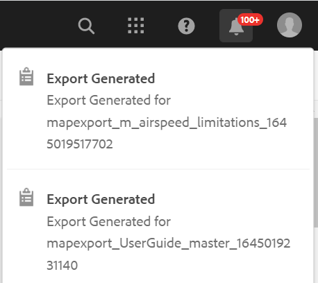

# 파일 다운로드 {#id216MC0H0BE8}

DITA 및 비 DITA 파일을 포함한 자산을 다운로드할 수 있습니다. 자산을 다운로드할 수 있는 여러 가지 방법이 있으며, 일부 메서드는 AEM이 기본적으로 사용되고, 다른 메서드는 AEM 가이드에서 지원합니다. 기본 AEM Assets 다운로드 정보에 대해서는 다음을 참조하십시오. [Adobe Experience Manager에서 자산 다운로드](https://experienceleague.adobe.com/docs/experience-manager-cloud-service/assets/manage/download-assets-from-aem.html) ( AEM 설명서 참조). 다음 섹션에서는 AEM 안내서에서 DITA 맵 콘솔을 통해 파일을 다운로드하는 메커니즘에 대해 설명합니다.

## DITA 맵 파일 내보내기

AEM 저장소에 DITA 맵 파일이 있으면 해당 종속 파일과 함께 맵 파일을 다운로드할 수 있습니다. 따라서 오프라인 편집, 유효성 검사, 검토 또는 간단히 백업을 만들기 위해 전체 맵 파일을 유연하게 공유할 수 있습니다.

다음 단계를 수행하여 종속 파일과 함께 DITA 맵 파일을 다운로드합니다.

1. Assets UI에서 다운로드할 DITA 맵으로 이동합니다.

1. DITA 맵을 클릭하여 DITA 맵 콘솔에서 엽니다.

1. 을(를) 선택합니다 **항목** 탭에서 DITA 맵에서 사용할 수 있는 주제 목록을 확인할 수 있습니다.

1. 기본 도구 모음에서 **맵 다운로드**.

   맵 다운로드 대화 상자가 나타납니다.

   {width="300" align="left"}

1. **다운로드**&#x200B;를 클릭합니다. 맵 다운로드 대화 상자에서 다음 옵션을 선택할 수 있습니다.

   - **기준선 사용**: DITA 맵에 대해 작성한 베이스라인 목록을 가져오려면 이 옵션을 선택합니다. 특정 기준선을 기준으로 맵 파일과 해당 컨텐츠를 다운로드하려면 드롭다운 목록에서 기준선을 선택합니다. 베이스라인 작업에 대한 자세한 내용은 [기준선을 사용한 작업](generate-output-use-baseline-for-publishing.md#).
   - **파일 계층 평면화**: 참조된 모든 항목 및 미디어 파일을 단일 폴더에 저장하려면 이 옵션을 선택합니다.

   >[!NOTE]
   >
   > 옵션을 선택하지 않고 맵 파일을 다운로드할 수도 있습니다. 이 경우 참조된 항목 및 미디어 파일의 마지막 지속적인 버전이 다운로드됩니다.

1. 을(를) 클릭한 후 **다운로드** 단추를 누르면 맵 다운로드 요청이 대기됩니다. 맵을 다운로드할 준비가 되면 다음 알림을 받게 됩니다.

   {width="550" align="left"}

   - 클릭 **다운로드** 맵 파일을 .zip 형식으로 다운로드하려면 다음을 수행하십시오.

   - 클릭 **나중에 다운로드** 맵 파일을 나중에 다운로드하려면 다음을 수행하십시오. AEM 알림 받은 편지함에서 다운로드 링크에 액세스할 수 있습니다. 받은 편지함에서 생성된 맵 알림을 클릭하여 맵을 .zip 형식으로 다운로드합니다.
   >[!NOTE]
   >
   > 기본적으로 다운로드한 맵은 AEM 알림 받은 편지함에서 5일 동안 유지됩니다.

{width="300" align="left"}

맵을 다운로드하면 맵을 선택하고 맨 위의 열기 아이콘을 사용하여 선택한 보고서를 열 수 있습니다.

**상위 항목:**[&#x200B;콘텐츠 관리](authoring.md)

