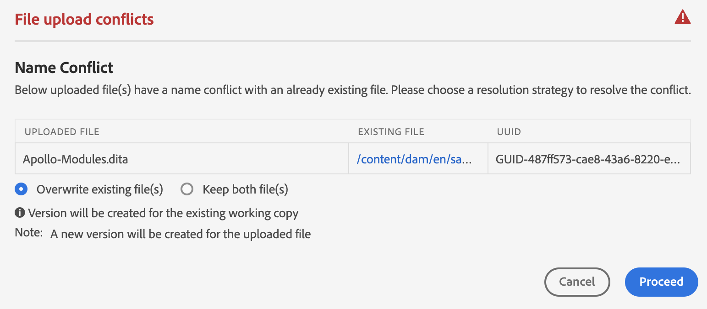
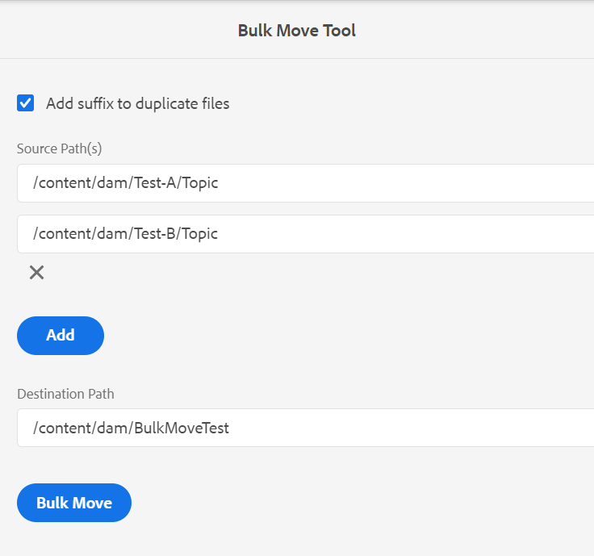
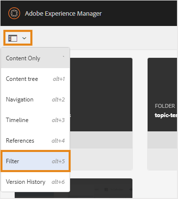

# 파일 및 폴더 관리 {#id2116G0L08XA}

이 섹션에서는 AEM Guides에서 복사, 붙여넣기, 드래그 앤 드롭 및 파일 삭제와 같은 기본 파일 작업을 처리하는 방법에 대해 설명합니다. 다음 시나리오가 가능합니다.

## 파일 복사 및 붙여넣기

**파일에 읽을 수 있는 파일 이름이 있는 경우**

- *이름이 같은 파일이 대상 폴더에 없는 경우*: 파일의 새 복사본이 만들어지고 UUID도 이 파일에 할당됩니다. 여기에서 파일 이름은 원래 파일 이름과 동일합니다.
- *이름이 같은 파일이 대상 폴더에 이미 있는 경우*: 파일의 새 사본은 파일 확장명 \(파일 이름0.extension\)과 같은 접미사가 붙은 채 만들어집니다. UUID도 새로 만든 파일에 할당됩니다.

**파일 이름이 UUID 패턴을 기반으로 하는 경우**

- *이름이 같은 파일이 대상 폴더에 없는 경우*: 파일의 새 복사본이 만들어지고 새 위치에 새 UUID도 할당됩니다. 여기에서 파일 이름은 UUID와 동일합니다.
- *이름이 같은 파일이 대상 폴더에 이미 있는 경우*: 파일의 새 사본이 만들어지고 새 UUID도 할당됩니다. 파일 이름은 UUID와 동일합니다.

## 폴더 복사 및 붙여넣기

**같은 위치에 폴더 복사 및 붙여넣기**

- *폴더에는 사람이 읽을 수 있는 파일 이름이 있는 파일이 있습니다*: 폴더의 새 사본은 \(foldername0\) 접미사를 사용하여 만들어집니다. 새 UUID도 폴더 내의 파일에 할당됩니다. 그러나 파일 이름은 변경되지 않습니다.

- *폴더에는 UUID 패턴을 기반으로 파일 이름이 있는 파일이 있습니다*: 폴더의 새 사본은 \(foldername0\) 접미사를 사용하여 만들어집니다. 새 UUID도 새 폴더 내의 모든 파일에 할당됩니다. 파일 이름도 변경됩니다. 파일 이름은 새 UUID와 동일합니다.

**다른 위치에 폴더 복사 및 붙여넣기**

- *폴더에는 사람이 읽을 수 있는 파일 이름이 있는 파일이 있습니다*: 폴더의 새 사본이 만들어지고 새 UUID도 폴더 내의 모든 파일에 새 위치에 할당됩니다. 여기서는 폴더 또는 파일 이름에 변경 사항이 없습니다.

- *폴더에는 UUID 패턴을 기반으로 파일 이름이 있는 파일이 있습니다*: 원래 폴더와 동일한 이름으로 폴더의 새 복사본이 만들어집니다. 새 UUID도 새 폴더 내의 모든 파일에 할당됩니다. 파일 이름도 변경됩니다. 파일 이름은 새 UUID와 동일합니다.

## 파일 드래그 앤 드롭

**사람이 읽을 수 있는 파일 이름으로 드래그 앤 드롭**

- *동일한 위치에 드래그하여 놓기*: 다음 옵션을 선택할 수 있습니다. **기존 파일 덮어쓰기\**, **두 파일 모두\(s\)를 유지합니다.**&#x200B;기존 작업 사본의 버전을 만드는 옵션입니다.

   {width="650" align="center"}

   을(를) 선택하는 경우 **기존 파일 덮어쓰기\** 옵션을 선택하면 업로드되는 파일이 원래 위치에서 기존 파일의 현재 작업 버전을 대체합니다. UUID가 만들어지거나 변경되지 않습니다.

   을(를) 선택하는 경우 **두 파일 모두\(s\)를 유지합니다.** 옵션을 선택하면 파일 확장명 \(파일 이름0.extension\)와 같은 접미사가 붙은 새 파일 사본이 만들어집니다. 새 UUID도 새로 복사된 파일에 지정됩니다.

   기존 파일 덮어쓰기\ 옵션을 선택하면 기존 작업 복사본에서 버전을 만드는 옵션을 선택하면 문서의 작업 복사본에서 새 버전이 만들어집니다.

   >[!NOTE]
   >
   > **업로드된 파일에 대한 새 버전 만들기** 관리자가 기능을 활성화해야 합니다. 이 기능이 활성화되어 있으면 업로드된 파일의 새 버전이 만들어집니다. 옵션을 선택 취소하면 업로드된 파일의 버전이 생성되지 않습니다. 자세한 내용은 *업로드된 파일에 대한 새 버전 만들기* 섹션을 참조하십시오.

   다른 사용자가 편집을 위해 이미 파일을 체크 아웃하고 기존 파일을 업로드하고 덮어쓰는 경우 파일이 실패하고 오류가 표시됩니다.

   >[!NOTE]
   >
   >다음 **업로드 시 체크 아웃된 파일 덮어쓰기** 관리자가 기능을 비활성화해야 합니다. 이 기능을 사용하면 체크 아웃된 파일을 덮어쓸 수 있습니다. 이 기능을 활성화하지 않으면 체크 아웃된 파일을 덮어쓰지 않습니다. 자세한 내용은 *업로드 시 체크 아웃된 파일 덮어쓰기* 섹션을 참조하십시오.

- *파일을 다른 위치에 드래그하여 놓습니다*: 파일의 새 복사본이 만들어지고 새 위치에 새 UUID도 할당됩니다. 여기에서 파일 이름은 원래 파일 이름과 동일합니다.

**UUID 패턴을 기반으로 파일 이름으로 드래그 앤 드롭**

*파일을 같은 위치에 드래그하여 놓습니다*: 다음 옵션을 선택할 수 있습니다. **기존 파일 덮어쓰기\** 기존 작업 사본의 버전을 생성하는 옵션과 함께 사용할 수 있습니다.

{width="650" align="center"}

파일을 덮어쓰는 경우 파일 이름 또는 해당 UUID는 변경되지 않습니다.

을(를) 선택하는 경우 **기존 작업 복사본용 버전 생성** 옵션을 선택하면 문서의 작업 복사본에서 새 버전이 만들어집니다. 새 파일이 업로드되고 새 버전의 파일도 작성되며 문서의 작업 복사본으로 만들어집니다.

**업로드된 파일에 대한 새 버전 만들기** 관리자가 기능을 활성화해야 합니다. 이 기능이 활성화되어 있으면 업로드된 파일의 새 버전이 만들어집니다. 옵션을 선택 취소하면 업로드된 파일의 버전이 생성되지 않습니다. 자세한 내용은 *업로드된 파일에 대한 새 버전 만들기* 섹션을 참조하십시오.

*파일을 다른 위치에 드래그하여 놓습니다*: 다음 옵션을 선택할 수 있습니다. **기존 파일 덮어쓰기\**, **파일을 새 위치로\ 이동**&#x200B;기존 작업 사본의 버전을 만드는 옵션입니다.

{width="650" align="center"}

을(를) 선택하는 경우 **기존 파일 덮어쓰기\** 옵션을 선택하면 업로드되는 파일이 원래 위치의 기존 파일을 대체합니다. UUID가 만들어지거나 변경되지 않습니다.

을(를) 선택하는 경우 **파일을 새 위치로\ 이동** 옵션을 선택하면 기존 파일이 현재 위치로 이동한 다음 업로드된 파일로 덮어씁니다. 파일을 새 위치로 이동해도 파일의 기존 참조가 손상되지 않습니다.

파일을 바꾸거나 이동하는 경우 기존 복사본에서 버전을 만드는 옵션을 선택하면 문서의 작업 복사본에서 새 버전이 만들어집니다. 새 파일은 기존 위치에서 대체되거나 새 위치로 이동됩니다.

## 파일을 대량으로 이동

AEM 안내서에는 관리자가 많은 파일이 있는 폴더를 한 위치에서 다른 위치로 이동하는 데 도움이 되는 대량 이동 도구가 포함되어 있습니다. 이 도구는 하나 이상의 폴더 내의 파일을 AEM 저장소의 다른 폴더로 쉽게 이동할 수 있습니다. 이 도구의 주요 기능 중 하나는 많은 수의 파일을 이동시킬 뿐만 아니라 이동 중인 파일에 대한 참조 및 파일 간의 참조도 유지한다는 것입니다. 작성 및 게시 작업을 방해하지 않고 일괄로 이동할 수 있는 파일 수를 조정할 수 있습니다.

>[!NOTE]
>
> 벌크 이동 도구는 폴더 수준에서만 작동합니다. 개별 주제 또는 맵 파일을 이동하려는 경우 AEM Assets UI에서 일반 이동 도구를 사용합니다.

다음은 벌크 이동 도구에서 제공하는 기능 중 일부입니다.

- 각 배치에서 처리할 파일 수를 조정할 수 있습니다. 이렇게 하려면 시스템이 쉽게 처리할 수 있는 최적의 수에 도달하기 전에 몇 가지 테스트를 실행해야 할 수 있습니다.
- 작성 및 게시 서비스는 이동 작업을 중단 없이 원활하게 실행됩니다.
- 후속 \(실행 중) 일괄 처리 프로세스 간 시간 간격을 완벽하게 제어할 수 있습니다. 이 시간 간격은 다음 파일 일괄 처리를 시작하기 전에 사후 처리 작업이 완료되도록 합니다.

- 이름이 같은 폴더의 자동 처리 이 기능을 사용하면 동일한 이름의 폴더가 이동되더라도 덮어쓰지 않습니다.

- 이동 중인 파일에 대한 참조 및 파일의 참조 자동 처리

배치 프로세스를 실행하기 전에 다음 사항을 고려해야 합니다.

- 현재 검토 중인 항목을 이동할 계획이라면 해당 항목을 이동하기 전에 모든 항목에 대한 검토 프로세스를 닫아야 합니다. 검토 작업을 닫지 않으면 검토 프로세스가 중단됩니다.
- 시스템에서 언제든지 단일 대량 이동 작업만 실행해야 합니다. 이렇게 하면 이동하는 항목에 대한 참조 및 해당 항목에 대한 참조를 적절히 처리할 수 있습니다.

파일을 대량으로 이동하려면 다음 단계를 수행하십시오.

1. 맨 위에 있는 Adobe Experience Manager 링크를 클릭하고 을 선택합니다 **도구**.
1. 선택 **안내서** 도구 목록
1. 을(를) 클릭합니다. **벌크 이동 도구** 타일.

   [벌크 이동 도구] 페이지가 표시됩니다.

   {width="550" align="center"}

1. [벌크 이동 도구] 페이지에서 다음 세부 정보를 제공합니다.

   - **중복 파일에 접미어 추가**: 이름이 같은 폴더를 이동하는 경우 이 옵션을 선택해야 합니다. 예를 들어 위의 스크린샷에서는 **소스 경로** 이동할 폴더 이름이 포함되어 있습니다. topic이라는 폴더가 test-A와 test-B라는 두 개의 서로 다른 위치에 있습니다. 이 옵션을 선택하면 폴더가 성공적으로 이동합니다. 첫 번째 이동된 폴더의 이름은 topic으로 지정되지만 두 번째 폴더의 이름은 topic0. 이동 작업은 순차적 시리즈 \(0, 1, 2 등\)에 접미사를 같은 이름의 폴더에 추가합니다.

      이 옵션을 선택하지 않고 이름이 같은 폴더를 이동하는 경우 작업이 중단되고 메시지가 표시됩니다.

   - **소스 경로\**: 이동할 폴더의 위치를 지정합니다. 일반적으로 브라우저의 주소 표시줄에서 소스 위치를 복사하여 붙여넣어야 합니다. 를 클릭하여 여러 폴더 위치를 지정할 수 있습니다 **추가** 버튼을 클릭합니다.

   - **대상 경로**: 소스 폴더를 이동할 위치를 지정합니다.

1. 클릭 **벌크 이동**.

   시스템이 소스에서 대상 위치로 파일 이동을 시작합니다. 프로세스가 완료되면 페이지 하단에 이동 프로세스의 요약이 표시됩니다.

   {width="650" align="center"}

## DITA 콘텐츠 검색

기본적으로 AEM에서는 DITA 콘텐츠를 인식하지 못하므로 리포지토리 내에서 DITA 콘텐츠를 검색하는 메커니즘을 제공하지 않습니다. AEM 안내서에서는 AEM 위에 레이어를 추가하여 AEM에서 DITA 콘텐츠를 이해하고 처리할 수 있습니다. AEM 안내서의 DITA 콘텐츠 검색 기능을 사용하면 AEM 리포지토리 내에서 DITA 콘텐츠를 검색할 수 있습니다.

>[!NOTE]
>
>시스템 관리자가 **DITA 요소** 검색 구성 요소를 선택한 다음 AEM Assets UI의 기능을 사용할 수 있습니다. 자세한 내용은 다음을 참조하십시오. *자산 UI에서 DITA 요소 검색 구성 요소 추가* 섹션을 참조하십시오.

검색 기능을 사용하여 다음을 수행할 수 있습니다.

- 요소 값을 기반으로 DITA 콘텐츠 검색 예 `author`= xml
- 속성 값을 기반으로 DITA 콘텐츠를 검색합니다. 예 `@platform`= windows
- DITA 요소와 속성 값의 조합을 사용합니다. 예 `author`= xml `AND` `@platform`= windows

AEM 리포지토리 내에서 DITA 콘텐츠를 검색하려면 다음 단계를 수행하십시오.

1. 자산 UI를 엽니다.

1. 왼쪽 레일에서 를 선택합니다. **필터**.

   {width="450" align="center"}

   컨텐츠 필터링 옵션이 왼쪽 레일에 표시됩니다. 필터링 옵션인 DITA 콘텐츠를 필터링하는 데 사용되는 DITA 요소를 찾을 수도 있습니다.

   {width="450" align="center"}

1. *\(선택 사항\)* 에서 **검색 디렉토리 선택** 필드에서 검색할 위치를 찾습니다.

1. 에서 **DITA 요소** 필터링, 제공 **요소 이름**, **속성**, 및 검색할 값을 지정합니다. 예를 들어 `author` 의 요소 `@type` 작성자는 다음 스크린샷에 표시된 대로 정보를 제공해야 합니다.

   {width="650" align="center"}

   에 입력한 검색 기준 **DITA 요소** 검색 창 상단에 필터가 표시됩니다. 검색 기준과 일치하는 파일은 **검색 결과** 영역.

   검색 기준을 지정하는 동안 다음 사항을 고려하십시오.

   - 정확한 구문을 검색하려면 따옴표 내의 값 필드에 구문을 입력합니다 `"`구문 검색`"`.
   - 최대 3개의 DITA 요소 검색 기준을 추가할 수 있습니다.
   - 여러 검색 기준을 지정하는 경우 모든 검색 기준이 AND 논리를 사용하여 결합됩니다.
   - 검색 기준에서는 와일드카드 문자를 사용할 수 없습니다. 예를 들어 Windows 값이 있는 플랫폼 \(attribute\)를 검색하려면 \*form이나 Windo?s를 지정할 수 없습니다.

**검색의 체크아웃 상태 필터**

DITA 요소 필터 외에도 AEM 가이드를 사용하여 체크아웃 상태에 따라 콘텐츠를 검색할 수도 있습니다. 이 기능은 현재 사용자가 체크 아웃한 파일을 빠르게 필터링하고 다시 체크 인하려는 경우 유용합니다.

체크 아웃 상태에 따라 파일을 검색하려면 다음 단계를 수행하십시오.

1. 자산 UI를 엽니다.

1. 클릭 **필터** 왼쪽 레일에 있습니다.
1. 검색 창에 검색 키워드를 입력합니다.
1. 왼쪽 레일에서 필요한 필터를 적용합니다.

   예를 들어 다음을 적용할 수 있습니다 **체크아웃 상태** 필터를 사용하여 체크 아웃되었거나 체크 아웃된 항목을 표시합니다. 체크 아웃한 사람 목록에서 사용자 또는 그룹을 선택하여 이 목록을 더 세분화할 수 있습니다.

   검색 결과가 표시됩니다.

## 파일 삭제

AEM 리포지토리에서 파일을 삭제하는 것은 시스템 관리자가 제어하는 제한된 기능입니다. 구성에 따라 다음과 같은 경우 파일 삭제를 제한할 수 있습니다.

- 체크아웃
- 들어오는 참조 또는 나가는 참조 있음

파일을 삭제할 수 있는 권한이 있는 특정 사용자 그룹에 속해 있는 경우에만 파일을 삭제할 수도 있습니다.

>[!NOTE]
>
> 파일 관리에 대한 구성에 대한 자세한 내용은 *체크 아웃된 파일의 삭제 방지* 및 *참조된 파일의 삭제 방지* Adobe Experience Manager 안내서 설치 및 구성 의 섹션을 as a Cloud Service.

관리자가 모든 사용자에게 파일 삭제 권한을 부여한 경우 참조가 포함된 파일을 삭제할 때 다음 메시지가 표시됩니다.

{width="650" align="center"}

이 시나리오에서는 파일에서 들어오는 참조나 나가는 참조를 제거하지 않고 파일을 강제로 삭제할 수 있습니다.

특정 사용자 그룹에 삭제 권한이 제공되면 해당 그룹에 속하는 사용자에게도 위의 메시지가 표시됩니다. 그러나 다른 사용자의 경우 다음 메시지가 표시됩니다.

{width="650" align="center"}

이 시나리오에서는 들어오는 참조와 나가는 참조가 모두 제거되기 전에는 파일을 삭제할 수 없습니다.

## 미디어 파일 작업

이미지 및 비디오와 같은 미디어 파일은 컨텐츠의 필수 부분입니다. 컨텐츠를 업로드하고 관리하는 동안 미디어 파일을 사용하여 작업할 수도 있습니다.

미디어 파일이 변경된 경우, **버전 기록**.다른 버전의 미디어 파일에서 변경 내용을 확인하려면:

1. 에서 파일에 액세스 **자산 UI**.
1. 버전 기록을 볼 파일을 선택합니다.
1. 왼쪽 레일에서 를 클릭합니다. **버전 기록** 버전을 선택합니다.
1. 버전 기록(Version History)에서 다른 버전의 축소판 그림을 확인할 수도 있습니다.

   {width="800" align="center"}

1. 나열된 버전에서 기본 버전으로 사용할 버전을 선택하고 을(를) 클릭합니다 **버전 미리 보기**. 선택한 버전의 미리 보기가 버전 미리 보기 창에 표시됩니다.

   {width="650" align="center"}

**상위 항목:**[&#x200B;콘텐츠 관리](authoring.md)

