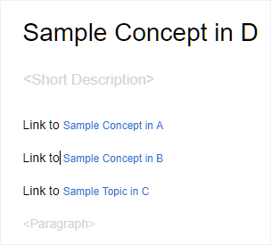
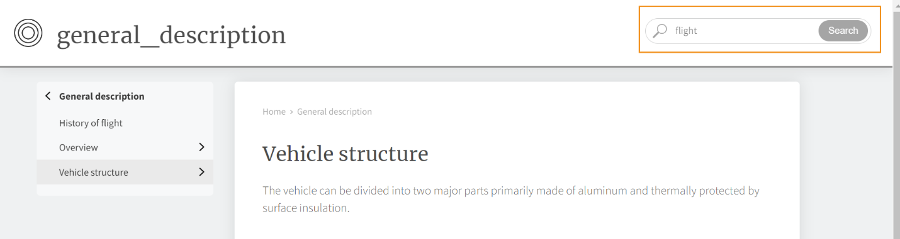

# AEM 사이트 {#id205BE3008SW}

AEM 사이트 출력에 사용할 수 있는 옵션은 다음과 같습니다.

다음 두 가지 방법으로 AEM 사이트 사전 설정을 만들 수 있습니다.

**웹 편집기에서:** 저장소 패널의 맵 보기에서 DITA 맵 파일을 열고 출력 탭에서 + 아이콘을 선택하여 출력 사전 설정을 만든 다음 사전 설정 추가 대화 상자의 유형 드롭다운에서 AEM 사이트를 선택합니다.웹 편집기에서 구성은 일반 및 고급 탭 아래에 구성되었습니다.

**일반**

다음 **일반** 탭에는 다음 구성이 포함되어 있습니다.

- 사이트 이름
- 출력 경로
- 기존 출력 페이지
- 고아 사이트 페이지 삭제
- \(맵에 대해 조건이 정의된 경우\)를 사용하여 조건 적용
- 기준선 사용 \(맵에 대해 기준선을 만든 경우\)
- 생성 후 워크플로우

**고급**

고급 탭에는 다음 구성이 포함되어 있습니다.

- DITA-OT 임시 파일 정리
- 모든 주제에 대해 별도의 PDF 생성
- 맵 속성을 기본값으로 사용

자세한 내용은 [AEM 사이트 구성](#id231KIM004X1).

**맵 대시보드에서**

AEM Site에 대한 출력 사전 설정을 열려면 Assets UI에서 DITA 맵 파일을 클릭한 다음 출력 사전 설정을 클릭한 다음 AEM Site 출력 옵션을 클릭합니다.맵 대시보드에서 **편집** 맨 위에서 다양한 구성을 업데이트한 다음 를 클릭합니다 **저장**.

>[!TIP]
>
> 자세한 내용은 *AEM 사이트 게시* AEM 사이트 출력 만들기에 대한 모범 사례에 대해서는 모범 사례 안내서의 섹션을 참조하십시오.

## AEM 사이트 구성 {#id_aem_site_config}

AEM 사이트 출력에 사용할 수 있는 옵션은 다음과 같습니다.

| AEM 사이트 옵션 | 설명 |
| --- | --- |
| 출력 유형 | 생성할 출력 유형입니다. 응답형 AEM 사이트 출력을 생성하려면 AEM Site 옵션을 선택합니다. |
| 설정 이름 | 만드는 AEM 사이트 설정을 설명하는 이름을 지정합니다. 예를 들어 *내부 고객 출력* 또는 *최종 사용자 출력*. |
| 사이트 이름 | 출력이 AEM 저장소에 저장되는 사이트 이름입니다.  AEM 저장소의 노드는 여기에 지정된 이름으로 생성됩니다. 사이트 이름을 지정하지 않으면 사이트 노드가 DITA 맵 파일 이름으로 생성됩니다.  여기서 지정하는 사이트 이름 도 브라우저 탭에서 제목으로 사용됩니다.  사이트 이름을 설정하는 동안 변수를 사용할 수도 있습니다. 변수 사용에 대한 자세한 내용은 [대상 경로, 사이트 이름 또는 파일 이름 옵션을 설정할 변수를 사용합니다](generate-output-use-variables.md#id18BUG70K05Z). |
| 디자인 | 출력을 생성하는 데 사용할 디자인 템플릿을 선택합니다.  사용자 정의 디자인 템플릿을 사용하여 출력을 생성하는 방법에 대한 자세한 내용은 게시 관리자에게 문의하십시오. |
| 대상 경로 | 출력이 저장되는 AEM 저장소 내의 경로입니다. 최종 출력을 생성하는 동안 사이트 이름과 대상 경로가 결합됩니다. 예를 들어, 사이트 이름을 `user-guide` 및 대상 경로: `/content/output/aem-guides`를 입력하면 최종 출력이 `/content/output/aem-guides/user-guide` 노드 아래에 있어야 합니다.  대상 경로를 설정하는 동안 변수를 사용할 수도 있습니다. 변수 사용에 대한 자세한 내용은 [대상 경로, 사이트 이름 또는 파일 이름 옵션을 설정할 변수를 사용합니다](generate-output-use-variables.md#id18BUG70K05Z). |
| 을 사용하여 조건 적용 | 다음 옵션 중 하나를 선택합니다.  **적용된 항목 없음**: 게시된 출력에 조건을 적용하지 않으려면 이 옵션을 선택합니다. **DITAVal 파일**: 조건부 컨텐츠를 생성하려면 DITAVal 파일을 선택합니다. 찾아보기 대화 상자를 사용하거나 파일 경로를 입력하여 여러 DITAVal 파일을 선택할 수 있습니다. 파일 이름 근처에 있는 교차 아이콘을 사용하여 제거합니다. DITAVal 파일은 지정된 순서대로 평가되므로 첫 번째 파일에 지정된 조건이 이후 파일에 지정된 일치 조건보다 우선합니다. 파일을 추가하거나 삭제하여 파일 순서를 유지할 수 있습니다. DITAVal 파일을 다른 위치로 이동하거나 삭제하면 맵 대시보드에서 자동으로 삭제되지 않습니다. 파일이 이동되거나 삭제될 경우 위치를 업데이트해야 합니다. 파일 이름 위로 마우스를 가져가면 파일이 저장된 AEM 저장소의 경로를 볼 수 있습니다. DITAVal 파일만 선택할 수 있으며 다른 파일 유형을 선택하면 오류가 표시됩니다. **조건 사전 설정**: 출력을 게시하는 동안 조건을 적용하려면 드롭다운에서 조건 사전 설정을 선택합니다. DITA 맵 파일에 조건을 추가한 경우 이 옵션이 표시됩니다. 조건부 설정은 DITA 맵 콘솔의 조건 사전 설정 탭에서 사용할 수 있습니다. 조건 사전 설정에 대한 자세한 내용은 [조건 사전 설정 사용](generate-output-use-condition-presets.md#id1825FL004PN). |
| 기존 출력 페이지 | 을(를) 선택합니다 **컨텐츠 덮어쓰기** 기존 페이지의 컨텐츠를 덮어쓰는 옵션. 이 옵션은 페이지의 컨텐츠 및 헤드 노드 아래에 있는 컨텐츠만 덮어씁니다. 이 옵션을 사용하면 컨텐츠를 혼합하여 게시할 수 있습니다. 이 옵션을 선택하면 게시된 출력에서 고아 페이지 삭제를 선택하는 옵션이 제공됩니다. 또한 *기본* AEM 사이트 출력을 만드는 옵션입니다.  을(를) 선택합니다 **삭제 및 만들기** 게시 중에 기존 페이지를 강제로 삭제하는 옵션. 이 옵션은 페이지 노드 및 해당 컨텐츠 및 그 아래에 있는 모든 하위 페이지를 삭제합니다. 출력 사전 설정의 디자인 템플릿을 변경하거나 대상에 이미 있는 추가 페이지를 제거하려면 이 옵션을 사용합니다. |
| 고아 사이트 페이지 삭제 | 선택 **컨텐츠 덮어쓰기** 에서 **기존 출력 페이지** 을 설정하면 이 옵션이 표시됩니다. 이 옵션을 선택하면 게시된 AEM 사이트에서 모든 고아 페이지가 삭제됩니다. 이 기능을 성공적으로 실행하려면 전체 DITA 맵을 게시하고 증분 게시를 사용하지 않아야 합니다.  a.dita, b.dita 및 c.dita가 포함된 DITA 맵을 게시했다고 가정합니다. 맵을 다시 게시하기 전에 맵에서 b.dita 주제를 제거했습니다. 이제 이 옵션을 선택한 경우 b.dita와 관련된 모든 컨텐츠가 AEM Site 출력에서 제거되고 a.dita 및 c.dita만 게시됩니다.  이 기능은 게시된 하위 맵을 제거하지 않습니다. 예를 들어 상위 맵에 하위 맵이 포함되어 있고 전체 하위 맵을 제거하는 경우, 하위 맵 컨텐츠는 게시된 출력에서 삭제되지 않습니다. 그러나 하위 맵에서 항목을 제거하고 다시 게시하면 제거된 토픽 컨텐츠가 사이트 출력에서 삭제됩니다.  또한 참조된 컨텐츠가 있고 다시 게시하기 전에 해당 컨텐츠가 제거되면 참조된 컨텐츠의 데이터가 제거되지 않습니다.  **참고**: 삭제된 고아 페이지에 대한 정보도 출력 생성 로그에 캡처됩니다. 로그 파일 액세스에 대한 자세한 내용은 [로그 파일을 보고 확인합니다](generate-output-basic-troubleshooting.md#id1821I0Y0G0A__id1822G0P0CHS). |
| DITA-OT 임시 파일 정리 | DITA-OT에서 생성한 임시 파일을 지우려면 이 옵션을 선택합니다. DITA-OT에서 임시 파일을 저장하는 위치는 출력 생성 로그에서 찾을 수 있습니다.  DITA-OT를 통해 출력을 생성하는 동안 오류가 발생하는 경우 이 옵션을 선택 해제하여 임시 파일을 유지할 수 있습니다. 그런 다음 이러한 파일을 사용하여 출력 생성 오류를 해결할 수 있습니다. |
| 각 주제에 대한 별도의 PDF 생성 | 선택한 경우 DITA 맵의 모든 주제에 대해 PDF이 만들어집니다. 이 옵션을 선택하면 새 PDF 경로 분할 옵션이 표시됩니다.  PDF 경로 분할 필드에서 각 주제에 대해 생성된 PDF을 저장할 경로를 지정합니다.  **참고**: AEM 가이드는 DITA-OT 플러그인 pdfx를 사용하여 각 주제에 대한 PDF을 생성합니다. 이 플러그인은 기본적으로 제공되는 DITA-OT 패키지와 함께 번들로 제공됩니다. 요구 사항에 따라 이 플러그인을 사용자 지정하여 PDF을 생성할 수 있습니다. 사용자 정의 DITA-OT 플러그인을 사용하는 경우 pdfx 플러그인을 통합하여 주제 수준 PDF 생성 기능이 있는지 확인합니다. |
| 생성 후 워크플로우 실행 | 이 옵션을 선택하면 AEM에 구성된 모든 워크플로우를 포함하는 새 생성 워크플로우 드롭다운 목록이 표시됩니다. 출력 생성 워크플로우가 완료된 후 실행할 워크플로우를 선택해야 합니다. |
| 기준선 사용 | 선택한 DITA 맵에 대한 기준선을 생성한 경우 이 옵션을 선택하여 게시할 버전을 지정합니다.  **중요 사항**: AEM Site에 대한 증분 출력을 생성하는 경우 첨부된 기준선이 아닌 파일의 현재 버전을 사용하여 출력이 생성됩니다.  자세한 내용은 [기준선을 사용한 작업](generate-output-use-baseline-for-publishing.md#id1825FI0J0PF) 자세한 내용 |
| 속성 | 메타데이터로 처리할 속성을 선택합니다. 이러한 속성은 DITA 맵 또는 북맵 파일의 속성 페이지에서 설정됩니다. 드롭다운 목록에서 선택하는 속성은 속성 필드 아래에 나열되며 드롭다운 목록에서 제거됩니다.  **참고**: 메타데이터 속성은 대소문자를 구분합니다.  *베이스라인(Baseline)을 선택한 경우 등록 정보 값은 선택한 베이스라인 버전을 기준으로 합니다. * 베이스라인을 선택하지 않은 경우 등록 정보의 값은 최신 버전을 기반으로 합니다.  DITA-OT 게시를 사용하여 메타데이터를 출력에 전달할 수도 있습니다. 자세한 내용은 다음을 참조하십시오. [DITA-OT를 사용하여 메타데이터를 출력에 전달합니다](pass-metadata-dita-ot.md#id21BJ00QD0XA).  **참고**: 을(를) 정의하지 않은 경우 `cq:tags` 속성 옵션에서 `cq:tags` 게시할 기준 요소를 선택한 경우에도 현재 작업 복사본에서 선택됩니다. |
| 주제에서 누락된 경우 맵 속성 사용 | 선택한 경우 맵 파일에 대해 정의된 등록 정보도 이러한 등록 정보가 정의되지 않은 항목에도 복사됩니다. 이 옵션을 사용하는 동안 다음 사항을 고려하십시오.  *String, Date 또는 Long(정수 및 다중 값) 속성만 AEM Site 페이지에 전달할 수 있습니다. * 문자열 유형 속성의 메타데이터 값은 특수 문자(예: `@, #, " "`). * 이 옵션은 `Properties` 선택 사항입니다. |

## AEM 사이트에 대한 추가 참고 사항

### 웹 편집기에서 문서 기반 출력 생성

웹 편집기에서 하나 이상의 주제에 대한 AEM 사이트 출력 또는 전체 DITA 맵을 생성할 수 있습니다. DITA 맵에 대한 출력 사전 설정을 만든 다음 맵에 대한 AEM 사이트 출력을 쉽게 생성할 수 있습니다. 맵에서 몇 가지 항목을 업데이트한 경우, 웹 편집기에서 해당 주제에 대해서만 AEM 사이트 출력을 생성할 수도 있습니다. 자세한 내용은 [웹 편집기에서 문서 기반 게시](web-editor-article-publishing.md#id218CK0U019I).

### 다른 맵에서 출력 연결 항목을 생성합니다.

여러 폴더 및 DITA 맵에 다양한 문서 세트를 분산하는 것은 매우 일반적인 시나리오입니다. 여러 위치에서 연결된 콘텐츠를 게시하면 매우 복잡해집니다. 기본적으로 모든 링크 `<xref>` 를 사용하여 `local` `@scope`. 주제에 대한 직접 링크를 사용하기 때문에 이러한 주제를 게시해도 어떠한 도전도 포함되어 있지 않습니다. 주제가 현재 DITA 맵 외부에 있는 경우 링크에 링크된 콘텐츠가 표시되지 않습니다.

컨텐츠를 연결하는 또 다른 방법은 를 사용하여 링크를 만드는 것입니다 `peer` `@scope`. 이러한 컨텐츠의 경우 DITA 맵의 게시 컨텍스트에서 연결된 주제에 대해 구성된 컨텍스트를 선택하여 런타임 시 링크가 해결됩니다. 다음 스크린샷은 이 있는 링크에 대한 속성 패널을 보여 줍니다 `peer` `@scope`:

{width="800" align="left"}

다른 맵의 다른 항목에 연결하는 복잡한 맵과 항목의 게시를 단순화하기 위해 AEM 가이드를 사용하여 각 출력 사전 설정에 대한 게시 컨텍스트를 설정할 수 있습니다.

게시 컨텍스트를 사용하면 맵에서 특정 출력을 게시할 항목을 지정할 수 있습니다. 예를 들어 다음과 같은 네 개의 폴더가 있다고 가정합니다. 샘플 a, 샘플 b, 샘플 c, 및 샘플 d. 각 폴더에는 DITA 맵(DITA 맵 A, DITA 맵 B, DITA 맵 C 및 DITA 맵 D)이 있습니다. DITA 맵 A의 주제가 DITA 맵 B, C 또는 D의 주제에 링크될 때 맵 간 연결이 발생합니다. 다음 스크린샷에서 샘플 개념 항목에는 다른 DITA 맵의 일부인 파일에 대한 링크 \(또는 참조\)가 포함되어 있습니다.

{width="450" align="left"}

이제 이 항목을 포함하는 맵 파일에 대한 AEM 사이트 게시 설정을 구성할 때 게시 중에 링크된 컨텐츠에 대한 게시 컨텍스트를 선택할 수 있습니다. 게시 컨텍스트는 DITA 맵과 해당 출력 사전 설정의 조합입니다. 출력 사전 설정에는 특정 버전의 콘텐츠 및 조건부 사전 설정이 포함되어 있습니다. DITA 맵, 출력 사전 설정, \(파일\) 버전 및 조건의 전체 조합을 통해 연결된 맵에 대한 게시 컨텍스트를 정의합니다.

상호 연결된 파일에 대한 게시 컨텍스트를 지정하려면 다음 단계를 수행합니다.

1. 를 엽니다. **출력 사전 설정** 게시할 DITA 맵의 탭입니다.

1. 을(를) 선택합니다 **AEM 사이트** 출력 사전 설정.

   AEM 사전 설정 및 게시 컨텍스트 탭이 표시됩니다.

   {width="800" align="left"}

1. 를 엽니다. **게시 컨텍스트** 탭.

   종속 항목 목록이 표시됩니다. 이 주제들은 현재 맵의 일부 주제와 연결되어 있지만, 일부 다른 DITA 맵에서 사용할 수 있습니다.

   >[!NOTE]
   >
   > 컨텍스트 게시 탭에는 `peer` `@scope` 전용. 링크 `local` `@scope`를 지정하는 경우에는 게시 컨텍스트를 지정할 필요가 없습니다.

   기본적으로 연결된 모든 주제에는 최신 출력 사전 설정과 맵이 선택되어 있습니다.

   {width="800" align="left"}

1. DITA 맵과 사전 설정의 기본 선택을 변경하려면 **편집** \(기본 도구 모음에서\)

1. 맵에서 각 종속 파일의 가장 최근에 게시된 출력을 사용하려면 을 선택합니다 **모든 종속 항목에 가장 최근에 생성된 게시 컨텍스트 사용**.

1. 에서 **상위 맵** 드롭다운 목록에서 현재 맵의 출력을 연결할 출력이 있는 맵 파일을 선택합니다.

   맵 파일을 선택하면 맵의 UUID가 상위 맵 UUID 열에 표시됩니다. 선택한 맵과 연결된 출력 사전 설정이 상위 맵의 사전 설정 목록에 나열됩니다.

1. 에서 **상위 맵의 사전 설정** 드롭다운 목록에서 현재 맵의 출력을 연결할 출력 사전 설정을 선택합니다.

1. 모든 종속 항목에 필요한 맵과 해당 출력 사전 설정을 선택하고 를 클릭합니다 **완료**.

   이제 종속 항목의 컨텍스트가 설정됩니다. 현재 맵에 대한 출력을 생성할 수 있습니다. 출력 생성에 대한 자세한 내용은 [맵 콘솔에서 DITA 맵에 대한 출력 생성](generate-output-for-a-dita-map.md#).

### 혼합 게시

AEM 안내서는 기존 AEM 사이트에 DITA 콘텐츠 게시를 지원합니다. 예를 들어 기존 사이트가 있는 경우 AEM 사이트 출력을 사용하여 해당 사이트에 있는 DITA 콘텐츠만 게시할 수 있습니다. 이 프로세스에서는 기존 비 DITA 컨텐츠가 게시 프로세스에 의해 수정되지 않습니다. DITA 콘텐츠만 게시하도록 사이트를 설정하는 방법에 대한 자세한 내용은 게시 관리자에게 문의하십시오.

### 게시 `conref`

사용 중인 경우 `conref` 컨텐츠의 경우 소스 \(또는 참조\) 항목의 컨텐츠와 함께 일반 또는 포함된 컨텐츠로 게시됩니다. 다음 `conref` 컨텐츠가 주 컨텐츠와 함께 렌더링되고, 동일한 사이트에 대해 별도의 사이트 페이지가 만들어지지 않습니다. 에서 참조되는 컨텐츠를 검색할 때 `conref`를 클릭한 다음 를 포함하는 기본 항목 또는 페이지만 `conref` 컨텐츠가 검색 결과에 표시됩니다.

>[!NOTE]
>
>에 대해 별도의 페이지를 생성한 경우 `conref` AEM Guides 버전 3.5 이하를 사용하는 컨텐츠의 경우, [고아 사이트 페이지 삭제](#delete-orphan-page-aem-site) 선택 사항입니다.

### 콘텐츠 내에서 문자열 검색

AEM 사이트 출력에서 문자열을 검색할 수 있습니다. 기본적으로 제목에서만 문자열을 검색할 수 있습니다. 컨텐츠 또는 AEM 사이트 출력의 본문에서 문자열을 검색하려면 시스템 관리자에게 문의하여 flattening.enabled 속성을 활성화합니다.

자세한 내용은 *AEM Site 노드 구조의 병합 구성* 섹션을 참조하십시오.

**상위 항목:**[&#x200B;출력 사전 설정 이해](generate-output-understand-presets.md)