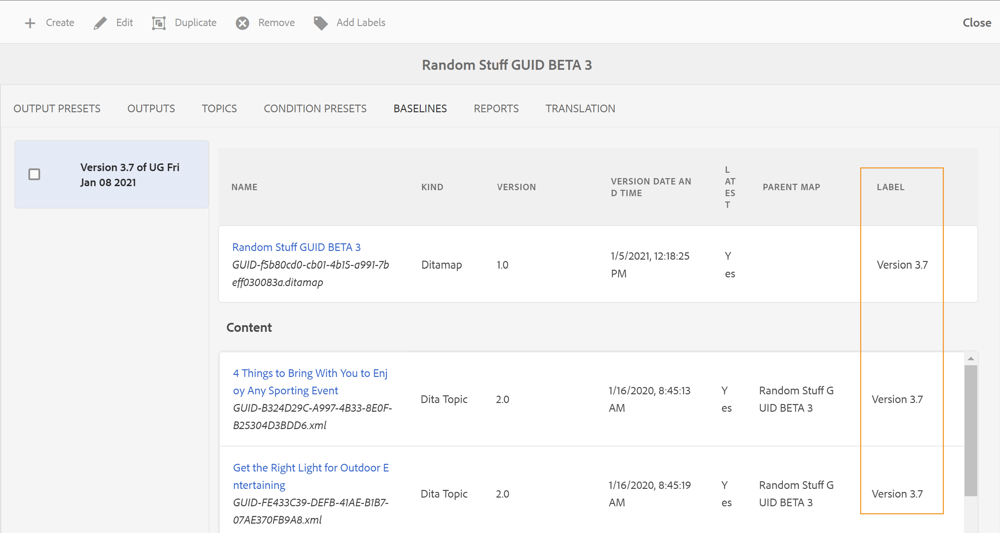
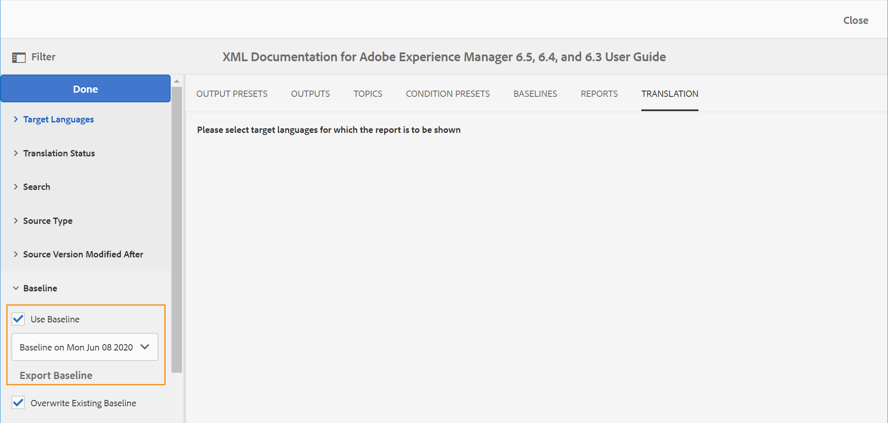

# 기준선을 사용한 작업 {#id1825FI0J0PF}

기준선 기능을 사용하면 게시나 변환에 사용할 수 있는 주제 및 자산의 버전을 만들 수 있습니다. 예를 들어 DITA 맵에 `topicA` 및 `imageA`을 사용하여 베이스라인을 생성하여 `topicA`, 그러나 4번째 버전의 `ImageA`. 기준선을 배치했으면 한 번의 클릭으로 다른 버전의 주제를 게시하거나 번역할 수 있습니다.

기준선을 선택하는 것은 출력 사전 설정에 선택 사항이며 DITA 맵에는 두 개 이상의 기준선이 있을 수 있습니다. 그러나 DITA 맵 내의 각 출력 사전 설정은 단일 기준선에만 연결할 수 있습니다. 게시 시 기준선을 지정하지 않으면 최신 버전의 콘텐츠를 사용하여 출력이 게시됩니다.

마찬가지로 컨텐츠를 번역하기 위해 기준선을 선택하는 것은 선택 사항입니다. 하지만 베이스라인(Baseline)을 사용하여 컨텐츠를 번역하도록 선택하면 베이스라인 컨텐츠가 번역된 사본과 함께 저장됩니다. 그런 다음 번역된 기준 요소를 사용하여 외부 게시자와 공유하거나 보관하는 등의 추가 작업을 수행할 수 있습니다. 번역된 베이스라인 내보내기에 대한 자세한 내용은 [번역된 베이스라인 내보내기](#id196SE600GHS).

>[!TIP]
>
> 자세한 내용은 *기준선* [기준선 작업]에 대한 우수 사례 안내서의 섹션을 참조하십시오.

관리자는 맵 대시보드에서 기준선 탭을 구성할 수 있습니다. 자세한 내용은 *DITA 맵 대시보드에서 기준선 탭 구성* 섹션을 참조하십시오.

다음 단계를 수행하여 베이스라인 피쳐에 액세스할 수 있습니다.

1. Assets UI에서 로 이동하고 DITA 맵 파일을 클릭합니다.
1. 로 이동합니다. **기준선** 탭.

베이스라인 탭에서 다음 작업을 수행할 수 있습니다.

- [기준선 만들기](#id195FI0I0MUQ)
- [베이스라인 내용 보기](#id195FI0I0TLN)
- [기준선 편집, 복제 또는 제거](#id195FI0I0YJL)
- [기준선에 레이블 추가](#id184KD0T305Z)

## 기준선 만들기 {#id195FI0I0MUQ}

특정 버전의 주제 및 특정 날짜 및 시간에 사용할 수 있는 참조된 컨텐츠 또는 주제 버전에 대해 정의된 레이블로 기준선을 만들 수 있습니다. 게시 또는 번역 워크플로우에서 기준선을 적용할 때마다 선택한 주제와 해당 버전이 출력 생성 또는 번역에 포함되도록 기준선에서 선택한 주제의 버전을 개별적으로 지정할 수 있습니다.

베이스라인을 생성하려면 다음 단계를 수행합니다.

1. 기준 요소 페이지에서 **만들기**.
1. 베이스라인의 이름을 입력합니다. **기준선 이름**.
1. in **버전 기준 설정**&#x200B;다음 옵션 중 하나를 선택합니다.

   - **레이블**: 적용된 레이블에 따라 주제를 선택하려면 이 옵션을 선택합니다. 입력한 문자열을 기준으로 목록을 필터링할 레이블을 입력합니다. 필터링된 아웃 목록에서 레이블을 선택하여 지정된 레이블이 있는 주제 및 기타 자산을 선택할 수 있습니다.
   선택 시 **레이블**&#x200B;또한 지정된 레이블이 적용되지 않은 최신 버전의 항목을 사용하는 추가 옵션이 제공됩니다. 이 옵션을 선택하지 않고 지정된 레이블이 없는 주제 또는 미디어 파일이 있으면 베이스라인 작성 프로세스가 실패합니다. 레이블 추가에 대한 자세한 내용은 [레이블 사용](web-editor-use-label.md#).

   - **버전** &lt;*타임스탬프*\>: 지정한 날짜 및 시간에 따라 주제 버전을 선택합니다. 여기서 지정하는 시간은 AEM 서버의 시간대에 해당합니다. 서버가 다른 시간대에 있는 경우 해당 항목은 사용자의 로컬 시간대가 아니라 서버의 시간대에 따라 선택됩니다.

   레이블 또는 버전을 날짜로 선택하면 맵 내의 참조된 모든 항목 및 미디어 파일이 그에 따라 선택됩니다. 사용자 인터페이스에는 표시되지 않지만 백엔드에 저장됩니다.

1. 하나 이상의 주제에 다른 버전을 사용하려면 해당 항목을 수동으로 선택하여 사용할 수 있습니다. 클릭 **항목 찾아보기**&#x200B;다른 버전을 사용할 항목을 선택합니다. 선택한 항목의 버전 선택 드롭다운 목록에서 베이스라인에서 사용할 주제 버전을 선택하고 **확인**.

   {width="800" align="left"}

   주제 및 선택한 버전에 대한 정보가 백엔드에 저장됩니다. 이 단계를 반복하여 여러 주제에 대해 선택한 버전을 변경할 수 있습니다.

1. 을(를) 클릭합니다. **모든 항목 찾아보기** DITA 맵에서 참조하는 모든 주제 및 미디어 파일을 로드하기 위한 링크입니다.주제 및 미디어 파일의 UUID는 주제 제목 또는 \(media\) 파일 이름 아래에도 표시됩니다.

   >[!NOTE]
   >
   > 중첩된 맵과 주제가 있는 DITA 맵에 매우 큰 파일 세트가 있는 경우 모든 항목 찾아보기를 클릭하면 모든 파일을 로드하는 데 시간이 걸릴 수 있습니다.

   맵의 내용은 다음 세 섹션에 나와 있습니다. 맵 파일, 컨텐츠 \(항목 참조\) 및 참조 컨텐츠 \(중첩된 항목, 맵 및 기타 자산\). 참조된 컨텐츠를 모두 사용할 수 있게 되면 베이스라인에서 사용할 항목의 버전을 개별적으로 선택할 수 있습니다.

   다음 **버전** 드롭다운 목록에는 주제 또는 참조된 콘텐츠의 사용 가능한 버전이 표시됩니다. 참조된 콘텐츠의 경우 버전을 자동으로 선택할 수 있습니다.

   만약 **자동으로 선택** 참조된 컨텐츠의 경우 시스템에서 참조되는 컨텐츠의 버전에 해당하는 참조된 컨텐츠의 버전을 자동으로 선택합니다. 예를 들어 항목 A에 이미지 B에 대한 참조가 있다고 가정해 보겠습니다. 항목 A의 버전 1.5가 만들어졌을 때 이미지 B의 버전은 리포지토리에서 1.2였습니다. 이제, 이미지 B가 설정된 항목 A의 버전 1.5를 사용하여 기준선을 만들 때 **자동으로 선택**&#x200B;로 지정하는 경우 시스템은 이미지 B의 버전 1.2를 자동으로 선택합니다.

   레이블을 사용하여 베이스라인을 생성하는 경우 **자동으로 선택** 는 참조된 모든 컨텐츠의 버전에 적용됩니다.

   참조된 컨텐츠 또는 자산 \(주제, 하위 맵, 이미지 또는 비디오\)의 버전이 \(예: 새로 업로드한 컨텐츠\)되지 않으면 기준선을 만들면 해당 파일에 대한 버전이 만들어집니다. 그러나 파일의 버전이 지정되면 해당 파일에 대해 증분 버전이 만들어지지 않습니다. 이 동작은 기본적으로 활성화되어 있는 버전 자동 만들기 설정에 의해 제어됩니다. 또한 번역 프로세스에서 모든 파일에 버전이 있어야 하는 컨텐츠를 번역하는 데에도 필요합니다.

   >[!NOTE]
   >
   > 특정 리소스에 대해 다른 버전을 지정하려면 **버전** 드롭다운 목록.

1. **저장**&#x200B;을 클릭합니다.

## 베이스라인 내용 보기 {#id195FI0I0TLN}

베이스라인 탭을 누르고 목록에서 원하는 베이스라인 버전을 선택하여 기존 베이스라인 컨텐츠를 볼 수 있습니다. 베이스라인 페이지는 DITA 맵 파일, 맵의 컨텐트 또는 주제, 참조된 컨텐트의 세 부분으로 나뉘어집니다. 맵에 하위 맵이 포함되어 있으면 하위 맵에서 참조되는 항목도 컨텐츠 섹션에도 표시됩니다. 기준 요소 페이지의 다양한 열은 아래에 설명되어 있습니다.

- **이름**: DITA 맵이나 주제 제목이나 자산의 이름(예: 이미지 파일 이름)을 나열합니다.

- **종류**: DITA 맵, DITA 주제 또는 이미지 형식과 같은 맵의 자산 종류 또는 유형을 나열합니다.

- **버전**: 기준선에서 사용할 수 있는 자산 버전을 나열합니다.

- **버전 날짜 및 시간**: 선택한 버전에 대한 자산의 생성 날짜 및 시간을 나열합니다.

- **최신 항목**: 베이스라인에서 최신 버전의 자산을 사용할지 여부를 나열합니다.

- **상위 맵**: 맵 파일에 하위 맵이 포함되어 있으면 이 열에는 항목을 참조하는 맵의 이름이 포함됩니다.

- **레이블**: 주제 버전에 적용된\(s\) 레이블을 나열합니다.

- **참조자**: 이 열은 참조된 컨텐츠에만 사용할 수 있습니다. 참조된 자산의 상위 항목을 나타냅니다. 자산을 여러 주제에서 참조하는 경우 항목은 쉼표로 구분됩니다.

## 기준선 편집, 복제 또는 제거 {#id195FI0I0YJL}

**기준선 편집**

기존 베이스라인을 편집하려면 다음 단계를 수행하십시오.

1. 베이스라인을 선택하고 을 클릭합니다 **편집**.
1. 기준선에서 필요한 변경 작업을 수행합니다. 주제 또는 참조된 콘텐츠의 이름과 버전을 변경할 수 있습니다.
1. **저장**&#x200B;을 클릭합니다.

**기준선 복제**

베이스라인을 선택하고 을 클릭합니다 **복제** 기존 베이스라인의 사본을 생성하기 위해 기준선에 다른 이름을 지정하고 주제 및 참조된 컨텐츠에 대한 버전 번호를 선택하고 **저장**.

**기준선 제거**

베이스라인 버전을 선택하고 **제거** 베이스라인 제거

## 기준선에 레이블 추가 {#id184KD0T305Z}

모든 단일 항목에 레이블을 추가하는 것은 시간이 걸릴 수 있습니다. AEM 안내서에서는 DITA 맵에서 여러 주제와 참조된 컨텐츠에 레이블을 추가하는 단일 클릭 메커니즘을 제공합니다.

다음 단계를 수행하여 DITA 맵에서 여러 주제 및 참조된 컨텐츠에 레이블을 추가합니다.

1. 기준 요소 페이지에서 레이블을 추가할 주제 및 참조된 컨텐츠가 포함된 기준 요소를 선택합니다.

   >[!NOTE]
   >
   > 기준선에 최신 버전의 주제나 자산이 없는지 확인합니다. 레이블은 버전이 지정된 주제 또는 자산에만 추가할 수 있습니다.

1. 클릭 **레이블 추가**.

   {width="800" align="left"}

1. 에서 **레이블 추가** 대화 상자에서 이 베이스라인에 연결할 고유한 레이블을 지정합니다.

   관리자가 사전 정의된 레이블을 구성한 경우 드롭다운 목록에 해당 레이블이 표시됩니다. 목록에서 레이블을 선택해야 합니다.

1. 하위 맵에서 참조하는 항목에 레이블을 적용하려면 을(를) 선택합니다 **하위 맵 및 종속 항목에 레이블 적용** 선택 사항입니다.

   - 클릭 **추가**.
지정된 레이블이 DITA 맵과 참조된 주제 및 컨텐츠에 추가됩니다.

      {width="650" align="left"}

## 번역된 베이스라인 내보내기 {#id196SE600GHS}

컨텐츠를 번역하는 데 기준선을 사용할 수 있습니다. 예를 들어, 프랑스어로 번역할 수 있는 버전 1.1의 기준선을 만들 수 있습니다. 번역 탭에서 기준 요소를 사용하여 컨텐츠를 필터링한 다음 컨텐츠의 버전 1.1에 대한 기준 요소를 선택해야 합니다. 컨텐츠를 번역하는 데 기준선을 사용하면 컨텐츠를 보다 쉽게 관리할 수 있습니다.

컨텐츠가 번역되면 보관 또는 공유하기 위해 번역된 베이스라인을 내보내거나 조직의 다른 팀과 공유할 수 있습니다. 번역된 기준선을 내보내기 전에 다음 사항을 고려해야 합니다.

- 베이스라인 내보내기는 베이스라인 컨텐츠를 번역한 후에만 가능합니다. 번역이 시작되지 않거나 완료되지 않은 기준 요소를 내보내려고 하면 오류가 발생합니다.
- 이미 번역된 버전에 대한 기준선만 전송할 수 있습니다. 예를 들어, 컨텐츠 버전 1.1에 대한 기준선을 만들었지만 동일한 기준선을 번역한 경우 이 기준선을 내보낼 수 있습니다. 그러나 변환되지 않은 버전 1.2에 대한 베이스라인을 생성한 경우에는 이 베이스라인을 내보낼 수 없습니다.
- 베이스라인(Baseline)을 이미 익스포트한 경우 *기존 기준 요소 덮어쓰기* 을(를) 내보내는 동안 옵션을 선택합니다.

번역된 베이스라인을 내보내려면 다음 단계를 수행하십시오.

1. 번역된 기준선이 포함된 DITA 맵을 엽니다.

1. 에서 **번역** 탭에서 을 확장합니다. **기준선** 왼쪽 레일에서 사용할 수 있는 옵션.

   {width="800" align="left"}

1. 을(를) 선택합니다 **기준선 사용** 옵션을 선택하고 내보낼 베이스라인을 선택합니다.

1. 클릭 **베이스라인 내보내기**.

   내보내기 상태가 표시됩니다. 프로세스가 성공하면 베이스라인을 내보내는 언어를 설명하는 메시지가 표시됩니다. 실패의 경우 실패 원인이 표시됩니다.

   이미 내보낸 베이스라인을 내보내려고 하면 베이스라인 작성 실패 메시지도 표시됩니다.

1. \(선택 사항\) 이미 내보낸 베이스라인을 내보내려면 을 선택합니다 **기존 기준 요소 덮어쓰기** 을 클릭한 다음 **베이스라인 내보내기**.

**상위 항목:**[&#x200B;출력 생성](generate-output.md)
