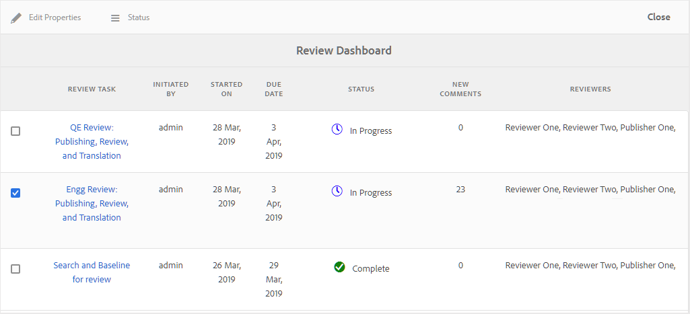

# 검토 대시보드를 사용하여 검토 작업 관리 {#id2056B0Y70X4}

검토 관리 워크플로우에는 다양한 작업이 포함될 수 있습니다. 예를 들어 특정 주제에 대해 검토자를 추가하거나 검토 기한을 연장할 수 있습니다. 모든 이해 관계자가 피드백을 받았다고 생각되면 검토 작업을 완료로 표시할 수도 있습니다. 이러한 작업은 검토 대시보드를 사용하여 관리할 수 있습니다.

다음 단계를 수행하여 검토 대시보드에 액세스하여 사용합니다.

>[!NOTE]
>
> 작성자 \(또는 이니시에이터\)인 프로젝트에만 검토 작업을 관리할 수 있습니다. 검토자 또는 게시자 \(user\)라도 프로젝트 작업에 대한 액세스 권한은 없습니다.

1. 에서 **프로젝트** 콘솔에서 관리할 검토 프로젝트를 클릭합니다.

   작업 타일이 있는 프로젝트 패널이 표시됩니다.

   

1. 에서 세 점을 클릭합니다 **검토** 타일.

   검토 대시보드가 표시됩니다. 대시보드에는 사용자가 만든 모든 검토 작업이 나열됩니다.

   

   검토 대시보드는 작업 이름, 검토를 시작한 날짜, 검토를 시작한 날짜, 기한 날짜, 상태, 작성자가 수락하거나 거부하지 않은 새 주석 수, 검토자 이름 등 검토 작업에 대한 세부 정보를 표시합니다. 작업은 새로 생성된 작업 순서대로 이전 작업에 나열됩니다.

   >[!NOTE]
   >
   > 검토 작업 링크를 누르면 검토를 위해 보내진 주제 또는 맵 파일이 열립니다.

1. 검토 작업을 선택합니다.

   속성 편집과 [상태](#check-review-status-id199RF0A0UHS) 옵션 을 클릭합니다.

1. 를 클릭하면 **속성 편집**&#x200B;을 지정하면 작업 세부 사항 페이지가 표시됩니다.

   작업 세부 사항 페이지에는 작업, 콘텐츠 및 검토자 탭이 세 개 있습니다. 다음 섹션에서는 각 탭에서 사용할 수 있는 다양한 기능에 대해 설명합니다.

## 작업 탭

에서는 다음 작업을 수행할 수 있습니다 **작업** 탭:

- 작업 제목을 **제목** 필드.
- 에 기본 할당 추가 **할당 대상** 드롭다운 목록. 여기에서 추가하는 검토자에게는 이 검토 작업의 일부인 모든 항목을 검토할 수 있는 액세스 권한이 부여됩니다. 에서 특정 주제에 대한 검토자를 제거하거나 선택적으로 추가할 수 있습니다 [검토자 탭](#reviewer-tab-id199RF0N0MUI).
- 에서 작업 설명을 업데이트합니다. **설명** 필드.
- 수정 **기한**. 작업 완료에 대한 기한을 미리 지정하거나 연기할 수 있습니다.
- 사용자에게 할당된 항목만 검토하도록 사용자를 제한하려면 옵션을 선택합니다.
- 클릭 **업데이트** 를 눌러 수정된 세부 정보를 업데이트합니다.
- 클릭 **완료** 검토 작업을 기한 전에 완료로 표시하려면 개별 항목의 작업이 완료됨으로 표시되면 선택한 항목의 검토가 닫힙니다. 그러나 DITA 맵을 통해 검토를 위해 공유되는 항목의 경우 DITA 맵 작업을 완료로 표시하면 검토를 위해 공유된 맵 내의 모든 주제 검토가 닫힙니다.
- 클릭 **복제** 검토 작업의 복사본을 만들려면 중복 검토 작업을 만드는 프로세스는 새 검토 작업을 만드는 프로세스와 유사합니다. 중복 작업 워크플로우를 시작하면 검토 작업 생성 페이지가 표시됩니다. 에 설명된 대로 새 작업 세부 사항을 제공해야 합니다. [검토할 항목 보내기](review-send-topics-for-review.md#).

   DITA 맵에서 만든 검토 작업을 선택한 경우 맵의 일부인 주제가 표시됩니다. 그런 다음 새 검토 작업에 포함할 항목을 선택할 수 있습니다.

   하나 이상의 주제 검토에서 중복되는 검토 작업의 경우 검토 작업 목록에 해당 주제만 표시됩니다. 이러한 항목을 다른 검토자 집합과 공유할 수 있습니다.

- 클릭 **닫기** 받은 편지함 페이지로 이동합니다.

## 콘텐츠 탭

에서는 다음 작업을 수행할 수 있습니다 **컨텐츠** 탭:

- 검토를 위해 전송된 항목의 버전을 변경합니다. 항목의 최신 버전, 날짜를 기준으로 버전, 특정 레이블이 있는 버전 또는 특정 기준선 \(DITA 맵의 경우)을 선택할 수 있습니다.

- 클릭 **업데이트** 검토자와 업데이트된 버전의 항목을 공유하려면 다음을 수행하십시오. 검토자는 최신 버전의 주제가 검토를 위해 전송되었다는 이메일 알림을 받습니다. 다음에 검토자가 주제를 열면 해당 항목의 업데이트된 버전이 표시됩니다.

   >[!NOTE]
   >
   > 업데이트된 버전의 항목의 경우 이전 주석이 최신 버전에서도 유지됩니다. 검토자는 두 버전 간의 차이점을 볼 수도 있습니다.

- 클릭 **완료** 검토 작업을 기한 전에 완료로 표시하려면 개별 항목의 작업이 완료됨으로 표시되면 선택한 항목의 검토가 닫힙니다. 그러나 DITA 맵을 통해 검토를 위해 공유되는 항목의 경우 DITA 맵 작업을 완료로 표시하면 검토를 위해 공유된 맵 내의 모든 주제 검토가 닫힙니다.

- 클릭 **복제** 현재 작업을 기본으로 사용하여 새 검토 작업을 생성합니다.

## 검토자 탭 {#reviewer-tab-id199RF0N0MUI}

에서는 다음 작업을 수행할 수 있습니다 **검토자** 탭:

- **모두 선택**: 주제 목록에서 모든 주제를 선택합니다. 모든 항목을 선택한 후 배치 작업을 쉽게 수행할 수 있습니다.
- **선택 항목 지우기**: 주제 목록에서 선택한 주제를 선택 취소합니다.

   >[!NOTE]
   >
   > 주제 옆에 있는 확인란을 클릭하여 항목을 개별적으로 선택하거나 선택 취소할 수도 있습니다.

- **추가**: 검토자 추가 대화 상자를 표시합니다. 선택한 항목에 검토자로 추가할 검토자 또는 사용자 역할 \(또는 그룹\)의 이름을 입력할 수 있습니다.
- **제거**: 검토자 제거 대화 상자를 표시합니다. 선택한 항목에서 검토자로 제거할 검토자 또는 사용자 역할 \(또는 그룹\)의 이름을 입력할 수 있습니다.
- **재지정**: 검토자 재지정 대화 상자를 표시합니다. 검토 작업을 지정할 검토자 또는 사용자 역할 \(또는 그룹\)의 이름을 입력할 수 있습니다. 이렇게 하면 선택한 항목에서 기존 검토자가 모두 제거되고 새로 선택한 검토자가 해당 항목에 할당됩니다.
- **내보내기**: CSV 파일로 검토 작업 세부 사항을 내보낼 수 있습니다. 이 파일에는 항목의 경로 및 제목, 검토자 이름, 검토를 위해 전송된 항목 버전 등의 세부 정보가 포함되어 있습니다.
- **검토자 편집**: 클릭 주제 목록의 아이콘에 검토자 편집 대화 상자가 표시됩니다. 이 대화 상자에서 선택한 주제에 대한 검토자를 추가하거나 제거할 수 있습니다.

## 검토 작업 상태 확인 {#check-review-status-id199RF0A0UHS}

기본 검토 대시보드 페이지에서 검토 작업을 선택하고 을 클릭합니다 **상태**&#x200B;로 설정되면 검토 작업의 상태 보고서가 표시됩니다.

검토 작업의 상태 보고서에는 다음 세부 정보가 포함됩니다.

- 검토 작업이 할당된 검토자의 이름\(s\)입니다.
- 상태 열은 검토 상태를 나타냅니다. 상태는 다음 중 하나일 수 있습니다.
   - **시작되지 않음**: 검토자가 아직 검토 링크를 열지 않았습니다.
   - **진행 중**: 검토자가 검토 링크를 열고 항목을 검토하는 중입니다.
   - **완료**: 검토자가 할당된 검토 작업을 완료하여 검토를 완료했습니다. 검토 작업은 각 검토자의 AEM 알림 받은 편지함에 있습니다.
- 검토자가 검토 링크를 열고 해당 주제가 검토됨 목록에 추가되는 특정 항목으로 이동하면 이렇게 하면 작성자가 검토자가 각 섹션을 열었는지 여부를 확인하는 데 도움이 됩니다. 댓글이 있으면 대괄호로 표시됩니다.
- 모든 주제에 대해 수행된 총 댓글 수입니다. 검토 중인 여러 항목의 경우 각 주제에 대한 댓글 수가 주제 이름에 대해 \(대괄호\)로 언급됩니다.
- 검토자가 항목을 마지막으로 액세스한 날짜입니다.

**상위 항목:**[&#x200B;항목 또는 맵 검토](review.md)

