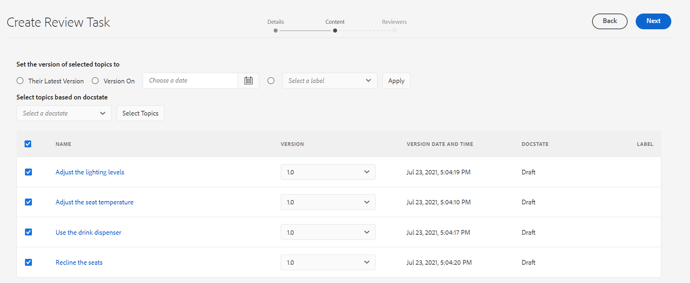

# 검토할 항목 보내기 {#id199RD0S035Z}

검토 워크플로우는 검토용 주제 목록을 지정하고, 여러 검토자를 추가하고, 검토 작업에 대한 타임라인을 지정하는 다중 검토자 환경을 만듭니다. AEM 가이드를 사용하면 작성자 및 게시자 그룹에 속하는 사용자가 검토를 시작할 수 있습니다.

검토 워크플로우는 프로젝트별로 다르므로 검토 개시자가 프로젝트 팀의 일부이거나 프로젝트를 만들 수 있는 권한이 있어야 합니다. 프로젝트를 만들 때 프로젝트에 대한 팀 구성원을 정의하고 다양한 역할 또는 그룹을 지정합니다. 프로젝트에 대한 자세한 내용은 [DITA 프로젝트 만들기](authoring-create-dita-project.md#).

다음 위치에서 검토 작업을 만들 수 있습니다.

- **웹 편집기**: 검토를 위해 개별 주제 또는 DITA 맵을 보낼 수 있습니다. 검토 작업을 만드는 워크플로우는 웹 편집기 및 자산 UI에서 일반적입니다. 검토 워크플로우를 시작하는 방법만 다릅니다. 웹 편집기에서 검토 워크플로우를 시작하는 방법에 대한 자세한 내용은 [검토 작업 만들기](web-editor-features.md#id215OCJ00JXA) 기능을 사용할 수 있습니다.

- **자산 UI**: 검토를 위해 하나 이상의 주제와 DITA 맵을 보낼 수 있습니다. Assets UI에서 검토할 문서 공유는 이 항목에 설명되어 있습니다.

Assets UI에서는 작성자/게시자가 검토 작업을 만들 수 있는 두 가지 방법이 있습니다.

- 검토할 하나 이상의 항목을 보냅니다.
- 검토를 위해 DITA 맵에서 여러 주제 보내기

## 검토할 하나 이상의 항목을 보냅니다. {#id1721E600FY4}

>[!IMPORTANT]
>
> 검토 작업을 만들기 전에 프로젝트를 만들고 해당 프로젝트에 검토자를 추가했는지 확인하십시오.

검토 작업을 만들고 검토할 항목을 보내려면 다음 단계를 수행하십시오.

>[!NOTE]
>
> DITA 프로젝트에서 작성자 또는 게시자인 경우에만 검토 작업을 만들 수 있습니다.

1. 자산 UI에서 필요한 폴더로 이동합니다.

1. 빠른 작업에서 선택 아이콘을 클릭하고 검토를 위해 전송할 항목을 선택합니다.

   

1. 도구 모음에서 **검토 작업 만들기**. 검토 작업 생성 페이지가 표시됩니다.

   >[!NOTE]
   >
   > 개정이 있는 주제에 대해서만 검토 작업을 만들 수 있습니다. 선택한 주제에 개정이 없는 경우 프롬프트가 표시됩니다.

   

1. 을(를) 입력합니다. **제목** 작업에 대해 DITA를 선택합니다 **프로젝트** 드롭다운 목록에서 을 선택합니다.

1. 에서 **할당 대상** 드롭다운 필드에서 검토할 항목을 보낼 검토자를 선택합니다.

   프로젝트의 개별 사용자 또는 사용자 그룹에 검토 작업을 지정할 수 있습니다. 프로젝트 관리자 그룹의 일부인 경우에만 개별 사용자에게 검토 작업을 지정할 수 있습니다. 그렇지 않으면 지정 대상 필드에만 사용자 그룹이 표시됩니다.

   >[!NOTE]
   >
   > 검토 워크플로우는 프로젝트별로 다릅니다. 프로젝트를 만들 때 프로젝트에 팀 구성원을 추가하고 그룹에 지정합니다. 따라서 여기에서 프로젝트를 선택하면 해당 프로젝트의 일부인 구성원을 선택할 수 있습니다. 프로젝트에 대한 자세한 내용은 [DITA 프로젝트 만들기](authoring-create-dita-project.md#).

1. 을(를) 입력합니다. **설명** Analytics Mobile Apps 또는 Analytics Premium이 없습니다.

   이 설명은 검토자에게 보낼 알림 전자 메일의 본문으로 사용됩니다.

1. 을(를) 선택합니다 **기한** 그리고 검토 기한을 표시할 시간입니다.

   >[!NOTE]
   >
   > 최종 기한에 도달하면 검토 작업이 완료되었음을 알리는 이메일이 개시자에게 전송됩니다. 개시자는 [검토 대시보드](review-manage-tasks-review-dashboard.md#).

1. 에서 루트 맵을 선택합니다 **루트 맵 경로**. 이 루트 맵은 검토 컨텐츠에 사용되는 모든 주요 참조 및 용어집 용어를 확인하는 데 사용됩니다. 루트 맵을 선택하지 않으면 검토를 위해 주제를 보내기 전에 DITA 주제와 연관된 주요 참조 또는 용어집 용어가 해결되지 않습니다.

   DITA 맵에 대한 검토를 만드는 경우 기본적으로 **루트 맵 경로** 이 해당 맵의 경로로 설정됩니다. 단일 또는 여러 주제에 대한 검토를 만드는 경우 기본적으로 **루트 맵 경로** 사용자 환경 설정에 정의된 맵으로 설정됩니다.

   >[!NOTE]
   >
   > 선택한 루트 맵이 키 참조를 확인하는 가장 높은 우선 순위를 갖습니다. 자세한 내용은 [주요 참조 확인](map-editor-other-features.md#id176GD01H05Z).

1. 다른 주제에 서로 다른 검토자를 할당할 수 있으므로 **할당자가 항목을 검토하도록 허용** 선택 사항은 검토자가 검토 작업의 모든 항목을 검토할 수 있는지 아니면 검토하도록 지정된 주제만 검토할 수 있는지를 제어합니다.

   모든 검토자가 검토 작업의 항목을 검토하도록 하려면 **할당자가 항목을 검토하도록 허용**.

   이 옵션을 선택하지 않으면 검토자가 **할당 대상** 필드에서는 지정된 주제만 검토할 수 있습니다.

1. **다음**&#x200B;을 클릭합니다.

   컨텐츠 페이지가 표시됩니다.

   

1. 컨텐츠 페이지에서 검토용으로 공유할 항목의 버전을 선택합니다.

   다음 방법 중 하나를 사용하여 버전을 선택할 수 있습니다.

   - *\(기본값\)* 옵션을 선택합니다 **최신 버전** 항목을 마지막으로 저장한 개정을 선택하려면
   - 을(를) 선택합니다 **버전** 옵션을 선택하고 지정된 날짜 및 시간에 따라 버전을 선택할 날짜 및 시간을 지정합니다. 지정한 날짜에 사용 가능한 주제 버전이 없다면 지정된 날짜 및 시간 바로 뒤에 사용 가능한 버전이 선택됩니다.
   - 을(를) 선택합니다 **레이블 선택** 옵션을 선택하고 드롭다운 목록에서 레이블을 선택합니다.
1. 버전을 선택하기 위해 선택한 후 **적용**.

   선택한 옵션을 기반으로 한 버전이 주제에 대해 선택됩니다.

   >[!NOTE]
   >
   > 또는 **버전** 각 항목의 드롭다운 목록입니다.

1. **다음**&#x200B;을 클릭합니다.

   검토자를 추가하거나 제거할 수 있는 검토자 페이지가 표시됩니다. 기본적으로 할당 대상 필드에 추가된 검토자는 검토를 위해 선택한 각 항목에 자동으로 추가됩니다.

   

1. 검토자 페이지에서 검토자를 추가하거나 제거할 수 있습니다. 검토자 페이지에서 다음 작업을 사용할 수 있습니다.

   - **모두 선택**: 주제 목록에서 모든 주제를 선택합니다. 모든 항목을 선택한 후 배치 작업을 쉽게 수행할 수 있습니다.
   - **선택 항목 지우기**: 주제 목록에서 선택한 주제를 선택 취소합니다.

      >[!NOTE]
      >
      > 주제 옆에 있는 확인란을 클릭하여 항목을 개별적으로 선택하거나 선택 취소할 수도 있습니다.

   - **추가**: 검토자 추가 대화 상자를 표시합니다. 선택한 항목에 검토자로 추가할 검토자 또는 사용자 역할 \(또는 그룹\)의 이름을 입력할 수 있습니다.
   - **제거**: 검토자 제거 대화 상자를 표시합니다. 선택한 항목에서 검토자로 제거할 검토자 또는 사용자 역할 \(또는 그룹\)의 이름을 입력할 수 있습니다.

      >[!NOTE]
      >
      > 검토자 상자에서 교차 기호를 클릭하여 주제의 검토를 제거할 수도 있습니다.

   - **재지정**: 검토자 재지정 대화 상자를 표시합니다. 검토 작업을 지정할 검토자 또는 사용자 역할 \(또는 그룹\)의 이름을 입력할 수 있습니다. 이렇게 하면 선택한 항목에서 기존 검토자가 모두 제거되고 새로 선택한 검토자가 해당 항목에 할당됩니다.
   - **내보내기**: CSV 파일로 검토 작업 세부 사항을 내보낼 수 있습니다. 이 파일에는 항목의 경로 및 제목, 검토자 이름, 검토를 위해 전송된 항목 버전 등의 세부 정보가 포함되어 있습니다.
   - **검토자 편집**: 클릭 주제 목록의 아이콘에 검토자 편집 대화 상자가 표시됩니다. 이 대화 상자에서 선택한 주제에 대한 검토자를 추가하거나 제거할 수 있습니다.
1. 클릭 **만들기** 검토 작업을 만들려면

   검토 작업이 성공적으로 만들어지면 확인 메시지가 표시됩니다. 다음 [문서 상태](web-editor-document-states.md#) 검토를 위해 전송된 항목의 경우 검토 중으로 설정됩니다.

   >[!NOTE]
   >
   > 화면 오른쪽 상단에 있는 알림 종을 클릭하고 검토 작업이 성공적으로 만들어졌는지 확인할 수도 있습니다. 알림 패널에서는 검토 작업의 일부였던 검토자에 대해 알림 하나를 표시하고 검토 개시자에 대한 알림 하나를 확인할 수 있습니다.

검토하기 위해 주제 또는 여러 주제가 지정되었음을 알리는 이메일을 모든 검토자에게 보냅니다. 전자 메일에는 브라우저 창에서 항목을 클릭하고 액세스할 수 있는 직접 링크가 포함되어 있습니다.

여러 주제가 지정되는 경우 검토자는 웹 브라우저의 주제 드롭다운 목록에서 해당 항목을 보고 선택할 수 있습니다.

## DITA 맵에서 검토할 여러 주제 보내기

DITA 맵은 책 내의 주제 논리 조직입니다. 검토를 위해 개별 주제를 보낼 때 검토자는 책에서 해당 항목의 위치에 대한 정보를 받지 않습니다. 검토자가 검토 중인 항목의 정확한 위치에 대한 정보를 가지고 있으면 검토자가 검토 중인 항목의 더 나은 컨텍스트를 받습니다.

AEM 가이드를 사용하면 검토를 위해 DITA 맵에 하나 이상의 주제를 동시에 보낼 수 있습니다. 검토자는 검토를 위해 공유된 주제와 함께 전체 맵 파일을 볼 수 있습니다. 이렇게 하면 검토자가 맵 또는 책 파일에서 주제 컨텍스트를 쉽게 가져올 수 있습니다.

동일한 DITA 맵을 여러 검토 작업에서 검토할 수 있습니다. 예를 들어 DITA 맵에 주제 A, B, C, D 및 E가 있는 경우 한 검토 작업에서 검토를 위해 A, B 및 C를 공유할 수 있고 다른 검토 작업에서는 검토를 위해 주제 C, D 및 E를 보낼 수 있습니다. 검토 프로세스를 통해 동일한 항목을 공유하고 여러 검토 작업에 파일을 매핑할 수 있습니다. 여러 검토 작업의 일반적인 항목에 대해 하나의 검토 작업에 지정된 주석은 다른 검토 작업의 주석으로 덮어쓰거나 병합되지 않습니다.

>[!IMPORTANT]
>
> 맵 파일의 주제가 여러 검토 작업에서 공유된 경우, 모든 검토 작업이 완료될 때까지 해당 상태는 검토 중 상태로 표시됩니다.

검토를 위해 맵 파일과 함께 하나 이상의 항목을 보내려면 다음 단계를 수행하십시오.

>[!IMPORTANT]
>
> 맵 파일을 통해 검토를 시작하면 새 항목을 추가하거나 기존 항목을 제거하여 맵 파일의 구조를 변경할 수 없습니다.

1. 자산 UI에서 필요한 폴더로 이동합니다.

   >[!NOTE]
   >
   > 콘솔의 보기가 카드 보기나 목록 보기로 설정되어 있는지 확인합니다.

1. 검토할 주제를 보낼 맵을 선택합니다.

1. 도구 모음에서 **검토 작업 만들기**. 검토 작업 생성 페이지가 표시됩니다.

1. 을(를) 입력합니다. **제목** 작업에 대해 DITA를 선택합니다 **프로젝트** 드롭다운 목록에서 을 선택합니다.

   >[!NOTE]
   >
   > 개정이 있는 주제에 대해서만 검토 작업을 만들 수 있습니다. 맵에 개정이 없는 주제가 포함되어 있는 경우, 이러한 파일 목록이 있는 메시지가 표시됩니다. 개정이 없는 파일은 검토 작업에서 제외됩니다.

1. 에서 **할당 대상** 드롭다운 필드에서 검토할 항목을 보낼 검토자를 선택합니다.

   프로젝트의 개별 사용자 또는 사용자 그룹에 검토 작업을 지정할 수 있습니다. 프로젝트 관리자 그룹의 일부인 경우에만 개별 사용자에게 검토 작업을 지정할 수 있습니다. 그렇지 않으면 지정 대상 필드에만 사용자 그룹이 표시됩니다.

   >[!NOTE]
   >
   > 검토 워크플로우는 프로젝트별로 다릅니다. 프로젝트를 만들 때 프로젝트에 팀 구성원을 추가하고 그룹에 지정합니다. 따라서 여기에서 프로젝트를 선택하면 해당 프로젝트의 일부인 구성원을 선택할 수 있습니다. 프로젝트에 대한 자세한 내용은 [DITA 프로젝트 만들기](authoring-create-dita-project.md#).

1. 을(를) 입력합니다. **설명** Analytics Mobile Apps 또는 Analytics Premium이 없습니다.

   이 설명은 검토자에게 보낼 알림 전자 메일의 본문으로 사용됩니다.

1. 을(를) 선택합니다 **기한** 그리고 검토 기한을 표시할 시간입니다.

   >[!NOTE]
   >
   > 최종 기한에 도달하면 검토 작업이 완료되었음을 알리는 이메일이 개시자에게 전송됩니다. 개시자는 [검토 대시보드](review-manage-tasks-review-dashboard.md#).

1. 다른 주제에 서로 다른 검토자를 할당할 수 있으므로 **할당자가 항목을 검토하도록 허용** 선택 사항은 검토자가 검토 작업의 모든 항목을 검토할 수 있는지 아니면 검토하도록 지정된 주제만 검토할 수 있는지를 제어합니다.

   모든 검토자가 검토 작업의 항목을 검토하도록 하려면 **할당자가 항목을 검토하도록 허용**.

   이 옵션을 선택하지 않으면 검토자가 **할당 대상** 필드에서는 지정된 주제만 검토할 수 있습니다.

1. **다음**&#x200B;을 클릭합니다.

   맵 파일에서 참조되는 모든 항목이 있는 컨텐츠 페이지가 표시됩니다. DITA 맵에 중첩된 맵이 포함되어 있으면 중첩된 맵의 항목도 여기에 나열됩니다.

   

1. 컨텐츠 페이지에서 검토용으로 공유할 항목의 버전을 선택합니다.

   다음 방법 중 하나를 사용하여 버전을 선택할 수 있습니다.

   - *\(기본값\)* 옵션을 선택합니다 **최신 버전** 항목을 마지막으로 저장한 개정을 선택하려면
   - 을(를) 선택합니다 **버전** 선택 사항 및 날짜 및 시간에 따라 버전을 선택할 날짜 및 시간을 지정합니다. 지정한 날짜에 사용 가능한 주제 버전이 없다면 지정된 날짜 및 시간 바로 뒤에 사용 가능한 버전이 선택됩니다.
   - 을(를) 선택합니다 **레이블 선택** 옵션을 선택하고 드롭다운 목록에서 레이블을 선택합니다. 선택한 레이블이 포함된 모든 항목은 **버전** 드롭다운 목록.
   - 을(를) 선택합니다 **베이스라인 선택** 옵션을 선택하고 드롭다운 목록에서 베이스라인을 선택합니다. 선택한 베이스라인의 일부인 모든 주제 버전은 **버전** 드롭다운 목록.
1. 버전을 선택하기 위해 선택한 후 **적용**.

   선택한 옵션을 기반으로 한 버전이 주제에 대해 선택됩니다.

   >[!NOTE]
   >
   > 또는 **버전** 각 항목의 드롭다운 목록입니다.

1. **다음**&#x200B;을 클릭합니다.

   검토자를 추가하거나 제거할 수 있는 검토자 페이지가 표시됩니다. 기본적으로 할당 대상 필드에 추가된 검토자는 검토를 위해 선택한 각 항목에 자동으로 추가됩니다.

1. 검토자 페이지에서 검토자를 추가하거나 제거할 수 있습니다. 검토자 페이지에서 다음 작업을 사용할 수 있습니다.

   - **모두 선택**: 주제 목록에서 모든 주제를 선택합니다. 모든 항목을 선택한 후 배치 작업을 쉽게 수행할 수 있습니다.
   - **선택 항목 지우기**: 주제 목록에서 선택한 주제를 선택 취소합니다.

      >[!NOTE]
      >
      > 주제 옆에 있는 확인란을 클릭하여 항목을 개별적으로 선택하거나 선택 취소할 수도 있습니다.

   - **추가**: 검토자 추가 대화 상자를 표시합니다. 선택한 항목에 검토자로 추가할 검토자 또는 사용자 역할 \(또는 그룹\)의 이름을 입력할 수 있습니다.
   - **제거**: 검토자 제거 대화 상자를 표시합니다. 선택한 항목에서 검토자로 제거할 검토자 또는 사용자 역할 \(또는 그룹\)의 이름을 입력할 수 있습니다.
   - **재지정**: 검토자 재지정 대화 상자를 표시합니다. 검토 작업을 지정할 검토자 또는 사용자 역할 \(또는 그룹\)의 이름을 입력할 수 있습니다. 이렇게 하면 선택한 항목에서 기존 검토자가 모두 제거되고 새로 선택한 검토자가 해당 항목에 할당됩니다.
   - **내보내기**: CSV 파일로 검토 작업 세부 사항을 내보낼 수 있습니다. 이 파일에는 항목의 경로 및 제목, 검토자 이름, 검토를 위해 전송된 항목 버전 등의 세부 정보가 포함되어 있습니다.
   - **검토자 편집**: 클릭 주제 목록의 아이콘에 검토자 편집 대화 상자가 표시됩니다. 이 대화 상자에서 선택한 주제에 대한 검토자를 추가하거나 제거할 수 있습니다.

   >[!IMPORTANT]
   >
   > 검토 작업을 만들려면 적어도 한 명의 검토자를 할당해야 합니다.

1. 클릭 **만들기** 검토 작업을 만들려면

   검토 작업이 성공적으로 만들어지면 확인 메시지가 표시됩니다. 다음 [문서 상태](web-editor-document-states.md#) 검토를 위해 전송된 항목의 경우 검토 중으로 설정됩니다.

   >[!NOTE]
   >
   > 인터페이스 오른쪽 상단의 알림 패널을 클릭하고 작업이 성공적으로 만들어졌는지 확인할 수도 있습니다. 알림 패널에서는 검토 작업의 일부인 검토와 검토 개시자에 대한 하나의 알림에 대해 각각 하나의 알림을 찾을 수 있습니다.

   >[!IMPORTANT]
   >
   > 검토를 시작하면 DITA 맵이나 주제를 다른 위치로 이동하거나 삭제할 수 없습니다. 이렇게 하면 검토 프로세스가 중단됩니다.

검토용 주제가 할당되었음을 알리는 전자 메일이 모든 검토자에게 전송됩니다. 전자 메일에는 브라우저 창에서 항목을 클릭하고 액세스할 수 있는 직접 링크가 포함되어 있습니다. DITA 맵과 함께 주제가 검토 모드로 열립니다.

**상위 항목:**[&#x200B;항목 또는 맵 검토](review.md)

