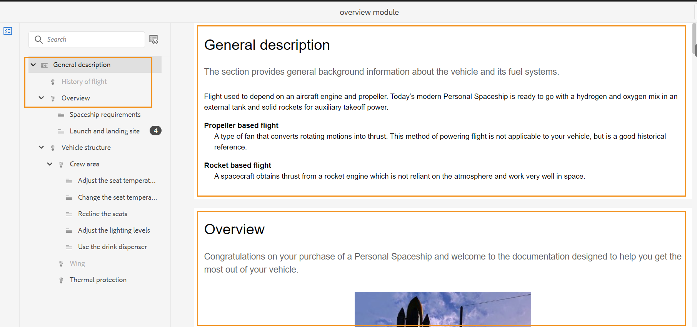

# 항목 검토 {#id2056B0W0FBI}

검토자인 경우 검토 항목에 대한 링크가 포함된 검토 요청 이메일을 받게 됩니다. 링크를 클릭하면 공유 주제에 대한 피드백을 추가할 수 있는 검토 페이지로 이동합니다.

다음 단계를 수행하여 항목을 검토합니다.

1. 검토 요청 이메일에 제공된 직접 링크를 클릭합니다.

   주제 또는 맵 링크가 브라우저에서 열립니다.

   >[!NOTE]
   >
   > AEM 사용자 인터페이스의 받은 편지함 알림 영역에서 주제 검토 링크에 액세스할 수도 있습니다.

1. 주제 검토를 시작하는 방식에 따라 다음 두 화면 중 하나를 볼 수 있습니다.

   >[!NOTE]
   >
   > 에서 검토를 만든 경우 UI가 다를 수 있습니다.
   >
   > - AEM 안내서 as a Cloud Service 2022년 11월 릴리스 또는 이전
   > - AEM 안내서 버전 4.1 이하

   DITA 맵을 사용하여 검토 워크플로우를 시작할 때 다음 화면이 나타납니다.

   {width="800" align="left"}

   이 화면에서는 다음 옵션을 사용할 수 있습니다.

   - **A**: 검토 작업의 이름입니다.
   - **B**: 주제 보기 아이콘을 클릭하여 주제 패널을 표시하거나 숨깁니다.

   - **C**: 숫자를 ***F*** 여기에서 원하는 필터 옵션을 선택하여 필터링할 수 있습니다. 해당 유형, 상태, 검토자 또는 버전별로 주석을 필터링할 수 있습니다. 예를 들어, 각 검토 항목에서 취소선 주석 수를 보려면 필터 아이콘을 클릭하고 **검토 유형** \> **삭제**.

      >[!NOTE]
      >
      > 필터를 적용할 때 선택한 필터와 일치하는 주석만 주석 패널에 표시됩니다. 필터링된 주석 수는 [항목] 패널의 왼쪽에 표시됩니다.

   - **D**: 현재 검토자에게 검토하도록 지정된 주제는 검정색으로 표시되며 클릭할 수 있습니다. 검토자가 주제 링크를 클릭하면 해당 항목이 화면 맨 위로 표시됩니다.
   - **E**: 검토할 수 없는 항목은 회색으로 표시됩니다. 이 항목은 읽기 전용 모드로 표시되며 해당 주제에 대한 검토 주석을 추가할 수 없습니다.

   - **F**: 주제에 받은 댓글 수입니다. 이 숫자는 적용되는 필터에 따라 변경됩니다.

   맵의 모든 항목은 단일 복합 문서로 표시됩니다. 검토자가 검토할 수 있는 항목은 정상적으로 표시됩니다. 검토가 허용되지 않는 항목은 표시되지 않습니다.

   {width="800" align="left"}

   위의 스크린샷에서는 일반적으로 표시되는 현재 검토자를 검토하기 위해 일반 설명 주제가 공유됩니다. 그러나 다음 항목인 비행 콘텐츠의 기록은 검토를 위해 공유되지 않으며 읽기 전용 모드로 표시됩니다. 현재 포커스가 있는 주제도 목차에서 강조 표시됩니다.

   검토를 위해 주제 또는 여러 주제를 선택하고 공유하면 다음 화면이 나타납니다.

   {width="800" align="left"}

   >[!NOTE]
   >
   > 여러 항목의 경우 문서 보기에서 하나의 복합 문서로 표시됩니다. 위의 스크린샷에서는 한 보기에서 두 개의 서로 다른 주제를 강조 표시합니다.

1. 를 클릭하여 [주석] 패널을 엽니다. **댓글** 아이콘 을 클릭하여 제품에서 사용할 수 있습니다.

   도구 모음에서 적절한 주석 유형을 선택하여 검토 주석을 제공하고 Enter 키를 눌러 설명을 제출합니다.

   >[!NOTE]
   >
   > [주석] 패널에는 현재 주제에 지정된 주석만 표시됩니다. 포커스를 다른 항목으로 이동하면 다른 주제에 지정된 주석이 표시됩니다.

1. 클릭 **닫기** 단추 사용 을 클릭하여 **닫기** 단추를 누르면 검토 항목에 액세스한 페이지로 리디렉션됩니다.

## 검토 화면에서 사용 가능한 추가 기능

**문서 보기 및 주제 보기** - 기본적으로 여러 항목을 공유하여 검토할 경우 검토자에게 주제 복합 문서 보기가 표시됩니다. DITA 맵 검토의 경우 맵의 모든 항목은 책 보기와 비슷한 단일 문서 형태로 표시됩니다. 원하는 경우 특정 주제를 클릭하면 해당 주제만 검토 화면에 표시됩니다.

단일 항목을 보면 문서 보기로 다시 전환할 수 있는 추가 옵션이 제공됩니다. 다음 스크린샷에서는 맵 파일의 특정 주제가 검토용으로 열립니다. 강조 표시된 옵션 — **문서 보기 표시** 사용자가 맵 파일의 문서 보기로 다시 전환할 수 있습니다.

{width="800" align="left"}

**다양한 유형의 주석 달기 도구 작업** - 텍스트를 강조 표시하고 텍스트를 강조하거나 텍스트를 삽입하거나 주석 메모를 추가하여 인라인 주석을 추가할 수 있습니다. [주석] 도구 모음에서 제공하는 다양한 유형의 주석 달기 도구는 아래에 설명되어 있습니다.

{width="350" align="left"}

- **강조 표시** \(\): 강조 표시 주석을 추가하려면 텍스트를 선택하고 강조 표시 아이콘을 클릭합니다. 또는 강조 표시 아이콘을 클릭하고 원하는 텍스트를 선택합니다.

   {width="650" align="left"}

   [주석] 패널에 강조 표시된 컨텐츠에 대한 설명을 추가할 수 있는 팝업이 나타납니다.

- **취소선** \(\): 컨텐츠 제거를 제안하려면 컨텐츠를 선택하고 취소선 아이콘을 클릭하여 선택할 수 있습니다. 또는 원하는 텍스트를 선택하고 Delete 키를 클릭합니다.

   주석 패널에 삭제된 컨텐츠에 대한 설명을 추가할 수 있는 팝업이 나타납니다.

- **텍스트 삽입** \(\): 텍스트를 삽입하려면 텍스트 삽입 아이콘을 클릭하고 텍스트를 삽입할 위치에 커서를 놓고 정보를 입력합니다. 또는 텍스트를 삽입할 위치에 커서를 놓고 입력을 시작합니다. 추가된 정보는 녹색 색상 글꼴로 표시됩니다.

- **댓글 추가**\(\): 스티커 메모 유형을 추가하려면 [주석 추가] 아이콘을 클릭하고 팝업 창에 설명을 입력합니다.

**상황별 도구 모음**

상황별 도구 모음을 사용하여 텍스트를 빠르게 강조 표시하거나 취소선을 조정할 수도 있습니다. 상황별 도구 모음을 사용하여 댓글을 달려면 다음 단계를 수행하십시오.

1. 강조표시하거나 건너뛸 텍스트를 선택합니다. 상황별 도구 모음이 표시됩니다.

   {width="550" align="left"}

1. 을(를) 클릭합니다. **강조 표시**&#x200B;또는 **취소선** 아이콘.
1. 주석 패널에 강조 표시 또는 취소선 작업에 대한 주석을 추가할 수 있습니다.

**주석 패널을 사용하여 검토** - [주석] 패널에는 현재 주제에 지정된 댓글 목록이 표시됩니다. 이 패널에는 다른 검토자의 주석도 나열되며, 항목을 여러 검토자에게 보낼 경우 주석도 나열됩니다. 주석 패널의 각 주석은 현재 항목의 해당 텍스트에 연결됩니다. 주석 처리된 텍스트를 식별하는 데 도움이 됩니다. 각 주석에는 타임스탬프와 함께 주석을 추가한 검토자의 이름이 표시됩니다.

주석은 문서의 주석 처리된 텍스트 순서로 표시됩니다. 예를 들어, 첫 번째 문장에 강조 표시된 주석이 있고 첫 번째 단락의 두 번째 문장에 텍스트 주석 삽입 이 있으면 삽입된 텍스트 주석 앞에 강조 표시된 텍스트 주석이 표시됩니다.

[주석] 패널을 사용하여 수행할 수 있는 작업은 다음과 같습니다.

- 주석을 클릭하면 문서에 해당 주석의 위치가 강조 표시됩니다.
- 댓글에 답글을 추가할 수 있습니다.
- 주석 패널에서 주석 텍스트를 클릭한 다음 선택하여 주석을 편집할 수 있습니다 **편집** 옵션 메뉴에서 을 클릭합니다.
- 댓글 패널에서 주석을 클릭한 다음 **삭제** 옵션 메뉴의 옵션을 선택합니다.

   {width="300" align="left"}

   >[!NOTE]
   >
   > 옵션 메뉴는 자신의 주석을 마우스로 가리키면 나타납니다. 다른 검토자가 주석에 대해 표시하지 않습니다.

- 참여하는 모든 사용자는 다른 사용자가 제출한 주석에 응답할 수 있습니다. 주석에서 **회신** 응답을 제출하려면 Enter 키를 누릅니다.

**미리보기 모드**

- 미리 보기 모드에서 주제를 열면 모든 변경 사항을 적용한 후 작성자가 볼 때 주제가 표시되는 방식을 보여줍니다. 예를 들어, 삽입된 모든 텍스트는 일반 텍스트로 표시되며, \(삭제됨\) 텍스트에서 모든 문자열을 제거합니다.

- 다음 스크린샷에서는 의 컨텐츠를 보여줍니다. *검토* 모드:

{width="550" align="left"}

다음 스크린샷에서는 의 컨텐츠를 보여줍니다. *미리 보기* 모드:

{width="550" align="left"}

**주석에 첨부 파일 추가** - 다른 파일에서 사용 가능한 추가 정보를 제공하여 주석을 보완하려면 주석에 첨부하면 됩니다. 검토자는 로컬 시스템에서 한 개 또는 여러 개의 파일을 주석에 쉽게 추가할 수 있습니다. 지원되는 모든 형태의 주석(강조 표시, 취소선, 텍스트 삽입 또는 주석)에 파일을 추가할 수 있습니다.

주석을 삽입하면 주석 추가 팝업이 나타납니다. 팝업에 추가 설명이나 정보를 제공한 후 Enter 키를 눌러 제출합니다. 주석이 추가되면 해당 주석에 첨부 파일을 추가하는 옵션이 제공됩니다.

{width="800" align="left"}

위의 스크린샷에서는 강조 표시 댓글의 팝업이 문서에 포함되어 있으며 [주석] 패널에도 주석이 추가됩니다. 첨부 파일 아이콘 두 위치 모두에서 주석과 함께 사용할 수 있습니다.

다음 단계를 수행하여 주석에 첨부 파일을 추가합니다.

1. 을(를) 클릭합니다. *첨부 파일 추가* 아이콘  첨부 파일을 추가할 주석에서.

   파일 열기 대화 상자가 나타납니다.

1. 첨부할 파일을 하나 이상 선택합니다.

   선택한 파일이 주석 패널에 주석과 함께 표시됩니다.

   [주석] 패널에서 파일 이름과 크기를 볼 수 있습니다. 삭제 아이콘을 클릭하여 파일을 제거할 수도 있습니다  관련 항목이 없습니다.

1. 클릭 **제출**.

   첨부 파일이 업로드되고 주석에 추가됩니다.

**첨부 파일 작업에 대한 추가 참고 사항:**

- 기본적으로 주석이 첨부된 두 파일만 표시됩니다. 파일이 더 있으면 **첨부 파일 보기** 오른쪽 버튼은 주석과 연결된 모든 첨부 파일 \(둘 이상)의 수를 표시합니다. 숫자를 클릭하여 모든 첨부 파일을 볼 수 있습니다. 예를 들어 주석에 첨부된 첨부 파일이 4개 있는 경우 단추에 +2가 표시됩니다.

{width="550" align="left"}

- 첨부 파일 위에 마우스 포인터를 두면 첨부 파일을 다운로드하거나 제거할 수 있는 옵션이 제공됩니다. 다음 스크린샷과 같이 현재 검토자가 해당 주석을 추가한 경우에만 첨부 파일을 제거할 수 있습니다.

{width="550" align="left"}

다른 검토자나 작성자는 첨부 파일 다운로드 옵션만 받습니다.

{width="550" align="left"}

- 주석에서 주석과 연관된 모든 첨부 파일을 다운로드할 수 있습니다 **첨부 파일 보기** 대화 상자. 첨부 파일을 선택하고 **다운로드** 아이콘 을 클릭하여 제품에서 사용할 수 있습니다.

- 주석에서 주석과 연관된 첨부 파일을 삭제할 수도 있습니다 **첨부 파일 보기** 대화 상자. 첨부 파일을 선택하고 **삭제** 아이콘.

{width="550" align="left"}

**조건 패널** - 주제에 조건부 콘텐츠가 있다면 **조건** \(\) 아이콘을 클릭합니다. 클릭 **조건** 아이콘을 클릭하면 항목의 사용 가능한 조건에 따라 컨텐츠를 강조 표시할 수 있는 조건 패널이 열립니다.

: 기본적으로 **모든 조건 강조 표시** 옵션이 활성화되고, 모든 조건이 선택되고, 전체 컨텐츠가 표시되고, 조건부 컨텐츠가 검토 모드와 미리 보기 모드에서 모두 강조 표시된 것으로 표시됩니다.

: 비활성화할 수 있습니다 **모든 조건 강조 표시** 옵션을 선택하면 주제에 있는 모든 컨텐츠를 강조 표시 없이 일반 텍스트로 볼 수 있습니다.

{width="350" align="left"}

특정 조건을 숨기거나 표시하도록 선택할 수 있습니다.

- 조건을 숨기면 해당 조건이 있는 컨텐츠가 검토 모드에서 강조 표시되지 않습니다.
- 조건 조건부 콘텐츠를 표시하는 경우 검토 모드에서 강조 표시됩니다. 예를 들어 다음 스크린샷에서는 컨텐츠만 두 가지 조건을 사용합니다. `win` 및 `mac` 이 강조 표시됩니다.

{width="650" align="left"}

미리 보기 모드에서는 표시된 두 가지 조건을 사용하는 조건부 콘텐츠 및 조건부 콘텐츠 `win` 및 `mac` 이 표시됩니다. 조건이 숨겨지는 나머지 조건부 콘텐츠는 표시되지 않습니다.

**실시간 검토** - 댓글 패널은 댓글과 작성자가 댓글에 대해 취한 피드백 또는 작업으로 실시간으로 업데이트됩니다.

- 여러 검토자가 동일한 문서에 주석을 두거나 주석에 동시에 응답할 수 있습니다. 화면 오른쪽 상단 모서리의 사용자 아이콘 위로 마우스를 가져가면 현재 문서를 검토하고 있는 사용자를 확인할 수 있습니다.

- 항목이 여러 검토 작업의 일부인 경우 한 작업에서 만들어진 주석이 다른 작업에 표시되지 않습니다.

- 오래된 주석 아이콘 \( 클릭)\)는 문서의 최신 버전과 주석 처리된 버전 간의 차이를 표시합니다. 비교 중인 버전 번호 \(버전 번호\)가 문서 맨 위에 표시됩니다.

   {width="800" align="left"}

   >[!NOTE]
   >
   > 오래된 설명 아이콘을 마우스로 가리키면 주석이 추가된 토픽 버전 번호가 표시됩니다. 예를 들어 버전 1.0에 주석이 주어지면 동일한 주석이 표시됩니다.

- 오래된 설명을 클릭하면 왼쪽 패널에 해당 주석의 버전이 열립니다. 이전 버전이 왼쪽 패널에 표시되고 현재 버전이 오른쪽 패널에 표시됩니다. 오래된 버전에 대한 모든 주석을 왼쪽에 가져옵니다. 이전 버전을 현재 버전과 비교할 수 있습니다.

**댓글 필터링** - 문서에 있는 주석을 필터링하여 필요에 따라 특정 주석을 볼 수 있습니다. 주석을 필터링하려면 **필터** 아이콘 \([주석] 패널의 [설명 검색] 텍스트 상자 오른쪽에 있는 메뉴에 나타나는 \)

다음 필터링 옵션 중 하나 이상을 **필터 유형** 대화 상자 및 클릭 **적용**.

- **검토 유형** - 주석 유형(강조 표시, 삭제, 삽입 또는 주석)을 기준으로 필터링합니다.
- **검토 상태** - 수락됨, 거부됨 또는 없음과 같은 댓글 상태를 기반으로 필터링합니다.
- **검토자** - 검토자 이름을 기준으로 필터링합니다.

- **버전** - 특정 버전의 주제에서 받은 주석을 기준으로 필터링합니다.

   필터를 사용할 때 오른쪽 패널의 주석이 선택 사항에 따라 필터링되고 왼쪽 패널의 주석 수가 그에 따라 업데이트됩니다.

필터를 제거하고 모든 주석을 보려면 **필터 유형** 대화 상자 및 클릭 **적용**.

**상위 항목:**[&#x200B;항목 또는 맵 검토](review.md)
