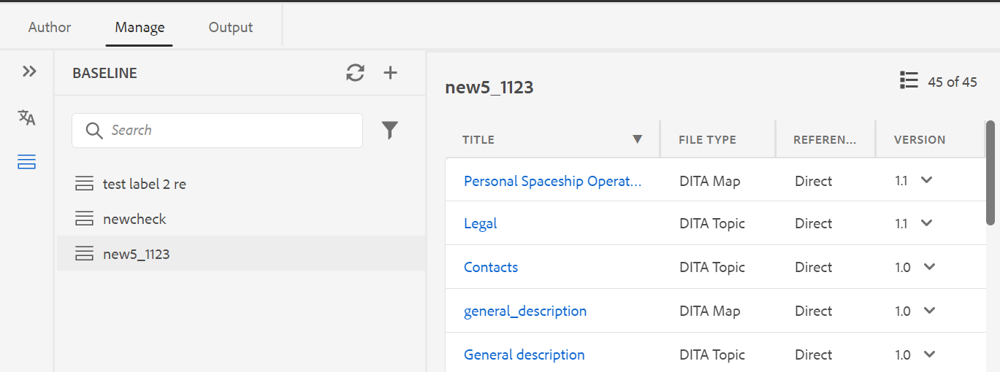

# 웹 편집기에서 기준 요소 생성 및 관리 {#id223MB0ZF043}

>[!TIP]
>
> AEM Guides as a Cloud Service 3월 릴리스 이상으로 업그레이드한 경우 웹 편집기에서 이 베이스라인 기능을 사용하는 것이 좋습니다.

AEM 안내서에서는 웹 편집기 내에 통합된 기준선 기능을 제공하여 사용자가 기준선을 만들고 이를 사용하여 다른 버전의 주제를 게시하거나 번역할 수 있도록 합니다.

## 기준선 만들기

다음 단계를 수행하여 웹 편집기에서 베이스라인을 작성할 수 있습니다.

1. 저장소 패널에서 맵 보기에서 DITA 맵 파일을 엽니다.
1. 을(를) 클릭합니다. **관리** 탭. 다음 **기준선** 패널에는 DITA 맵의 기준선이 표시됩니다.

   {width="800" align="left"}

1. 설정 **기준선** 패널의 오른쪽 위에서 + 아이콘을 클릭합니다. 특정 버전의 주제 및 특정 날짜 및 시간에 사용할 수 있는 참조된 컨텐츠 또는 주제 버전에 대해 정의된 레이블로 베이스라인을 생성할 수 있습니다.
1. 에 베이스라인의 이름을 입력합니다. **기준선 이름**.
1. in **기준선 옵션**&#x200B;로 지정하는 경우 **파일 버전 사용** 옵션 또는 **레이블 사용** 옵션:

   **파일 버전 사용**: 특정 버전의 주제 및 특정 날짜 및 시간에 사용할 수 있는 참조된 컨텐츠나 주제 버전에 대해 정의된 레이블로 정적 기준선을 만들 수 있습니다.

   - in **다음을 기준으로 최신 버전을 설정합니다.** 다음 옵션 중 하나를 선택합니다.

      1. **날짜** &lt;time stamp=&quot;&quot;>: 지정한 날짜 및 시간에 따라 주제 버전을 선택합니다.
      1. **레이블**: 적용된 레이블에 따라 주제를 선택하려면 이 옵션을 선택합니다. 주제에 지정된 레이블이 있는 경우 드롭다운에 레이블이 나열됩니다. 목록에서 레이블을 선택할 수 있습니다. 텍스트 상자에 레이블을 추가할 수도 있습니다.\
         선택 시 **레이블,** 직접 및 간접 참조를 선택할 수 있습니다.
      - DITA 맵 내의 직접 참조에 대해 지정된 레이블이 적용되지 않은 최신 버전의 주제를 사용할 수 있는 옵션이 제공됩니다.

      >[!NOTE]
      >
      > 존재하지 않는 레이블을 입력하고 옵션을 선택합니다 **기준선을 만들지 않음** 그러면 베이스라인을 작성할 수 없고 [기준선] 패널의 기준선 이름 근처에 오류 메시지가 표시됩니다.

      - DITA 맵 내의 간접 참조의 경우 지정된 레이블이 적용되지 않은 최신 버전의 주제를 사용할 수 있는 추가 옵션이 제공됩니다. 선택할 수도 있습니다 **자동으로 선택** 참조된 컨텐츠에 대해 시스템은 참조된 컨텐츠가 참조되는 컨텐츠의 버전에 해당하는 버전을 자동으로 선택합니다.

   레이블 또는 버전을 날짜로 선택하면 맵 내의 참조된 모든 항목 및 미디어 파일이 그에 따라 선택됩니다. 사용자 인터페이스에는 표시되지 않지만 백엔드에 저장됩니다.

   **레이블 사용**: 베이스라인 작성 시 적용된 레이블에 따라 항목을 선택하려면 이 옵션을 선택합니다.

   레이블을 기반으로 하는 기준선은 동적으로 업데이트됩니다. 베이스라인을 생성하거나 베이스라인을 다운로드하거나 베이스라인을 사용하여 번역 프로젝트를 생성하는 경우 업데이트된 레이블에 따라 파일이 동적으로 선택됩니다. 예를 들어 기준선에 레이블 릴리스 1.0이 있는 항목의 버전 1.2를 사용하고 레이블 릴리스 1.0이 있는 버전 1.5가 업데이트된 경우 기준선이 동적으로 업데이트되고 버전 1.5가 사용됩니다.

   {width="550" align="left"}

   - **레이블 선택**: 항목에 지정된 레이블이 있는 경우 레이블은 **레이블 선택** 드롭다운. 목록에서\ 레이블을 선택할 수 있습니다. 먼저 선택한 레이블에 나중에 선택하는 레이블보다 우선 순위가 더 높습니다.
1. **간접 참조**: DITA 맵 내의 간접 참조에 대해 다음과 같은 옵션이 제공됩니다.

   - **자동으로 선택**: 선택할 수 있습니다 **자동으로 선택** 참조된 컨텐츠에 대해 시스템은 참조된 컨텐츠가 참조되는 컨텐츠의 버전에 해당하는 버전을 자동으로 선택합니다.

   - **선택한 레이블 사용**: 주제 버전에 대해 정의된 선택된 레이블로 베이스라인을 생성할 수 있습니다.
   - **최신 버전 또는 작업 복사본을 사용합니다**: 지정된 레이블이 적용되지 않은 최신 버전의 항목을 사용하거나 버전이 만들어지지 않은 경우 항목의 작업 사본을 사용하여 기준선을 만듭니다.
1. 클릭 **적용**.

베이스라인이 생성됩니다. 기준선 만들기는 비동기식으로 수행되므로 웹 편집기에서 다른 파일에서 계속 작업할 수 있습니다. 베이스라인이 생성되면 베이스라인이 생성되었음을 확인하는 팝업 메시지가 표시되고 이에 대한 받은 편지함 알림도 수신됩니다.

## 기준선 관리

베이스라인 대시보드의 다양한 기능을 사용하여 기존 베이스라인을 관리할 수 있습니다.

- [기준선] 패널의 텍스트 상자를 사용하여 기존 기준선을 검색할 수 있습니다. 를 사용하십시오 **필터 적용** 모든 베이스라인을 표시하거나 생성 상태를 성공, 진행 중 또는 실패로 나열하는 베이스라인을 표시합니다.
- 를 사용하십시오 **새로 고침** [기준선] 패널의 아이콘을 사용하여 모든 기준선을 다시 확인하고 맵 보기에서 열린 DITA 맵의 새 기준선 목록을 표시합니다.
- [기준선] 패널의 목록에서 기준선을 두 번 클릭하여 기존 기준선의 내용을 보거나 편집할 수 있습니다. 중앙에 있는 기준선 편집 창에는 DITA 맵 파일, 맵의 내용 또는 주제, 참조된 컨텐츠가 표시됩니다.

{width="550" align="left"}

옵션 메뉴에서 베이스라인에서 다음 작업을 수행할 수도 있습니다.

- **편집**, **복제,** 또는 **삭제** 기존 기준선.
- 에서 기존 레이블을 추가, 제거 또는 변경합니다. **레이블 관리** 선택 사항입니다. 관리자가 사전 정의된 레이블을 구성한 경우 레이블 추가 드롭다운 목록에 해당 레이블이 표시됩니다. 레이블 추가에 대한 자세한 내용은 [레이블 사용](web-editor-use-label.md#).

   >[!NOTE]
   >
   > 레이블을 추가하거나 제거하는 프로세스는 비동기적으로 발생하므로 웹 편집기에서 다른 파일에서 계속 작업할 수 있습니다. 레이블을 추가하거나 제거하면 해당 레이블이 추가 또는 제거되었음을 확인하는 팝업 메시지가 표시되고 이에 대한 받은 편지함 알림도 수신하게 됩니다.

- **속성 편집** 베이스라인을 생성하는 동안 설정한 기존 베이스라인입니다.
- 를 사용하여 CSV 파일로 베이스라인 스냅샷을 내보냅니다 **베이스라인 내보내기** 선택 사항입니다.

**기준선 필터**

에서 필터 아이콘 사용 **기준선 필터** 패널에서는 기준선 편집 창에서 연 기준선에 필터를 적용할 수 있습니다.

{width="350" align="left"}

- 파일 이름 또는 파일 위치를 기준으로 파일을 필터링합니다.
- 파일 유형, 참조 유형 등과 같은 다른 열의 값을 기준으로 파일을 필터링합니다.
- 베이스라인 편집 창에 표시할 열을 선택합니다.

>[!NOTE]
>
> 열 머리글을 클릭하고 기준 요소 편집 창의 열을 기준으로 파일을 정렬할 수 있습니다.

**베이스라인 저장 또는 재설정**

베이스라인을 편집한 후에는 **저장** 단추을 눌러 변경 사항을 베이스라인에 저장합니다. 을(를) 클릭합니다. **재설정** 변경 사항을 저장하고 베이스라인을 재설정하지 않으려면 버튼을 클릭합니다. 를 클릭하면 **재설정** 저장하지 않은 변경 사항이 유실된다는 경고가 표시됩니다.

**상위 항목:**[&#x200B;웹 편집기 작업](web-editor.md)
